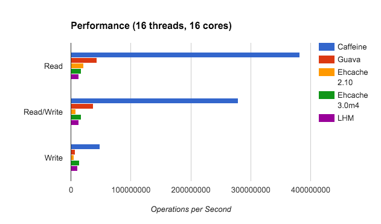

# Caffeine 缓存

## 1. 性能对比

## 2. 原理

### 2.1 W-TinyLFU

传统的 LFU(**Least Frequently Used**, 最不常用的) 受时间周期的影响比较大。所以各种LFU的变种出现了，基于时间周期进行衰减，或者在最近某个时间段内的频率。同样的LFU也会使用额外空间记录每一个数据访问的频率，即使数据没有在缓存中也需要记录，所以需要维护的额外空间很大。

> 可以试想我们对这个维护空间建立一个hashMap，每个数据项都会存在这个hashMap中，当数据量特别大的时候，这个hashMap也会特别大。

再回到LRU，我们的LRU也不是那么一无是处，LRU可以很好的应对突发流量的情况，因为他不需要累计数据频率。

所以W-TinyLFU结合了LRU和LFU，以及其他的算法的一些特点。