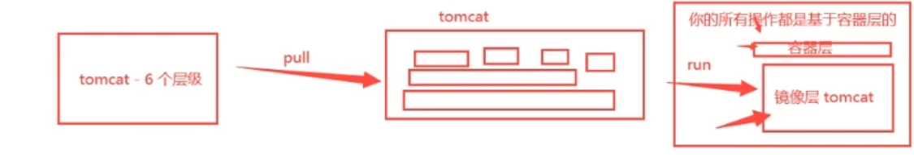
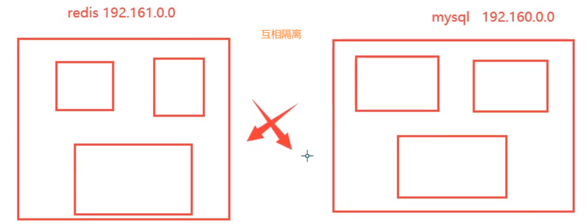
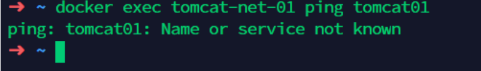
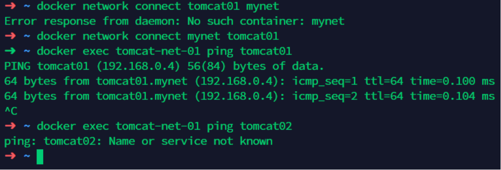

# Docker

[参考](https://yeasy.gitbook.io/docker_practice/)

## 安装 Docker

```shell
 # 删除 docker 
 yum remove docker \
                  docker-client \
                  docker-client-latest \
                  docker-common \
                  docker-latest \
                  docker-latest-logrotate \
                  docker-logrotate \
                  docker-engine
                  
 # 安装工具包
 yum install -y yum-utils
 
 # 添加阿里云镜像
 yum-config-manager \
    --add-repo \
    https://mirrors.aliyun.com/docker-ce/linux/centos/docker-ce.repo
 
 
 # 更新 yum 软件包索引
 yum makecache fast
 
 # 安装社区版
 yum install docker-ce docker-ce-cli containerd.io
 
 # 启动 docker
 sudo systemctl start docker
 
 # 判断是否安装成功
 dokcer version
 
 # 测试 helloworld 镜像
 sudo docker run hello-world
 
 # 设置开机启动
 systemctl enable docker
```

**卸载 docker** 

```shell
$ sudo yum remove docker-ce docker-ce-cli containerd.io

$ sudo rm -rf /var/lib/docker
```

**阿里云镜像加速**

访问阿里云


```shell
sudo mkdir -p /etc/docker
sudo tee /etc/docker/daemon.json <<-'EOF'
{
  "registry-mirrors": ["https://11xunxrm.mirror.aliyuncs.com"]
}
EOF
sudo systemctl daemon-reload
sudo systemctl restart docker

# 检查是否生效
docker info

# 显示信息中包含如下信息
# Registry Mirrors:
# https://xxxx.mirror.aliyuncs.com/
```

## 底层原理

Docker是一个Client-Server结构的系统，Docker的守护进程运行在主机上。通过Socket从客户端访问！

Docker-Server接收到Docker-Client的指令，就会执行这个命令！


**为什么Docker比Vm快**
1、docker有着比虚拟机更少的抽象层。由于docker不需要Hypervisor实现硬件资源虚拟化,运行在docker容器上的程序直接使用的都是实际物理机的硬件资源。因此在CPU、内存利用率上docker将会在效率上有明显优势。
2、docker利用的是宿主机的内核,而不需要Guest OS。

```
GuestOS： VM（虚拟机）里的的系统（OS）

HostOS：物理机里的系统（OS）
```


因此,当新建一个 容器时,docker不需要和虚拟机一样重新加载一个操作系统内核。仍而避免引导、加载操作系统内核返个比较费时费资源的过程,当新建一个虚拟机时,虚拟机软件需要加载GuestOS,返个新建过程是**分钟级别**的。而docker由于直接利用宿主机的操作系统,则省略了这个复杂的过程,因此新建一个docker容器只需要**几秒钟**。

### 镜像原理-联合文件系统

#### **镜像是什么**

镜像是一种轻量级、可执行的独立软件保，用来打包软件运行环境和基于运行环境开发的软件，他包含运行某个软件所需的所有内容，包括代码、运行时库、环境变量和配置文件。

获取镜像的途径：

- 从远程仓库下载
- 别人拷贝给你
- 自己制作一个镜像 DockerFile

#### **Docker镜像加载原理**

> UnionFs （联合文件系统）

UnionFs（联合文件系统）：Union文件系统（UnionFs）是一种分层、轻量级并且高性能的文件系统，他支持对文件系统的修改作为一次提交来一层层的叠加，同时可以将不同目录挂载到同一个虚拟文件系统下（ unite several directories into a single virtual filesystem)。Union文件系统是 Docker镜像的基础。镜像可以通过分层来进行继承，基于基础镜像（没有父镜像），可以制作各种具体的应用镜像
特性：一次同时加载多个文件系统，但从外面看起来，只能看到一个文件系统，联合加载会把各层文件系统叠加起来，这样最终的文件系统会包含所有底层的文件和目录。

> Docker 镜像加载原理

docker的镜像实际上由一层一层的文件系统组成，这种层级的文件系统UnionFS。
boots(boot file system）主要包含 bootloader和 Kernel, bootloader主要是引导加 kernel, Linux刚启动时会加bootfs文件系统，在 Docker镜像的最底层是 boots。这一层与我们典型的Linux/Unix系统是一样的，包含boot加載器和内核。当boot加载完成之后整个内核就都在内存中了，此时内存的使用权已由 bootfs转交给内核，此时系统也会卸载bootfs。
rootfs（root file system),在 bootfs之上。包含的就是典型 Linux系统中的/dev,/proc,/bin,/etc等标准目录和文件。 rootfs就是各种不同的操作系统发行版，比如 Ubuntu, Centos等等。


#### 分层理解

> 分层的镜像

我们可以去下载一个镜像，注意观察下载的日志输出，可以看到是一层层的在下载。

最大的好处：**资源共享**！比如有多个镜像都从相同的Base镜像构建而来，那么宿主机只需在磁盘上保留一份base镜像，同时内存中也只需要加载一份base镜像，这样就可以为所有的容器服务了，而且镜像的每一层都可以被共享。

所有的 Docker镜像都起始于一个基础镜像层，当进行修改或培加新的内容时，就会在当前镜像层之上，创建新的镜像层。

举一个简单的例子，假如基于 Ubuntu Linux16.04创建一个新的镜像，这就是新镜像的第一层；如果在该镜像中添加 Python包，
就会在基础镜像层之上创建第二个镜像层；如果继续添加一个安全补丁，就会创健第三个镜像层该像当前已经包含3个镜像层，如下图所示（这只是一个用于演示的很简单的例子）。

在添加额外的镜像层的同时，镜像始终保持是当前所有镜像的组合，理解这一点.


> 特点

Docker 镜像都是只读的，当容器启动时，一个新的可写层加载到镜像的顶部！

这一层就是我们通常说的容器层，容器之下的都叫镜像层！



#### Commit 镜像

```shell
docker commit 提交容器成为一个新的副本

# 命令和git原理类似
docker commit -m="描述信息" -a="作者" 容器id 目标镜像名:[版本TAG]
```


## Docker 基础命令

### 1.帮助命令

```shell
docker version    #显示docker的版本信息。
docker info       #显示docker的系统信息，包括镜像和容器的数量
docker 命令 --help #帮助命令
```

帮助文档的地址：https://docs.docker.com/engine/reference/commandline/build/

### 2.镜像命令

```shell
#查看所有本地主机上的镜像 可以使用docker image ls代替
docker images 
#搜索镜像
docker search 
#下载镜像 docker image pull
docker pull 
#删除镜像 docker image rm 镜像名:版本号
docker rmi 
#删除全部的镜像
docker rmi -f $(docker images -aq) 
```

**docker images 解释**

```
#REPOSITORY			# 镜像的仓库源
#TAG				    # 镜像的标签(版本)		---lastest 表示最新版本
#IMAGE ID			# 镜像的id
#CREATED			# 镜像的创建时间
#SIZE				# 镜像的大小

# 可选项 
Options:  
-a, --all         Show all images (default hides intermediate images) #列出所有镜像
-q, --quiet       Only show numeric IDs # 只显示镜像的id
```

### 3. 容器命令

```shell
#新建容器并启动
docker run 镜像id
# 列出所有运行的容器 docker container list
docker ps 
#删除指定容器
docker rm 容器id 
#启动容器
docker start 容器id	
#重启容器
docker restart 容器id	
#停止当前正在运行的容器
docker stop 容器id	
#强制停止当前容器
docker kill 容器id	
```

#### docker run 命令

`docker run [可选参数] image | docker container run [可选参数] image`

| 命令 | 参数          | 示例 | 说明                                      |
| ---- | ------------- | ---- | ----------------------------------------- |
| run  | --name="Name" |      | 容器名字 tomcat01 tomcat02 用来区分容器   |
|      | -d            |      | 后台方式运行                              |
|      | -it           |      | 使用交互方式运行，进入容器查看内容        |
|      | -p            |      | 指定容器的端口 -p 8080(宿主机):8080(容器) |
|      | -P(大写)      |      | 随机指定端口                              |

#### 列出所有运行的容器

| 命令      | 参数 | 示例 | 说明                      |
| --------- | ---- | ---- | ------------------------- |
| docker ps |      |      | 列出当前正在进行的容器    |
|           | -a   |      | 列出所有容器              |
|           | -n=? |      | 列出最近创建的前 ? 个容器 |
|           | -n=? |      | 只列出容器的编号          |

#### 退出容器

```shell
# 进入容器，exit会退出容器，ctrl+pq 不会导致容器退出，会把容器放在后台运行 （exit只是停止运行，可以重新起来，如果启容器时候，只是运行临时命令，容器不能起来）
docker attach 正在运行的容器
#容器直接退出
exit 		
#容器不停止退出 	---注意：这个很有用的操作
ctrl +P +Q  
```

#### 删除容器

```shell
#删除指定的容器，不能删除正在运行的容器，如果要强制删除 rm -rf
docker rm 容器id 
#删除所有的容器
docker rm -f $(docker ps -aq)  
#删除所有的容器
docker ps -a -q|xargs docker rm  
```

### 4. 常用其他命令

#### 后台启动命令

```shell
# 命令 docker run -d 镜像名
[root@iz2zeak7sgj6i7hrb2g862z ~]# docker run -d centos
a8f922c255859622ac45ce3a535b7a0e8253329be4756ed6e32265d2dd2fac6c

[root@iz2zeak7sgj6i7hrb2g862z ~]# docker ps    
CONTAINER ID      IMAGE       COMMAND    CREATED     STATUS   PORTS    NAMES
# 问题docker ps. 发现centos 停止了
# 常见的坑，docker容器使用后台运行，就必须要有要一个前台进程，docker发现没有应用，就会自动停止
# nginx，容器启动后，发现自己没有提供服务，就会立刻停止，就是没有程序了
```

#### 查看容器中进程信息 ps

```
docker top 容器id
```

#### 查看镜像的元数据

```
docker inspect 容器id
```

#### 进入容器

```shell
# 方式一
docker exec -it 容器id /bin/bash
# 方式二
docker attach 容器id
#区别：
#docker exec #进入当前容器后开启一个新的终端，可以在里面操作。（常用）
#docker attach # 进入容器正在执行的终端
```

#### 从容器内拷贝文件到主机上

```shell
docker cp 容器id:容器内路径 主机目的地路径
```

## Docker 查看日志

```shell
docker logs --help
Options:
      --details        Show extra details provided to logs 
*  -f, --follow         Follow log output
      --since string   Show logs since timestamp (e.g. 2013-01-02T13:23:37) or relative (e.g. 42m for 42 minutes)
*      --tail string    Number of lines to show from the end of the logs (default "all")
*  -t, --timestamps     Show timestamps
      --until string   Show logs before a timestamp (e.g. 2013-01-02T13:23:37) or relative (e.g. 42m for 42 minutes)
➜  ~ docker run -d centos /bin/sh -c "while true;do echo 6666;sleep 1;done" #模拟日志      
#显示日志
-tf		#显示日志信息（一直更新）
--tail number #需要显示日志条数
docker logs -t --tail n 容器id #查看n行日志
docker logs -ft 容器id #跟着日志
```

## 容器数据卷

#### 什么是容器数据卷

将应用和环境打包成一个镜像！

数据？如果数据都在容器中，那么我们容器删除，数据就会丢失！需求：**数据可以持久化**

MySQL，容器删除了，删库跑路！需求：**MySQL数据可以存储在本地！**

容器之间可以有一个数据共享的技术！Docker容器中产生的数据，同步到本地！

这就是卷技术！目录的挂载，将我们容器内的目录，挂载到Linux上面！

#### 使用数据卷

> 方式一：直接使用命令挂载 -v

```shell
docker run -it -v 主机目录:容器内目录  -p 主机端口:容器内端口
#通过 docker inspect 容器id 查看
[root@iz2zeak7sgj6i7hrb2g862z home]# docker inspect 6064c490c371
```


> 具名和匿名挂载

```shell
# 匿名挂载
-v 容器内路径!
$ docker run -d -P --name nginx01 -v /etc/nginx nginx

# 查看所有的volume(卷)的情况. 也可以使用 docker ispect 容器id查看 source的目录
$ docker volume ls    
DRIVER              VOLUME NAME # 容器内的卷名(匿名卷挂载)
local               21159a8518abd468728cdbe8594a75b204a10c26be6c36090cde1ee88965f0d0
local               b17f52d38f528893dd5720899f555caf22b31bf50b0680e7c6d5431dbda2802c
# 这里发现，这种就是匿名挂载，我们在 -v只写了容器内的路径，没有写容器外的路径！


# 具名挂载 -P:表示随机映射端口
$ docker run -d -P --name nginx02 -v juming-nginx:/etc/nginx nginx
9663cfcb1e5a9a1548867481bfddab9fd7824a6dc4c778bf438a040fe891f0ee
# 查看所有的volume(卷)的情况
$ docker volume ls                  
DRIVER              VOLUME NAME
local               21159a8518abd468728cdbe8594a75b204a10c26be6c36090cde1ee88965f0d0
local               b17f52d38f528893dd5720899f555caf22b31bf50b0680e7c6d5431dbda2802c
local               juming-nginx #多了一个名字

# 查看所有的volume(卷)的情况
$ docker volume ls                  
DRIVER              VOLUME NAME
local               21159a8518abd468728cdbe8594a75b204a10c26be6c36090cde1ee88965f0d0
local               b17f52d38f528893dd5720899f555caf22b31bf50b0680e7c6d5431dbda2802c
local               juming-nginx #多了一个名字
```

所有的docker容器内的卷，没有指定目录（**匿名挂载**）的情况下都是在**/var/lib/docker/volumes/自定义的卷名/_data**下，
**如果指定了目录，docker volume ls 是查看不到的**。

#### 区别三种挂载方式

三种挂载：

* 匿名挂载： -v 容器内路径	
* 具名挂载：-v 卷名：容器内路径
* 指定路径挂载：-v /宿主机路径：容器内路径 

#### 挂载目录的权限

```shell
# 通过 -v 容器内路径： ro rw 改变读写权限
ro #readonly 只读
rw #readwrite 可读可写
$ docker run -d -P --name nginx05 -v juming:/etc/nginx:ro nginx
$ docker run -d -P --name nginx05 -v juming:/etc/nginx:rw nginx

# ro 只要看到ro就说明这个路径只能通过宿主机来操作，容器内部是无法操作！
```

#### 容器间数据共享

**容器之间的配置信息的传递，数据卷容器的生命周期一直持续到没有容器使用为止**。

**但是一旦你持久化到了本地，这个时候，本地的数据是不会删除的**！

## DockerFile

**Dockerfile 就是用来构建docker镜像的构建文件**！命令脚本！

通过这个**脚本可以生成镜像**，镜像是一层一层的，脚本是一个个的命令，每个命令都是一层！

#### DockerFile构建过程

**基础知识**：

1、每个保留关键字(指令）都是必须是大写字母

2、执行从上到下顺序

3、#表示注释

4、每一个指令都会创建提交一个新的镜像曾，并提交！


Dockerfile是面向开发的，我们以后要发布项目，做镜像，就需要编写dockerfile文件，这个文件十分简单！

Docker镜像逐渐成企业交付的标准，必须要掌握！

DockerFile：构建文件，定义了一切的步骤，源代码

DockerImages：通过DockerFile构建生成的镜像，最终发布和运行产品。

Docker容器：容器就是镜像运行起来提供服务。

#### DockerFile 指令

| 指令       | 解释                                                         |
| ---------- | ------------------------------------------------------------ |
| FROM       | 基础镜像，一切从这里开始构建                                 |
| MAINTAINER | maintainer:镜像是谁写的， 姓名+邮箱                          |
| RUN        | 镜像构建的时候需要运行的命令                                 |
| ADD        | 步骤，tomcat镜像，这个tomcat压缩包！添加内容 添加同目录      |
| WORKDIR    | 镜像的工作目录                                               |
| VOLUME     | 挂载的目录                                                   |
| EXPOSE     | 保留端口配置                                                 |
| CMD        | 指定这个容器启动的时候要运行的命令，只有最后一个会生效，可被替代 |
| ENTRYPOINT | 指定这个容器启动的时候要运行的命令，可以追加命令             |
| ONBUILD    | 当构建一个被继承DockerFile这个时候就会运行onbuild的指令，触发指令 |
| COPY       | 类似ADD，将我们文件拷贝到镜像中                              |
| ENV        | 构建的时候设置环境变量！                                     |


> 制作 tomcat 镜像

1、准备镜像文件

```
准备tomcat 和 jdk 到当前目录，编写好README
```

2、编写dokerfile

```shell
$ vim dockerfile
# 基础镜像centos
FROM centos 										
# 作者
MAINTAINER cao<1165680007@qq.com>					
# 复制README文件
COPY README /usr/local/README
# 添加jdk，ADD 命令会自动解压
ADD jdk-8u231-linux-x64.tar.gz /usr/local/ 			
# 添加tomcat，ADD 命令会自动解压
ADD apache-tomcat-9.0.35.tar.gz /usr/local/ 		
# 安装 vim 命令
RUN yum -y install vim								
# 环境变量设置 工作目录
ENV MYPATH /usr/local 								
WORKDIR $MYPATH
# 环境变量： JAVA_HOME环境变量
ENV JAVA_HOME /usr/local/jdk1.8.0_231 				
ENV CLASSPATH $JAVA_HOME/lib/dt.jar:$JAVA_HOME/lib/tools.jar
# 环境变量： tomcat环境变量
ENV CATALINA_HOME /usr/local/apache-tomcat-9.0.35 	
ENV CATALINA_BASH /usr/local/apache-tomcat-9.0.35

# 设置环境变量 分隔符是：
ENV PATH $PATH:$JAVA_HOME/bin:$CATALINA_HOME/lib:$CATALINA_HOME/bin 	
# 设置暴露的端口
EXPOSE 8080 										

# 设置默认命令
CMD /usr/local/apache-tomcat-9.0.35/bin/startup.sh && tail -F /usr/local/apache-tomcat-9.0.35/logs/catalina.out 				
```

3、构建镜像

```shell
# 因为dockerfile命名使用默认命名 因此不用使用-f 指定文件
$ docker build -t mytomcat:0.1 .
```

4、run镜像

```shell
# -d:后台运行 -p:暴露端口 --name:别名 -v:绑定路径 
$ docker run -d -p 8080:8080 --name tomcat01 
-v /home/kuangshen/build/tomcat/test:/usr/local/apache-tomcat-9.0.35/webapps/test 
-v /home/kuangshen/build/tomcat/tomcatlogs/:/usr/local/apache-tomcat-9.0.35/logs
```

5、访问测试

```shell
$ docker exec -it 自定义容器的id /bin/bash

$ cul localhost:8080
123
```

6、发布项目

直接将war宝放在挂在卷目录下即可

#### 发布镜像

> 发布到阿里云

[参考阿里云文档](https://cr.console.aliyun.com/repository/)

```shell
$ sudo docker login --username=zchengx registry.cn-shenzhen.aliyuncs.com
$ sudo docker tag [ImageId] registry.cn-shenzhen.aliyuncs.com/dsadxzc/cheng:[镜像版本号]

# 修改id 和 版本
sudo docker tag a5ef1f32aaae registry.cn-shenzhen.aliyuncs.com/dsadxzc/cheng:1.0
# 修改版本
$ sudo docker push registry.cn-shenzhen.aliyuncs.com/dsadxzc/cheng:[镜像版本号]
```

## Docker 网络

初始化docker环境时，可以看到docker的网络地址


### 三个网络

> docker 是如何处理容器网络访问的？
>
> 例如 tomcat 容器是如何访问到 mysql 容器的

```shell
# 测试  运行一个tomcat
$ docker run -d -P --name tomcat01 tomcat

# 查看容器内部网络地址
$ docker exec -it 容器id ip addr

# 发现容器启动的时候会得到一个 eth0@if91 ip地址，docker分配！
$ ip addr
1: lo: <LOOPBACK,UP,LOWER_UP> mtu 65536 qdisc noqueue state UNKNOWN group default qlen 1
    link/loopback 00:00:00:00:00:00 brd 00:00:00:00:00:00
    inet 127.0.0.1/8 scope host lo
       valid_lft forever preferred_lft forever
261: eth0@if91: <BROADCAST,MULTICAST,UP,LOWER_UP> mtu 1500 qdisc noqueue state UP group default 
    link/ether 02:42:ac:12:00:02 brd ff:ff:ff:ff:ff:ff link-netnsid 0
    inet 172.18.0.2/16 brd 172.18.255.255 scope global eth0
       valid_lft forever preferred_lft forever

       
# 思考？ linux能不能ping通容器内部！ 可以 容器内部可以ping通外界吗？ 可以！
$ ping 172.18.0.2
PING 172.18.0.2 (172.18.0.2) 56(84) bytes of data.
64 bytes from 172.18.0.2: icmp_seq=1 ttl=64 time=0.069 ms
64 bytes from 172.18.0.2: icmp_seq=2 ttl=64 time=0.074 ms
```

> 原理

1、我们每启动一个docker容器，docker就会给docker容器分配一个ip，我们只要按照了docker，就会有一个docker0桥接模式，使用的技术是veth-pair技术！

https://www.cnblogs.com/bakari/p/10613710.html

再次测试 ip addr


2 、再启动一个容器测试，发现又多了一对网络


我们发现这个容器带来网卡，都是一对对的

 veth-pair 就是一对的虚拟设备接口，他们都是成对出现的，一端连着协议，一端彼此相连

正因为有这个特性 veth-pair 充当一个桥梁，连接各种虚拟网络设备的OpenStac,Docker容器之间的连接，OVS的连接，都是使用evth-pair技术

3、我们来测试下tomcat01和tomcat02是否可以ping通

```shell
# 获取tomcat01的ip 172.17.0.2
$ docker-tomcat docker exec -it tomcat01 ip addr  
550: eth0@if551: <BROADCAST,MULTICAST,UP,LOWER_UP> mtu 1500 qdisc noqueue state UP group default 
    link/ether 02:42:ac:11:00:02 brd ff:ff:ff:ff:ff:ff link-netnsid 0
    inet 172.17.0.2/16 brd 172.17.255.255 scope global eth0
       valid_lft forever preferred_lft forever
       
# 让tomcat02 ping tomcat01       
$ docker-tomcat docker exec -it tomcat02 ping 172.17.0.2
PING 172.17.0.2 (172.17.0.2) 56(84) bytes of data.
64 bytes from 172.17.0.2: icmp_seq=1 ttl=64 time=0.098 ms
64 bytes from 172.17.0.2: icmp_seq=2 ttl=64 time=0.071 ms

# 结论：容器和容器之间是可以互相ping通
```

#### 网络模型图


> 结论：tomcat01和tomcat02公用一个路由器，docker0。

所有的容器不指定网络的情况下，都是docker0路由的，docker会给我们的容器分配一个默认的可用ip。

> 小结

Docker使用的是Linux的桥接，宿主机是一个Docker容器的网桥 docker0


Docker中所有网络接口都是虚拟的，虚拟的转发效率高（内网传递文件）

只要容器删除，对应的网桥一对就没了！

#### --link

> 使用场景：**我们编写了一个微服务，database url=ip: 项目不重启，数据ip换了，我们希望可以处理这个问题，可以通过名字来进行访问容器**

–link 本质就是在hosts配置中添加映射

**现在使用Docker已经不建议使用–link了！**

自定义网络，不适用docker0！

docker0问题：不支持容器名连接访问！

```shell
$ docker exec -it tomcat02 ping tomca01   # ping不通
ping: tomca01: Name or service not known

# 运行一个tomcat03 --link tomcat02 
$ docker run -d -P --name tomcat03 --link tomcat02 tomcat
5f9331566980a9e92bc54681caaac14e9fc993f14ad13d98534026c08c0a9aef

# 3连接2
# 用tomcat03 ping tomcat02 可以ping通
$ docker exec -it tomcat03 ping tomcat02
PING tomcat02 (172.17.0.3) 56(84) bytes of data.
64 bytes from tomcat02 (172.17.0.3): icmp_seq=1 ttl=64 time=0.115 ms
64 bytes from tomcat02 (172.17.0.3): icmp_seq=2 ttl=64 time=0.080 ms

# 2连接3
# 用tomcat02 ping tomcat03 ping不通
```

docker network inspect 网络id 网段相同


docker inspect tomcat03


查看tomcat03里面的/etc/hosts发现有tomcat02的配置


#### 自定义网络--建议方式

```shell
docker network
connect     -- Connect a container to a network
create      -- Creates a new network with a name specified by the
disconnect  -- Disconnects a container from a network
inspect     -- Displays detailed information on a network
ls          -- Lists all the networks created by the user
prune       -- Remove all unused networks
rm          -- Deletes one or more networks
```

> 查看所有的  docker 网络


##### 网络模式

* bridge：桥接 docker（默认，自己创建也是用bridge模式）
* none ：不配置网络，一般不用
* host：和所主机共享网络
* container：容器网络连通（用得少！局限很大）

测试：

```shell
# 我们直接启动的命令 --net bridge,而这个就是我们得docker0
# bridge就是docker0
$ docker run -d -P --name tomcat01 tomcat
等价于 => docker run -d -P --name tomcat01 --net bridge tomcat

# docker0，特点：默认，域名不能访问。 --link可以打通连接，但是很麻烦！
# 我们可以 自定义一个网络
$ docker network create --driver bridge --subnet 192.168.0.0/16 --gateway 192.168.0.1 mynet
```


```shell
$ docker network inspect mynet;
```


启动两个tomcat,再次查看网络情况


再次查看 mynet 情况


在自定义的网络下，服务可以互相ping通，不用使用–link


我们自定义的网络docker当我们维护好了对应的关系，推荐我们平时这样使用网络！

> 好处

redis -不同的集群使用不同的网络，保证集群是安全和健康的

mysql-不同的集群使用不同的网络，保证集群是安全和健康的



#### 网络连通


```shell
# 测试两个不同的网络连通  再启动两个tomcat 使用默认网络，即docker0
$ docker run -d -P --name tomcat01 tomcat
$ docker run -d -P --name tomcat02 tomcat
# 此时ping不通
```



```shell
# 要将tomcat01 连通 tomcat—net-01 ，连通就是将 tomcat01加到 mynet网络
# 一个容器两个ip（tomcat01）
```



```shell
# 01连通 ，加入后此时，已经可以tomcat01 和 tomcat-01-net ping通了
# 02是依旧不通的
```

> 结论

假设要跨网络操作别人，就需要使用docker network connect 连通！

#### 部署 Redis 集群


```shell
# 创建网卡
docker network create redis --subnet 172.38.0.0/16
# 通过脚本创建六个redis配置
for port in $(seq 1 6);\
do \
mkdir -p /mydata/redis/node-${port}/conf
touch /mydata/redis/node-${port}/conf/redis.conf
cat << EOF >> /mydata/redis/node-${port}/conf/redis.conf
port 6379
bind 0.0.0.0
cluster-enabled yes
cluster-config-file nodes.conf
cluster-node-timeout 5000
cluster-announce-ip 172.38.0.1${port}
cluster-announce-port 6379
cluster-announce-bus-port 16379
appendonly yes
EOF
done


# 通过脚本运行六个redis
for port in $(seq 1 6);\
docker run -p 637${port}:6379 -p 1667${port}:16379 --name redis-${port} 
-v /mydata/redis/node-${port}/data:/data 
-v /mydata/redis/node-${port}/conf/redis.conf:/etc/redis/redis.conf \
-d --net redis --ip 172.38.0.1${port} redis:5.0.9-alpine3.11 redis-server /etc/redis/redis.conf
docker exec -it redis-1 /bin/sh #redis默认没有bash
redis-cli --cluster create 172.38.0.11:6379 172.38.0.12:6379 172.38.0.13:6379 172.38.0.14:6379 172.38.0.15:6379 172.38.0.16:6379  --cluster-replicas 1

# 上面会被当成两条语句 所以还是一个个创建
docker run -p 6371:6379 -p 16671:16379 --name redis-1 \
-v /mydata/redis/node-1/data:/data \
-v /mydata/redis/node-1/conf/redis.conf:/etc/redis/redis.conf \
-d --net redis --ip 172.38.0.11 redis:5.0.9-alpine3.11 redis-server /etc/redis/redis.conf 

#进入redis 客户端 
/data # redis-cli -c

#这就是三主三从
127.0.0.1:6379> cluster nodes
d7ed3e7e0bdbc201a4cf4a9bbea8cf0a7f3c7e55 172.38.0.16:6379@16379 slave 6a05f953fd4957681380f92e35048510b9d37f43 0 1599119396000 6 connected
2e628ddbdf44f8ab4ebfcf0cba5d3f19e89a22aa 172.38.0.13:6379@16379 master - 0 1599119396726 3 connected 10923-16383
6a05f953fd4957681380f92e35048510b9d37f43 172.38.0.12:6379@16379 master - 0 1599119397528 2 connected 5461-10922
2e060c950f68953efc5f15ef822122afad9f96cf 172.38.0.14:6379@16379 slave 2e628ddbdf44f8ab4ebfcf0cba5d3f19e89a22aa 0 1599119397728 4 connected
f2738a5e4db18bf6cca08f2f60792e620f142b83 172.38.0.11:6379@16379 myself,master - 0 1599119395000 1 connected 0-5460
3368b08de6e2514495d6bb355ba8b69459ba5a6c 172.38.0.15:6379@16379 slave f2738a5e4db18bf6cca08f2f60792e620f142b83 0 1599119396000 5 connected
```

## SpringBoot 项目打包 Docker 镜像

1、构建SpringBoot项目

2、打包运行

```
mvn package
1
```

3、编写dockerfile

```shell
FROM java:8
COPY *.jar /app.jar
CMD ["--server.port=8080"]
EXPOSE 8080
ENTRYPOINT ["java","-jar","app.jar"]
12345
```

4、构建镜像

```shell
# 1.复制jar和DockerFIle到服务器
# 2.构建镜像
$ docker build -t xxxxx:xx  .
123
```

5、发布运行

以后我们使用了Docker之后，给别人交付就是一个镜像即可！

## Docker-compose

