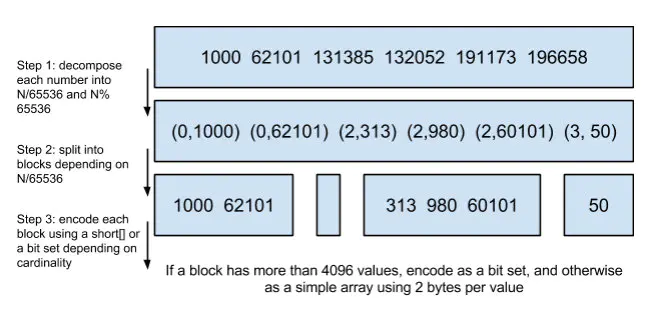

# Elasticsearch

## Elasticsearch 架构


Elasticsearch是**分布式**存储的，一个Elasticsearch集群会有多个Elasticsearch节点，所谓节点实际上就是运行着Elasticsearch进程的机器。在众多的节点中，其中会有一个`Master Node`，它主要负责维护索引元数据、负责切换主分片和副本分片身份等工作，如果主节点挂了，会选举出一个新的主节点。

Elasticsearch最外层的是Index（相当于数据库 表的概念）；一个Index的数据我们可以分发到不同的Node上进行存储，这个操作就叫做**分片**。

比如现在我集群里边有3个节点，我现在有一个Index，想将这个Index在3个节点上存储，那我们可以设置为3个分片。这3个分片的数据**合起来**就是Index的数据

为什么要分片？原因也很简单：

- 如果一个Index的数据量太大，只有一个分片，那只会在一个节点上存储，随着数据量的增长，一个节点未必能把一个Index存储下来。
- 多个分片，在写入或查询的时候就可以并行操作（从各个节点中读写数据，提高吞吐量）

现在问题来了，如果某个节点挂了，那部分数据就丢了吗？显然Elasticsearch也会想到这个问题，所以分片会有主分片和副本分片之分（为了实现**高可用**）

数据写入的时候是**写到主分片**，副本分片会**复制**主分片的数据，读取的时候**主分片和副本分片都可以读**。

> Index需要分为多少个分片和副本分片都是可以通过配置设置的

如果某个节点挂了，前面所提高的`Master Node`就会把对应的副本分片提拔为主分片，这样即便节点挂了，数据就不会丢。

### 集群状态查看

* 查看集群健康状况

  ```http
  GET _cat/health?v
  ```

  ```
  # 响应信息如下(一行显示不全, 分作两行)：
  epoch       timestamp  cluster  status  node.total  node.data  shards  pri  relo
  1552979327  07:08:47   heal_es  yellow           1          1      33   33     0
  
  init  unassign  pending_tasks  max_task_wait_time  active_shards_percent
     0         5              0                   -                  86.8%
  
  ```

* 查看节点状态

  ```http
  GET _cat/nodes?v
  ```

  ```
  # 响应信息如下(一行显示不全, 分作两行):
  ip             heap.percent  ram.percent  cpu  load_1m  load_5m  load_15m  
  172.16.22.133            49           98    3     0.56     0.74      1.02
  
  node.role  master  name
  mdi        *       1UlY804
  ```

* 查看所有索引信息

  ```http
  GET _cat/indices?v
  ```

  ```
  # 响应信息如下(一行显示不全, 分作两行): 
  health  status  index      uuid                    pri  rep  
  green   open    .kibana_1  4q7ELvdcTVilW3UwtMWqeg    1    0
  
  docs.count  docs.deleted  store.size  pri.store.size
          18             0      78.5kb          78.5kb
  ```

## 文件格式

文件格式与关系型数据库比较

| Elasticsearch              | 关系型数据库                                                 |
| -------------------------- | ------------------------------------------------------------ |
| 索引（Indices）            | 库（Databases）                                              |
| 类型（Types）              | 表（Tables）                                                 |
| 文档（Documents）          | 行（Rows）                                                   |
| 字段（Fields）             | 列（Columns）。                                              |
| 映射（Mapping）            | schema（数据库的组织和结构，是数据库对象的集合，集合包括表，视图，储存过程，索引等） |
| Put/Post/Delete/Update/Get | 增/删/改/查                                                  |

## 数据结构

### 倒排索引

Elasticsearch 根据分词器，将对应**正向索引**转为**倒排索引**


众所周知，世界上有这么多的语言，那Elasticsearch怎么**切分这些词呢？**，Elasticsearch**内置**了一些分词器

- Standard  Analyzer 。按词切分，将词小写
- Simple Analyzer。按非字母过滤（符号被过滤掉），将词小写
- WhitespaceAnalyzer。按照空格切分，不转小写
- ....等等等

Elasticsearch分词器主要由三部分组成：

- Character Filters（文本过滤器，去除HTML）
- Tokenizer（按照规则切分，比如空格）
- TokenFilter（将切分后的词进行处理，比如转成小写）

显然，Elasticsearch是老外写的，内置的分词器都是英文类的，而我们用户搜索的时候往往搜的是中文，现在中文分词器用得最多的就是**IK**。

### 数据结构解析


输入一段文字，Elasticsearch会根据分词器对文字进行**分词**（也就是图上所看到的Ada/Allen/Sara..)，这些分词汇总起来我们叫做`Term Dictionary`，而我们需要通过分词找到对应的记录，这些文档ID保存在`PostingList`

于`Term Dictionary`的词实在太多了，不可能把`Term Dictionary`所有的词都放在内存中，于是Elasticsearch还抽了一层叫做`Term Index`，这层只存储  部分   **词的前缀**，`Term Index`会存在内存中（检索会特别快）.

`Term Index`在内存中是以**FST**（Finite State Transducers）的形式保存的，其特点是**非常节省内存**。FST有两个优点：

- 1）空间占用小。通过对词典中单词前缀和后缀的重复利用，压缩了存储空间；
- 2）查询速度快。O(len(str))的查询时间复杂度。

前面讲到了`Term Index`是存储在内存中的，且Elasticsearch用**FST**（Finite State Transducers）的形式保存（节省内存空间）。`Term Dictionary`在Elasticsearch也是为他进行排序（查找的时候方便），其实`PostingList`也有对应的优化。

### Frame Of Reference（**FOR**）

`PostingList`会使用Frame Of Reference（**FOR**）编码技术对里边的数据进行压缩，**节约磁盘空间**。

> 比如一个词对应的文档ID 列表`[73, 300, 302, 332,343, 372]` ，ID列表首先要从小到大排好序；
>
> - **第一步：** 增量编码就是从第二个数开始每个数存储与前一个id的差值，即`300-73=227`，`302-300=2`，...，一直到最后一个数。
> - **第二步：** 就是将这些差值放到不同的区块，Lucene使用256个区块，下面示例为了方便展示使用了3个区块，即每3个数一组。
> - **第三步：** 位压缩，计算每组3个数中最大的那个数需要占用bit位数，比如30、11、29中最大数30最小需要5个bit位存储，这样11、29也用5个bit位存储，这样才占用15个bit，不到2个字节，压缩效果很好。
>
> 如下面原理图所示，这是一个区块大小为3的示例（实际上是256）：


`PostingList`里边存的是文档ID，我们查的时候往往需要对这些文档ID做**交集和并集**的操作（比如在多条件查询时)，`PostingList`使用**Roaring Bitmaps**来对文档ID进行交并集操作。

### Roaring Bitmaps（RBM）

在 elasticsearch 中使用filters 优化查询，filter查询只处理文档是否匹配与否，不涉及文档评分操作，查询的结果可以被缓存。具体的 Filter 和Query 的异同读者可以自行网上查阅资料。

对于filter 查询，elasticsearch 提供了Filter cache 这种特殊的缓存，filter cache 用来存储 filters 得到的结果集。缓存 filters 不需要太多的内存，它只保留一种信息，即哪些文档与filter相匹配。同时它可以由其它的查询复用，极大地提升了查询的性能。

Frame Of Reference 压缩算法对于倒排表来说效果很好，但对于需要存储在内存中的 Filter cache 等不太合适。

倒排表和Filter cache两者之间有很多不同之处：

- 倒排表存储在磁盘，针对每个词都需要进行编码，而Filter等内存缓存只会存储那些经常使用的数据。
- 针对Filter数据的缓存就是为了加速处理效率，对压缩算法要求更高。

这就产生了下面针对内存缓存数据可以进行高效压缩解压和逻辑运算的roaring bitmaps算法。

说到Roaring bitmaps，就必须先从bitmap说起。Bitmap是一种数据结构，假设有某个posting list：

```javascript
[3,1,4,7,8]
```

对应的Bitmap就是：

```
[0,1,0,1,1,0,0,1,1]
```

非常直观，用0/1表示某个值是否存在，比如8这个值就对应第8位，对应的bit值是1，这样用一个字节就可以代表8个文档id（1B = 8bit），旧版本(5.0之前)的Lucene就是用这样的方式来压缩的。但这样的压缩方式仍然不够高效，Bitmap自身就有压缩的特点，其用一个byte就可以代表8个文档，所以100万个文档只需要12.5万个byte。但是考虑到文档可能有数十亿之多，在内存里保存Bitmap仍然是很奢侈的事情。而且对于个每一个filter都要消耗一个Bitmap，比如age=18缓存起来的话是一个Bitmap，18<=age<25是另外一个filter缓存起来也要一个Bitmap。

Bitmap的缺点是存储空间随着文档个数线性增长，所以秘诀就在于需要有一个数据结构打破这个魔咒，那么就一定要用到某些指数特性：

- 可以很压缩地保存上亿个bit代表对应的文档是否匹配filter；
- 这个压缩的Bitmap仍然可以很快地进行AND和 OR的逻辑操作。

Lucene使用的这个数据结构叫做 **Roaring Bitmap**，即位图压缩算法，简称**BMP**。

使用**Roaring Bitmaps**的好处就是可以节省空间和快速得出交并集的结果。



其压缩的思路其实很简单。与其保存100个0，占用100个bit。还不如保存0一次，然后声明这个0重复了100遍。

这两种合并使用索引的方式都有其用途。Elasticsearch 对其性能有详细的对比，可阅读 [Frame of Reference and Roaring Bitmaps](https://www.elastic.co/blog/frame-of-reference-and-roaring-bitmaps)。

## Elasticsearch 写入流程


集群中写入操作都是写入到主分片中的。

集群上的每个节点都是`coordinating node`（**协调节点**），协调节点表明这个节点可以做**路由**。比如**节点1**接收到了请求，但发现这个请求的数据应该是由**节点2**处理（因为主分片在**节点2**上），所以会把请求转发到**节点2**上。

- coodinate（**协调**）节点通过hash算法可以计算出是在哪个主分片上，然后**路由到对应的节点**
- `shard = hash(document_id) % (num_of_primary_shards)`

路由到对应的节点以及对应的主分片时，会做以下的事：

1. 将数据写到内存缓存区
2. 然后将数据写到translog缓存区
3. 每隔**1s**数据从buffer中refresh到FileSystemCache中，生成segment文件，一旦生成segment文件，就能通过索引查询到了
4. refresh完，memory buffer就清空了。
5. 每隔**5s**中，translog 从buffer flush到磁盘中
6. 定期/定量从FileSystemCache中,结合translog内容`flush index`到磁盘中。


解释一下：

- Elasticsearch会把数据先写入内存缓冲区，然后每隔**1s**刷新到文件系统缓存区（当数据被刷新到文件系统缓冲区以后，数据才可以被检索到）。所以：Elasticsearch写入的数据需要**1s**才能查询到
- 为了防止节点宕机，内存中的数据丢失，Elasticsearch会另写一份数据到**日志文件**上，但最开始的还是写到内存缓冲区，每隔**5s**才会将缓冲区的刷到磁盘中。所以：Elasticsearch某个节点如果挂了，可能会造成有**5s**的数据丢失。
- 等到磁盘上的translog文件大到一定程度或者超过了30分钟，会触发**commit**操作，将内存中的segement文件异步刷到磁盘中，完成持久化操作。

说白了就是：写内存缓冲区（**定时**去生成segement，生成translog），能够**让数据能被索引、被持久化**。最后通过commit完成一次的持久化。

## Elasticsearch 更新和删除

Elasticsearch的更新和删除操作流程：

- 给对应的`doc`记录打上`.del`标识，如果是删除操作就打上`delete`状态，如果是更新操作就把原来的`doc`标志为`delete`，然后重新新写入一条数据

前面提到了，每隔**1s**会生成一个segement 文件，那segement文件会越来越多越来越多。Elasticsearch会有一个**merge**任务，会将多个segement文件**合并**成一个segement文件。

在合并的过程中，会把带有`delete`状态的`doc`给**物理删除**掉。

## DSL 语法

[ES5.x版本语法参考](https://xiaoxiami.gitbook.io/elasticsearch/)

### Filter 与 Query 的区别

- Query Context：会对搜索进行相关性算分。查询结果**不可缓存**

- Filter Context：不需要相关性算分，能够利用缓存来获得更好的性能

  > Filter 如何过滤缓存？
  >
  > Elasticsearch将创建一个文档匹配过滤器的位集bitset（如果文档匹配则为1，否则为0）。 随后用相同的过滤器执行查询将重用此信息。
  >
  > 每当添加或更新新文档时，位集bitset也会更新。

**关注点不同**：

|                | Filter                                         | Query                                                        |
| -------------- | ---------------------------------------------- | ------------------------------------------------------------ |
| 是否包含       | 确定是否包含在检索结果中，回答只有“是”或“否”。 | 确定文档是否应该成为结果的一部分.                            |
| 相关度得分     | 不涉及评分<br />没有相关度排名                 | 除了确定文档是否匹配外，查询子句还计算了表示文档与其他文档相比匹配程度的_score。<br />**得分越高，相关度越高。<br />更相关的文件，在搜索排名更高。** |
| 针对结构化数据 | 精确匹配，范围检索                             | 相关度匹配                                                   |
| 性能           | 查询结果能够使用缓存                           | 查询结果不能使用缓存                                         |
| 使用场景       | 除此之外的其他使用filter过滤器过滤。           | **全文检索以及任何使用相关性评分**的场景使用query检索。      |

### text 与 keyword 区别

* text 会进行分词，当使用 term 精确查询时，就有可能不会查询到 （相关性评分->分为[相关性、评分]，而直接精确搜索相关性评分时，查询不到）
* text 的 field 若为 keyword 那么可以查询到，如果为 raw，必须指定 XXX.raw 再使用精确查询，可以查询到。
* keyword 不会分词。 可以使用精确查询

### Elasticsearch match、term、filter、query的区别

term是代表完全匹配，即不进行分词器分析，文档中必须包含整个搜索的词汇

match和term的区别是,match查询的时候,elasticsearch会根据你给定的字段提供合适的分析器,而term查询不会有分析器分析的过程

match查询相当于模糊匹配,只包含其中一部分关键词就行

match查询会先对搜索词进行分词，分词完毕后再逐个对分词结果进行匹配，相对于term的精确搜索，match是分词匹配搜索

**两者查询的结果构成**

1. query查出来的结果包括数据表里面符合条件的文档信息以及相关度得分(_score)
2. filter查出来的结果要么是数据表里面符合条件的文档信息,要么为null,并且不会计算相关度得分

**查询过程**

这里以query检索下的must查询方式和filter过滤检索做对比,两者在查询数据后得出的结果(只看查出来的数据表里面的文档信息)是一致的,但是它们的查询过程不一样.

举个例子:在同一个 index(数据库)下的同一个type(数据表)查询符合条件的name和age.

1. query是从数据表中先查出符合name条件的数据作为集合A,再从数据表中查出符合age条件的数据作为集合B,两者再取交集得出最后结果.
2. filter是从数据表中查出符合name条件的数据作为集合,再使用过滤器直接从该集合中过滤出符合age条件的数据,得出最后结果.

**使用场景**

简单来说,全文检索和需要计算相关度得分来做排序的场景,使用query

其他情况都使用filter过滤查询

**性能方面**

1. filter是简单的过滤查询,对集合内的数据只进行满足/不满足条件的筛选,所以处理速度比较快.另外,因为filter过滤的工作原理,每次对文档做相同的过滤操作都会重新启用此信息,所以filter有缓存功能
2. query不仅有查询操作,还要计算符合条件的文档的相关度得分,底层操作复杂导致处理速度没有filter快.另外,query的查询结果是不可缓存的

#### 各种情况下查询

1. term

    1）term查询keyword字段。

   **term不会分词。而keyword字段也不分词。需要完全匹配才可**。

   2）term查询text字段。

   **因为text字段会分词，而term不分词，所以term查询的条件必须是text字段分词后的某一个**。

2. match

   1）match查询keyword字段

   **match会被分词，而keyword不会被分词，match的需要跟keyword的完全匹配可以**。

   2）match查询text字段

   **match分词，text也分词，只要match的分词结果和text的分词结果有相同的就匹配**。

3. match_phrase

   1）match_phrase匹配keyword字段。

   **match_phrase会被分词，而keyword不会被分词，match_phrase的需要跟keyword的完全匹配才可以。**

   2）match_phrase匹配text字段。

   **match_phrase是分词的，text也是分词的。match_phrase的分词结果必须在text字段分词中都包含，而且顺序必须相同，而且必须都是连续的**。

4. query_string

   1）query_string查询key类型的字段，试过了，无法查询。

   2）query_string查询text类型的字段。

   和match_phrase区别的是，**query_string查询text类型字段，不需要连续，顺序还可以调换。**

### 索引操作

* 创建并查看索引

  ```http
  PUT /customer
  GET /_cat/indices?v
  ```

  ```
  health status index    uuid                   pri rep
  yellow open   customer 9uPjf94gSq-SJS6eOuJrHQ   5   1          
  green  open   pms      xlU0BjEoTrujDgeL6ENMPw   1   0         
  green  open   .kibana  ljKQtJdwT9CnLrxbujdfWg   1   0   
         
  docs.count docs.deleted store.size pri.store.size
   0            0       460b           460b
   41            0     30.5kb         30.5kb
   2            1     10.7kb         10.7kb
  ```

* 删除索引并查看

  ```http
  DELETE /customer
  GET /_cat/indices?v
  ### 查询前缀为ares_request-v2的所有索引信息
GET /_cat/indices/ares_request-v2*
  ```
  
  ```
  health status index    uuid                   pri rep 
  green  open   pms      xlU0BjEoTrujDgeL6ENMPw   1   0         
  green  open   .kibana  ljKQtJdwT9CnLrxbujdfWg   1   0          
  
  docs.count docs.deleted store.size pri.store.size
  41            0     30.5kb         30.5kb
  2             1     10.7kb         10.7kb
  ```

### 映射操作

Mapping

* 查看映射

  ```http
  GET /gb/_mapping/tweet
  ```

* 更新映射

  * 方式一：先删除索引，在创建索引的时候指定 mapping

    ```http
    DELETE /gb
    
    PUT /gb 
    {
      "mappings": {
        "tweet" : {
          "properties" : {
            "tweet" : {
              "type" :    "string",
              "analyzer": "english"
            },
            "date" : {
              "type" :   "date"
            },
            "name" : {
              "type" :   "string"
            },
            "user_id" : {
              "type" :   "long"
            }
          }
        }
      }
    }
    ```

  * 方式二：在原有的基础上更新

    ```http
    PUT /gb/_mapping/tweet
    {
      "properties" : {
        "tag" : {
          "type" :    "string",
          "index":    "not_analyzed"
        }
      }
    }
    ```

###  索引模板

当新建一个 Elasticsearch 索引时，自动匹配模板，完成索引的基础部分搭建。

[官方文档](https://www.elastic.co/guide/cn/elasticsearch/guide/current/index-templates.html)

[索引模板详解](https://www.jianshu.com/p/1f67e4436c37)

* 模板结构

  ```json
  {
    "order": 0,                               // 模板优先级
    "template": "sample_info*",               // 模板匹配的名称方式
    "settings": {...},                        // 索引设置
    "mappings": {...},                        // 索引中各字段的映射定义
    "aliases": {...}                          // 索引的别名
  }
  ```

* 新增索引模板：（更改模板方法，将原模版，加上个更新的字段即可）

  ```HTTP
  PUT /_template/my_logs 
  {
    "template": "logstash-*", 
    "order":    1, 
    "settings": {
      "number_of_shards": 1 
    },
    "mappings": {
      "_default_": { 
        "_all": {
          "enabled": false
        }
      }
    },
    "aliases": {
      "last_3_months": {} 
    }
  }
  ```

* 查看模板

  ```http
  # 已知模板名，查看
  GET /_template/template_1
   
  # 通过模糊匹配得到多个模板信息
  GET /_template/temp*
   
  # 批量查看模板
  GET /_template/template_1,template_2
  ```

* 验证模板是否存在

  ```http
  HEAD _template/template_1
  ```

* 删除模板

  ```http
  DELETE /_template/template_1
  ```

### 文档操作

- 在索引中添加文档

  ```http
  PUT /customer/doc/1
  {
    "name": "John Doe"
  }
  ```

- 查看索引中的文档

  ```http
  GET /customer/doc/1
  ```

- 修改索引中的文档

  ```http
  POST /customer/doc/1/_update
  {
    "doc": { "name": "Jane Doe" }
  }
  ```

### 数据搜索

#### 基础搜索

> 返回值解析:
>
> **took：** 表示我们执行整个搜索请求消耗了多少毫秒
>
> **timed_out：** 表示本次查询是否超时
>
> 这里需要注意当`timed_out`为True时也会返回结果，这个结果是在请求超时时ES已经获取到的数据，所以返回的这个数据可能不完整。
>
> 且当你收到`timed_out`为True之后，虽然这个连接已经关闭，但在后台这个查询并没有结束，而是会继续执行
>
> **_shards：** 显示查询中参与的分片信息，成功多少分片失败多少分片等
>
> **hits：** 匹配到的文档的信息，其中`total`表示匹配到的文档总数，`max_score`为文档中所有`_score`的最大值
>
> hits中的`hits`数组为查询到的文档结果，默认包含查询结果的前十个文档，每个文档都包含文档的`_index`、`_type`、`_id`、`_score`和`_source`数据
>
> 结果文档默认情况下是按照相关度（_score）进行降序排列，也就是说最先返回的是相关度最高的文档，文档相关度意思是文档内容与查询条件的匹配程度

* 搜索全部：`match_all`

  ```http
  GET /bank/_search
  {
    "query": { "match_all": {} }
  }
  ```

* 分页搜索，`from`表示偏移量，从0开始，`size`表示每页显示的数量；

  ```http
  GET /bank/_search
  {
    "query": { "match_all": {} },
    "from": 0,
    "size": 10
  }
  ```

* 搜索排序，使用`sort`表示，例如按`balance`字段降序排列；

  ```http
  GET /bank/_search
  {
    "query": { "match_all": {} },
    "sort": { "balance": { "order": "desc" } }
  }
  ```

* 搜索并**返回指定字段**内容，使用`_source`表示，例如只返回`account_number`和`balance`两个字段内容：

  ```http
  GET /bank/_search
  {
    "query": { "match_all": {} },
    "_source": ["account_number", "balance"]
  }
  ```

* **存在某个字段搜索**

  ```http
  
  GET iptv-monitor-m-gather-apk-20180806/_search
  {
      "size": 1,
      "query": {
          "exists": {
              "field": "rtpLossRate"
          }
      },
      "_source":["rtpLossRate"]
  }
  2、第二种
  GET iptv-monitor-m-gather-apk-20180806/_search
  {
      "size":1,
      "query":{
          "bool":{
              "must":{
                  "exists":{
                      "field":"rtpLossRate"
                  }
              }
          }
      },
      "_source":["rtpLossRate"]
  }
  ```

  

#### 条件搜索

* 条件搜索，使用`match`表示匹配条件，例如搜索出`account_number`为`20`的文档：

  ```http
  GET /bank/_search
  {
    "query": {
      "match": {
        "account_number": 20
      }
    }
  }
  ```

* 文本类型字段的条件搜索，例如搜索`address`字段中包含`mill`的文档，对比上一条搜索可以发现，对于数值类型`match`操作使用的是精确匹配，对于文本类型使用的是模糊匹配；

  ```http
  GET /bank/_search
  {
    "query": {
      "match": {
        "address": "mill"
      }
    },
    "_source": [
      "address",
      "account_number"
    ]
  }
  ```

* 短语匹配搜索，使用`match_phrase`表示，例如搜索`address`字段中同时包含`mill`和`lane`的文档：

  ```http
  GET /bank/_search
  {
    "query": 
      "match_phrase": {
        "address": "mill lane"
      }
    }
  }
  ```

* 负责内层对象搜索

  ```http
  GET /bank/_search
  {
    "query": 
      "match_phrase": {
        "customer.address": "mill lane"
      }
    }
  }
  ```

* 嵌套对象 nested 搜索

  ```http
  GET /bank/_search
  {
    "query": 
      "nested":{
        "path":"customer",
        "query":{
           "match":{
           	"address":"mill lane"
           }
        }
      }
    }
  }
  ```

#### match 查询与 term 查询的区别

* term ：精确的短语查询

* match ： 分词查询

  

[match与term的区别](https://www.jianshu.com/p/d5583dff4157)

#### 精确值查询 term / terms 查询

**term 查询**

查询`price`字段等于6000的文档

```json
GET /ad/phone/_search
{
  "query": {
    "term": {
      "price": {
        "value": "6000"
      }
    }
  }
}
```

查询`name`字段等于`phone 8`的文档

```json
GET /ad/phone/_search
{
  "query": {
    "term": {
      "name": {
        "value": "phone 8"
      }
    }
  }
}
```

返回值如下，没有查询到名称为`phone 8`的文档

```json
{
  "took": 5,
  "timed_out": false,
  "_shards": {
    "total": 5,
    "successful": 5,
    "skipped": 0,
    "failed": 0
  },
  "hits": {
    "total": 0,
    "max_score": null,
    "hits": []
  }
}
```

为什么没有查到`phone 8`的这个文档那，这里需要介绍一下`term`的查询原理

 `term`查询会去倒排索引中寻找确切的`term`,它并不会走分词器，只会去配倒排索引 ，而`name`字段的`type`类型是`text`，会进行分词，将`phone 8` 分为`phone`和`8`，我们使用`term`查询`phone 8`时倒排索引中没有`phone 8`，所以没有查询到匹配的文档

`term`查询与`match`查询的区别

- `term`查询时，不会分词，直接匹配倒排索引
- `match`查询时会进行分词，查询`phone 8`时，会先分词成`phone`和`8`，然后去匹配倒排索引，所以结果会将`phone 8`和`xiaomi 8`两个文档都查出来

还有一点需要注意，因为`term`查询不会走分词器，但是回去匹配倒排索引，所以查询的结构就跟分词器如何分词有关系，比如新增一个`/ad/phone`类型下的文档，`name`字段赋值为`Oppo`，这时使用`term`查询`Oppo`不会查询出文档，这时因为es默认是用的`standard`分词器，它在分词后会将单词转成小写输出，所以使用`oppo`查不出文档，使用小写`oppo`可以查出来

```json
GET /ad/phone/_search
{
  "query": {
    "term": {
      "name": {
        "value": "Oppo" //改成oppo可以查出新添加的文档
      }
    }
  }
}
```

这里说的并不是想让你了解`standard`分词器，而是要get到所有像`term`这类的查询结果跟选择的分词器有关系，了解选择的分词器分词方式有助于我们编写查询语句

**terms 查询**

`terms`查询与`term`查询一样，但它允许你指定多直进行匹配，如果这个字段包含了指定值中的任何一个值，那么这个文档满足条件

```
GET /ad/phone/_search
{
  "query": {
    "terms": {
      "ad": ["red","blue"]
    }
  }
}
```

#### 组合搜索

* 组合搜索，使用`bool`来进行组合，`must`表示**同时满足**，例如搜索`address`字段中同时包含`mill`和`lane`的文档；

  ```http
  GET /bank/_search
  {
    "query": {
      "bool": {
        "must": [
          { "match": { "address": "mill" } },
          { "match": { "address": "lane" } }
        ]
      }
    }
  }
  ```

* 组合搜索，`should`表示**满足其中任意一个**，搜索`address`字段中包含`mill`或者`lane`的文档；

  ```http
  GET /bank/_search
  {
    "query": {
      "bool": {
        "should": [
          { "match": { "address": "mill" } },
          { "match": { "address": "lane" } }
        ]
      }
    }
  }
  ```

* 组合搜索，`must_not`表示**同时不满足**，例如搜索`address`字段中不包含`mill`且不包含`lane`的文档；

  ```http
  GET /bank/_search
  {
    "query": {
      "bool": {
        "must_not": [
          { "match": { "address": "mill" } },
          { "match": { "address": "lane" } }
        ]
      }
    }
  }
  ```

* 组合搜索，组合`must`和`must_not`，例如搜索`age`字段等于`40`且`state`字段不包含`ID`的文档；

  ```http
  GET /bank/_search
  {
    "query": {
      "bool": {
        "must": [
          { "match": { "age": "40" } }
        ],
        "must_not": [
          { "match": { "state": "ID" } }
        ]
      }
    }
  }
  ```

#### 过滤搜索

- 搜索过滤，使用`filter`来表示，例如过滤出`balance`字段在`20000~30000`的文档；

  ```http
  GET /bank/_search
  {
    "query": {
      "bool": {
        "must": { "match_all": {} },
        "filter": {
          "range": {
            "balance": {
              "gte": 20000,
              "lte": 30000
            }
          }
        }
      }
    }
  }
  ```

#### 搜索聚合

- 对搜索结果进行聚合，使用`aggs`来表示，类似于MySql中的`group by`，例如对`state`字段进行聚合，统计出相同`state`的文档数量；

  ```http
  GET /bank/_search
  {
    "size": 0,
    "aggs": {
      "group_by_state": {
        "terms": {
          "field": "state.keyword"
        }
      }
    }
  }
  ```

- 嵌套聚合，例如对`state`字段进行聚合，统计出相同`state`的文档数量，再统计出`balance`的平均值；

  ```http
  GET /bank/_search
  {
    "size": 0,
    "aggs": {
      "group_by_state": {
        "terms": {
          "field": "state.keyword"
        },
        "aggs": {
          "average_balance": {
            "avg": {
              "field": "balance"
            }
          }
        }
      }
    }
  }
  ```

- 对聚合搜索的结果进行**排序**，例如按`balance`的平均值降序排列；

  ```http
  GET /bank/_search
  {
    "size": 0,
    "aggs": {
      "group_by_state": {
        "terms": {
          "field": "state.keyword",
          "order": {
            "average_balance": "desc"
          }
        },
        "aggs": {
          "average_balance": {
            "avg": {
              "field": "balance"
            }
          }
        }
      }
    }
  }
  ```

- **按字段值的范围**进行分段聚合，例如分段范围为`age`字段的`[20,30]` `[30,40]` `[40,50]`，之后按`gender`统计文档个数和`balance`的平均值；

  ```http
  GET /bank/_search
  {
    "size": 0,
    "aggs": {
      "group_by_age": {
        "range": {
          "field": "age",
          "ranges": [
            {
              "from": 20,
              "to": 30
            },
            {
              "from": 30,
              "to": 40
            },
            {
              "from": 40,
              "to": 50
            }
          ]
        },
        "aggs": {
          "group_by_gender": {
            "terms": {
              "field": "gender.keyword"
            },
            "aggs": {
              "average_balance": {
                "avg": {
                  "field": "balance"
                }
              }
            }
          }
        }
      }
    }
  }
  ```

* 聚合过滤

  * 单个 Filter

    定义当前文档集上下文中与指定过滤器匹配的所有文档的单个bucket（桶）。 通常这将用于将当前聚合上下文缩小到一组特定的文档。

    ```http
    POST /sales/_search?size=0
    {
        "aggs" : {
            "t_shirts" : {
                "filter" : { "term": { "type": "t-shirt" } },
                "aggs" : {
                    "avg_price" : { "avg" : { "field" : "price" } }
                }
            }
        }
    }
    ```

    在上面的例子中，我们计算了type(类型)为t-shirt的所有产品的平均价格。

    响应结果：

    ```json
    {
        ...
        "aggregations" : {
            "t_shirts" : {
                "doc_count" : 3,
                "avg_price" : { "value" : 128.33333333333334 }
            }    }
    }
    ```

  * 多个过滤器

    定义多bucket(桶)聚合，其中每个bucket(桶)与过滤器相关联。 每个bucket(桶)将收集与其关联的过滤器匹配的所有文档

    ```http
    PUT /logs/message/_bulk?refresh
    { "index" : { "_id" : 1 } }
    { "body" : "warning: page could not be rendered" }
    { "index" : { "_id" : 2 } }
    { "body" : "authentication error" }
    { "index" : { "_id" : 3 } }
    { "body" : "warning: connection timed out" }
    
    GET logs/_search
    {
      "size": 0,
      "aggs" : {
        "messages" : {
          "filters" : {
            "filters" : {
              "errors" :   { "match" : { "body" : "error"   }},
              "warnings" : { "match" : { "body" : "warning" }}
            }
          }
        }
      }
    }
    ```

    在上面的例子中，我们分析日志消息。 聚合将构建日志消息的两个集合（桶） - 一个用于所有包含 error 的消息，另一个用于包含 warning 的所有消息。

    响应结果：

    ```json
    {
      "took": 9,
      "timed_out": false,
      "_shards": ...,
      "hits": ...,
      "aggregations": {
        "messages": {
          "buckets": {
            "errors": {
              "doc_count": 1
            },
            "warnings": {
              "doc_count": 2
            }
          }
        }
      }
    }
    ```

  * 匿名过滤器

    过滤器字段也可以作为过滤器的数组提供，就像下面的请求一样

    ```http
    GET logs/_search
    {
      "size": 0,
      "aggs" : {
        "messages" : {
          "filters" : {
            "filters" : [
              { "match" : { "body" : "error"   }},
              { "match" : { "body" : "warning" }}
            ]
          }
        }
      }
    }
    ```

    过滤的buckets（桶）按照请求中提供的顺序返回。 这个例子的响应结果是：

    ```json
    {
      "took": 4,
      "timed_out": false,
      "_shards": ...,
      "hits": ...,
      "aggregations": {
        "messages": {
          "buckets": [
            {
              "doc_count": 1
            },
            {
              "doc_count": 2
            }
          ]
        }
      }
    }
    ```

  * Other Buckets

    other_bucket 参数可以为响应添加一个bucket，它将包含所有与给定过滤器不匹配的文档，该参数的值可以如下所示：

    * false：不计算 other bucket

    * true：如果使用了命名的过滤器,则返回另一个bucket bucket(默认命名为_other_)，如果使用匿名过滤器，则返回最后一个bucket

      other_bucket_key参数可用于将其他存储桶的密钥设置为除默认值_other_之外的值。 设置此参数将会将other_bucket参数隐式设置为true。

      下面的代码片段显示了请求另一个bucket被命名为other_messages的响应。

    ```http
    PUT logs/message/4?refresh
    {
      "body": "info: user Bob logged out"
    }
    
    GET logs/_search
    {
      "size": 0,
      "aggs" : {
        "messages" : {
          "filters" : {
            "other_bucket_key": "other_messages",
            "filters" : {
              "errors" :   { "match" : { "body" : "error"   }},
              "warnings" : { "match" : { "body" : "warning" }}
            }
          }
        }
      }
    }
    ```

    响应结果如下：

    ```json
    {
      "took": 3,
      "timed_out": false,
      "_shards": ...,
      "hits": ...,
      "aggregations": {
        "messages": {
          "buckets": {
            "errors": {
              "doc_count": 1
            },
            "warnings": {
              "doc_count": 2
            },
            "other_messages": {
              "doc_count": 1
            }
          }
        }
      }
    }
    ```

## Java API 操作

[具体操作可参考](https://www.ctolib.com/docs/sfile/elasticsearch-java-master/index.html)

## Docker 容器安装 Elasticsearch 与 kibana

### Elasticsearch 安装

> 拉取容器与启动

```shell
# 拉取容器
docker pull elasticsearch:7.2.0
# 启动命令. 其中包括容器卷的使用，JVM 大小设置
docker run --name elasticsearch -p 9200:9200 -p 9300:9300 \
-e "discovery.type=single-node" \
-e ES_JAVA_OPTS="-Xms64m -Xmx512m" \
-v /data/elk/es/config/elasticsearch.yml:/usr/share/elasticsearch/config/elasticsearch.yml \
-v /data/elk/es/data:/usr/share/elasticsearch/data \
-v /data/elk/es/plugins:/usr/share/elasticsearch/plugins \
-d elasticsearch:7.2.0
# 设置开机启动
docker update elasticsearch --restart=always
```

> elasticsearch.yml 配置文件配置

```yaml
cluster.name: "docker-cluster"
network.host: 0.0.0.0
# 以下两个配置解决跨域访问问题
http.cors.enabled: true
http.cors.allow-origin: "*"
xpack.security.enabled: true
```

> 检测是否启动完成

```shell
{
  "name" : "530dd7820315",
  "cluster_name" : "docker-cluster",
  "cluster_uuid" : "7O0fjpBJTkmn_axwmZX0RQ",
  "version" : {
    "number" : "7.2.0",
    "build_flavor" : "default",
    "build_type" : "docker",
    "build_hash" : "508c38a",
    "build_date" : "2019-06-20T15:54:18.811730Z",
    "build_snapshot" : false,
    "lucene_version" : "8.0.0",
    "minimum_wire_compatibility_version" : "6.8.0",
    "minimum_index_compatibility_version" : "6.0.0-beta1"
  },
  "tagline" : "You Know, for Search"
}
```

> 为 es 配置密码

1. 首先需要检查配置项中 `xpack.security.enabled` 是否为 true，否则需要修改为 true，并重启 es 才可以进行下述步骤；
2. 执行 `elasticsearch-setup-passwords` 命令 ；

```shell
docker exec -it elasticsearch /bin/bash
cd /usr/share/elasticsearch/bin
./elasticsearch-setup-passwords interactive
```

3. 这里会为 4 个用户分别设置密码 `elastic`,`kibana`,`logstash_system`,`beats_system`，是否继续时，输入 y 即可，下面开始设置密码；

4. 修改命令如下：

   ```shell
   curl -H "Content-Type:application/json" -XPOST -u elastic 'http://127.0.0.1:9200/_xpack/security/user/elastic/_password' -d '{ "password" : "123456" }'
   ```

5. 在 kibana 配置文件中添加用户即可

   ```yaml
   elasticsearch.username: "elastic"
   elasticsearch.password: "123456"
   ```

> 配置 IK 中文分词器

1. 访问 [ik分词器github的release下载页面](https://github.com/medcl/elasticsearch-analysis-ik/releases)，下载与安装的 ES 相同版本的 zip 包。

2. 服务器安装与配置

   ```shell
   # 进入plugins目录
   cd /mydata/elasticsearch/plugins
   # 新建一个名字叫 ik 的文件夹
   mkdir ik
   # 将下载的ik分词器插件压缩包上传到ik文件夹下，然后解压zip 就ok了
   unzip xxx 
   # 如果没有 unzip 命令需要 yum 下载对应程序即可
   yum install unzip
   # 给一下ik文件夹的权限
   chmod -R 777 /mydata/elasticsearch/plugins/ik
   # 检测是否安装成功，列出 es 安装的所有插件，显示 ik 即成功
   docker exec -it elasticsearch /bin/bash
   cd /usr/share/elasticsearch/bin
   elasticsearch-plugin list
   ```

3. 重启 es 容器，插件才可生效

### Kibana 安装

> 容器拉取与启动

```shell
# 拉取容器,注意，kibana 与 es 版本要一致才可以
docker pull kibana:7.2.0
# 启动，配置文件设置
docker run -d -it --privileged=true --name=kibana -p 5601:5601 -v /data/elk/kibana/kibana.yml:/usr/share/kibana/config/kibana.yml kibana:7.2.0
# 设置开机启动
```

> 配置文件

```yaml
server.name: kibana
server.host: "0"
elasticsearch.hosts: [ "http://192.168.2.101:9200" ]
xpack.monitoring.ui.container.elasticsearch.enabled: true
# 用户名密码
elasticsearch.username: "kibana"
elasticsearch.password: "Wandz150331."
```

> 检测部署

浏览器输入 `http://xxx:5601`是否出现kibana页面