# Hadoop 安装

## 1. 安装 JDK 1.8

```shell
# 检查是否已经安装
rpm -qa | grep java
# 卸载已安装的
rpm -qa | grep java
# 查看 JDK 安装路径
which java
# 上传jdk安装包到对应目录下，并解压
tar -zxvf jdk-8u144-linux-x64.tar.gz -C /opt/module/
# 在 /etc/profile 文件末尾追加 JDK 路径，并校验是否安装成功
sudo vi /etc/profile
# 追加下述三行，注意去除注释
# JAVA_HOME
export JAVA_HOME=/opt/module/jdk1.8.0_144
export PATH=$PATH:$JAVA_HOME/bin
# 刷新 profile
source /etc/profile
# 检测是否安装成功
 java -version
```

## 2. 安装 Hadoop

> 下载对应版本 Hadoop

https://archive.apache.org/dist/hadoop/common/hadoop-2.7.2/

```shell
# 上传到对应目录下并解压
tar -zxvf hadoop-2.7.2.tar.gz -C /opt/module/
```

> 将 Hadoop 添加到环境变量中

```shell
vi /etc/profile
# 在文件末尾（shift+g）追加以下
# HADOOP_HOME
export HADOOP_HOME=/opt/module/hadoop-2.7.2
export PATH=$PATH:$HADOOP_HOME/bin
export PATH=$PATH:$HADOOP_HOME/sbin
# 保存退出后，刷新 profile
source /etc/profile
# 校验是否安装成功
hadoop version
```

> Hadoop 重要目录

（1）bin目录：存放对Hadoop相关服务（HDFS,YARN）进行操作的脚本

（2）etc目录：Hadoop的配置文件目录，存放Hadoop的配置文件

（3）lib目录：存放Hadoop的本地库（对数据进行压缩解压缩功能）

（4）sbin目录：存放启动或停止Hadoop相关服务的脚本

（5）share目录：存放Hadoop的依赖jar包、文档、和官方案例

## 3.Hadoop 运行模式

> 官方：http://hadoop.apache.org/

* 本地模式
* 伪分布式模式
* 完全分布式模式

### 本地模式

> 官方 Grep 案例

```shell
# 1. 创建在hadoop-2.7.2文件下面创建一个input文件夹
mkdir input
# 2. 将Hadoop的xml配置文件复制到input
cp etc/hadoop/*.xml input
# 3. 执行share目录下的MapReduce程序
bin/hadoop jar share/hadoop/mapreduce/hadoop-mapreduce-examples-2.7.2.jar grep input output 'dfs[a-z.]+'
# 4. 查看输出结果
cat output/*
```

> 官方 WordCount 案例

```shell
# 1.创建在hadoop-2.7.2文件下面创建一个wcinput文件夹
mkdir wcinput
# 2.在wcinput文件下创建一个wc.input文件
cd wcinput
touch wc.input
# 3.编辑wc.input文件
vi wc.input
# 在文件中输入如下内容
hadoop yarn
hadoop mapreduce
atguigu
atguigu
保存退出：：wq
# 4.回到Hadoop目录/opt/module/hadoop-2.7.2
# 5.执行程序
hadoop jar share/hadoop/mapreduce/hadoop-mapreduce-examples-2.7.2.jar wordcount wcinput wcoutput
# 6.查看结果
cat wcoutput/part-r-00000
atguigu 2
hadoop  2
mapreduce       1
yarn    1
```

### 伪分布式模式

单节点的完全分布式模式

#### 1. 启动HDFS并运行MapReduce程序

主要步骤：

​    （1）配置集群

​    （2）启动、测试集群增、删、查

​    （3）执行WordCount案例

> （1） 配置集群

（a）配置：hadoop-env.sh

```shell
# Linux系统中获取JDK的安装路径：
echo $JAVA_HOME
/opt/module/jdk1.8.0_144
# 修改JAVA_HOME 路径：
export JAVA_HOME=/opt/module/jdk1.8.0_144
```

（b）配置：core-site.xml

```xml
<!-- 指定HDFS中NameNode的地址  --> 
<property>  
    <name>fs.defaultFS</name>    
    <value>hdfs://hadoop101:9000</value>  
</property>    
<!-- 指定Hadoop运行时产生文件的存储目录  -->  
<property>    
    <name>hadoop.tmp.dir</name>   
    <value>/opt/module/hadoop-2.7.2/data/tmp</value>
</property>  
```

（c）配置：hdfs-site.xml

```xml
 <!--  指定HDFS副本的数量 -->  
<property>    
    <name>dfs.replication</name>   
    <value>1</value>  
</property> 
```

> （2）启动集群

```shell
#（a）格式化 NameNode（第一次启动时格式化，以后就不要总格式化）
bin/hdfs namenode -format
#（b）启动NameNode
sbin/hadoop-daemon.sh start namenode
# （c）启动DataNode
sbin/hadoop-daemon.sh start datanode
```

格式化 NameNode 注意点：

格式化NameNode，会产生新的集群id,导致NameNode和DataNode的集群id不一致，集群找不到已往数据。**所以，格式NameNode时，一定要先删除data数据和log日志，然后再格式化NameNode**。

> （3）查看集群

```shell
#（a）查看是否启动成功
jps
13586 NameNode
13668 DataNode
13786 Jps
#（b）web端查看HDFS文件系统
# http://{{hadoop所在服务器IP}}:50070/dfshealth.html#tab-overview
# 如果不能查看，可参考：http://www.cnblogs.com/zlslch/p/6604189.html
#（c）查看产生的Log日志:/opt/module/hadoop-2.7.2/logs
ls
hadoop-atguigu-datanode-hadoop.atguigu.com.log
hadoop-atguigu-datanode-hadoop.atguigu.com.out
hadoop-atguigu-namenode-hadoop.atguigu.com.log
hadoop-atguigu-namenode-hadoop.atguigu.com.out
SecurityAuth-root.audit
cat hadoop-atguigu-datanode-hadoop101.log
```

> （4）操作集群

```shell
#（a）在HDFS文件系统上创建一个input文件夹
bin/hdfs dfs -mkdir -p /user/atguigu/input
#（b）将测试文件内容上传到文件系统上
bin/hdfs dfs -put wcinput/wc.input /user/atguigu/input/
#（c）查看上传的文件是否正确
bin/hdfs dfs -ls  /user/atguigu/input/
bin/hdfs dfs -cat /user/atguigu/ input/wc.input
#（d）运行MapReduce程序
bin/hadoop jar share/hadoop/mapreduce/hadoop-mapreduce-examples-2.7.2.jar wordcount /user/atguigu/input/ /user/atguigu/output
#（e）查看输出结果 命令行查看：
bin/hdfs dfs -cat /user/atguigu/output/*
#（f）将测试文件内容下载到本地
hdfs dfs -get /user/atguigu/output/part-r-00000 ./wcoutput/
#（g）删除输出结果
hdfs dfs -rm -r /user/atguigu/output
```

#### 2. 启动YARN并运行MapReduce程序

> （1）配置集群

（a）配置yarn-env.sh

```shell
# 配置一下JAVA_HOME
export JAVA_HOME=/opt/module/jdk1.8.0_144
```

（b）配置yarn-site.xml

```xml
<!-- Reducer获取数据的方式 -->
<property>
  <name>yarn.nodemanager.aux-services</name>
  <value>mapreduce_shuffle</value>
</property>
<!-- 指定YARN的ResourceManager的地址 -->
<property>
    <name>yarn.resourcemanager.hostname</name>
    <value>hadoop101</value>
</property>
```

（c）配置：mapred-env.sh

```shell
#　配置一下JAVA_HOME
export JAVA_HOME=/opt/module/jdk1.8.0_144
```

（d）配置： (对mapred-site.xml.template重新命名为) mapred-site.xml

```shell
mv mapred-site.xml.template mapred-site.xml
vi mapred-site.xml
# 添加如下内容
```

```xml
<!-- 指定MR运行在YARN上 -->
<property>
    <name>mapreduce.framework.name</name>
    <value>yarn</value>
</property>
```

> （2）启动集群

```shell
#（a）启动前必须保证NameNode和DataNode已经启动
#（b）启动ResourceManager
sbin/yarn-daemon.sh start resourcemanager
#（c）启动NodeManager
sbin/yarn-daemon.sh start nodemanager
```

> （3）操作集群

（a）YARN的浏览器页面查看，http://{{hadoop安装服务器IP}}:8088/cluster

自定义端口可在 yarn-site.xml 中添加

```xml
<property>
	<name>yarn.resourcemanager.webapp.address</name>
	<value>0.0.0.0:8088</value>
</property>
```

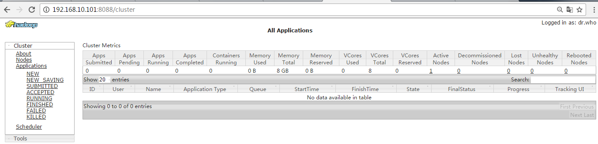

（b）删除文件系统上的output文件

```shell
bin/hdfs dfs -rm -R /user/atguigu/output
```

（c）执行MapReduce程序

```shell
bin/hadoop jar share/hadoop/mapreduce/hadoop-mapreduce-examples-2.7.2.jar wordcount /user/atguigu/input /user/atguigu/output
```

（d）查看运行结果

```shell
hadoop-2.7.2]$ bin/hdfs dfs -cat /user/atguigu/output/*
```

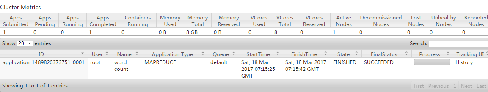

#### 3. 配置历史服务器

为了查看程序的历史运行情况，需要配置一下历史服务器。具体配置步骤如下：

1.配置mapred-site.xml

 ```shell
vi mapred-site.xml
 ```

在该文件里面增加如下配置。

```xml
<!-- 历史服务器端地址 -->
<property>
<name>mapreduce.jobhistory.address</name>
<value>hadoop101:10020</value>
</property>
<!-- 历史服务器web端地址 -->
<property>
  <name>mapreduce.jobhistory.webapp.address</name>
  <value>hadoop101:19888</value>
</property>
```

2.启动历史服务器

```shell
sbin/mr-jobhistory-daemon.sh start historyserver
```

3.查看历史服务器是否启动

```shell
 jps
```

4.查看JobHistory

http://hadoop101:19888/jobhistory

#### 4. 日志文件配置聚集

日志聚集概念：应用运行完成以后，将程序运行日志信息上传到HDFS系统上。

日志聚集功能好处：可以方便的查看到程序运行详情，方便开发调试。

注意：开启日志聚集功能，需要重新启动NodeManager 、ResourceManager和HistoryManager。

1. 配置yarn-site.xml

```shell
vi yarn-site.xml
# 在该文件里面增加如下配置。
```

```xml
<!-- 日志聚集功能使能 -->
<property>
    <name>yarn.log-aggregation-enable</name>
    <value>true</value>
</property>
<!-- 日志保留时间设置7天 -->
<property>
	<name>yarn.log-aggregation.retain-seconds</name>
	<value>604800</value>
</property>
```

2. 关闭NodeManager 、ResourceManager和HistoryManager

```shell
sbin/yarn-daemon.sh stop resourcemanager
sbin/yarn-daemon.sh stop nodemanager
sbin/mr-jobhistory-daemon.sh stop historyserver
```

3. 启动NodeManager 、ResourceManager和HistoryManager

```shell
sbin/yarn-daemon.sh start resourcemanager
sbin/yarn-daemon.sh start nodemanager
sbin/mr-jobhistory-daemon.sh start historyserver
```

4. 删除HDFS上已经存在的输出文件

```shell
bin/hdfs dfs -rm -R /user/atguigu/output
```

5. 执行WordCount程序

```shell
hadoop jar share/hadoop/mapreduce/hadoop-mapreduce-examples-2.7.2.jar wordcount /user/atguigu/input /user/atguigu/output
```

6. 查看日志，如图2-37，2-38，2-39所示

   http://{{HadoopIP}}:19888/jobhistory

   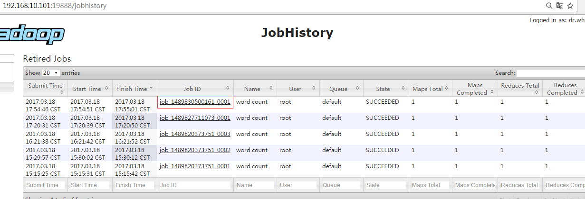

   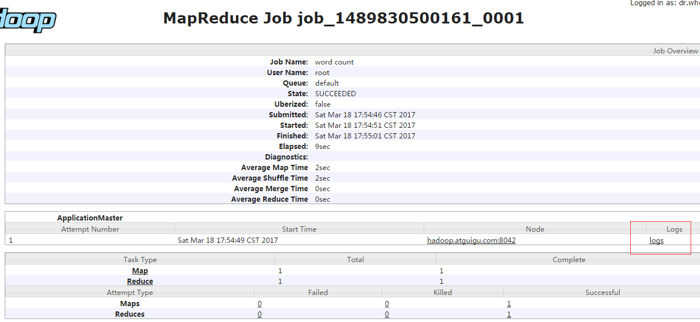

   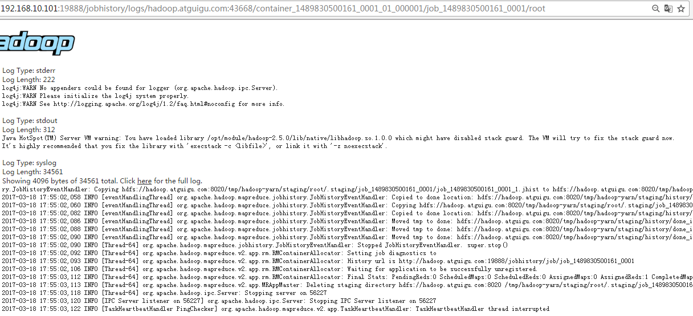

#### 5. 配置文件说明

Hadoop配置文件分两类：默认配置文件和自定义配置文件，只有用户想修改某一默认配置值时，才需要修改自定义配置文件，更改相应属性值。

（1）默认配置文件：

| 文件名               | 文件位置                                                    |
| -------------------- | ----------------------------------------------------------- |
| [core-default.xml]   | hadoop-common-2.7.2.jar/  core-default.xml                  |
| [hdfs-default.xml]   | hadoop-hdfs-2.7.2.jar/  hdfs-default.xml                    |
| [yarn-default.xml]   | hadoop-yarn-common-2.7.2.jar/  yarn-default.xml             |
| [mapred-default.xml] | hadoop-mapreduce-client-core-2.7.2.jar/  mapred-default.xml |

（2）自定义配置文件：

​    **core-site.xml**、**hdfs-site.xml**、**yarn-site.xml**、**mapred-site.xml**四个配置文件存放在`$HADOOP_HOME/etc/hadoop`这个路径上，用户可以根据项目需求重新进行修改配置。

### 完全分布式运行模式

#### 常用管理网址

| 链接                                     | 作用                       |
| ---------------------------------------- | -------------------------- |
| https://hadoop.apache.org/docs/stable/   | 官方文档                   |
| http://192.168.2.101:8088/cluster        | 集群状态管理               |
| http://192.168.2.100:50070/explorer.html | Hadoop 文件管理            |
| http://192.168.2.102:50090/status.html   | SecondaryNameNode 管理网址 |


#### 常用端口(需要开放的)

| 组件      | 节点              | 默认端口 | 配置                                                         | 用途说明                                                     |
| --------- | ----------------- | -------- | ------------------------------------------------------------ | ------------------------------------------------------------ |
| HDFS      | DataNode          | 50010    | dfs.datanode.address                                         | datanode服务端口，用于数据传输                               |
| HDFS      | DataNode          | 50075    | dfs.datanode.http.address                                    | http服务的端口                                               |
| HDFS      | DataNode          | 50475    | dfs.datanode.https.address                                   | https服务的端口                                              |
| HDFS      | DataNode          | 50020    | dfs.datanode.ipc.address                                     | ipc服务的端口                                                |
| HDFS      | NameNode          | 50070    | dfs.namenode.http-address                                    | http服务的端口                                               |
| HDFS      | NameNode          | 50470    | dfs.namenode.https-address                                   | https服务的端口                                              |
| HDFS      | NameNode          | 8020     | fs.defaultFS                                                 | 接收Client连接的RPC端口，用于获取文件系统metadata信息。      |
| HDFS      | journalnode       | 8485     | dfs.journalnode.rpc-address                                  | RPC服务                                                      |
| HDFS      | journalnode       | 8480     | dfs.journalnode.http-address                                 | HTTP服务                                                     |
| HDFS      | ZKFC              | 8019     | dfs.ha.zkfc.port                                             | ZooKeeper FailoverController，用于NN HA                      |
| YARN      | ResourceManager   | 8032     | yarn.resourcemanager.address                                 | RM的applications manager(ASM)端口                            |
| YARN      | ResourceManager   | 8030     | yarn.resourcemanager.scheduler.address                       | scheduler组件的IPC端口                                       |
| YARN      | ResourceManager   | 8031     | yarn.resourcemanager.resource-tracker.address                | IPC                                                          |
| YARN      | ResourceManager   | 8033     | yarn.resourcemanager.admin.address                           | IPC                                                          |
| YARN      | ResourceManager   | 8088     | yarn.resourcemanager.webapp.address                          | http服务端口                                                 |
| YARN      | NodeManager       | 8040     | yarn.nodemanager.localizer.address                           | localizer IPC                                                |
| YARN      | NodeManager       | 8042     | yarn.nodemanager.webapp.address                              | http服务端口                                                 |
| YARN      | NodeManager       | 8041     | yarn.nodemanager.address                                     | NM中container manager的端口                                  |
| YARN      | JobHistory Server | 10020    | mapreduce.jobhistory.address                                 | IPC                                                          |
| YARN      | JobHistory Server | 19888    | mapreduce.jobhistory.webapp.address                          | http服务端口                                                 |
| HBase     | Master            | 60000    | hbase.master.port                                            | IPC                                                          |
| HBase     | Master            | 60010    | hbase.master.info.port                                       | http服务端口                                                 |
| HBase     | RegionServer      | 60020    | hbase.regionserver.port                                      | IPC                                                          |
| HBase     | RegionServer      | 60030    | hbase.regionserver.info.port                                 | http服务端口                                                 |
| HBase     | HQuorumPeer       | 2181     | hbase.zookeeper.property.clientPort                          | HBase-managed ZK mode，使用独立的ZooKeeper集群则不会启用该端口。 |
| HBase     | HQuorumPeer       | 2888     | hbase.zookeeper.peerport                                     | HBase-managed ZK mode，使用独立的ZooKeeper集群则不会启用该端口。 |
| HBase     | HQuorumPeer       | 3888     | hbase.zookeeper.leaderport                                   | HBase-managed ZK mode，使用独立的ZooKeeper集群则不会启用该端口。 |
| Hive      | Metastore         | 9083     | /etc/default/hive-metastore中export PORT=<port>来更新默认端口 |                                                              |
| Hive      | HiveServer        | 10000    | /etc/hive/conf/hive-env.sh中export HIVE_SERVER2_THRIFT_PORT=<port>来更新默认端口 |                                                              |
| ZooKeeper | Server            | 2181     | /etc/zookeeper/conf/zoo.cfg中clientPort=<port>               | 对客户端提供服务的端口                                       |
| ZooKeeper | Server            | 2888     | /etc/zookeeper/conf/zoo.cfg中server.x=[hostname]:nnnnn[:nnnnn]，标蓝部分 | follower用来连接到leader，只在leader上监听该端口。           |
| ZooKeeper | Server            | 3888     | /etc/zookeeper/conf/zoo.cfg中server.x=[hostname]:nnnnn[:nnnnn]，标蓝部分 | 用于leader选举的。只在electionAlg是1,2或3(默认)时需要。      |

#### 1. 编写集群分发脚本 xsync（也可以直接再对应机器上安装好Hadoop 后进入步骤2）

1. scp（secure copy）安全拷贝

   （1）scp定义：

   scp可以实现服务器与服务器之间的数据拷贝。（from server1 to server2）（2）基本语法

   scp   -r     $pdir/$fname        $user@hadoop$host:$pdir/$fname

   命令  递归    要拷贝的文件路径/名称  目的用户@主机:目的路径/名称

   （3）案例实操

   （a）在hadoop101上，将hadoop101中/opt/module目录下的软件拷贝到hadoop102上。

   ```shell
   scp -r /opt/module root@hadoop102:/opt/module
   ```

   （b）在hadoop103上，将hadoop101服务器上的/opt/module目录下的软件拷贝到hadoop103上。

   ```shell
   sudo scp -r atguigu@hadoop101:/opt/module root@hadoop103:/opt/module
   ```

   （c）在hadoop103上操作将hadoop101中/opt/module目录下的软件拷贝到hadoop104上。

   ```shell
   scp -r atguigu@hadoop101:/opt/module root@hadoop104:/opt/module
   ```

   **注意**：

   拷贝过来的/opt/module目录，别忘了在hadoop102、hadoop103、hadoop104上修改所有文件的，所有者和所有者组。

   ```shell
   sudo chown atguigu:atguigu -R /opt/module
   ```

   （d）将hadoop101中/etc/profile文件拷贝到hadoop102的/etc/profile上。

   ```shell
   sudo scp /etc/profile root@hadoop102:/etc/profile
   ```

   （e）将hadoop101中/etc/profile文件拷贝到hadoop103的/etc/profile上。

   ```shell
   sudo scp /etc/profile root@hadoop103:/etc/profile
   ```

   （f）将hadoop101中/etc/profile文件拷贝到hadoop104的/etc/profile上。

   ```shell
   sudo scp /etc/profile root@hadoop104:/etc/profile
   ```

   **注意**：拷贝过来的配置文件别忘了source一下/etc/profile，。

2. rsync 远程同步工具

   rsync主要用于备份和镜像。具有速度快、避免复制相同内容和支持符号链接的优点。

   rsync和scp区别：用rsync做文件的复制要比scp的速度快，rsync只对差异文件做更新。scp是把所有文件都复制过去。

   （1）基本语法

   rsync   -rvl    $pdir/$fname        $user@hadoop$host:$pdir/$fname

   命令  选项参数  要拷贝的文件路径/名称  目的用户@主机:目的路径/名称

   选项参数说明

   | 选项 | 功能         |
   | ---- | ------------ |
   | -r   | 递归         |
   | -v   | 显示复制过程 |
   | -l   | 拷贝符号连接 |

   （2）案例实操

   （a）把hadoop101机器上的/opt/software目录同步到hadoop102服务器的root用户下的/opt/目录

   ```shell
   rsync -rvl /opt/software/ root@hadoop102:/opt/software
   ```

3. xsync集群分发脚本

   （1）需求：循环复制文件到所有节点的相同目录下

   （2）需求分析：

   （a）rsync命令原始拷贝：

   ```shell
   rsync -rvl   /opt/module        root@hadoop103:/opt
   ```

   （b）期望脚本：

   xsync要同步的文件名称

   （c）说明：在/home/atguigu/bin这个目录下存放的脚本，atguigu用户可以在系统任何地方直接执行。

   （3）脚本实现

   （a）在/home/atguigu目录下创建bin目录，并在bin目录下xsync创建文件，文件内容如下：

   ```shell
   mkdir bin
   cd bin/
   touch xsync
   vi xsync
   ```

   在该文件中编写如下代码

   ```sh
   #!/bin/bash
   #1 获取输入参数个数，如果没有参数，直接退出
   pcount=$#
   if((pcount==0)); then
   echo no args;
   exit;
   fi
   
   #2 获取文件名称
   p1=$1
   fname=`basename $p1`
   echo fname=$fname
   
   #3 获取上级目录到绝对路径
   pdir=`cd -P $(dirname $p1); pwd`
   echo pdir=$pdir
   
   #4 获取当前用户名称
   user=`whoami`
   
   #5 循环
   for((host=103; host<105; host++)); do
      echo ------------------- hadoop$host --------------
      rsync -rvl $pdir/$fname $user@hadoop$host:$pdir
   done
   ```

   （b）修改脚本 xsync 具有执行权限

   ```shell
   chmod 777 xsync
   ```

   （c）调用脚本形式：xsync 文件名称

   ```shell
   xsync /home/atguigu/bin
   ```

   **注意**：

   如果将xsync放到/home/atguigu/bin目录下仍然不能实现全局使用，可以将xsync移动到/usr/local/bin目录下。

#### 2. 集群配置

1. 集群部署规划

   |      | hadoop102          | hadoop103                    | hadoop104                   |
   | ---- | ------------------ | ---------------------------- | --------------------------- |
   | HDFS | NameNode  DataNode | DataNode                     | SecondaryNameNode  DataNode |
   | YARN | NodeManager        | ResourceManager  NodeManager | NodeManager                 |

2. 配置集群

   （1）核心配置文件，配置core-site.xml

   ```shell
   vi core-site.xml
   # 在该文件中编写如下配置
   ```

   ```xml
   <!-- 指定HDFS中NameNode的地址 -->
   <property>
      <name>fs.defaultFS</name>
      <value>hdfs://hadoop102:9000</value>
   </property>
   
   <!-- 指定Hadoop运行时产生文件的存储目录 -->
   <property>
      <name>hadoop.tmp.dir</name>
      <value>/opt/module/hadoop-2.7.2/data/tmp</value>
   </property>
   ```

   （2）HDFS配置文件

   配置hadoop-env.sh

   ```shell
   [atguigu@hadoop102 hadoop]$ vi hadoop-env.sh
   # 加入如下配置
   export JAVA_HOME=/opt/module/jdk1.8.0_144
   ```

   配置hdfs-site.xml

   ```shell
   vi hdfs-site.xml
   # 在该文件中编写如下配置
   ```

   ```xml
   <property>
      <name>dfs.replication</name>
      <value>3</value>
   </property>
   
   <!-- 指定Hadoop辅助名称节点主机配置 -->
   <property>
      <name>dfs.namenode.secondary.http-address</name>
      <value>hadoop104:50090</value>
   </property>
   ```

   **注意**：

   > 如果 core-site 与 hdfs-site 配置 host+hostName 的方式，而是使用IP地址配置时，需要再 hdfs-site.xml 中添加以下配置，否则会导致 dataNode 有守护进行，但hdfs web页面上显示没有live node。
   >
   > ```xml
   > <property>
   >     <name>dfs.namenode.datanode.registration.ip-hostname-check</name>
   >     <value>false</value>
   > </property>
   > ```

   

   （3）YARN配置文件

   配置yarn-env.sh

   ```shell
   vi yarn-env.sh
   # 加入如下配置
   export JAVA_HOME=/opt/module/jdk1.8.0_144
   ```

   配置yarn-site.xml

   ```shell
   vi yarn-site.xml
   # 在该文件中增加如下配置
   ```

   ```xml
   <!-- Reducer获取数据的方式 -->
   <property>
       <name>yarn.nodemanager.aux-services</name>  
       <value>mapreduce_shuffle</value>
   </property>
   
   <!-- 指定YARN的ResourceManager的地址 -->
   <property>
       <name>yarn.resourcemanager.hostname</name>
       <value>hadoop103</value>
   </property>
   ```

   （4）MapReduce配置文件

   配置mapred-env.sh

   ```shell
   vi mapred-env.sh
   # 加入如下配置
   export JAVA_HOME=/opt/module/jdk1.8.0_144
   ```

   配置mapred-site.xml

   ```shell
   cp mapred-site.xml.template mapred-site.xml
   vi mapred-site.xml
   # 在该文件中增加如下配置
   ```

   ```xml
   <!-- 指定MR运行在Yarn上 -->
   <property>
       <name>mapreduce.framework.name</name>
       <value>yarn</value>
   </property>
   ```

3. 在集群上分发配置好的Hadoop配置文件

   ```shell
   xsync /opt/module/hadoop-2.7.2/
   ```

4. 查看文件分发情况

   ```shell
   cat /opt/module/hadoop-2.7.2/etc/hadoop/core-site.xml
   ```

#### 3. 集群单点启动

注意：是第一次启动，需要删除 data 目录与 logs 目录的文件

（1）如果集群是第一次启动，需要**格式化NameNode**

```shell
hadoop namenode -format
```

（2）在adoop102上启动NameNode

```shell
hadoop-daemon.sh start namenode
jps
3461 NameNode
```

（3）在hadoop102、hadoop103以及hadoop104上分别启动DataNode

```shell
hadoop-daemon.sh start datanode
jps
3461 NameNode
3608 Jps
3561 DataNode

hadoop-daemon.sh start datanode
jps
3190 DataNode
3279 Jps

hadoop-daemon.sh start datanode
jps
3237 Jps
3163 DataNode
```

#### 4. SSH 无密登录配置

1. 配置ssh

   （1）基本语法

   ssh另一台电脑的ip地址

   （2）ssh连接时出现Host key verification failed的解决方法

   ```shell
   ssh 192.168.1.103
   
   The authenticity of host '192.168.1.103 (192.168.1.103)' can't be established.
   
   RSA key fingerprint is cf:1e:de:d7:d0:4c:2d:98:60:b4:fd:ae:b1:2d:ad:06.
   
   Are you sure you want to continue connecting (yes/no)? 
   Host key verification failed.
   ```

   （3）解决方案如下：直接输入yes

2. 无密钥配置

   （1）免密登录原理，

   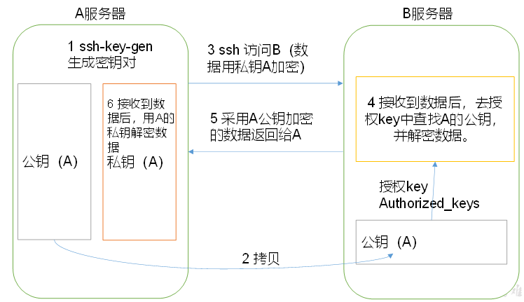

   （2）生成公钥和私钥：

   ```shell
   ssh-keygen -t rsa
   ```

   然后敲（三个回车），就会生成两个文件id_rsa（私钥）、id_rsa.pub（公钥）

   （3）将公钥拷贝到要免密登录的目标机器上

   ```shell
   ssh-copy-id hadoop102
   
   ssh-copy-id hadoop103
   
   ssh-copy-id hadoop104
   ```

   **注意**：

   还需要在hadoop102上采用root账号，配置一下无密登录到hadoop102、hadoop103、hadoop104；

   还需要在hadoop103上采用atguigu账号配置一下无密登录到hadoop102、hadoop103、hadoop104服务器上。

3. .ssh文件夹下（~/.ssh）的文件功能解释

| known_hosts     | 记录ssh访问过计算机的公钥(public  key) |
| --------------- | -------------------------------------- |
| id_rsa          | 生成的私钥                             |
| id_rsa.pub      | 生成的公钥                             |
| authorized_keys | 存放授权过得无密登录服务器公钥         |

#### 5. 一键起集群

1. 配置slaves

   ```shell
   cd /opt/module/hadoop-2.7.2/etc/hadoop/slaves
   
   vi slaves
   # 在该文件中增加如下内容：对应的集群Node的IP
   hadoop102
   hadoop103
   hadoop104
   ```

   注意：该文件中添加的内容结尾不允许有空格，文件中不允许有空行。

   同步所有节点配置文件

   ```shell
   xsync slaves
   ```

2. 启动集群

   （1）如果集群是第一次启动，需要格式化NameNode（注意格式化之前，一定要先停止上次启动的所有namenode和datanode进程，然后再删除data和log数据）

   ```shell
   bin/hdfs namenode -format
   ```

   （2）启动HDFS

   ```shell
   # 第一台集群
   sbin/start-dfs.sh
   jps
   4166 NameNode
   4482 Jps
   4263 DataNode
   # 第二台集群
   jps
   3218 DataNode
   3288 Jps
    # 第三台集群
   jps
   3221 DataNod
   3283 SecondaryNameNode
   3364 Jps
   ```

   （3）启动YARN

   ```shell
   sbin/start-yarn.sh
   ```

   **注意**：

   NameNode和ResourceManger如果不是同一台机器，不能在NameNode上启动 YARN，应该在ResouceManager所在的机器上启动YARN。

   （4）Web端查看SecondaryNameNode

   （a）浏览器中输入：http://hadoop104:50090/status.html

   （b）查看SecondaryNameNode信息

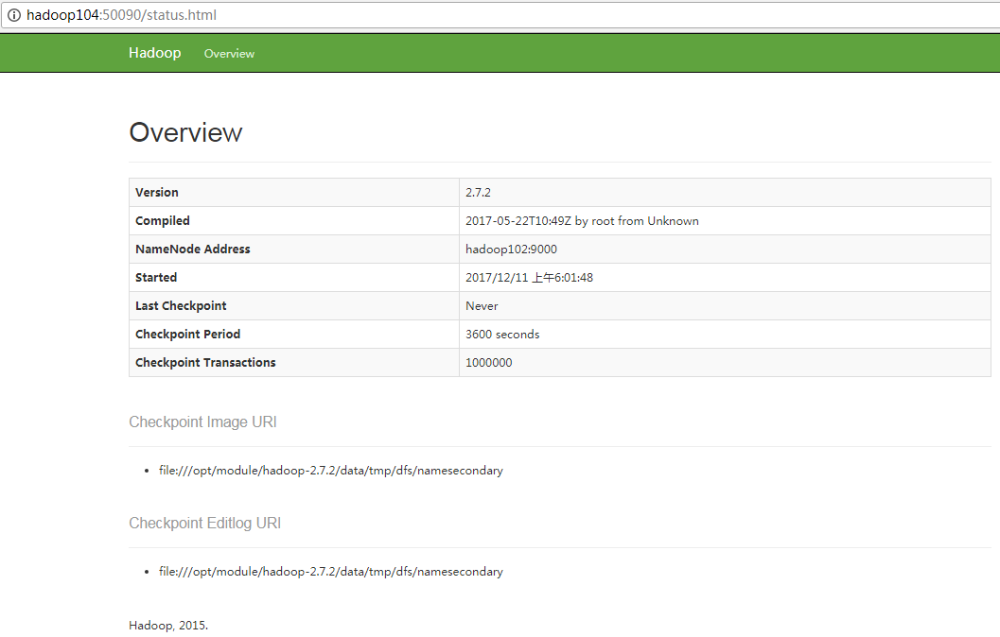

3. 集群基本测试

   （1）上传文件到集群

   上传小文件

   ```shell
   hdfs dfs -mkdir -p /user/atguigu/input
   
   hdfs dfs -put wcinput/wc.input /user/atguigu/input
   ```

   上传大文件

   ```shell
   bin/hadoop fs -put /opt/software/hadoop-2.7.2.tar.gz  /user/atguigu/input
   ```

   （2）上传文件后查看文件存放在什么位置

   （a）查看HDFS文件存储路径

   ```shell
   pwd
   /opt/module/hadoop-2.7.2/data/tmp/dfs/data/current/BP-938951106-192.168.10.107-1495462844069/current/finalized/subdir0/subdir0
   ```

   （b）查看HDFS在磁盘存储文件内容

   ```shell
   cat blk_1073741825
   hadoop yarn
   hadoop mapreduce 
   atguigu
   atguigu
   ```

   （3）拼接

   ```
   -rw-rw-r--. 1 atguigu atguigu 134217728 5月 23 16:01 **blk_1073741836**
   
   -rw-rw-r--. 1 atguigu atguigu  1048583 5月 23 16:01 blk_1073741836_1012.meta
   
   -rw-rw-r--. 1 atguigu atguigu 63439959 5月 23 16:01 **blk_1073741837**
   
   -rw-rw-r--. 1 atguigu atguigu  495635 5月 23 16:01 blk_1073741837_1013.meta
   ```

   ```shell
   cat blk_1073741836>>tmp.file
   
   cat blk_1073741837>>tmp.file
   
   tar -zxvf tmp.file
   ```

   （4）下载

   ```shell
   bin/hadoop fs -get /user/atguigu/input/hadoop-2.7.2.tar.gz ./
   ```

#### 6. 集群启动/停止总结

1. 各个服务组件逐一启动/停止

   （1）分别启动/停止HDFS组件

   ```shell
    hadoop-daemon.sh start / stop namenode / datanode / secondarynamenode
   ```

   （2）启动/止YARN

   ```shell
   yarn-daemon.sh start / stop resourcemanager / nodemanager
   ```

2. 各个模块分开启动/停止（配置ssh是前提）常用（$HADOOP_HOME/sbin/）

   （1）整体启动/停止HDFS

   ```shell
   start-dfs.sh  / stop-dfs.sh
   ```

   （2）整体启动/停止YARN

   ```
   start-yarn.sh / stop-yarn.sh
   ```

#### 7. 集群的时间同步

> 可参考 Linux 笔记中时间同步的两种方式

时间同步的方式：找一个机器，作为时间服务器，所有的机器与这台集群时间进行定时的同步，比如，每隔十分钟，同步一次时间。

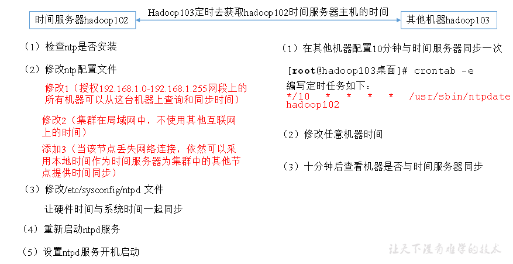

**配置时间同步具体实操：**

1. 时间服务器配置（必须root用户）

   （1）检查ntp是否安装

   ```shell
   rpm -qa|grep ntp
   ntp-4.2.6p5-10.el6.centos.x86_64
   fontpackages-filesystem-1.41-1.1.el6.noarch
   ntpdate-4.2.6p5-10.el6.centos.x86_64
   ```

   （2）修改ntp配置文件

   ```shell
   vi /etc/ntp.conf
   ```

   修改内容如下

   a）修改1（授权192.168.1.0-192.168.1.255网段上的所有机器可以从这台机器上查询和同步时间）

   ```
   #restrict 192.168.1.0 mask 255.255.255.0 nomodify notrap
   ```

   为

   ```
   restrict 192.168.1.0 mask 255.255.255.0 nomodify notrap
   ```

   b）修改2（集群在局域网中，不使用其他互联网上的时间）

   ```
   server 0.centos.pool.ntp.org iburst
   server 1.centos.pool.ntp.org iburst
   server 2.centos.pool.ntp.org iburst
   server 3.centos.pool.ntp.org iburst
   ```

   为

   ```
   #server 0.centos.pool.ntp.org iburst
   #server 1.centos.pool.ntp.org iburst
   #server 2.centos.pool.ntp.org iburst
   #server 3.centos.pool.ntp.org iburst
   ```

   c）添加3（当该节点丢失网络连接，依然可以采用本地时间作为时间服务器为集群中的其他节点提供时间同步）

   ```
   server 127.127.1.0
   
   fudge 127.127.1.0 stratum 10
   ```

   （3）修改/etc/sysconfig/ntpd 文件

   ```shell
   vim /etc/sysconfig/ntpd
   ```

   增加内容如下（让硬件时间与系统时间一起同步）

   ```
   SYNC_HWCLOCK=yes
   ```

   （4）重新启动ntpd服务

   ```shell
   service ntpd status
   ntpd 已停
   service ntpd start
   正在启动 ntpd：                       [确定]
   ```

   （5）设置ntpd服务开机启动

   ```shell
   chkconfig ntpd on
   ```

2. 其他机器配置（必须root用户）

   （1）在其他机器配置10分钟与时间服务器同步一次

   ```shell
   crontab -e
   ```

   编写定时任务如下：

   ```shell
   */10 * * * * /usr/sbin/ntpdate hadoop102
   ```

   （2）修改任意机器时间

   ```shell
   date -s "2017-9-11 11:11:11"
   ```

   （3）十分钟后查看机器是否与时间服务器同步

   ```shell
    date
   ```

   **说明**：测试的时候可以将10分钟调整为1分钟，节省时间。

# HDFS

分布式文件存储系统

优点：

* 高容错率：
  * 数据自动保存多个副本，可以通过增加副本的形式，提高容错性
  * 一个副本丢失后，可以自动恢复
* 适合处理大数据
  * 数据规模：能够处理数据规模达到GB、TB、PB级别大数据
  * 文件规模：能够处理百万规模以上的文件数量，数量相当大
* 构建在廉价机器上，通过多副本机制，提高可靠性

缺点：

* 不适合低延时数据访问，比如无法做到毫秒级的存储数据
* 无法高效的对大量小得文件进行存储
  * 存储大量小文件，他会占用NameNode大量的内存来存储文件目录和块信息，错误操作，NameNode 的内存大小是有限的。
  * 小文件存储的寻址时间会超过读取时间，它违反了HDFS的设计目标
* 不支持并发写入、文件随机修改
  * 一个文件只能有一个写，不允许多个线程同时写入
  * 仅支持追加，不支持文件的随机修改

## HDFS 架构

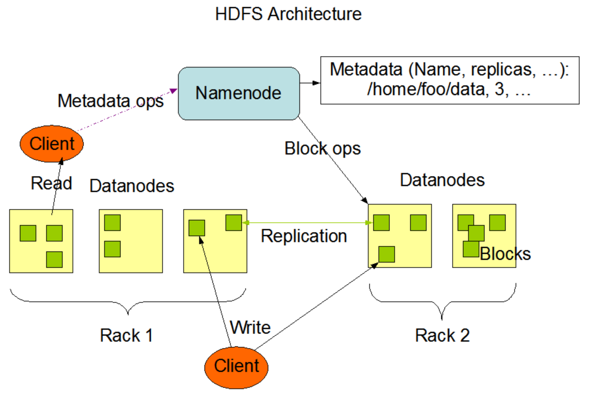

1. NameNode

   相当于 Master

   * 管理HDFS的名称空间
   * 配置副本策略
   * 管理数据块（Block）的映射信息
   * 处理客户端读写请求

2. DataNode

   相当于Slave，NameNode 下达命令，DataNode 执行实际的操作

   * 存储实际的数据块
   * 执行数据块的读/写操作

3. Client

   客户端。

   * 文件切分。文件上传HDFS的时候，Client 将文件切分为多个Block，然后依次上传
   * 与 NameNode 交互。获取文件的位置信息
   * 与 DataNode 交互。 读取或者写入数据
   * Client 提供一些命令来管理 HDFS，比如 NameNode 格式化
   * Client 可以通过一些命令来访问 HDFS。比如对 HDFS 的增删改查操作

4. SecondaryNameNode

   并非 NameNode 的副本。 在 NameNode 挂掉后，并不能够马上替换 NameNode 并提供服务

   * 辅助 NameNode，分担工作量，比如定期合并 Fsimage 和 Edits，并推送给 NameNode
   * 在紧急情况下，可以辅助恢复 NameNode

## HDFS 文件块

HDFS 中文件在物理上是分块存储（Block），块的大小可以是通过配置参数（dfs.blocksize）来设置。 默认大小 Hadoop2.x中是 128M，老版本中 64M

> HDFS 的块大小设置主要取决于磁盘传输速率

* HDFS 的块设置的太小，会增加寻址时间，程序一直在找块的开始位置
* 块设置的太大，从磁盘传输数据的时间会明显大于定位这个块开始位置所需的时间。导致程序在处理这块数据时，会非常慢。

## HDFS 命令

> 基本语法

* bin/hadoop fs 具体命令
* bin/hdfs dfs 具体命令

**dfs 是 fs 的实现类**

> 具体命令

可以使用 bin/hadoop fs OR bin/hdfs dfs 直接打印所有命令

| 命令           | 参数 | 示例                                                   | 作用                                                         |
| -------------- | ---- | ------------------------------------------------------ | ------------------------------------------------------------ |
| -help          |      | hadoop fs -help rm                                     | 输出这个命令的参数                                           |
| -ls            |      | hadoop fs -ls /                                        | 显示目录信息                                                 |
| -mkdir         | -p   | hadoop fs -mkdir -p  /sanguo/sanguo                    | 创建目录                                                     |
| -moveFromLocal |      | hadoop fs -moveFromLocal  本地文件地址 HDFS目标目录    | 将本地文件移动到HDFS                                         |
| -appendToFile  |      | hadoop fs -appendToFile 本地文件 HDFS目标文件          | 向目标文件追加本地文件的内容                                 |
| -cat           |      | hadoop fs -cat HDFS目标文件                            | 查看目标文件的内容                                           |
| -chgrp         |      | hadoop fs -chgrp 目标组 目标文件                       | 将目标文件所属组修改为目标组                                 |
| -chmod         |      | hadoop fs -chmod 777 目标文件                          | 修改目标文件的权限                                           |
| -chown         |      | hadoop fs -chown 目标组:目标用户 目标文件              | 将目标文件所属人修改为目标组下的目标人                       |
| -copyFromLocal |      | hadoop fs -copyFromLocal 本地文件 目标目录             | 从本地拷贝文件到目标HDFS目标目录下                           |
| -copyToLocal   |      | hadoop fs -copyToLocal HDFS文件 本地目标目录           | 从HDFS拷贝文件到本地目标目录                                 |
| -cp            |      | hadoop fs -cp 目标文件 目标目录                        | 在HDFS中拷贝文件                                             |
| -mv            |      | hadoop fs -mv 目标文件 目标目录                        | 在HDFS中移动文件                                             |
| -put           |      | hadoop fs -put 本地文件 HDFS 目录                      | 从本地拷贝文件到 HDFS 目录（相当于copyFromLocal）            |
| -get           |      | hadoop fs -get HDFS文件 本地目录                       | 从HDFS下载文件到本地目录（相当于copyToLocal）                |
| -getmerge      |      | hadoop fs -getmerge /user/root/test/* ./root/merge.txt | 合并下载多个文件                                             |
| -tail          |      | hadoop fs -tail 目标文件                               | 显示目标文件的末尾                                           |
|                | -f   | hadoop fs -tail -f 目标文件                            | 监听并打印目标文件                                           |
| -rm            |      | hadoop fs -rm 目标文件                                 | 删除文件或文件夹                                             |
|                | -rf  | hadoop fs -rm -rf 目标文件                             | 强制删除                                                     |
| -rmdir         |      | hadoop fs -rmdir 目标空目录                            | 删除空目录                                                   |
| -du            | -s   | hadoop fs -du -s 目标目录                              | 合并打印目标目录占用空间                                     |
|                | -h   | hadoop fs -du -h 目标目录                              | -h 以可读的方式展示，比如 K、M、G                            |
| -setrep        |      | hadoop fs -setrep 10 目标文件                          | 设置HDFS中文件的副本数，最大不超过实际集群数量，如果超过集群数量，那么当往集群中增加集器时，他会根据之前备份数量配置大于集群数量的文件，同步到这台新机器上 |

## Java API 操作

> 具体可参考 SpringBoot-HDFS 项目

注意：

* 在 Windows 环境调试时，需要设置 HadoopHome，保证可以程序可以调用到 $HadoopHome\bin\winutils.exe 

  程序

  ```
  // 设置 Hadoop_Home， windows 调试过程中也可以将其设置在环境变量中
  System.setProperty("hadoop.home.dir", "D:\\Java Program\\hadoop-2.7.2");
  ```

# HBase

##  一、逻辑结构

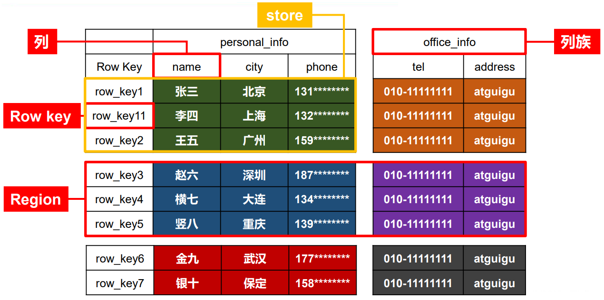

## 二、物理结构

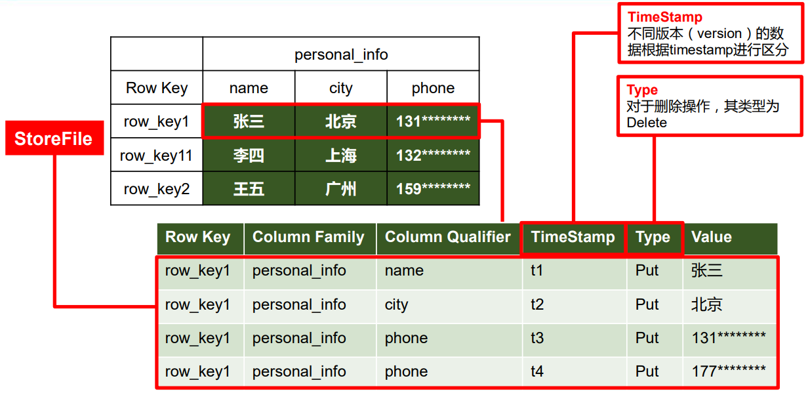

## 三、数据模型

1）Name Space

命名空间，类似于关系型数据库的 DatabBase 概念，每个命名空间下有多个表。HBase 有两个自带的命名空间，分别是 hbase 和 default，hbase 中存放的是 HBase 内置的表，default 表是用户默认使用的命名空间。

2）Region

类似于关系型数据库的表概念。不同的是，HBase 定义表时只需要声明列族即可，不需要声明具体的列。这意味着，往 HBase 写入数据时，字段可以动态、按需指定。因此，和关系型数据库相比，HBase 能够轻松应对字段变更的场景。

3）Row

HBase 表中的每行数据都由一个 RowKey 和多个 Column（列）组成，数据是按照 RowKey 的字典顺序存储的，并且查询数据时只能根据 RowKey 进行检索，所以 RowKey 的设计十分重要。

4）Column

HBase 中的每个列都由 Column Family(列族)和 Column Qualifier（列限定符）进行限定，例如 info：name，info：age。建表时，只需指明列族，而列限定符无需预先定义。

5）Time Stamp

用于标识数据的不同版本（version），每条数据写入时，如果不指定时间戳，系统会自动为其加上该字段，其值为写入 HBase 的时间。

6）Cell

由{rowkey, column Family：column Qualifier, time Stamp} 唯一确定的单元。cell 中的数据是没有类型的，全部是字节码形式存贮。

## 四、HBase 基本架构

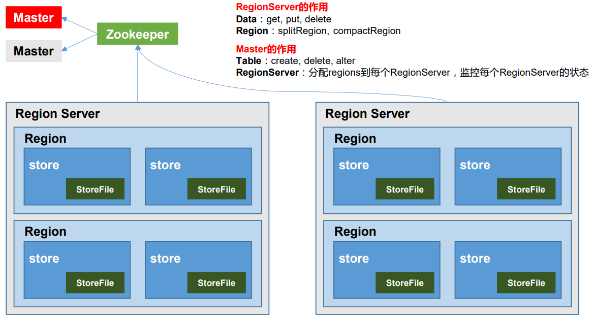

架构角色：

1. Region Server

   Region Server 为 Region 的管理者，其实现类为 HRegionServer，

   主要作用如下:

   * 对于数据的操作：get, put, delete；
   * 对于 Region 的操作：splitRegion、compactRegion。

2. Master

   Master 是所有 Region Server 的管理者，其实现类为 HMaster，

   主要作用如下：

   * 对于表的操作：create, delete, alter
   * 对于 RegionServer的操作：分配 regions到每个RegionServer，监控每个 RegionServer 的状态，负载均衡和故障转移。

3. Zookeeper

   HBase 通过 Zookeeper 来做 Master 的高可用、RegionServer 的监控、元数据的入口以及集群配置的维护等工作。

4. HDFS

   HDFS 为 HBase 提供最终的底层数据存储服务，同时为 HBase 提供高可用的支持。

## 基本 Shell 命令

| 命令            | 例子                                                         | 说明                                                         |
| --------------- | ------------------------------------------------------------ | ------------------------------------------------------------ |
| bin/hbase shell | bin/hbase shell                                              | 进入 Shell 客户端                                            |
| help            | help                                                         | 查看帮助命令                                                 |
| list            | list                                                         | 查看当前数据库有哪些表                                       |
| create          | create 'student', 'info'                                     | 创建表                                                       |
| put             | put 'student', '1001', 'info:sex', 'male'                    | 插入数据到表                                                 |
| scan            | scan 'student'                                               | 扫描查看表数据                                               |
|                 | scan 'student', {STARTROW => '1001', STOPROW => '1001'} <br />scan 'student', {STARTROW => '1001'} | 指定起始与终止位置                                           |
|                 | scan ‘t1′, {FILTER => “(PrefixFilter (‘row2′) AND (QualifierFilter (>=, ‘binary:xyz'))) AND (TimestampsFilter ( 123, 456))”} | 扫描t1表，过滤 rowkey 的前缀为 row2 的，并且列名 >=  xyz 的列，并且时间戳在 123， 456之间的数据 |
|                 | scan 'table', {REVERSED => TRUE}                             | 反转顺序                                                     |
| describe        | describe ‘student’                                           | 查看表结构                                                   |
| put             | put 'student', '1001', 'info:name', 'Nick'                   | 更新数据                                                     |
| get             | get 'student', '1001'                                        | 查看指定行数（特殊的scan，STARTROW与STOPROW在同一行）        |
|                 | get ‘t1′, ‘r1′, {COLUMN => ‘c1′, TIMERANGE => [ts1, ts2], VERSIONS => 4} | 查询 t1 表中 r1 行 c1 列的，时间戳在 ts1 - ts2 之间的，版本为 4 的数据 |
|                 | get 'student', '1001', 'info:name'                           | 查看指定列簇数据                                             |
| count           | count 'student'                                              | 统计表的行数据                                               |
| deleteall       | deleteall 'student', '1001'                                  | 删除某rowkey的全部数据                                       |
|                 | delete 'student', '1002', 'info:sex'                         | 删除某 rowkey 的某一列数据                                   |
| truncate        | truncate 'student'                                           | 清空表数据（操作顺序为先 disable，然后再 truncate。）        |
| drop            | drop 'student'                                               | 删除表数据（操作顺序为先 disable，然后再 drop。）            |
| alter           | alter 'student', {NAME=>'info', VERSIONS=>3}                 | 将 info 列族中的数据存放 3 个版本                            |

## 过滤器

### 介绍

HBase过滤器是一套为完成一些较高级的需求所提供的API接口。

过滤器也被称为下推判断器（push-down predicates），支持把数据过滤标准从客户端下推到服务器，带有 Filter 条件的 RPC 查询请求会把 Filter 分发到各个 RegionServer，所有的过滤器都在服务端生效，使被过滤掉的数据不会被传送到客户端，这些过滤逻辑在读操作时使用，可以有效降低网络传输的压力。

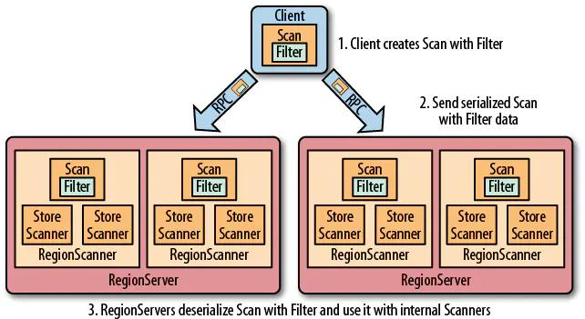

### 组成

过滤器主要有过滤器本身、比较器和比较运算符组成。

1. 操作符

   抽象操作符，也叫比较运算符。

   - LESS：小于
   - LESS_OR_EQUAL：小于等于
   - EQUAL：等于
   - NOT_EQUAL：不等于
   - GREATER：大于
   - GREATER_OR_EQUAL：大于等于
   - NO_OP：排除一切值

2. 比较器

   - BinaryComparator：二进制比较器，用于按字典顺序比较指定字节数组。
   - BinaryPrefixComparator：二进制比较器，只比较前缀是否与指定字节数组相同。
   - NullComparator：控制比较式，判断当前值是不是为null。
   - BitComparator：位比价器，通过BitwiseOp提供的AND（与）、OR（或）、NOT（非）进行比较。
   - RegexStringComparator：提供一个正则的比较器，支持正则表达式的值比较，仅支持 EQUAL 和非 EQUAL。
   - SubstringComparator：判断提供的子串是否出现在value中，并且不区分大小写。

   [原理](https://mp.weixin.qq.com/s?__biz=MzUwOTE3OTYwNA==&mid=2247484249&idx=1&sn=9627e6c1ef0761c199cf563aec3e0a8f&chksm=f91760e2ce60e9f4ba9b58982c9dfa761c1574c1d4275d913aebfe22856c80356bf00e5c5699&scene=21#wechat_redirect)

### 过滤器分类

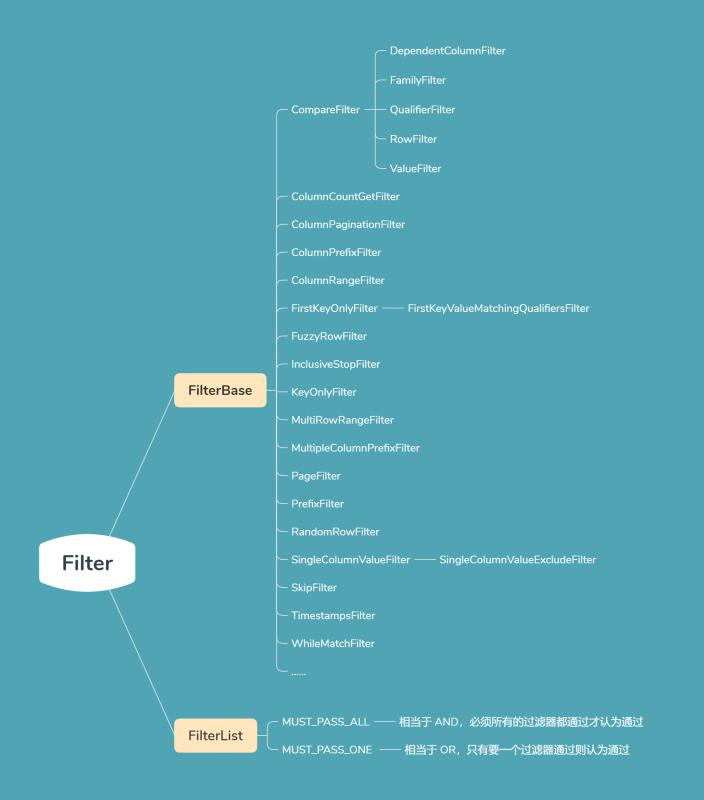


# Hive 安装

## 官方地址

1．Hive 官网地址 http://hive.apache.org/ 

2．文档查看地址 https://cwiki.apache.org/confluence/display/Hive/GettingStarted 

3．下载地址 http://archive.apache.org/dist/hive/

## Hive 部署

1. Hive 安装及配置 

   （1）把 apache-hive-1.2.1-bin.tar.gz 上传到 linux 的/opt/software 目录下 

   （2）解压 apache-hive-1.2.1-bin.tar.gz 到/opt/module/目录下面 

   ```shell
   tar -zxvf apache-hive-1.2.1-bin.tar.gz -C /opt/module/ 
   ```

   （3）修改 apache-hive-1.2.1-bin.tar.gz 的名称为 hive

   ```shell
    mv apache-hive-1.2.1-bin/ hive 
   ```

   （4）修改/opt/module/hive/conf 目录下的 hive-env.sh.template 名称为 hive-env.sh

   ```shell
    mv hive-env.sh.template hive-env.sh
   ```

   （5）配置 hive-env.sh 文件 

   （a）配置 HADOOP_HOME 路径 export

   ```shell
   HADOOP_HOME=/opt/module/hadoop-2.7.2 
   ```

   （b）配置 HIVE_CONF_DIR 路径 export

   ```SHELL
   HIVE_CONF_DIR=/opt/module/hive/conf
   ```

2. Hadoop 集群配置 

   （1）必须启动 hdfs 和 yarn 

   ```shell
   sbin/start-dfs.sh 
   sbin/start-yarn.sh
   ```

   （2）在 HDFS 上创建/tmp 和/user/hive/warehouse 两个目录并修改他们的同组权限可写 (可不操作，系统会自动创建) 

   ```shell
   bin/hadoop fs -mkdir /tmp 
   bin/hadoop fs -mkdir -p /user/hive/warehouse 
   bin/hadoop fs -chmod g+w /tmp 
   bin/hadoop fs -chmod g+w /user/hive/warehouse
   ```

3. Hive 基本操作

   ```shell
   #（1）启动 hive
   bin/hive
   #（2）查看数据库
   hive> show databases;
   #（3）打开默认数据库
   hive> use default;
   #（4）显示 default 数据库中的表
   hive> show tables;
   #（5）创建一张表
   hive> create table student(id int, name string);
   #（6）显示数据库中有几张表
   hive> show tables;
   #（7）查看表的结构
   hive> desc student;
   #（8）向表中插入数据
   hive> insert into student values(1000,"ss");
   #（9）查询表中数据
   hive> select * from student;
   #（10）退出 hive
   hive> quit;
   ```

## 将本地文件导入 Hive 案例

需求 

将本地/opt/module/data/student.txt 这个目录下的数据导入到 hive 的 student(id int, name string)表中。 

1. 数据准备 在/opt/module/data 这个目录下准备数据

   （1）在/opt/module/目录下创建 data

   ```shell
   mkdir data 
   ```

   （2）在/opt/module/datas/目录下创建 student.txt 文件并添加数据 

   ```shell
   touch student.txt
    vi student.txt 
    1001	zhangshan
    1002	lishi
    1003	zhaoliu
   ```

    **注意以 tab 键间隔。**

2. Hive 实际操作 

   ```shell
   #（1）启动 hive 
   bin/hive 
   #（2）显示数据库 
   hive> show databases; 
   #（3）使用 default 数据库 
   hive> use default; 
   #（4）显示 default 数据库中的表 
   hive> show tables; 
   #（5）删除已创建的 student 表 
   hive> drop table student; 
   #（6）创建 student 表, 并声明文件分隔符’\t’ 
   hive> create table student(id int, name string) ROW FORMAT DELIMITED FIELDS TERMINATED BY '\t'; 
   #（7）加载/opt/module/data/student.txt 文件到 student 数据库表中。 
   hive> load data local inpath '/opt/module/data/student.txt' into table student; 
   #（8）Hive 查询结果 
   hive> select * from student; 
   OK 1001 zhangshan 1002 lishi 1003 zhaoliu Time taken: 0.266 seconds, Fetched: 3 row(s)
   ```

## 将 MetaStore 存放在 MySQL 中

### MySQL 安装

#### 1. 安装包准备

1. 查看 mysql 是否安装，如果安装了，卸载 mysql

   （1）查看 

   ```shell
   rpm -qa|grep mysql mysql-libs-5.1.73-7.el6.x86_64 
   ```

   （2）卸载

   ```shell
    rpm -e --nodeps mysql-libs-5.1.73-7.el6.x86_64 
   ```

2. 解压 mysql-libs.zip 文件到当前目录

   ```shell
   unzip mysql-libs.zip
   ls mysql-libs.zip mysql-libs 
   ```

3. 进入到 mysql-libs 文件夹下

#### 2. 安装 MySQL 服务器

1. 安装 mysql 服务端 

   ```shell
   rpm -ivh MySQL-server-5.6.24-1.el6.x86_64.rpm 
   ```

2. 查看产生的随机密码

   ```shell
   cat /root/.mysql_secret OEXaQuS8IWkG19Xs
   ```

3. 查看 mysql 状态

   ```shell
   service mysql status
   ```

4. 启动 mysql 

   ```shell
   service mysql start
   ```

#### 3. 安装 MySQL 客户端

1. 安装 mysql 客户端 

   ```shell
    rpm -ivh MySQL-client-5.6.24-1.el6.x86_64.rpm
   ```

2. 链接 mysql

    ```shell
   mysql -uroot -pOEXaQuS8IWkG19Xs
   ```

3. 修改密码 

   ```shell
   mysql>SET PASSWORD=PASSWORD('000000'); 
   ```

4. 退出 mysql 

   ```shell
   mysql>exit
   ```

#### 4. MySQL 中 user 表中主机配置

配置只要是 root 用户+密码，在任何主机上都能登录 MySQL 数据库。

1. 进入 mysql 

   ```shell
   mysql -uroot -p000000
   ```

2. 显示数据库 

   ```shell
   mysql>show databases; 
   ```

3. 使用 mysql 数据库 

   ```shell
   mysql>use mysql;
   ```

4. 展示 mysql 数据库中的所有表 

   ```shell
   mysql>show tables;
   ```

5. 展示 user 表的结构 

   ```shell
   mysql>desc user;
   ```

6. 查询 user 表 

   ```shell
   mysql>select User, Host, Password from user; 
   ```

7. 修改 user 表，把 Host 表内容修改为% 

   ```shell
   mysql>update user set host='%' where host='localhost';
   ```

8. 删除 root 用户的其他 host 

   ```shell
   delete from user where Host='hadoop102';
   delete from user where Host='127.0.0.1'; 
   delete from user where Host='::1';
   ```

9. 刷新

   ```shell
    mysql>flush privileges;
   ```

10. 退出 

    ```shell
    mysql>quit;
    ```

#### 5. Hive 元数据配置到 MySql 2.5.1 驱动拷贝

1. 在/opt/software/mysql-libs 目录下解压 mysql-connector-java-5.1.27.tar.gz 驱动 包

   ```shell
   tar -zxvf mysql-connector-java-5.1.27.tar.gz 
   ```

2. 拷贝 mysql-connector-java-5.1.27-bin.jar 到/opt/module/hive/lib/ 

   ```shell
   cp /opt/software/mysql-libs/mysql-connector-java-5.1.27/mysql-c onnector-java-5.1.27-bin.jar/opt/module/hive/lib/ 
   ```

#### 6.  配置 Metastore 到 MySql 

1. 在/opt/module/hive/conf 目录下创建一个 hive-site.xml

   ```shell
   touch hive-site.xml 
   vi hive-site.xml
   ```

2. 根据官方文档配置参数，拷贝数据到 hive-site.xml 文件中 

   https://cwiki.apache.org/confluence/display/Hive/AdminManual+MetastoreAdmin

   ```xml
   <?xml version="1.0"?>
   <?xml-stylesheet type="text/xsl" href="configuration.xsl"?>
   <configuration>
       <property>
           <name>javax.jdo.option.ConnectionURL</name>
           <value>jdbc:mysql://hadoop102:3306/metastore?createDatabaseI
       fNotExist=true</value>
           <description>JDBC connect string for a JDBC
       metastore</description>
       </property>
       <property>
           <name>javax.jdo.option.ConnectionDriverName</name>
           <value>com.mysql.jdbc.Driver</value>
           <description>Driver class name for a JDBC
       metastore</description>
       </property>
       <property>
           <name>javax.jdo.option.ConnectionUserName</name>
           <value>root</value>
           <description>username to use against metastore
       database</description>
       </property>
       <property>
           <name>javax.jdo.option.ConnectionPassword</name>
           <value>000000</value>
           <description>password to use against metastore
       database</description>
       </property>
   </configuration>
   ```

3. 配置完毕后，如果启动 hive 异常，可以重新启动虚拟机。（重启后，别忘了启 动 hadoop 集群）

#### 7. Hive多窗口测试

1. 先启动 MySQL 

   ```shell
   mysql -uroot -p000000 
   ```

   查看有几个数据库 

   ```shell
   mysql> show datab
   +--------------------+
   | Database |
   +--------------------+
   | information_schema |
   | mysql |
   | performance_schema |
   | test |
   +--------------------+
   ```

2. 再次打开多个窗口，分别启动 hive

   ```shell
   bin/hive
   ```

3. 启动 hive 后，回到 MySQL 窗口查看数据库，显示增加了 metastore 数据库

   ```shell
   mysql> show databases;
   +--------------------+
   | Database |
   +--------------------+
   | information_schema |
   | metastore |
   | mysql |
   | performance_schema |
   | test |
   +--------------------+
   ```

### HiveJDBC 访问

1. 初始化 MySQL 数据库

   ```shell
   $HIVE_HOME/bin schematool -initSchema -dbType mysql
   ```

   ```
   #出现如下内容并查看mysql是否创建了metastore 数据库
   ......................................
   .............................................
   Initialization script completed
   schemaTool completed
   ```

2. 后台启动 Hive

   ```shell
   #启动metastore服务
   nohup hive --service metastore >> /var/matestore.log 2>&1 &         ##hivemetastore
   #启动hive服务
   nohup  hive --service hiveserver2 >> /var/hive.log 2>&1 &    ##hiveserver2，jdbc连接均需要
   netstat  -lnp|grep 9083
   tcp        0      0 0.0.0.0:9083            0.0.0.0:*               LISTEN      11918/java 
   netstat  -lnp|grep 10000
   tcp        0      0 0.0.0.0:10000           0.0.0.0:*               LISTEN      12011/java  
   
   ```

3. 启动 beeline

   ```shell
   bin/beeline
   ```

4. 连接 hiveserver2

   ```shell
   beeline> !connect jdbc:hive2://hadoop102:10000（回车）
   Connecting to jdbc:hive2://hadoop102:10000
   Enter username for jdbc:hive2://hadoop102:10000: root（回车）
   Enter password for jdbc:hive2://hadoop102:10000: （直接回车）
   Connected to: Apache Hive (version 1.2.1)
   Driver: Hive JDBC (version 1.2.1)
   Transaction isolation: TRANSACTION_REPEATABLE_READ
   0: jdbc:hive2://hadoop102:10000> show databases;
   +----------------+--+
   | database_name |
   +----------------+--+
   | default |
   | hive_db2 |
   +----------------+--+
   ```

   **注意**：

   上述 hadoop102 是 hive 服务的 IP，端口10000为默认端口，可配置。

   如果输入 root 回车后，输入密码直接回车不成功（默认没有配置密码，可以 直接回车），即报权限校验不通过，需要修改 Hive 配置文件 hive-site.xml，添加下述内容，然后再重启 hive 服务

   ```xml
   <!-- 此处可以设为NONE和CUSTOM，前者为不需要验证，后者是用户名和密码验证 -->
   <property>
       <name>hive.server2.authentication</name>
       <value>NONE</value><!--或者CUSTOM-->
   </property>
   ```

   如果需要配置自定义校验，可参考 https://juejin.cn/post/6844903902656069645


# Sqoop 安装

## 下载安装

从 http://mirror.bit.edu.cn/apache/sqoop/ 地址下载 sqoop 安装包

解压压缩包到一个目录下

```shell
cd /apps
tar zxvf sqoop-1.4.7.bin__hadoop-2.6.0.tar.gz
```

## 配置

1. 进入 sqoop 的 conf 目录，复制 sqoop-env-template.sh 为 sqoop-env.sh

```shell
cd /apps/sqoop-1.4.7.bin__hadoop-2.6.0/conf
cp sqoop-env-template.sh sqoop-env.sh
```

2. 编辑 sqoop-env.sh 文件，其中路径根据具体位置填写

```shell
#Set path to where bin/hadoop is available
export HADOOP_COMMON_HOME=/apps/hadoop-2.7.7

#Set path to where hadoop-*-core.jar is available
export HADOOP_MAPRED_HOME=/apps/hadoop-2.7.7

#set the path to where bin/hbase is available
#export HBASE_HOME=/apps/hbase-2.0.4

#Set the path to where bin/hive is available
export HIVE_HOME=/apps/apache-hive-2.3.2-bin

#Set the path for where zookeper config dir is
#export ZOOCFGDIR=/apps/zookeeper-3.4.10/conf
```

3. 验证安装配置

```shell
$ bin/sqoop-version
...
19/01/08 14:57:19 INFO sqoop.Sqoop: Running Sqoop version: 1.4.7
Sqoop 1.4.7
git commit id 2328971411f57f0cb683dfb79d19d4d19d185dd8
Compiled by maugli on Thu Dec 21 15:59:58 STD 2017
```

## 从 PostgreSQL 数据库中导入数据到Hive中

### 连接 PostgreSQL 数据库

1. **首先需要准备 postgresql 的 jdbc 驱动包，并放入 sqoop 的lib目录下。**

2. 查看数据库

   ```shell
   bin/sqoop list-databases --connect jdbc:postgresql://localhost:5432 --username test --password test
   ...
   postgres
   hive
   test
   ```

3. 查看数据库的表

   ```shell
   bin/sqoop list-tables --connect jdbc:postgresql://localhost:5432/test --username test --password test
   ...
   users
   ```

4. 查看表中的数据

   ```shell
   bin/sqoop eval --connect jdbc:postgresql://localhost:5432/test --username test --password test -e 'select * from users'
   -------------------------------------------------------------
   | id          | name                 | password             |
   -------------------------------------------------------------
   | 1           | user1                | password1            |
   | 2           | user2                | password2            |
   | 3           | user3                | password3            |
   -------------------------------------------------------------
   ```

### 从 PostgreSQL 向HDFS中导入数据

```shell
# 导入数据到默认目录
$ bin/sqoop import --connect jdbc:postgresql://localhost:5432/test --username test  --password test --table users --m 1

# 查看hdfs文件系统
$ hdfs dfs -ls /user/kongxx/
drwxr-xr-x   - kongxx supergroup          0 2019-01-09 00:06 /user/kongxx/users

# 查看hdfs文件内容
$ hdfs dfs -cat /user/kongxx/users/*
1,user1,password1
2,user2,password2
3,user3,password3

# 导入数据到指定目录
$ bin/sqoop import --connect jdbc:postgresql://localhost:5432/test --username test --password test --table users --target-dir /user/kongxx/users2 --m 1

# 查看hdfs文件系统
$ hdfs dfs -ls /user/kongxx/
drwxr-xr-x   - kongxx supergroup          0 2019-01-09 00:06 /user/kongxx/users
drwxr-xr-x   - kongxx supergroup          0 2019-01-09 00:21 /user/kongxx/users2

# 查看hdfs文件内容
$ hdfs dfs -cat /user/kongxx/users2/*
1,user1,password1
2,user2,password2
3,user3,password3

# 导入使用查询语句查询的数据到指定目录，并指定分隔符
$ bin/sqoop import --connect jdbc:postgresql://localhost:5432/test --username test --password test --query 'select * from users where $CONDITIONS and 1=1' --target-dir /user/kongxx/users3 --fields-terminated-by '\t' --m 1

# 查看hdfs文件内容
$ hdfs dfs -cat /user/kongxx/users3/*
1	user1	password1
2	user2	password2
3	user3	password3
```

### 从 PostgreSQL 向 Hive 中导入数据

####　1.创建软连接

在使用Hive前，需要在 sqoop 的根目录下创建一个 hive-exec.jar 的软连接，如下：

```shell
ln -s /apps/apache-hive-2.3.2-bin/lib/hive-exec-2.3.2.jar
```

#### 2. 向 Hive 中导入数据

```shell
# 导入数据到 hive 中 （也可以指定 Hive 中的数据库，表和使用增量导入方式）
$ bin/sqoop import --connect jdbc:postgresql://localhost:5432/test --username test --password test --table users --hive-import –hive-database default --create-hive-table --m 1

# 查看数据文件
$ bin/hdfs dfs -cat /user/hive/warehouse/users/*
1	user1	password1
2	user2	password2
3	user3	password3
```

**Hive 参数**：

- –hive-import 必须参数，指定导入hive
- –hive-database default hive库名
- –hive-table people hive表名
- –fields-terminated-by hive的分隔符
- –hive-overwrite 重写重复字段
- –create-hive-table 帮创建好 hive 表，但是表存在会出错。不建议使用这个参数，因为到导入的时候，会与我们的字段类型有出入。
- –hive-partition-key “dt” 指定分区表的字段
- –hive-partition-value “2018-08-08” 指定分区表的值

**过滤条件**

- –where “age>18” 匹配条件
- –columns “name,age” 选择要导入的指定列
- –query ‘select * from people where age>18 and $CONDITIONS’: sql语句查询的结果集
  - 不能 –table 一起使用
  - 需要指定 –target-dir 路径

**当数据库中字符为空时的处理**

- –null-non-string ‘0’ 当不是字符串的数据为空的时候，用 0 替换
- –null-string ‘string’ 当字符串为空的时候，使用string 字符替换

**提高传输速度**

- –direct 提高数据库到hadoop的传输速度

**增量导入**

增量导入对应，首先需要知监控那一列，这列要从哪个值开始增量

```
* check-column id 用来指定一些列
* 这些被指定的列的类型不能使任意字符类型，如char、varchar等类型都是不可以的,常用的是指定主键id.
* –check-column 可以去指定多个列
123
```

- last-value 10 从哪个值开始增量
- incremental 增量的模式
  - append id 是获取大于某一列的某个值。
  - lastmodified “2016-12-15 15:47:30” 获取某个时间后修改的所有数据
    - –append 附加模式
    - –merge-key id 合并模式

注意：增量导入不能与 –delete-target-dir 一起使用，还有必须指定增量的模式

####  3. 在 Hive 中查看数据

```shell
$ hive

hive> show tables;
OK
users

hive> select * from users;
OK
1	user1	password1
2	user2	password2
3	user3	password3
```


