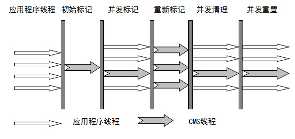

# JVM 垃圾回收

## 常见面试题：

* **如何判断对象是否死亡（两种方法）**

  * 引用计数法
  * 可达性分析算法

* **简单介绍一下强引用、软引用、弱引用、虚引用（虚引用与软引用和弱引用的区别、使用软引用能带来的好处）**

  * 虚引用与软引用、弱引用的区别：

    虚引用必须和引用队列（ReferenceQueue）联合使用。当垃圾回收器准备回收一个对象时，如果发现它还有虚引用，就会在回收对象的内存之前，把这个虚引用加入到与之关联的引用队列中。程序可以通过判断引用队列中是否已经加入了虚引用，来了解被引用的对象是否将要被垃圾回收。程序如果发现某个虚引用已经被加入到引用队列，那么就可以在所引用的对象的内存被回收之前采取必要的行动。

  * 使用软引用的好处：

    在程序设计中一般很少使用弱引用与虚引用，使用软引用的情况比较多，这是因为**软引用可以加速 JVM 对垃圾回收的速度，可以维护系统的运行安全，防止内存溢出(`outOfMemery`)等问题。**

* **如何判断一个常量是废弃常量**

  假设常量池中"abc"字符串，如果当前没有任何 String 对象引用改字符串常量的话，就说明改查常量”abc“ 就是废弃常量，如果这是发生内存回收的话而且有必要的话，"abc"就会被清理出常量池。

* **如何判断一个类是无用的类**

  同时满足以下三个条件：

  * 该类所有的实例都已经被回收，也就是 Java 堆中不存在该类的任何示例。
  * 加载该类的 ClassLoader 已经被回收。
  * 该类对应的 java.land.Class 对象没有在任何地方被引用，无法再任何地方通过反射访问该类的方法。

* **垃圾收集有哪些算法，各自的特点**

  * **标记-清除**：首先标记出所有需要回收的对象，在标记完成后统一回收所有被标记的对象。有两个明显问题：
    * 效率问题
    * 空间问题（标记清除后产生大量不连续的空间碎片）
  * **复制算法：**它可以将内存**分为大小相同的两块**，每次使用其中的一块。当这一块的内存使用完后，就将还存活的对象复制到另一块去，然后再把使用的空间一次清理掉。
  * **标记-整理**：根据老年代的特点提出的一种标记算法，标记过程仍然与“标记-清除”算法一样，但后续步骤不是直接对可回收对象回收，而是**让所有存活的对象向一端移动**，然后直接清理掉端边界以外的内存。
  * **分代收集算法**：根据对象存活周期将内存分为几块，采用不同的收集算法
    * 新生代中，每次收集都会有大量对象死去，所以可以选择复制算法，只需要付出少量对象的复制成本就可以完成每次垃圾收集。
    * 老年代的对象存活几率是比较高的，而且没有额外的空间对它进行分配担保，所以我们必须选择“标记-清除”或“标记-整理”算法进行垃圾收集。

* **HotSpot 为什么要分为新生代和老年代？**

  **提高垃圾收集的效率**，比如在新生代中，每次收集都会有大量对象死去，所以可以选择复制算法，只需要付出少量对象的复制成本就可以完成每次垃圾收集。而老年代的对象存活几率是比较高的，而且没有额外的空间对它进行分配担保，所以我们必须选择“标记-清除”或“标记-整理”算法进行垃圾收集。

* **常见的垃圾回收器有哪些？**

  *  **Serial 收集器（单线程）**：Serial（串行）收集器收集器是最基本、历史最悠久的垃圾收集器了。它在进行垃圾收集工作的时候必须暂停其他所有的工作线程（ **"Stop The World"** ），直到它收集结束。

    Serial 收集器由于没有线程 交互的开销，自然可以获得很高的单线程收集效率。Serial 收集器对于运行在 Client 模式下的虚拟机来说是个不错的选择。

  * **ParNew 收集器**：serial 收集器的多线程版本，除了使用多线程进行垃圾收集外，其余行为（控制参数、收集算法、回收策略等等）和 Serial 收集器完全一样。

    运行在 Server 模式下的虚拟机的首要选择，，只有它能与 CMS 收集器（真正意义上的并发收集器，后面会介绍到）配合工作。

  * **Parallel Scavenge 收集器**：Parallel Scavenge 收集器也是使用复制算法的多线程收集器，它看上去几乎和ParNew都一样。

    * Parallel Scavenge 收集器关注点是吞吐量（高效率的利用 CPU）。
    * CMS 等垃圾收集器的关注点更多的是用户线程的停顿时间（提高用户体验）。

  * **Serial Old 收集器：****Serial 收集器的老年代版本**，它同样是一个单线程收集器。它主要有两大用途：一种用途是在 JDK1.5 以及以前的版本中与 Parallel Scavenge 收集器搭配使用，另一种用途是作为 CMS 收集器的后备方案。

  * **Parallel Old 收集器： **Parallel Scavenge 收集器的老年代版本。使用多线程和“标记-整理”算法。**在注重吞吐量以及 CPU 资源的场合**，都可以优先考虑 Parallel Scavenge 收集器和 Parallel Old 收集器。

  * **CMS 收集器（Concurrent Mark Sweep）**：是 HotSpot 虚拟机第一款真正意义上的并发收集器，CMS 收集器是一种 **“标记-清除”算法**实现的，它第一次实现了让垃圾收集线程与用户线程（基本上）同时工作。整个过程分为四个步骤：

    * 初始标记
    * 并发标记
    * 重新标记
    * 并发清除

    从它的名字就可以看出它是一款优秀的垃圾收集器，主要优点：**并发收集、低停顿**。但是它有下面三个明显的缺点：

    * **对 CPU 资源敏感；**
    * **无法处理浮动垃圾；**
    * **它使用的回收算法-“标记-清除”算法会导致收集结束时会有大量空间碎片产生。**

  *  **G1 收集器**：G1 (Garbage-First) 是一款面向服务器的垃圾收集器,主要针对配备多颗处理器及大容量内存的机器. 以极高概率满足 GC 停顿时间要求的同时,还具备高吞吐量性能特征.被视为 JDK1.7 中 HotSpot 虚拟机的一个重要进化特征。它具备一下特点：

    * 并行与并发

    * 分代收集

    * 空间整合：

      与 CMS 的“标记--清理”算法不同，G1 从整体来看是基于“**标记整理**”算法实现的收集器；从局部上来看是基于“复制”算法实现的。

    * 可预测的停顿

    G1 收集器的运作大致分为以下几个步骤：

    * 初始标记
    * 并发标记
    * 最终标记
    * 筛选回收

    **G1 收集器在后台维护了一个优先列表，每次根据允许的收集时间，优先选择回收价值最大的 Region(这也就是它的名字 Garbage-First 的由来)**。

  * 

* **介绍一下 CMS，G1 收集器**
* **Minor GC 与 Full GC 有什么不同？**
* **新生代 GC (Minor GC)**：指发生在新生代的垃圾收集动作，Minor GC 非常频繁，回收速度一般也比较快。
  
  * **老年代 GC (Major GC / Full GC)**：指发生在老年代的GC，出现了 Major GC 经常会伴随至少一次的 Minor GC(并非绝对)，Major GC 的速度一般会比 Minor GC 的慢 10 倍以上。

## 回收思路


当需要排查各种内存溢出问题、当垃圾收集成为系统达到更高并发的瓶颈时，我们就需要对这些“自动化”的技术实施必要的监控和调节

## 1. JVM 内存分配与回收的原理

Java 的自动内存管理主要针对对象内存的回收和对象内存的分配。同时，Java 自动内存管理最核心的功能是 **堆内存** 中的对象的分配和回收。

Java 堆是垃圾收集器管理的主要区域，因此也被称作为 **GC堆(Garbage Collected Heap)**。从垃圾回收的角度，由于现在收集器基本都采用分代垃圾收集算法，所以 Java 堆还可以细分为：**新生代和老年代**，再细致一点的又可分为：**Eden 空间、From Survivor、To Survivor 空间**等。**进一步划分的目的是为了更好的回收内存，或者更快地分配内存。**

**堆空间的基本结构：**


上图所示：

* **eden 区、s0("From Survivor") 区、s1("To Survivor") 区都属于新生代**
* **tentired 区属于老年代。**

大部分情况，对象都会首先进入 Eden 区域分配，在一次新生代垃圾回收后，如果对象还存活，则会进入 s1("To")，并且对象的年龄还会增加到1（Eden 区 -> Survivor 区后对象的初始年龄变为1）

> 当它的年龄增加到一定程度（默认为15），就会被晋升到老年代中。对象晋升到老年代的年龄阈值，可以通过参数`-XX:MaxTenuringThreshold` 来设置。

经过这次GC后，Eden 区和 s0("From") 区被清空。 ***这个时候* s0("From") 和 s1("To") 会交换他们的角色，也就是新的 s1("To") 就是*上次 GC 前*的 s0("From") ，新的 s0("From") 就是*上次 GC 前*的 s1("To")**。 不管怎样，都会保证名为 s1("To") 的 Survivor 区域是空的。**MinorGC（新生代垃圾回收策略）** 会一直重复这样的过程，直到 s1("To") 区被填满，s1("To") 被填满之后，会将所有对象移动到老年代中。 

堆内存常见的内存分配策略：

* 对象优先在 Eden 区分配
* 大对象直接进入老年代
* 长期存活的对象直接进入老年代

### 1.1 对象优先在 Eden 区域分配

目前主流的垃圾收集器都会采用分代回收算法，因此需要将堆内存分为新生代和老年代，这样我们就可以根据各个年代的特点选择合适的垃圾收集算法。

大多数情况下，对象在新生代中 Eden 区分配，当 Eden 区域没有足够的内存进行分配时，虚拟机将发起一次 Minor GC。

测试：

```java
public class GCTest {

	public static void main(String[] args) {
		byte[] allocation1, allocation2;
		allocation1 = new byte[30900*1024];
		//allocation2 = new byte[900*1024];
	}
}
```

打印日志配置：


运行结果 (红色字体描述有误，应该是对应于 JDK1.7 的永久代)：


从上图我们可以看出 eden 区内存几乎已经被分配完全（即使程序什么也不做，新生代也会使用 2000 多 k 内存）。假如我们再为 allocation2 分配内存会出现什么情况呢？

```java
allocation2 = new byte[900*1024];
```


为什么会出现异常（Allocation Failure）：因为给 allocation2 分配内存的时候，eden 区几乎已经被分配完了，我们刚刚讲了当 Eden 区没有足够空间进行分配时，虚拟机系那个发起一次 Minor GC. GC 期间虚拟机又发现 allocation1 无法存入 Survivor 空间，所以只好通过**分配担保机制**吧新生代的对象提前转移到老年代中去，老年代上的空间足够存放 allocation1，所以不会出现 Full GC，执行 Minor GC 后，后面分配的对象如果能够存在 Eden 区的话，还是会在 Eden 区分配内存。 可以执行如下代码验证：

```java
public class GCTest {

	public static void main(String[] args) {
		byte[] allocation1, allocation2,allocation3,allocation4,allocation5;
		allocation1 = new byte[32000*1024];
		allocation2 = new byte[1000*1024];
		allocation3 = new byte[1000*1024];
		allocation4 = new byte[1000*1024];
		allocation5 = new byte[1000*1024];
	}
}
```

### 1.2 大对象直接进入老年代

大对象就是需要大量连续内存空间的对象（比如：字符串、数组）

为了避免大对象分配内存时由于分配担保机制带来的复制而降低效率

### 1.3 长期存活的对象直接进入老年代

既然虚拟机采用了分代收集的思想来管理内存，那么内存回收时就必须能识别哪些对象应存放在新生代，哪些对象因存放在老年代中。为了做到这一点，虚拟机给每个对象一个（Age）计数器。

如果对象在 Eden 出生并经过第一次 Minor GC 后仍然能够存活，并且能被对象 Survivor 容纳的话，将会被移动到 Survivor 空间中，并将对象年龄设置为 1，对象在 Survivor 中每熬过一次 Minor GC ，年龄就会增加1，当他的年龄增加到一定程度（默认为15岁），就会被晋升到老年代中。对象晋升到老年代年龄阈值，可以通过参数`-XX:MaxTenuringThreshold` 来设置。

### 1.4 动态对象年龄判定

大部分情况，对象都会首先在 Eden 区域分配，在一次新生代垃圾回收后，如果对象还存活，则会进入 s0 或者 s1，并且对象的年龄还会加 1(Eden 区->Survivor 区后对象的初始年龄变为 1)，当它的年龄增加到一定程度（默认为 15 岁），就会被晋升到老年代中。对象晋升到老年代的年龄阈值，可以通过参数 `-XX:MaxTenuringThreshold` 来设置。

> “Hotspot遍历所有对象时，按照年龄从小到大对其所占用的大小进行累积，当累积的某个年龄大小超过了survivor区的一半时，取这个年龄和MaxTenuringThreshold中更小的一个值，作为新的晋升年龄阈值”。
>
> **动态年龄计算的代码如下**
>
> ```c++
> uint ageTable::compute_tenuring_threshold(size_t survivor_capacity) {
> 	//survivor_capacity是survivor空间的大小
>   size_t desired_survivor_size = (size_t)((((double) survivor_capacity)*TargetSurvivorRatio)/100);
>   size_t total = 0;
>   uint age = 1;
>   while (age < table_size) {
>     total += sizes[age];//sizes数组是每个年龄段对象大小
>     if (total > desired_survivor_size) break;
>     age++;
>   }
>   uint result = age < MaxTenuringThreshold ? age : MaxTenuringThreshold;
> 	...
> }
> ```

## 2. 对象已经死亡

堆中几乎放着所有的对象实力，对堆垃圾回收前的第一步就是要判断哪些对象已经死亡（即不能再被任何途径使用的对象）


### 2.1 引用计数法

给对象中添加一个引用计数器，每当有一个地方引用它，计数器就+1，当引用失效，计数器 -1，任何时候计数器为0时的对象就是不可能再被引用的。

**这个方法实现简单，效率高，但是目前主流的虚拟机中并没有选择这个算法来管理内存，其最主要的原因是它很难解决对象之间相互循环引用的问题。**

所谓对象之间相互引用的问题，如下面的代码所示：除了对象 objA 和 objB 相互引用着对方之外，这两个对象之间再无任何引用，但是它们因为相互引用着对方，导致它们的引用计数器都不为0，于是引用计数算法无法通知 GC 回收器回收它们。

```java
public class ReferenceCountingGc {
    Object instance = null;
	public static void main(String[] args) {
		ReferenceCountingGc objA = new ReferenceCountingGc();
		ReferenceCountingGc objB = new ReferenceCountingGc();
		objA.instance = objB;
		objB.instance = objA;
		objA = null;
		objB = null;

	}
}
```

### 2.2 可达性分析算法

这个算法的基本思想就是通过一系列的成为 “**GC Roots**” 的对象作为起点，从这些节点开始向下搜索，节点所走过的路径称之为引用链，当一个对象到 GC Roots 没有任何引用链相连的话，则证明此对象是不可用的。

GC管理的区域是Java堆，**虚拟机栈**、**方法区**和**本地方法栈**不被GC所管理，因此选用这些区域内引用的对象作为GC Roots，是**不会被GC所回收**的。其中虚拟机栈和本地方法栈都是线程私有的内存区域，只要线程没有终止，就能确保它们中引用的对象的存活。而方法区中类静态属性引用的对象是显然存活的。常量引用的对象在当前可能存活，因此，也可能是GC roots的一部分.

可以作为 GC Roots 的对象：

1. 虚拟机栈（栈帧中的本地变量表）中引用的对象
2. 方法区中类静态属性引用的对象
3. 方法区中常量引用的对象
4. 本地方法栈中JNI（即一般说的Native方法）引用的对象


### 2.3 引用

无论是通过引用计数法判断对象引用数量，还是通过可达性分析算法判断对象的引用链是否可达，判断对象的存活都与“引用”相关

JDK1.2 之前，Java 中引用的定义很传统：如果 reference 类型的数据存储的数值代表的是另一块内存的起始地址，就称这块内存代表一个引用。

JDK1.2 之后，Java 对引用的概念进行了扩充，将引用分为强引用、软引用、弱引用、虚引用四种（引用强度逐渐减弱）

#### 1. 强引用（StrongReference）

以前我们使用的大部分引用实际上都是强引用，这是使用最普遍的引用。如果一个对象具有强引用，那就类似于必不可少的生活用品，垃圾回收器绝不会回收它，当内存空间不足，Java 虚拟机宁愿抛出 OutOfMemoryError 错误，使程序异常终止，也不会靠随意回收具有强引用的对象来解决内存不足问题。

#### 2. 软引用（SoftReference）

如果一个对象只具有软引用，那么就类似于可有可无的生活用品。如果内存空间足够，垃圾回收器就不会回收它，如果内存空间不足，就会回收这些对象的内存。只要垃圾回收器没有回收它，该对象就可以被程序使用。软引用可用来实现内存敏感的高速缓存。

软引用可以和一个引用队列（ReferenceQueue）联合使用，如果软引用索引用的对象被垃圾回收，Java 虚拟机就会把这个软引用加入到与之关联的引用队列中。

#### 3. 弱引用（WeakReference）

如果一个对象只具有弱引用，那就类似于可有可无的生活用品。

> 弱引用与软引用的区别在于：
>
> 只具有弱引用的对象拥有更短暂的生命周期。

在垃圾回收线程扫描它所管辖的内存区域的过程中，一旦发现了只具有弱引用的对象，不管当前内存是否足够，都会回收它的内存。不过，由于垃圾回收器是一个优先级很低的线程，因此不一定会很快发现那些只具有弱引用的对象。

弱引用可以和一个引用队列（ReferenceQueue）联合使用，如果弱引用索引用的对象被垃圾回收，Java 虚拟机就会把这个弱引用加入到与之关联的引用队列中。

#### 4. 虚引用（PhantomReference）

“虚引用”顾名思义，就是形同虚设，与其他几种引用不同，虚引用并不会决定对象的生命周期。如果一个对象仅持有虚引用，那么它就和没有任何引用一样，在任何时候都可能被回收。

**虚引用主要用来跟踪对象被垃圾回收的活动。**

> 虚引用与软引用和弱引用的一个区别在于：
>
> 虚引用必须和引用队列（ReferenceQueue）联合使用。当垃圾回收器准备回收一个对象时，如果发现它还有虚引用，就会在护手对象的内存之前，就把这个虚引用加入到与之关联的引用队列中。程序可以通过判断引用队列中是否已经加入了虚引用，来了解被引用的对象是否将要被垃圾回收。程序如果发现某个引用已经被加入到引用队列，那么就可以在所引用的对象的内存被回收之前采取必要的动作。

特别注意：在程序设计中一般很少使用弱引用与虚引用，使用软引用的情况比较多，**因为软引用可以加速JVM对垃圾内存的回收速度，可以维护系统的运行安全，防止内存溢出（OutOfMemory）等问题的产生.**

### 内存泄漏与内存溢出

* 内存泄漏：Java内存泄露是说程序逻辑问题,造成申请的内存无法释放.这样的话无论多少内存,早晚都会被占用光的.
  最简单的例子就是死循环了
* 内存溢出：就是你要求分配的内存超出了系统能给你的，系统不能满足需求，于是产生溢出。

### 2.4 不可达的对象并非“非死不可”

即使在可达性分析中不可达的对象，也并非是“非死不可”的，这时候它们暂时处于“缓刑阶段”，要真正宣告一个对象死亡，至少要经历两次标记过程，可达性分析法中不可达对象被第一次标记并且执行一次筛选，筛选的条件是此对象是否有必要执行 finalize 方法。当对象没有覆盖 finalize 方法，或 finalize 方法已经被虚拟机调用过时，虚拟机将这两种情况视为没有必要执行。

被判定位需要执行的对象将会被放在一个队列中进行第二次标记，除非这个对象与引用链上的任何一个对象建立关联，否则就会被真的回收。

### 2.5 如何判断一个常量时废弃常量

**运行时常量池主要回收的是废弃的常量**。

加入在常量池中存在“abc”，如果当前没有任何 String 对象引用该字符串的话，就说明常量“abc” 就是废弃常量，如果这是发生内存回收，而且有必要的话，“abc”就会被系统清理出常量池中

>注意：JDK1.7 以及之后版本的 JVM 已经将运行时常量池从方法区中移出来，在 Java 堆（heap）中开辟了一块区域存放运行时常量池。

### 2.6 如何判断一个类是无用的类

**方法区主要回收的是无用的类**

判定一个常量是否是“废弃常量”比较简单，而要判定一个类是否是“无用的类”的条件则相对苛刻许多。类需要**同时满足**下面 3 个条件才能算是 **“无用的类”** ：

- 该类所有的实例都已经被回收，也就是 Java 堆中不存在该类的任何实例。
- 加载该类的 ClassLoader 已经被回收。
- 该类对应的 java.lang.Class 对象没有在任何地方被引用，无法在任何地方通过反射访问该类的方法。

虚拟机可以对满足上述 3 个条件的无用类进行回收，这里说的仅仅是“可以”，而并不是和对象一样不使用了就会必然被回收。

## 3. 垃圾收集算法

**垃圾收集算法**:

* 标记-清除算法
* 复制算法
* 标记-整理算法
* 分代收集算法

### 3.1 标记-清除算法

该算法分为"标记"和"清除"阶段：首先标记出所有需要回收的对象，在标记完成后统一回收所有被标记的对象。它是最基础的收集算法，后续算法都是对其不足进行改进得到。这种垃圾收集算法会带来两个明显的问题：

1. **效率问题**

2. **空间问题（标记清除后会产生大量不连续的碎片）**

   

### 3.2 复制算法

为了解决效率问题，”复制“收集算法出现了。它可以将内存分为内存大小相同的两块，每次使用其中的一块。当这一块内存使用完后，就将还存活的对象复制到另一块中去，然后再把使用空间一次清理掉，这样就使每次的内存回收都是对内存区间的一半进行回收。


### 3.3 标记-整理算法

根据老年代的特点提出的一种标记算法，标记过程仍然与”标记-清除“算法一样，单后续步骤不是直接对可回收对象回收，而是让所有存活对象向一端移动，然后直接清理掉端边界以外的内存。


### 3.4 分代收集算法

当前虚拟机的垃圾手机都是采用分代收集算法，这种算法没有新的思想，只是根据对象的存活周期的不同将内存分为几块。一般将 Java 堆分为新生代和老年代，这样我们就可以根据各个年代的特点选择合适的垃圾收集算法。

> **新生代中，每次收集都会有大量的对象死去，所以可以选择复制算法，只需要付出少量对象的复制成本就可以完成每次垃圾收集。**
>
> **老年代的对象存活几率是比较高的，而且没有额外的空间对它进行分配担保，所以我们必须选择”标记-清除“或”标记-整理“算法进行垃圾收集**。


## 4 垃圾收集器

垃圾收集器：

* Serial 收集器
* ParNew 收集器
* Parallel Scavenge 收集器
* CMS 收集器
* G1 收集器

如果说收集算法是内存回收的方法论，那么垃圾收集器就是内存回收的具体实现。

到目前为止没有最好的垃圾收集器出现，更没有万能的垃圾收集器，**现在能做的是根据具体应用场景选择适合自己的垃圾收集器**。

### 4.1 Serial 收集器

Serial（串行）收集器是最基本、历史最悠久的垃圾收集器。**这是一个单线程收集器。**它的单线程的意义不仅仅意味着它只会是用一条垃圾收集器线程去完成垃圾收集工作，更重要的是它在进行垃圾收集工作的时候必须暂停其他所有的工作线程（"**Stop The World**"），知道它收集结束。

新生代采用复制算法，老年代采用标记整理算法


虚拟机的设计者们当然知道 STW　带来的不良用户体验，所以在后面的垃圾收集器设计中停顿时间在不断的缩短（仍然存在停顿，寻找最优秀的垃圾收集器的过程仍然在继续）。

 Serial 收集器优点：

* 简单高效：与其他收集器的单线程相比。Serial 收集器由于没有线程交互的开销，可以获得很高得单线程收集效率。

Serial 收集器得应用：

* 对于运行在 Client 模式下得虚拟机来说是个不错得选择。

### 4.2 ParNew 收集器

ParNew 收集器其实就是 Serial 收集器得多线程版本，除了使用多线程进行垃圾回收外，其余行为（控制参数、收集算法、回收策略等等）和 Serial 收集器完全一样。

新生代采用复制算法，老年代采用标记-整理算法


ParNew收集器的应用：

* 许多运行在 Server 模式下的虚拟机的首要选择。

**除了 Serial 收集器外，只有它能与 CMS 收集器（真正意义上的并发收集器）配合工作。**

**并行和并发概念补充：**

- **并行（Parallel）** ：指多条垃圾收集线程并行工作，但此时用户线程仍然处于等待状态。
- **并发（Concurrent）**：指用户线程与垃圾收集线程同时执行（但不一定是并行，可能会交替执行），用户程序在继续运行，而垃圾收集器运行在另一个 CPU 上。

### 4.3 Parallel Scavenge 收集器

Parallel Scavenge 收集器也是使用复制算法的多线程收集器，他看上去与 ParNew 收集器一样。

他的特别之处在于：

```c
-XX:+UseParallelGC 

    使用 Parallel 收集器+ 老年代串行

-XX:+UseParallelOldGC

    使用 Parallel 收集器+ 老年代并行
```

**Parallel Scavenge 收集器关注点是吞吐量（高效率的利用CPU）。CMS等垃圾收集器的关注点更多的是用户线程的停顿时间（提高用户体验）。**所谓吞吐量就是CPU中用于运行用户代码的时间与CPU总消耗时间的比值。Parallel Scavenge 收集器提供了很多参数供用户找到最合适的停顿时间或最大吞吐量，如果对于收集器运行不太了解的话，手工优化存在困难时可以选择把内存管理优化交给虚拟机去完成也是一个不错的选择。

**新生代采用复制算法，老年代采用标记-整理算法**


### 4.4 Serial Old 收集器

**Serial 收集器的老年代版本**，它同样是一个单线程收集器。

采用标记整理算法

主要用途：

* 在 JDK1.5以及以前的版本与 Parallel Scavenge 收集器搭配使用
* 作为 CMS 收集器的后备方案

### 4.5 Parallel Old 收集器

**Parallel Scavenge 收集器的老年代版本**。使用多线程和“标记-整理”算法。在注重吞吐量以及CPU资源的场合，都可以优先考虑 Parallel Scavenge 收集器和 Parallel Old 收集器。

### 4.6 CMS 收集器

**CMS （Concurrent Mark Sweep）收集器是一种以获取最短的回收停顿时间为目标的收集器。它非常符合在注重用户体验的应用上的需求。**

**CMS （Concurrent Mark Sweep）收集器是 HotSpot 虚拟机第一款真正意义上的并发收集器，它第一次实现了让垃圾手机线程与用户线程（基本上）同时工作**

从名字中的 Mark Sweep 这两个单词可以看出来，CMS 收集器是一种**“标记-清除”**算法的实现的，它的运作过程相比于前面几种垃圾收集器来说更加复杂一些。整个过程分为四个步骤:

* **初始标记**：暂停所有的其他线程，并记录下直接与 root 相连的对象，速度很快。
* **并发标记**：同时开启 GC 和用户线程，用一个闭包结构去记录可达对象。但在这个阶段结束，这个闭包结构并不能保证包含当前的所有可达对象。**因为用户线程可能会不断的更新引用域，所以GC线程无法保证可达性分析的实时性。所以整个算法里会记录这些发生引用更新的地方。**
* **重新标记**：重新标记阶段就是为了修正并发标记期间因为用户程序继续运行而导致标记产生变动的那一部分对象的标记记录，这个阶段的停顿时间一般会比初始标记阶段的时间稍长，远远比并发标记时间短。
* **并发清除**：开启用户线程，同时GC线程开始对为标记的区域做清扫。



从它的名字就可以看出它是一款优秀的垃圾收集器，主要优点：**并发收集、低停顿**。但是它有下面三个明显的缺点：

* **对 CPU 资源敏感**
* **无法处理浮动垃圾**
* **它使用的回收算法“标记-清除”算法会导致收集结束时会有大量的空间碎片产生。**

### 4.7 G1 收集器

**G1（Garbage-First）是一款面向服务器的垃圾收集器，主要针对配备多颗处理器以及大容量内存的机器，以极高概率满足GC停顿时间要求的同时，还具备高吞吐量的性能特征。** 

被视为 JDK1.7 中 HotSpot 虚拟机的一个重要进化特征。它具备以下特点：

* **并行与并发**：G1能充分利用CPU、多核环境下的硬件优势，使用多个 CPU(CPU或CPU核心)来缩短 STW 的停顿时间。部分其他收集器原本需要 Java 线程执行的 GC 动作，G1收集器仍然可以通过并发的方式让 Java 程序继续运行。
* **分代收集**：虽然G1可以不需要其他收集器配合就能独立管理整个 GC 堆，但是还是保留了分代的概念。
* **空间整合**：与CMS的”标记-清除“算法不同，G1从整体来看是基于”标记-整理“算法实现的收集器；从局部上来看是基于”复制“算法实现的。
* 可预测的停顿：这是G1相对于CMS的另一个大优势，降低停顿时间是G1和CMS的共同关注点，但是G1除了追求低停顿外，还能建立可预测的低停顿事件模型，能让使用者明确指定在一个长度为M 毫秒的时间片段内。

G1 收集器的运作大致分为以下几个步骤：

* **初始标记**
* **并发标记**
* **最终标记**
* **筛选回收**

G1 收集器在后台维护了一个优先列表，每次根据允许的收集时间来选择回收价值最大的 Region（这也是它的名字 Garbage-First 名字的由来）。这种使用 Region 划分内存空间以及有优先级区域回收方式，保证了 G1收集器在有限时间内尽可能高的收集效率（把内存化整为零）