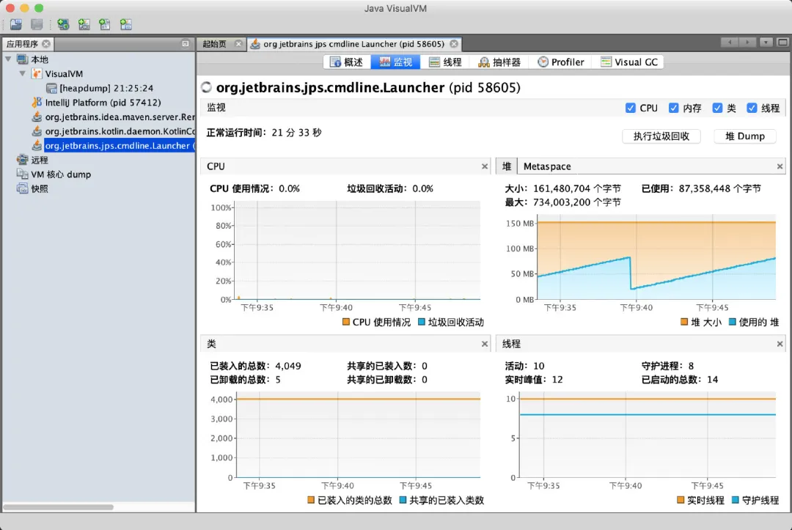
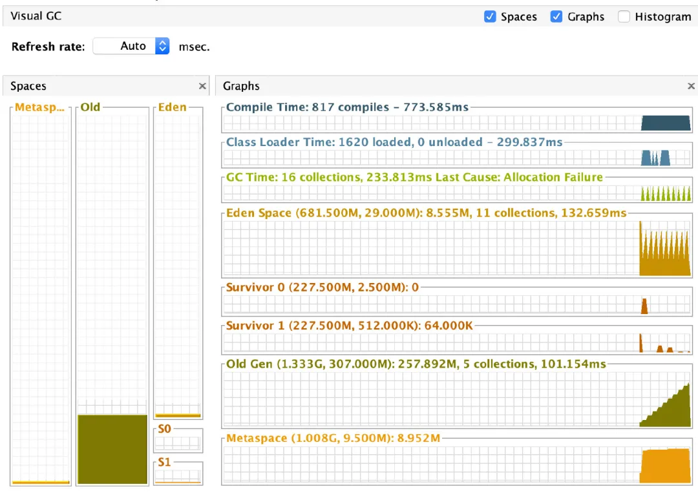
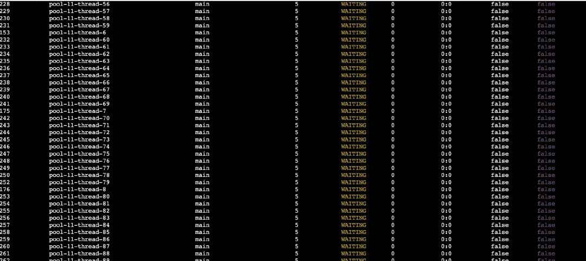
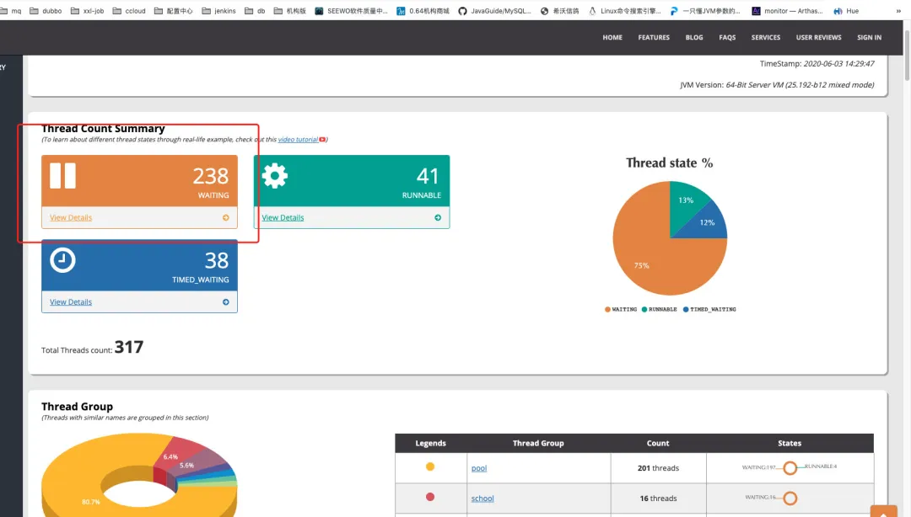
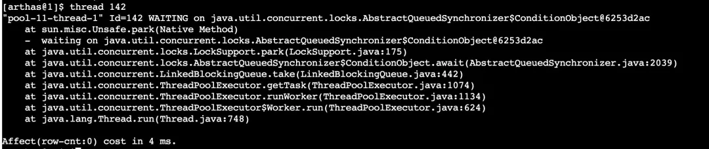
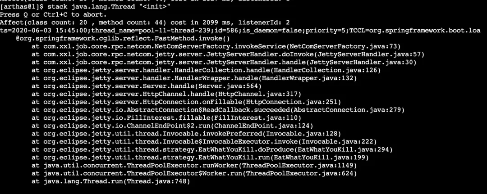
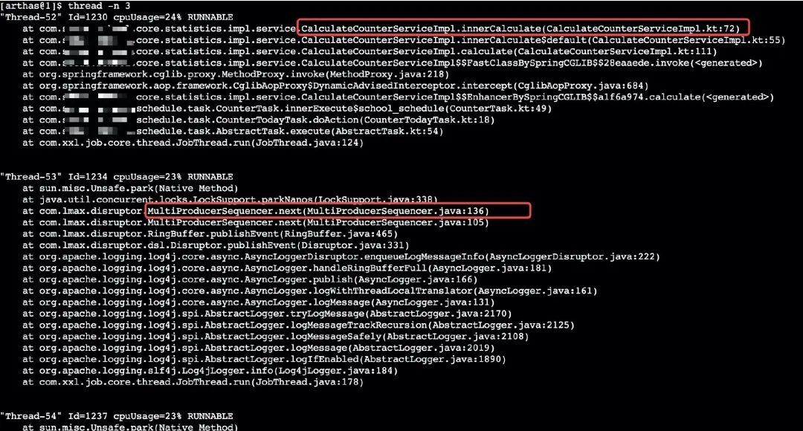
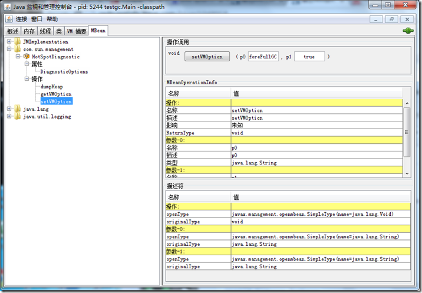

# JVM 问题排查

## 一、排查问题步骤（代码层面）

1. 使用 top 命令，找出 cpu 占用最高的进程的PID；
2. 使用 ps -ef | grep PID 找出对应 PID 的应用
3. 使用 jstack -l PID >> PID.log 获取对应进程的各个线程的信息
4. 使用 top -Hp PID 拿到占用 CPU 最高的线程 PID
5. 使用 printf "%x\n" PID 根据线程 PID（10进制） 拿到线程的 TID（16进制） 
6. 采用 grep TID -A 200 PID.log 根据 TID 去找到对应的问题


## 二、GC 问题

### 步骤

1. 使用 JDK 自带的 jstat 工具分析 GC 情况

   `jstat -gcutil 对应进程PID 2000 200`

    2000代表每隔2000毫秒检查一次, 200代表检查两百次, 200也可以省略, 表示不限次数.
   
   主要查看 FGC 列的次数，查看是否频繁进行FGC
   
2. 使用 -XX:+HeapDumpOnOutOfMemoryError 参数启动服务，或者使用 jmap 手动dump文件

   ```
   jmap -dump:live,format=b,file=d:\dump\heap.hprof <pid>
   ```

   [手动生成 dump 文件方式](https://blog.csdn.net/jijianshuai/article/details/79128033)

3. 使用 jvisualvm 分析 dump 文件

   [分析 dump 文件](https://www.jianshu.com/p/8f1679d9603b)

### 内存泄漏与内存溢出

* 内存泄漏：Java内存泄露是说程序逻辑问题,造成申请的内存无法释放.这样的话无论多少内存,早晚都会被占用光的.
  最简单的例子就是死循环了
* 内存溢出：就是你要求分配的内存超出了系统能给你的，系统不能满足需求，于是产生溢出。

### GC 种类

#### Major GC

老年代的垃圾收集叫做 Major GC，Major GC  通常是和 Full GC 等价的，收集整个 GC 堆，Hotspot为了避免由于新生代对象晋升到旧生代导致旧生代空间不足的现象，在进行Minor GC时，做了一个判断，如果之前统计所得到的Minor GC晋升到老年代的平均大小大于老年代的剩余空间，那么就直接触发Full GC。

#### 分代 GC

1. Young GC（**Minor GC**）：只收集年轻代的 GC 
2. Old GC：只收集老年代的 GC（只有 CMS  的 concurrent collection 是这个模式）
3. Mixed GC：收集整个 young gen 以及部分 old gen 的 GC（只有 G1 有整个模式）

#### Full GC

Full GC 定义是相对明确的，针对整个新生代、老年代、元空间（matesapece ，java 8以上版本取代 perm gen） 的全局范围的 GC


年轻代分为了一个Eden区和两个survivor区（S1，S2），survivor区同一时间只会有一个满一个空，交替的。然后就是GC 到一定的阈值到老年代.

### 使用 jvisualvm 分析

操作界面：



VisualGC 插件



[参考博客](https://mp.weixin.qq.com/s/7XGD-Z3wrThv5HyoK3B8AQ)

### 使用 arthas 分析

[参考博客](https://mp.weixin.qq.com/s/lYrSACBskHtmwiu_pr2_cg)

[docker中使用 arthas](https://mp.weixin.qq.com/s/UXtSpRR82uMpeTAjRR10wg)

1. 进入 arthas 终端，执行 thread 命令

   

   fasthread 输出结果如下：

   

2. arthas 查看 WAITING 状态的线程堆栈

   

3. 查看创建线程的服务，注入线程的 init  方法，在 arthas 中执行 stack 命令

   

4. 使用 thread 查看 CPU 占用最高的线程

   


### 设置在 FullGC 前后自动生成 dump 文件（分析生产频繁FullGC）

* HeapDumpBeforeFullGC： 实现在Full GC前dump。

* HeapDumpAfterFullGC   ： 实现在Full GC后dump。

* HeapDumpPath              ： 设置Dump保存的路径

设置方式：

1. 启动jvm时，带上这些参数（这个方法适合开发测试环境）

   java -Xms200m -Xmx200m -Xmn50m -XX:PermSize=30m -XX:+HeapDumpBeforeFullGC -XX:+HeapDumpAfterFullGC -XX:HeapDumpPath=e:\dump testgc.Main

2. 使用JConsole等工具调用JMX服务的com.sum.management.HotSpotDiagnostic.setVMOption方法来实现。

   

3. 使用jinfo命令进行设置。（**生产环境常用的方法**）

   ```shell
   # 第一步，通过jps获得java程序的pid
   jps
   5940 Main
   3012 Jps
   
   # 第二步，调用jinfo命令设置VM参数
   jinfo -flag +HeapDumpBeforeFullGC 5940
   jinfo -flag +HeapDumpAfterFullGC 5940
   ```

4. 开发程序调用JMX的API来实现

   得到了Full GC前后的dump, 接下来就可以使用一些分析工具(如MAT)来分析Full GC产生的原因了。


