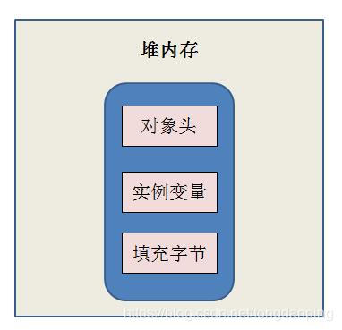
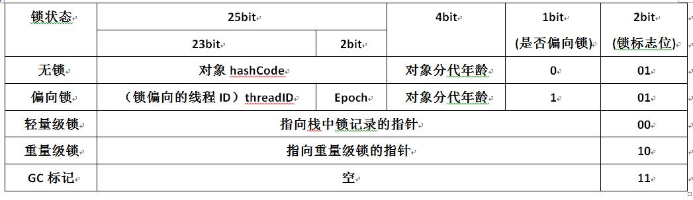
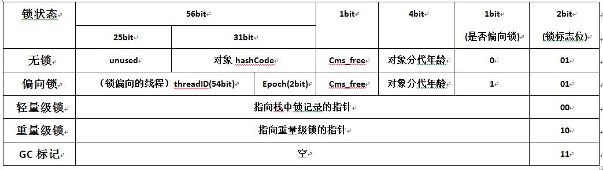
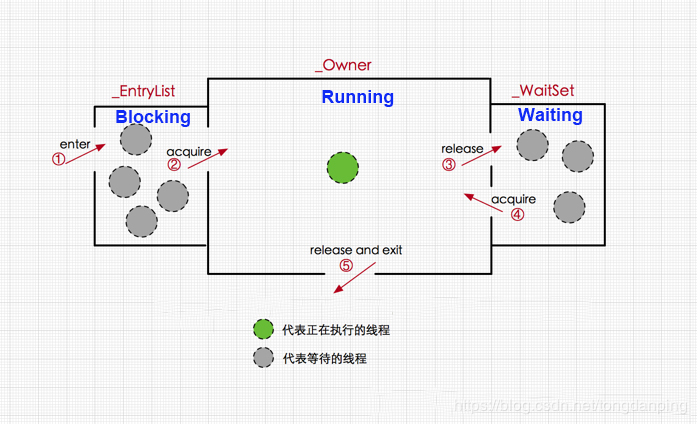

## Java 内存模型

### 同步的八种操作

* **lock**(锁定)：作用于主内存的变量，把一个变量表示为一条线程独占状态
* **unlock**(解锁)：作用于主内存的变量，把一个处于锁定状态的变量释放出来，释放出来的变量才可以被其他线程锁定
* **read**(读取)：作用于主内存的变量，把一个变量值从主内存中传输到线程的工作内存中，以便随后的load操作使用
* **load**(载入)：作用于主内存的变量，它把 read 操作从主内存中的变量值放入工作内存中的变量副本中。
* **use**(使用)：作用于工作内存的变量，把工作内存中的一个变量值传递给执行引擎
* **assign**(赋值)：作用于工作内存的变量，它把一个从执行引擎接收到的值赋值给工作内存的变量
* **store**(存储)：作用于工作内存的变量，它把工作内存中的一个变量的值送到主内存中，以便随后的 write 操作
* **write**(写入)：作用于主内存的变量，它把 store 操作从工作内存中一个变量值传入到主内存的变量中

### 同步规则

* 如果要把一个变量从主内存中复制到工作内存，就需要按顺序地执行 read 和 load 操作，如果把变量从工作内存中同步回主内存中，就需要按顺序地执行 store 和 write 操作。但 Java 内存模型只要求上述操作必须按顺序执行，而没有要求必须是连续执行的。
* 不允许 read 和 load、store 和 write 操作之一单独出现，必须两两出现
* 不允许一个线程丢弃它的最近的 assign 的操作，即变量在工作内存中改变了之后必须同步到主内存中。
* 不允许一个线程无原因的（没有发生过任何 assign 操作）把数据从工作内存同步回主内存中
* 一个新的变量只能在主内存中诞生，不允许在工作内存中直接使用一个未被初始化（load或assign）的变量。即就是对一个变量实时 use 和 store 操作之前，必须先执行过了 assign 和 load 操作。
* 一个变量在同一时刻只允许一条线程对其进行 lock 操作，但 lock 操作可以被同一条线程重复执行多次，多次执行后，只有执行相同次数的 unlock 操作，变量才会被解锁。lock 和 unlock 必须成对出现。
* 如果对一个变量执行 lock 操作，将会清空工作内存中次变量的值，在执行引擎使用这个变量前需重新执行 load 或 assign 操作初始化变量的值
* 如果一个变量实现没有被 lock 操作锁定，则不允许对它执行 unlock 操作；也不允许去 unlock 一个被其他线程锁定的变量
* 对一个变量执行 unlock 操作之前，必须先把此变量同步到主内存中（执行 store 和 write 操作）


## 悲观锁与乐观锁

[参考来源](https://github.com/Snailclimb/JavaGuide/blob/master/docs/essential-content-for-interview/面试必备之乐观锁与悲观锁.md)

> 乐观锁对应于生活中乐观的人总是想着事情往好的方向发展，悲观锁对应于生活中悲观的人总是想着事情往坏的方向发展。这两种人各有优缺点，不能不以场景而定说一种人好于另外一种人。

### 悲观锁

总是假设最坏的情况，每次去拿数据的时候都认为别人会修改，所以每次在拿数据的时候都会上锁，这样别人想拿这个数据就会阻塞直到它拿到锁（**共享资源每次只给一个线程使用，其它线程阻塞，用完后再把资源转让给其它线程**）。传统的关系型数据库里边就用到了很多这种锁机制，比如行锁，表锁等，读锁，写锁等，都是在做操作之前先上锁。Java中`synchronized`和`ReentrantLock`等独占锁就是悲观锁思想的实现。

### 乐观锁

总是假设最好的情况，每次去拿数据的时候都认为别人不会修改，所以不会上锁，但是在更新的时候会判断一下在此期间别人有没有去更新这个数据，可以使用版本号机制和CAS算法实现。**乐观锁适用于多读的应用类型，这样可以提高吞吐量**，像数据库提供的类似于**write_condition机制**，其实都是提供的乐观锁。在Java中`java.util.concurrent.atomic`包下面的原子变量类就是使用了乐观锁的一种实现方式**CAS**实现的。

### 两种锁的使用场景

从上面对两种锁的介绍，我们知道两种锁各有优缺点，不可认为一种好于另一种，像**乐观锁适用于写比较少的情况下（多读场景）**，即冲突真的很少发生的时候，这样可以省去了锁的开销，加大了系统的整个吞吐量。但如果是多写的情况，一般会经常产生冲突，这就会导致上层应用会不断的进行retry，这样反倒是降低了性能，所以**一般多写的场景下用悲观锁就比较合适。**

### 乐观锁常见的两种实现方式

> 乐观锁一般会使用版本号机制或CAS算法实现。

#### 1. 版本号控制

一般是在数据表中加上一个数据版本号version字段，表示数据被修改的次数，当数据被修改时，version值会加一。当线程A要更新数据值时，在读取数据的同时也会读取version值，在提交更新时，若刚才读取到的version值为当前数据库中的version值相等时才更新，否则重试更新操作，直到更新成功。

**举一个简单的例子：** 假设数据库中帐户信息表中有一个 version 字段，当前值为 1 ；而当前帐户余额字段（ balance ）为 $100 。

1. 操作员 A 此时将其读出（ version=1 ），并从其帐户余额中扣除 $50（ $100-$50 ）。
2. 在操作员 A 操作的过程中，操作员B 也读入此用户信息（ version=1 ），并从其帐户余额中扣除 $20 （ $100-$20 ）。
3. 操作员 A 完成了修改工作，将数据版本号加一（ version=2 ），连同帐户扣除后余额（ balance=$50 ），提交至数据库更新，此时由于提交数据版本大于数据库记录当前版本，数据被更新，数据库记录 version 更新为 2 。
4. 操作员 B 完成了操作，也将版本号加一（ version=2 ）试图向数据库提交数据（ balance=$80 ），但此时比对数据库记录版本时发现，操作员 B 提交的数据版本号为 2 ，数据库记录当前版本也为 2 ，不满足 “ 提交版本必须大于记录当前版本才能执行更新 “ 的乐观锁策略，因此，操作员 B 的提交被驳回。

这样，就避免了操作员 B 用基于 version=1 的旧数据修改的结果覆盖操作员A 的操作结果的可能。

#### 2. CAS 算法

即**compare and swap（比较与交换）**，是一种有名的**无锁算法**。无锁编程，即不使用锁的情况下实现多线程之间的变量同步，也就是在没有线程被阻塞的情况下实现变量的同步，所以也叫非阻塞同步（Non-blocking Synchronization）。**CAS算法**涉及到三个操作数。

* 需要读写的内存值 V
* 进行比较的值 A
* 拟写入的值 B

当且仅当 V 的值等于 A时，CAS通过原子方式用新值B来更新V的值，否则不会执行任何操作（比较和替换是一个原子操作）。一般情况下是一个**自旋操作**，即**不断的重试**。

[**面试必备之深入理解自旋锁**](https://blog.csdn.net/qq_34337272/article/details/81252853)

### 乐观锁的缺点

> ABA 问题是乐观锁一个常见的问题

#### 1. ABA 问题

如果一个变量V初次读取的时候是A值，并且在准备赋值的时候检查到它仍然是A值，那我们就能说明它的值没有被其他线程修改过了吗？很明显是不能的，因为在这段时间它的值可能被改为其他值，然后又改回A，那CAS操作就会误认为它从来没有被修改过。这个问题被称为CAS操作的 **"ABA"问题。**

JDK 1.5 以后的 `AtomicStampedReference 类`就提供了此种能力，其中的 `compareAndSet 方法`就是首先检查当前引用是否等于预期引用，并且当前标志是否等于预期标志，如果全部相等，则以原子方式将该引用和该标志的值设置为给定的更新值。

#### 2. 循环时间开销大

**自旋CAS（也就是不成功就一直循环执行直到成功）如果长时间不成功，会给CPU带来非常大的执行开销。** 如果JVM能支持处理器提供的pause指令那么效率会有一定的提升，pause指令有两个作用，第一它可以延迟流水线执行指令（de-pipeline）,使CPU不会消耗过多的执行资源，延迟的时间取决于具体实现的版本，在一些处理器上延迟时间是零。第二它可以避免在退出循环的时候因内存顺序冲突（memory order violation）而引起CPU流水线被清空（CPU pipeline flush），从而提高CPU的执行效率。

#### 3. 只能保证一个共享变量的原子操作

CAS 只对单个共享变量有效，当操作涉及跨多个共享变量时 CAS 无效。但是从 JDK 1.5开始，提供了`AtomicReference类`来保证引用对象之间的原子性，你可以把多个变量放在一个对象里来进行 CAS 操作.所以我们可以使用锁或者利用`AtomicReference类`把多个共享变量合并成一个共享变量来操作。

### CAS 与 synchronized 使用场景

>CAS适用于写比较少的情况下（多读场景，冲突一般较少）;
>
>synchronized适用于写比较多的情况下（多写场景，冲突一般较多）

1. 对于资源竞争较少（线程冲突较轻）的情况，使用synchronized同步锁进行线程阻塞和唤醒切换以及用户态内核态间的切换操作额外浪费消耗cpu资源；而CAS基于硬件实现，不需要进入内核，不需要切换线程，操作自旋几率较少，因此可以获得更高的性能。
2. 对于资源竞争严重（线程冲突严重）的情况，CAS自旋的概率会比较大，从而浪费更多的CPU资源，效率低于synchronized。

>  Java并发编程这个领域中synchronized关键字一直都是元老级的角色，很久之前很多人都会称它为 **“重量级锁”** 。但是，在JavaSE 1.6之后进行了主要包括为了减少获得锁和释放锁带来的性能消耗而引入的 **偏向锁** 和 **轻量级锁** 以及其它**各种优化**之后变得在某些情况下并不是那么重了。synchronized的底层实现主要依靠 **Lock-Free** 的队列，基本思路是 **自旋后阻塞**，**竞争切换后继续竞争锁**，**稍微牺牲了公平性，但获得了高吞吐量**。在线程冲突较少的情况下，可以获得和CAS类似的性能；而线程冲突严重的情况下，性能远高于CAS。

## volatile 关键字

[参考文章](https://zhuanlan.zhihu.com/p/137193948)

## synchronized 关键字

### 一、使用场景

synchronized是一个同步关键字，在某些多线程场景下，如果不进行同步会导致数据不安全，而Synchronized关键字就是用于代码同步。什么情况下会数据不安全呢，要满足两个条件：一是数据共享（临界资源），二是多线程同时访问并改变该数据。

synchronized锁的3种使用形式（使用场景）：

* synchronized修饰普通同步方法：锁对象当前实例对象；
* synchronized修饰静态同步方法：锁对象是当前的类Class对象
* synchronized修饰同步代码块：锁对象是synchronized后面括号里配置的对象，这个对象可以是某个对象（xlock），也可以是某个类（Xlock.class）；

**注意：**

* 使用synchronized修饰**非静态方法**或者使用synchronized修饰**代码块**时指定的为实例对象时，同一个类的不同对象拥有自己的锁，因此不会相互阻塞。
* **使用synchronized修饰类和对象时**，由于类对象和实例对象分别拥有自己的监视器锁，因此不会相互阻塞。
* **使用synchronized修饰实例对象时**，如果一个线程正在访问实例对象的一个synchronized方法时，其它线程不仅不能访问该synchronized方法，该对象的其它synchronized方法也不能访问，因为一个对象只有一个监视器锁对象，但是其它线程可以访问该对象的非synchronized方法。
* 线程A访问实例对象的非static synchronized方法时，线程B也可以同时访问实例对象的static synchronized方法，因为前者获取的是**实例对象的监视器锁**，而后者获取的是**类对象的监视器锁**，两者不存在互斥关系。

### 二、实现原理

#### 1. Java 对象头

首先，我们要知道对象在内存中的布局：

已知对象是存放在堆内存中的，对象大致可以分为三个部分，分别是对象头、实例变量和填充字节。

* 对象头主要是由 `MarkWord` 和 `Klass Point(类型指针) ` 组成的，其中 `Klass Point` 是对象指向它的类元数据的指针，虚拟机通过这个指针来确定这个对象是哪个类的实例，`Mark Word` 用于存储自身的运行时数据。如果对象是数组对象，那么对象头占用 3 个字宽（Word），如果对象是非数组对象，那么对象头占用 2 个字宽。（1 word = 2 byte = 16 bit） 
* 实例变量存储的是对象的属性信息，包括父类的属性信息，按照 4 字节对齐
* 填充字符，因为虚拟机要求对象字节必须是 8 字节的整数倍，填充字符就是用于凑齐这个整数倍的



由第一部分可知 synchronized 不论是修饰方法还是代码块，都是通过持有修饰对象的锁来实现同步。 synchronized 锁对象是存在锁目标对象的对象头的 `Mark Word` 中。

##### MarkWord 结构

在 32 位虚拟机中



在 64 位虚拟机中



**注意**：上图中的偏向锁和轻量级锁都是在java6以后对锁机制进行优化时引进的

#### 2. synchronized 在 JVM 中的实现原理

Java 虚拟机中的同步(synchronization)基于进入和退出管程(Monitor)对象实现， 无论是

*　**显式同步**(有明确的 monitorenter 和 monitorexit 指令,即**同步代码块**)
*　**隐式同步**(没有monitor指令，有ACC_SYNCHRONIZED标识,即**同步方法**)

都是如此。

重量级锁对应的标志位是 10，存储了指向重量级监视器锁的指针，在 Hotspot 中，对象的监视器(monitor) 锁对象由 ObjectMonitor 对象实现(C++)，其跟同步相关的数据结构如下：

```c++
ObjectMonitor() {    
    _count        = 0; //用来记录该对象被线程获取锁的次数    
    _waiters      = 0;    
    _recursions   = 0; //锁的重入次数    
    _owner        = NULL; //指向持有ObjectMonitor对象的线程     
    _WaitSet      = NULL; //处于wait状态的线程，会被加入到_WaitSet 
    _WaitSetLock  = 0 ;    
    _EntryList    = NULL ; //处于等待锁block状态的线程，会被加入到该列表  }
```

首先看一下线程在获取锁的几个状态转换：



线程的生命周期存在5个状态：`start`, `running`, `waiting`, `blocking`, `dead`

**对于一个 synchronized 修饰的方法（代码块）来说**：

1. 当多个线程同时访问该方法时，那么这些线程会先被放进 `_EntryList` 队列，此时线程处于 `blocking` 状态
2. 当一个线程获取到了实例对象的监视器( `monitor` )锁，那么就可以进入到 `running` 状态，执行方法。此时 `ObjectMonitor` 对象的 `_owner` 指针指向当前线程，`_count` + 1表示当前对象锁被一个线程获取。
3. 当 `running` 状态的线程调用 `wait()方法`是，那么当前线程释放 `monitor ` 对象，进入 `waiting` 状态， `ObjectMonitor` 对象的 `_owner` 变为 null， `_count` - 1，同时线程进入 `_WaitSet` 队列，知道有线程调用 `notify()` 方法换型该线程，则该线程重新获取 `monitor` 对象进入 `_Owner` 区
4. 如果当前线程执行完毕，那么也释放 `monitor` 对象，进入 `waiting` 状态，`ObjectMonitor` 对象的 `_owner` 变为 null， `_count` - 1.

**synchronized 修饰的代码块/方法获取 `monitor` 对象：**
在 JVM 规范里有说明，不管是方法同步还是代码块同步都是基于进入和退出 `monitor` 对象来实现，然后二者在实现上还是有很大的不同的。**通过 `javap` 对 class 字节码文件进行反编译可以得到反编译后的代码。**

1. synchronized 修饰的代码块：

synchronized 代码块同步时需要在同步的代码块开始的位置插入 `monitorentry` 执行，在同步结束的位置或者异常出现的位置插入`monitorexist`指令；JVM 要保证 `monitorentry` 和 `monitorexit` 都是正对出现的，任何对象都有一个 `monitor` 与之对应，当这个对象的 `monitor` 被持有以后，它将处于锁定状态。

例如，同步代码块如下：

```java
public class SyncCodeBlock {
   public int i;
   public void syncTask(){
       synchronized (this){
           i++;
       }
   }
}
```

对同步代码块编译以后的 class 字节码文件反编译，结果如下（仅保留方法部分的反编译内容）：

```class
public synchronized void syncTask();
    descriptor: ()V
    //方法标识ACC_PUBLIC代表public修饰，ACC_SYNCHRONIZED指明该方法为同步方法
    flags: ACC_PUBLIC, ACC_SYNCHRONIZED
    Code:
      stack=3, locals=1, args_size=1
         0: aload_0
         1: dup
         2: getfield      #2                  // Field i:I
         5: iconst_1
         6: iadd
         7: putfield      #2                  // Field i:I
        10: return
      LineNumberTable:
        line 12: 0
        line 13: 10
}
```

可以看出方法开始和结束的地方都没有出现`monitorentry`和`monitorexit`指令，但是出现的`ACC_SYNCHRONIZED`标志位。

### 三、锁的优化

#### 1. 锁升级

锁的四种状态（级别由低到高）：

* 无锁状态
* 偏向锁状态
* 轻量级锁状态
* 重量级锁状态

#####　① **偏向锁**

为什么引入偏向锁？

因为经过HotSpot的作者大量的研究发现，大多数时候是不存在锁竞争的，常常是一个线程多次获得同一个锁，因此如果每次都要竞争锁会增大很多没有必要付出的代价，为了降低获取锁的代价，才引入的偏向锁。

**偏向锁的升级**

当线程1访问代码块并获取锁对象时，会在 Java 对象头和栈帧中记录偏向的锁的 `threadID`, 因为**偏向锁不会主动释放锁**，因此以后线程1再次获取锁的时候，需要**比较当前线程的 `threadID` 与 Java 对象头的 `threadID` 是否一致**：

* 如果一致（还是线程1获取锁对象），则无需使用 CAS 来加锁、解锁；

* 如果不一致（其他线程，例如线程2要竞争锁对象，而偏向锁不会主动释放因此还是存储线程1的 `threadID`），那么需要查看 Java 对象头中记录的线程1是否存活：
  * 如果没有存活，那么锁对象被重置为**无锁状态，**其他线程（线程2）可以竞争将其设置为偏向锁；
  * 如果存活，那么立刻**查找该线程（线程1）的栈帧信息，如果还是需要继续持有这个锁对象，那么暂停当前线程1，撤销偏向锁，升级为轻量级锁**，如果线程1不在使用该锁对象，那么将锁对象设置为无锁状态，重新偏向新的线程。

**偏向锁的取消**

偏向锁是默认开启的，而且开始的时间一般是比应用程序启动慢几秒，如果不想有这个延迟，那么可以使用 `-XX:BiasedLockingStartUpDelay=0`

如果不想要偏向锁，那么可以通过 `-XX:-UseBiasedLocking` 来设置。

##### ② 轻量级锁

**为什么要引入轻量级锁**

**轻量级锁考虑的是竞争锁对象的线程不多，而且线程持有锁的时间不长的场景**。因为阻塞线程需要 CPU 从用户态转到内核态，代价较大，如果刚刚阻塞不久这个锁就释放了，那么这个代价就有点得不偿失了，因此这个时候就干脆不阻塞这个线程，让它自选等待锁的释放。

**轻量级锁什么时候升级为重量级锁**？

线程1获取轻量级锁时会先**把锁对象的对象头 `MarkWord` 赋值一份到线程1的栈帧中创建的用于存放所记录的空间（称为 `DisplacedMarkWord`），然后使用 CAS 把锁对象的对象头的内容替换为线程1存储的所记录（`DisplacedMarkWord`）的地址；**

如果在线程1赋值对象头的同时（在线程1 CAS 之前），线程2也准备获取锁，复制了对象头到线程2的记录空间中，但是在线程2 CAS 的时候，发现线程1已经把对象头换了，**线程2的 CAS 失败，那么线程2就尝试使用自旋锁来等待线程1释放锁**

但是如果自选的时间太长也是不行的，因为自选是需要消耗 CPU 的，因此自选的次数时有限制的，比如 10 次或者 100 次 ，如果**自选次数到了，线程1还没有释放锁**；**或者线程1还在执行，线程2还在自选等待，这是又有一个线程3过来竞争这个锁对象，那么这个时候轻量级锁就会膨胀为重量级锁。重量级锁把除了拥有锁的线程之外的其他线程都阻塞，防止CPU空转**。

**自旋锁**在 JDK1.6 之前其实就已经引入了，不过是默认关闭的，需要通过`--XX:+UseSpinning`参数来开启。JDK1.6及1.6之后，就改为默认开启的了。需要注意的是：自旋等待不能完全替代阻塞，因为它还是要占用处理器时间。如果锁被占用的时间短，那么效果当然就很好了！反之，相反！自旋等待的时间必须要有限度。如果自旋超过了限定次数任然没有获得锁，就应该挂起线程。**自旋次数的默认值是10次，用户可以修改`--XX:PreBlockSpin`来更改**。

另外,**在 JDK1.6 中引入了自适应的自旋锁。自适应的自旋锁带来的改进就是：自旋的时间不在固定了，而是和前一次同一个锁上的自旋时间以及锁的拥有者的状态来决定，虚拟机变得越来越“聪明”了**。

**注意**：

#### 2. 锁消除

Java 虚拟机在 JIT 编译时（可以简单理解为当某段代码即将第一次被执行时进行编译，又称之为即使编译），通过对运行上下文的扫描，经过逃逸分析，去除不可能存在共享资源竞争的锁，通过这种方式消除没有必要的锁，可以节省毫无意义的请求锁的时间。

#### 3. 锁粗化

原则上，我们在编写代码的时候，总是推荐将同步块的作用范围限制得尽量小，——直在共享数据的实际作用域才进行同步，这样是为了使得需要同步的操作数量尽可能变小，如果存在锁竞争，那等待线程也能尽快拿到锁。

大部分情况下，上面的原则都是没有问题的，但是如果一系列的连续操作都对同一个对象反复加锁和解锁，那么会带来很多不必要的性能消耗。

### synchronized 和 ReenTrantLock 的对比

**① 两者都是可重入锁**

两者都是可重入锁。

**“可重入锁”**概念是：自己可以再次获取自己的内部锁。比如一个线程获得了某个对象的锁，此时这个对象锁还没有释放，当其再次想要获取这个对象的锁的时候还是可以获取的，如果不可锁重入的话，就会造成死锁。同一个线程每次获取锁，锁的计数器都自增1，所以要等到锁的计数器下降为0时才能释放锁。

**② synchronized 依赖于 JVM 而 ReenTrantLock 依赖于 API**

synchronized 是依赖于 JVM 实现的，前面我们也讲到了 虚拟机团队在 JDK1.6 为 synchronized 关键字进行了很多优化，但是这些优化都是在虚拟机层面实现的，并没有直接暴露给我们。ReenTrantLock 是 JDK 层面实现的（也就是 API 层面，需要 lock() 和 unlock 方法配合 try/finally 语句块来完成），所以我们可以通过查看它的源代码，来看它是如何实现的。

**③ ReenTrantLock 比 synchronized 增加了一些高级功能**

相比synchronized，ReenTrantLock增加了一些高级功能。主要来说主要有三点：**①等待可中断；②可实现公平锁；③可实现选择性通知（锁可以绑定多个条件）**

- **ReenTrantLock提供了一种能够中断等待锁的线程的机制**，通过lock.lockInterruptibly()来实现这个机制。也就是说正在等待的线程可以选择放弃等待，改为处理其他事情。
- **ReenTrantLock可以指定是公平锁还是非公平锁。而synchronized只能是非公平锁。所谓的公平锁就是先等待的线程先获得锁。** ReenTrantLock默认情况是非公平的，可以通过 ReenTrantLock类的`ReentrantLock(boolean fair)`构造方法来制定是否是公平的。
- synchronized关键字与wait()和notify/notifyAll()方法相结合可以实现等待/通知机制，ReentrantLock类当然也可以实现，但是需要借助于Condition接口与newCondition() 方法。Condition是JDK1.5之后才有的，它具有很好的灵活性，比如可以实现多路通知功能也就是在一个Lock对象中可以创建多个Condition实例（即对象监视器），**线程对象可以注册在指定的Condition中，从而可以有选择性的进行线程通知，在调度线程上更加灵活。 在使用notify/notifyAll()方法进行通知时，被通知的线程是由 JVM 选择的，用ReentrantLock类结合Condition实例可以实现“选择性通知”** ，这个功能非常重要，而且是Condition接口默认提供的。而synchronized关键字就相当于整个Lock对象中只有一个Condition实例，所有的线程都注册在它一个身上。如果执行notifyAll()方法的话就会通知所有处于等待状态的线程这样会造成很大的效率问题，而Condition,实例的signalAll()方法 只会唤醒注册在该Condition实例中的所有等待线程。

如果你想使用上述功能，那么选择ReenTrantLock是一个不错的选择。

**④ 性能已不是选择标准**

在JDK1.6之前，synchronized 的性能是比 ReenTrantLock 差很多。具体表示为：synchronized 关键字吞吐量岁线程数的增加，下降得非常严重。而ReenTrantLock 基本保持一个比较稳定的水平。我觉得这也侧面反映了， synchronized 关键字还有非常大的优化余地。后续的技术发展也证明了这一点，我们上面也讲了在 JDK1.6 之后 JVM 团队对 synchronized 关键字做了很多优化。**JDK1.6 之后，synchronized 和 ReenTrantLock 的性能基本是持平了。所以网上那些说因为性能才选择 ReenTrantLock 的文章都是错的！JDK1.6之后，性能已经不是选择synchronized和ReenTrantLock的影响因素了！而且虚拟机在未来的性能改进中会更偏向于原生的synchronized，所以还是提倡在synchronized能满足你的需求的情况下，优先考虑使用synchronized关键字来进行同步！优化后的synchronized和ReenTrantLock一样，在很多地方都是用到了CAS操作**。


## AQS 框架(AbstractQueuedSynchronizer)

[原文](http://www.cnblogs.com/waterystone/p/4920797.html)

### 一、概述

许多并发框架都是基于 `AbstractQueuedSynchronizer`（抽象的队列同步器），AQS 定义了一套多线程访问共享资源的同步器框架，许多同步类实现都依赖于它：

* ReetrantLock
* Semaphore
* CountDownLatch

### 二、框架


它维护了一个 `volatile int state （代表共享资源）` 和一个 FIFO 线程等待队列（多线程争用资源被阻塞时会进入此队列）。 这里 `volatile` 是核心关键词。`state` 的访问方式有三种：

* `getState` 方法
* `setState` 方法;
* `compareAndSetState` 方法

AQS 定义了两种共享方式：

* Exclusive：独占，只有一个线程执行，如 `ReentrantLock`
* Share：共享，多个线程可同时执行，如 Semaphore 和 `CountDownLatch`

不同的自定义同步器争用共享资源的方式也不同。**自定义同步器在实现时只需要实现共享资源 state 的获取与释放方式即可**，至于具体线程等待队列的维护（如获取资源失败/唤醒出队等），AQS 在底层已经实现好了。自定义同步器实现时主要实现以下几个方法：

* **isHeldExclusively()**：**该线程是否正在独占资源**，只有用到 condition 时才需要实现它。
* **tryAcquire(int)**：独占方式。**尝试获取资源**，成功则返回 true，失败则返回 false
* **tryRelease(int)**：独占方式。**尝试释放资源**，成功则返回 true，失败则返回 false
* **tryAcquireShared(int)**：共享方式。**尝试获取资源**。
  * 负数表示失败；
  * 0表示成功，但没有剩余可用资源；
  * 正数表示成功，且有剩余资源
* **tryReleaseShared(int)**：共享方式。**尝试释放资源**，如果释放后允许唤醒后续等待节点返回 true，否则返回 false。

**独占锁**以 `ReentrantLock` 为例，state 初始为 0，表示未锁定状态。 A 线程 `lock()` 时，会调用 `tryAcquire()` 独占该锁并将 `state + 1。`此后其他线程再调用 `tryAcquire()` 时就会失败，直到 A  线程 `unlock()` 到 `state = 0` （即释放锁）为止，其他线程才有机会获取该锁。当然，释放锁之前，A 线程自己是可以重复获取此锁的（`state` 会类加），这就是可重入的概念。 但是需要注意，获取多少次就需要释放多少次，这样才能保证最后 `state` 是能回到 0 的。

**共享锁**以 `CountDownLatch` 为例，任务分为 N 个子线程去执行，`state` 也初始化为 N （注意 N 要与线程个数一致）。这 N 子线程是并行执行的，每个子线程执行完后 `countDown()` 一次，state 会用 CAS 的方式减1。等到所有子线程都执行完后（即 `state = 0`），会 `unpark()` （唤醒）主调用线程，然后主调用线程就会 `await()` 函数返回，继续后续动作。

一般说，自定义同步器要么是独占方法，要么是共享方式，他们也只需要实现 `tryAcquire-tryRelease`、`tryAcquireShared-tryReleaseShared` 的一种即可。但是 AQS 也支持自定义同步器同时实现独占和共享两种方式，如 `ReentrantReadWriteLock`. 

### 三、源码解析

#### 1. 结点状态 waitStatus

Node 节点是对每一个等待线程获取资源的线程封装，其包括了需要同步的线程本身及其等待状态，如是否被阻塞、是否等待唤醒、是否已经被取消等等。变量 `waitStatus` 则表示当前 Node 节点的等待状态，共有 5 中取值：`CANCELLED`、`SIGNAL`、`CONDITION`、`PROPAGATE`、`0`.

* **CANCELLED**（1）：表示当前节点已经取消调度。 当 timeout 或被中断（响应中断的情况下），会触发变更为此状态，进入该状态以后的节点将不会再变化。
* **SIGNAL**（-1）：表示后继节点再等待当前节点唤醒。后继节点入队时，会将前继节点的状态更新为 SIGNAL。
* **CONDITION**（-2）：表示节点等待在 Condition 上，当其他线程调用了 Condition 的 signal() 方法后， CONDITION 状态的节点将从等待队列转移到同步队列中，等待获取同步锁。
* **PROPAGATE**（-3）：共享模式下，前继节点不仅会唤醒后继节点，同时也可能唤醒后继的后继节点。
* **0**：新节点入队时的默认状态

**注意**：

* 负值表示处于有效等待状态、
* 正值表示节点已经取消。

所以源码中很多地方都是用 > 0 、< 0 来判断节点的状态是否正常。

#### 2. acquire(int)

此方法是独占模式下线程获取共享线程的顶层入口。如果获取到资源，线程直接返回，否则进入等待队列，知道获取到资源为止，且整个过程忽略中断的影响。这也正是 `lock()` 的语义，当然不仅仅只限于 `lock()`。 获取到资源后，线程就可以执行其临界点代码了。下面是 `acquire()` 的源码：

```java
public final void acquire(int arg) {
    if (!tryAcquire(arg) &&
         acquireQueued(addWaiter(Node.EXCLUSIVE), arg))
         selfInterrupt();
}
```

函数流程如下：

1. `tryAcquire`() 尝试直接取获取资源，如果成功则直接返回（这里体现了非公平锁，每个线程获取锁时尝试直接抢占加塞一次，而 CLH 队列中可能还有别的线程在等待）；
2. `addWaiter`() 将线程加入等待队列的尾部，并标记为独占模式；
3. `acquireQueued`() 使线程阻塞在等待队列中获取资源，一直获取到资源后才返回。如果在整个等待过程中被中断过，则返回 true，否则返回 false。
4. 如果线程在等待过程中被中断过，它是不响应的，只是获取资源后才再进行自我中断 `selfInterrupt`()，将中断补上。

##### 2.1 tryAcquire(int)

此方法尝试去获取资源。如果获取成功，则直接返回 true，否则直接返回 false。这也正是 `tryLock`() 的语义，还是那句话，当然不仅仅只限于 `tryLock`()。如下是 `tryAcquire`() 的源码：

```java
protected boolean tryAcquire(int arg) {
     throw new UnsupportedOperationException();
}
```

AQS 这里只定义了一个接口，具体资源的获取交由自定义同步器去是实现了（通过 `state` 的 get/set/CAS）

之所以没有定义为 `abstract`，是哪位独占模式下只用 `tryAcquire-tryRelease`，而共享模式下只用实现 `tryAcquireShared-tryReleaseShared`。如果都定义成 abstract，那么每个模式也要实现另外一个模式下的接口。

##### 2.2 addWaiter(Node)

此方法用于将当前线程加入到等待队列的队尾，并返回当前线程所在的节点。

```java
private Node addWaiter(Node mode) {
    //以给定模式构造结点。mode有两种：EXCLUSIVE（独占）和SHARED（共享）
    Node node = new Node(Thread.currentThread(), mode);
    
    //尝试快速方式直接放到队尾。
    Node pred = tail;
    if (pred != null) {
        node.prev = pred;
        if (compareAndSetTail(pred, node)) {
            pred.next = node;
            return node;
        }
    }
    
    //上一步失败则通过enq入队。
    enq(node);
    return node;
}
```

##### 2.2.1 enq(Node)

此方法用于将 node 加入队尾。

```java
private Node enq(final Node node) {
    //CAS"自旋"，直到成功加入队尾
    for (;;) {
        Node t = tail;
        if (t == null) { // 队列为空，创建一个空的标志结点作为head结点，并将tail也指向它。
            if (compareAndSetHead(new Node()))
                tail = head;
        } else {//正常流程，放入队尾
            node.prev = t;
            if (compareAndSetTail(t, node)) {
                t.next = node;
                return t;
            }
        }
    }
}
```

CAS 自旋 `volatile` 变量，是一种很经典的用法。

#####　2.3 acquireQueued(Node, int)

通过 ``tryAcquire()` 和 `addWorker()`，该线程获取资源失败，已经被放入等待队列尾部。 


```java
final boolean acquireQueued(final Node node, int arg) {
    boolean failed = true;//标记是否成功拿到资源
    try {
        boolean interrupted = false;//标记等待过程中是否被中断过
        
        //又是一个“自旋”！
        for (;;) {
            final Node p = node.predecessor();//拿到前驱
            //如果前驱是head，即该结点已成老二，那么便有资格去尝试获取资源（可能是老大释放完资源唤醒自己的，当然也可能被interrupt了）。
            if (p == head && tryAcquire(arg)) {
                setHead(node);//拿到资源后，将head指向该结点。所以head所指的标杆结点，就是当前获取到资源的那个结点或null。
                p.next = null; // setHead中node.prev已置为null，此处再将head.next置为null，就是为了方便GC回收以前的head结点。也就意味着之前拿完资源的结点出队了！
                failed = false; // 成功获取资源
                return interrupted;//返回等待过程中是否被中断过
            }
            
            //如果自己可以休息了，就通过park()进入waiting状态，直到被unpark()。如果不可中断的情况下被中断了，那么会从park()中醒过来，发现拿不到资源，从而继续进入park()等待。
            if (shouldParkAfterFailedAcquire(p, node) &&
                parkAndCheckInterrupt())
                interrupted = true;//如果等待过程中被中断过，哪怕只有那么一次，就将interrupted标记为true
        }
    } finally {
        if (failed) // 如果等待过程中没有成功获取资源（如timeout，或者可中断的情况下被中断了），那么取消结点在队列中的等待。
            cancelAcquire(node);
    }
}
```

##### 2.4 shouldParkAfterFailedAcquire(Node, Node)

此方法主要用于检查状态，看看是否线程可以进入 `waiting` 状态。

```java
private static boolean shouldParkAfterFailedAcquire(Node pred, Node node) {
    int ws = pred.waitStatus;//拿到前驱的状态
    if (ws == Node.SIGNAL)
        //如果已经告诉前驱拿完号后通知自己一下，那就可以安心休息了
        return true;
    if (ws > 0) {
        /*
         * 如果前驱放弃了，那就一直往前找，直到找到最近一个正常等待的状态，并排在它的后边。
         * 注意：那些放弃的结点，由于被自己“加塞”到它们前边，它们相当于形成一个无引用链，稍后就会被保安大叔赶走了(GC回收)！
         */
        do {
            node.prev = pred = pred.prev;
        } while (pred.waitStatus > 0);
        pred.next = node;
    } else {
         //如果前驱正常，那就把前驱的状态设置成SIGNAL，告诉它拿完号后通知自己一下。有可能失败，人家说不定刚刚释放完呢！
        compareAndSetWaitStatus(pred, ws, Node.SIGNAL);
    }
    return false;
}
```

整个流程中，如果前驱节点的状态不是 SIGNAL，那么就不能进入 `waiting` 状态，需要继续往前找，找到一个正常等待的状态的 Node 在它后面，看自己是否有机会拿到锁，如果不能，则进入 `waiting` 状态。

##### 2.5 parkAndCheckInterrupt()

如果线程找好安全休息点后，那就可以安心休息。 此方法就是让线程去休息，真正进入等待状态。

```java
private final boolean parkAndCheckInterrupt() {
    LockSupport.park(this); // 调用 park() 使线程进入 waiting 状态
    return Thread.interrupt(); // 如果被唤醒，查看自己是不是被中断的
}
```

park() 会让当前线程进入 waiting 状态。 在此状态下，有两种途径可以唤醒该线程：

* 被 unpark()
* 被 interrupt()

需要注意的是，Thread.interrupt() 会清除当前线程的中断标记位。

##### 2.6 小结

再看 acquireQueued()，该函数的具体流程：

1. 结点进入队尾之后，检查状态，找到安全休息点；
2. 调用 park() 进入 waiting 状态，等待 unpark() 或者 interrupt() 唤醒自己；
3. 被唤醒后，看自己是否有资格拿到号。如果拿到，head 指向当前节点，并返回从入队到拿到号的整个过程中是否被中断过；如果没有拿到，则继续流程1循环。

##### 2.7 acquire() 总结

```java
public final void acquire(int arg) {
    if (!tryAcquire(arg) &&
        acquireQueued(addWaiter(Node.EXCLUSIVE), arg))
        selfInterrupt();
}
```

再总结下它的流程：

1. 调用自定义同步器的 `tryAcquire`() 尝试去获取资源，如果成功则直接返回；
2. 没成功，则 `addWriter`() 将该线程加入等待队列的尾部，并标记为独占模式。
3. `acquireQueued`() 使线程再等待队列中休息，有机会时（轮到自己，会被 `unpark`()）会去尝试获取资源。获取到资源后才返。如果整个过程中被中断过，则返回 true，否则返回 false。
4. 如果线程再等待过程中被中断过，它是不响应的。只是获取资源后才再进行自我中断 `selfInterrupt`()，将中断补上。

流程图：


这也是 `ReentrantLock.lock()` 的流程，相当于 `acquire`(1)

#### 3. release(int)

`release`() 是 `acquire`() 的相反操作，此方式是独占模式下线程释放共享资源的顶层入口。它会释放指定量的资源，如果彻底试方法（`state` = 0），它会唤醒等待队列里的其他线程来获取资源。这也是 `unlock`() 的语义。

```java
public final boolean release(int arg) {
    if (tryRelease(arg)) {
        Node h = head;//找到头结点
        if (h != null && h.waitStatus != 0)
            unparkSuccessor(h);//唤醒等待队列里的下一个线程
        return true;
    }
    return false;
}
```

它是通过 `tryRelease`() 来释放资源，需要注意的是：**它是根据 `tryRelease`() 的返回值来判断该线程是否已经完成释放掉资源了！所以自定义同步器再设计 `tryRelease`() 的时候需要明确这一点。**

##### 3.1 tryRelease(int)

才方法尝试去释放指定量的资源。

```java
protected boolean tryRelease(int arg) {
    throw new UnsupportedOperationException();
}
```

与 `tryAcquire`() 相同，这个方法是需要独占模式的自定义同步器去实现的。正常来说，`tryRelease`() 都会成功的，因为是独占模式，该线程来释放资源，那么它本身已经拿到独占资源了，直接减掉相应量的资源即可（`state -= arg`），也不需要考虑线程安全的问题。但是需要注意它的返回值，**`release`() 是根据 `tryRelease`() 的返回值判断该线程是否已经完成释放掉资源了！所以同步器在实现时，如果已经彻底释放资源（`state` = 0），要返回 true，否则返回 false**。

##### 3.2 unparkSuccessor(Node)

此方法用于唤醒等待队列中下一个线程。

```java
private void unparkSuccessor(Node node) {
    //这里，node一般为当前线程所在的结点。
    int ws = node.waitStatus;
    if (ws < 0)//置零当前线程所在的结点状态，允许失败。
        compareAndSetWaitStatus(node, ws, 0);

    Node s = node.next;//找到下一个需要唤醒的结点s
    if (s == null || s.waitStatus > 0) {//如果为空或已取消
        s = null;
        for (Node t = tail; t != null && t != node; t = t.prev) // 从后向前找。
            if (t.waitStatus <= 0)//从这里可以看出，<=0的结点，都是还有效的结点。
                s = t;
    }
    if (s != null)
        LockSupport.unpark(s.thread);//唤醒
}
```

用 `unpark`() 唤醒等待队列中最前面的那个未放弃的线程。

这里用 S 来表示，此时再和 `acquireQueued`() 联系起来， S 被唤醒后，进入 `if(p == head && tryAcquire(arg))` 的判断（即使 `p != head` 也没有关系，它会再进入 `shouldParkAfterFailedAcquire()` 寻找一个安全点。这里既然 s 已经是等待队列中最前边的那个未放弃线程了，那么通过 `shouldParkAfterFailedAcquire()` 的调整，S 也必然会跑到 head 的 next 节点了，下一次自旋就是 `p == head` 就成立了），然后 S 把自己设置成为 head 标杆节点，表示自己已经取到资源了， `acquire()` 也返回了。 

##### 3.2.1 小结

release()是独占模式下线程释放共享资源的顶层入口。它会释放指定量的资源，如果彻底释放了（即state=0）,它会唤醒等待队列里的其他线程来获取资源。

> 如果获取锁的线程在release时异常了，没有unpark队列中的其他结点，这时队列中的其他结点会怎么办？是不是没法再被唤醒了？
>
> 是的。
>
> 这时，队列中等待锁的线程将永远处于park状态，无法再被唤醒！！！但是我们再回头想想，获取锁的线程在什么情形下会release抛出异常呢？？
>
> * 这时，队列中等待锁的线程将永远处于park状态，无法再被唤醒！！！但是我们再回头想想，获取锁的线程在什么情形下会release抛出异常呢？？
> * 线程被interupt了？线程在运行态是不响应中断的，所以也不会抛出异常；
> * release代码有bug. 默认的实现方式暂时未存在 bug，如果自己实现的方法有 bug 则会导致该场景。

#### 4. acquireShared(int)

此方法是共享模式下线程获取共享资源的顶层入口。它会获取指定量的资源，获取成功后直接返回，获取失败则进入等待队列，知道获取到资源为止。

```java
public final void acquireShared(int arg) {
    if (tryAcquireShared(arg) < 0)
        doAcquireShared(arg);
}
```

这里 `tryAcquireShared` 依然需要自定义同步器自己去实现。但是 AQS 已经把其返回值的语义定义好了：

* 负数代表失败
* 0 代表成功，但是没有剩余资源
* 正数代表成功，还有剩余资源，其他线程还可以去获取。

所以这里 `acquireShared()` 的流程就是：

1. `tryAcquiredShared()` 尝试获取资源，成功则直接返回。
2. 失败则通过 `doAcquireShared()` 进入等待队列，知道获取到资源为止才返回。

##### 4.1 doAcquireShared(int)

此方法用于当前线程加入等待队列尾部休息，知道其他线程释放资源唤醒自己，自己成功拿到相应量的资源后返回。

```java
private void doAcquireShared(int arg) {
    final Node node = addWaiter(Node.SHARED);//加入队列尾部
    boolean failed = true;//是否成功标志
    try {
        boolean interrupted = false;//等待过程中是否被中断过的标志
        for (;;) {
            final Node p = node.predecessor();//前驱
            if (p == head) {//如果到head的下一个，因为head是拿到资源的线程，此时node被唤醒，很可能是head用完资源来唤醒自己的
                int r = tryAcquireShared(arg);//尝试获取资源
                if (r >= 0) {//成功
                    setHeadAndPropagate(node, r);//将head指向自己，还有剩余资源可以再唤醒之后的线程
                    p.next = null; // help GC
                    if (interrupted)//如果等待过程中被打断过，此时将中断补上。
                        selfInterrupt();
                    failed = false;
                    return;
                }
            }
            
            //判断状态，寻找安全点，进入waiting状态，等着被unpark()或interrupt()
            if (shouldParkAfterFailedAcquire(p, node) &&
                parkAndCheckInterrupt())
                interrupted = true;
        }
    } finally {
        if (failed)
            cancelAcquire(node);
    }
}
```

与 `acquireQueued` 流程非常相似，只不过这里将中断的 `selfInterrupt()` 放到了 `doAcquireShared()` 方法里，而独占模式是放到 `acquireQueued()` 之外。

跟独占模式比，还有一点需要注意的是，这里只有线程是head.next时（“老二”），才会去尝试获取资源，有剩余的话还会唤醒之后的队友。那么问题就来了，假如老大用完后释放了5个资源，而老二需要6个，老三需要1个，老四需要2个。老大先唤醒老二，老二一看资源不够，他是把资源让给老三呢，还是不让？答案是否定的！老二会继续park()等待其他线程释放资源，也更不会去唤醒老三和老四了。独占模式，同一时刻只有一个线程去执行，这样做未尝不可；但共享模式下，多个线程是可以同时执行的，现在因为老二的资源需求量大，而把后面量小的老三和老四也都卡住了。当然，这并不是问题，**只是AQS保证严格按照入队顺序唤醒罢了（保证公平，但降低了并发）**。

##### 4.1.1 setHeadAndPropagate(Node int)

```java
private void setHeadAndPropagate(Node node, int propagate) {
    Node h = head; 
    setHead(node);//head指向自己
     //如果还有剩余量，继续唤醒下一个邻居线程
    if (propagate > 0 || h == null || h.waitStatus < 0) {
        Node s = node.next;
        if (s == null || s.isShared())
            doReleaseShared();
    }
}
```

此方法在 `setHead()` 的基础上多了一步，就是自己苏醒的同时，如果条件符合（比如还有剩余资源），还会去唤醒后继结点，毕竟是共享模式！

##### 4.2 小结

`acquireShared()` 的流程：

1. `tryAcquireShared()` 尝试获取资源，成功则直接返回；
2. 失败则通过 `doAcquireShared()` 进入等待队列 `park()` ，直到被 `unpark()`/`interrupt()` 并成功获取到资源才返回。整个等待过程也是忽略中断的。

其实跟 `acquire()` 的流程大同小异，只不过多了个**自己拿到资源后，还会去唤醒后继队友的操作（这才是共享嘛）**

#### 5. releaseShared()

此方法是共享模式下线程释放共享资源的顶层入口。它会释放指定量的资源，如果成功释放且允许唤醒等待线程，它会唤醒等待队列里的其他线程来获取资源。

```java
public final boolean releaseShared(int arg) {
    if (tryReleaseShared(arg)) {//尝试释放资源
        doReleaseShared();//唤醒后继结点
        return true;
    }
    return false;
}
```

此方法的流程也比较简单，一句话：释放掉资源后，唤醒后继。

跟独占模式下的 `release()` 相似，但有一点稍微需要注意：

* 独占模式下的 `tryRelease()` 在完全释放掉资源（`state=0`）后，才会返回true去唤醒其他线程，这主要是基于独占下可重入的考量；
* 而共享模式下的 `releaseShared()` 则没有这种要求，共享模式实质就是控制一定量的线程并发执行，那么拥有资源的线程在释放掉部分资源时就可以唤醒后继等待结点。

例如，资源总量是13，A（5）和B（7）分别获取到资源并发运行，C（4）来时只剩1个资源就需要等待。A在运行过程中释放掉2个资源量，然后 `tryReleaseShared(2)` 返回true唤醒C，C一看只有3个仍不够继续等待；随后B又释放2个，`tryReleaseShared(2)` 返回true唤醒C，C一看有5个够自己用了，然后C就可以跟A和B一起运行。

而 `ReentrantReadWriteLock` 读锁的 `tryReleaseShared()` 只有在完全释放掉资源（state=0）才返回true，所以自定义同步器可以根据需要决定 `tryReleaseShared()` 的返回值。

##### 5.1 doReleaseShared()

此方法主要用于唤醒后继。

```java
private void doReleaseShared() {
    for (;;) {
        Node h = head;
        if (h != null && h != tail) {
            int ws = h.waitStatus;
            if (ws == Node.SIGNAL) {
                if (!compareAndSetWaitStatus(h, Node.SIGNAL, 0))
                    continue;
                unparkSuccessor(h);//唤醒后继
            }
            else if (ws == 0 &&
                     !compareAndSetWaitStatus(h, 0, Node.PROPAGATE))
                continue;
        }
        if (h == head)// head发生变化
            break;
    }
}
```

#### 6. 小结

值得注意的是，`acquire()` 和 `acquireShared()` 两种方法下，线程在等待队列中都是忽略中断的。AQS也支持响应中断的，`acquireInterruptibly()`/`acquireSharedInterruptibly()`即是，相应的源码跟 `acquire()` 和 `acquireShared()` 差不多。

### 四、简单应用

简单概括自定义的实现原理：

不同的自定义同步器争用共享资源的方式也不同。**自定义同步器在实现时只需要实现共享资源state的获取与释放方式即可**，至于具体线程等待队列的维护（如获取资源失败入队/唤醒出队等），AQS已经在顶层实现好了。自定义同步器实现时主要实现以下几种方法：

- `isHeldExclusively()`：该线程是否正在独占资源。只有用到condition才需要去实现它。
- `tryAcquire(int)`：独占方式。尝试获取资源，成功则返回true，失败则返回false。
- `tryRelease(int)`：独占方式。尝试释放资源，成功则返回true，失败则返回false。
- `tryAcquireShared(int)`：共享方式。尝试获取资源。负数表示失败；0表示成功，但没有剩余可用资源；正数表示成功，且有剩余资源。
- `tryReleaseShared(int)`：共享方式。尝试释放资源，如果释放后允许唤醒后续等待结点返回true，否则返回false。

#### 4.1 Mutex（互斥锁）

Mutex是一个不可重入的互斥锁实现。锁资源（AQS里的state）只有两种状态：0表示未锁定，1表示锁定。下边是Mutex的核心源码：

```java
class Mutex implements Lock, java.io.Serializable {
    // 自定义同步器
    private static class Sync extends AbstractQueuedSynchronizer {
        // 判断是否锁定状态
        protected boolean isHeldExclusively() {
            return getState() == 1;
        }

        // 尝试获取资源，立即返回。成功则返回true，否则false。
        public boolean tryAcquire(int acquires) {
            assert acquires == 1; // 这里限定只能为1个量
            if (compareAndSetState(0, 1)) {//state为0才设置为1，不可重入！
                setExclusiveOwnerThread(Thread.currentThread());//设置为当前线程独占资源
                return true;
            }
            return false;
        }

        // 尝试释放资源，立即返回。成功则为true，否则false。
        protected boolean tryRelease(int releases) {
            assert releases == 1; // 限定为1个量
            if (getState() == 0)//既然来释放，那肯定就是已占有状态了。只是为了保险，多层判断！
                throw new IllegalMonitorStateException();
            setExclusiveOwnerThread(null);
            setState(0);//释放资源，放弃占有状态
            return true;
        }
    }

    // 真正同步类的实现都依赖继承于AQS的自定义同步器！
    private final Sync sync = new Sync();

    //lock<-->acquire。两者语义一样：获取资源，即便等待，直到成功才返回。
    public void lock() {
        sync.acquire(1);
    }

    //tryLock<-->tryAcquire。两者语义一样：尝试获取资源，要求立即返回。成功则为true，失败则为false。
    public boolean tryLock() {
        return sync.tryAcquire(1);
    }

    //unlock<-->release。两者语文一样：释放资源。
    public void unlock() {
        sync.release(1);
    }

    //锁是否占有状态
    public boolean isLocked() {
        return sync.isHeldExclusively();
    }
}
```

同步类在实现时一般都将自定义同步器（sync）定义为内部类，供自己使用；而同步类自己（Mutex）则实现某个接口，对外服务。当然，接口的实现要直接依赖sync，它们在语义上也存在某种对应关系！！而sync只用实现资源 `state` 的获取-释放方式 `tryAcquire-tryRelelase`，至于线程的排队、等待、唤醒等，上层的AQS都已经实现好了，我们不用关心。

除了Mutex，`ReentrantLock`/`CountDownLatch`/`Semphore`这些同步类的实现方式都差不多，不同的地方就在获取-释放资源的方式 `tryAcquire-tryRelelase`。

