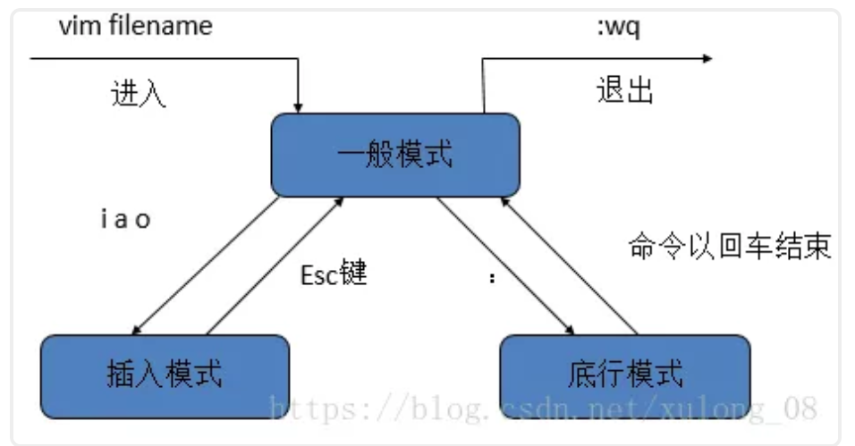
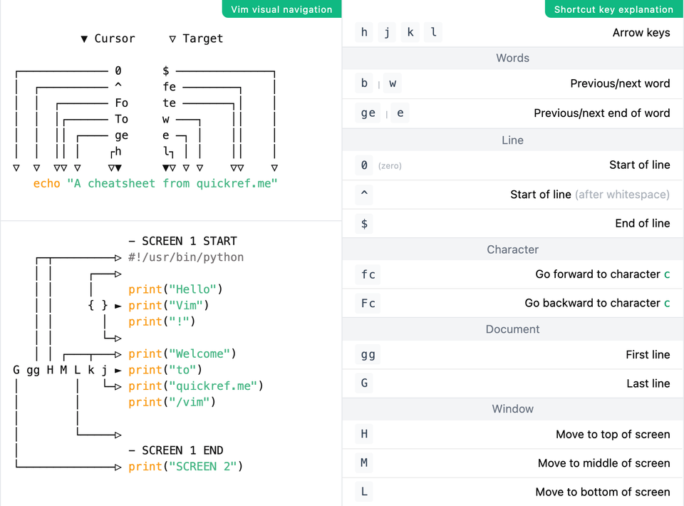

# Linux 命令

## CentOS 防火墙相关命令

1. 查看 firewall 服务状态

```shell
systemctl status firewalld
```


2. 查看 firewall 的状态

```shell
firewall-cmd --state
```


3. 开启、重启、关闭 firewalld.service 服务

```shell
# 开启
service firewalld start
# 重启
service firewalld restart
# 关闭
service firewalld stop
```

4. 查看防火墙规则

```shell
firewall-cmd --list-all 
```


5. 查询、开放、关闭端口

```shell
# 查询端口是否开放
firewall-cmd --query-port=8080/tcp
# 开放80端口
firewall-cmd --permanent --add-port=80/tcp
# 移除端口
firewall-cmd --permanent --remove-port=8080/tcp
#重启防火墙(修改配置后要重启防火墙)
firewall-cmd --reload
# 参数解释
1、firwall-cmd：是Linux提供的操作firewall的一个工具；
2、--permanent：表示设置为持久；
3、--add-port：标识添加的端口；
# 查看端口是否被监听
netstat -lnpt
```

## 权限相关

chmod -x a.sh 文件a.sh加上可执行权限

## 安装 ipconfig 

`yum install net-tools.x86_64 `

# linux 的目录结构


- bin  (binaries) 存放二进制可执行文件
- sbin  (super user binaries) 存放二进制可执行文件，只有 root 才能访问
- etc (etcetera) 存放系统配置文件
- usr  (unix shared resources) 用于存放共享的系统资源
- home 存放用户文件的根目录
- root  超级用户目录
- dev (devices) 用于存放设备文件
- lib  (library) 存放跟文件系统中的程序运行所需要的共享库及内核模块
- mnt  (mount) 系统管理员安装临时文件系统的安装点
- boot 存放用于系统引导时使用的各种文件
- tmp  (temporary) 用于存放各种临时文件
- var  (variable) 用于存放运行时需要改变数据的文件

# linux 常用命令

- 命令格式：命令  - 选项  参数 （选项和参数可以为空）
- 如：ls  -la  /usr

## 2.1 操作文件以及目录

| 命令  | 参数       | 示例                    | 说明                                                         |
| ----- | ---------- | ----------------------- | ------------------------------------------------------------ |
| cd    |            | cd /home                | 切换目录                                                     |
| pwd   |            | pwd                     | 显示当前工作目录                                             |
| touch |            | touch 1.txt             | 创建空文件                                                   |
| mkdir |            | mkdir testdir           | 创建一个新目录                                               |
|       | -p         | mkdir -p dir1/dir2/dir3 | 创建多级目录，**父目录不存在的情况下先生成父目录**           |
| cp    |            | cp 1.txt                | 复制文件或目录                                               |
|       | -r         | cp -r dir1/  dir2       | **递归处理，将指定目录dir1下的文件与子目录一并拷贝**到dir2文件目录下 |
| mv    |            | mv dir1 dir2            | 移动文件或目录、文件或目录改名                               |
| rm    |            | rm 1.txt                | 删除文件                                                     |
|       | -r<br />-f | rm -rf dir1             | -r 同时删除该目录以及目录下的所有文件<br />-f 强制删除文件或目录 |
| rmdir |            | rmdir dir1              | 删除**空目录**                                               |
| cat   |            | cat 1.txt               | 显示文本文件内容                                             |
| more  |            | more 1.txt              | 分页显示文本文件内容，可前后翻页<br />**空格向后，b向前**    |
| less  |            | less 1.txt              | 分页显示文本文件内容，可前后翻页。<br />**空格向后，b向前，支持底行模式** |
|       | :G         |                         | 到文件底部                                                   |
|       | n          |                         | 往下一个查找                                                 |
|       | N          |                         | 往上一个查找                                                 |
|       | b          |                         | 向后翻一页                                                   |
|       | d          |                         | 向后翻半页                                                   |
|       | h          |                         | 显示帮助页面                                                 |
|       | q          |                         | 退出                                                         |
| head  |            | head 1.txt              | 查看文件开头部分。默认10行                                   |
|       | -[num]     | head -20 1.txt          | 查看文件开头部分，指定查看行数                               |
| tail  |            | tail 1.txt              | 查看文本结尾部分，默认10行                                   |
|       | -[num]     | tail -20 1.txt          | 查看文本结尾部分，指定查看行数                               |
|       | -f         | tail -f 1.txt           | 循环滚动读取文件并动态显示在屏幕上，根据文件属性追踪（**根据文件描述符进行追踪，当文件改名或被删除，追踪停止**） |
|       | -F         | tail -F 1.txt           | 循环滚动读取文件并动态显示在屏幕上，根据文件名追踪。（**该文件被删除或改名后，如果再次创建相同的文件名，会继续追踪**） |
| wc    |            | wc 1.txt                | 统计文本行数、字数、字符数                                   |
|       | -m         | wc -m 1.txt             | 字符数                                                       |
|       | -w         | wc -w 1.txt             | 文本字数                                                     |
|       | -l         | wc -l 1.txt             | 文本行数                                                     |
| find  | -name      | find / -name 1.txt      | 在文件系统中指定目录下查找指定文件                           |
| grep  |            | grep aaa 1.txt          | 在指定文件中查找包含指定内容的行，例如: 在 1.txt 中查找包含 aaa 的所有行 |
| ln    |            | ln 1.txt 1_bak.txt      | 建立链接文件<br />**硬链接：会在选定的位置上生成一个和源文件大小相同的文件，无论是软链接还是硬链接，文件都保持同步变化** |
|       | -s         | ln -s 1.txt 1_bak.txt   | 对源文件建立符号连接.<br />**软连接:只会在选定的位置上生成一个文件的镜像，不会占用磁盘空间，类似与windows的快捷方式** |

## 2.2 系统常用命令

| 命令     | 参数    | 示例                        | 说明                                              |
| -------- | ------- | --------------------------- | ------------------------------------------------- |
| top      |         | top                         | 显示当前系统中耗费资源最多的进程                  |
|          | -c      |                             |                                                   |
|          | -P      |                             | 按照CPU使用率排序                                 |
|          | -M      |                             | 按照内存使用大小排序                              |
| date     |         | date                        | 显示系统当前时间                                  |
| ps       |         |                             | 较少单独使用，配合参数根据需求，ps -ef 或 ps -aux |
|          | -e / -A | ps -e                       | 显示所有进程，环境变量                            |
|          | -f      | ps -ef                      | 全格式显示                                        |
|          | -a      | ps -a                       | 显示所有用户的所有进程（包括其他用户）            |
|          | -u      | ps -au                      | 按用户名和启动时间的顺序来显示进程                |
|          | -x      | ps -aux                     | 显示无控制终端的进程                              |
| kill     | -9      | kill -9 pid                 | 根据进程的 pid 强制杀死一个进程                   |
| df       |         | df                          | 显示文件系统磁盘使用情况                          |
|          | -h      | df -h                       | 以可读方式显示：Kb, Mb，GB 等                     |
| du       |         |                             | 显示指定目录以及子目录已使用的磁盘空间的综合      |
|          | -s      | du -s *                     | 显示指定目录下的总和，* 当前目前目录下表示所有    |
| free     |         | free                        | 显示当前内存和交换空间的使用情况                  |
|          | -h      | free -h                     | 以可读方式显示，单位以 M/G                        |
| ifconfig |         | ifconfig                    | 网卡网络配置，常用于查看当前IP地址                |
|          |         | ifconfig eth0 192.168.12.22 | 临时修改系统IP（重启后失效）                      |
| ping     |         | ping baidu.com              | 测试网络的连通性                                  |
| hostname |         | hostname                    | 查看主机名                                        |
| shutdown | -r      | shutdown -r                 | 先关机，在重启                                    |
|          | -h      | shutdown -h                 | 关机后不重启                                      |
| halt     |         | halt                        | 关机后关闭电源，相当于 shutdown -h                |
| reboot   |         | reboot                      | 重新启动，相当于 shutdown -r                      |

## 2.3 压缩解压缩

| 命令  | 参数   | 示例                                                   | 说明                                                         |
| ----- | ------ | ------------------------------------------------------ | ------------------------------------------------------------ |
| gzip  |        | gzip 1.txt                                             | 压缩后面的文件或者文件夹                                     |
|       | -d     | gzip -d 1.txt.gz                                       | 解压后面的压缩文件                                           |
|       | -[num] | gzip -9 1.txt                                          | 用指定的数字 num 调整压缩的速度，-1 或 --fast 表示最快压缩方法（低压缩比），-9 或 --best 表示最慢压缩方法（高压缩比）。系统缺省值（default）为6 |
| tar   | -c     | tar -cvf 1.tar 1.txt                                   | 建立一个压缩文件的参数指令，例如：将1.txt 压缩为1.tar，也可以指定多个文件或文件夹 |
|       | -x     | tar -xvf 1.tar 1.txt                                   | 揭开一个压缩文件的参数指令                                   |
|       | -z     | tar -zcvf 1.tar.gz 1.txt<br />tar -zxvf 1.tar.gz 1.txt | 是否需要使用 gzip，使用 gzip 压缩或者解压                    |
|       | -v     |                                                        | 压缩的过程中显示文件                                         |
|       | -f     |                                                        | 使用的文档名，在 f 之后要立即接文档名                        |
| unzip | -o     |                                                        | 不提示的情况下覆盖文件                                       |
|       | -d     | unzip -o -d /home/sunny myfile.zip                     | d /home/sunny 指明将文件解压缩到/home/sunny目录下；          |
| zip   | -d     | zip -d myfile.zip smart.txt                            | 删除压缩文件中smart.txt文件                                  |
|       | -m     | zip -m myfile.zip ./rpm_info.txt                       | 向压缩文件中myfile.zip中添加rpm_info.txt文件                 |
|       | -r     | zip -r filename.zip filesdir                           | filename.zip 代表你创建的文件，filesdir 代表你想放置新 zip 文件的目录。-r 选项指定你想递归地（recursively）包括所有包括在 filesdir 目录中的文件。 |

## 2.4 文件权限操作

linux 文件权限的描述格式解读


- r 可读权限，w 可写权限，x 可执行权限（也可以用二进制表示  111 110 100  -->  764）
- 第 1 位：文件类型（d 目录，- 普通文件，l 链接文件）
- 第 2-4 位：所属用户权限，用 u（user）表示
- 第 5-7 位：所属组权限，用 g（group）表示
- 第 8-10 位：其他用户权限，用 o（other）表示
- 第 2-10 位：表示所有的权限，用 a（all）表示

| 命令  | 参数     | 示例                        | 说明                                                         |
| ----- | -------- | --------------------------- | ------------------------------------------------------------ |
| chmod |          | chmod u+r 1.txt             | 修改文件或目录的权限<br />u 表示当前用户，g 表示同组用户，o表示其他用户，a表示全部用户<br />r 表示可读，w 表示可写，x 表示可执行<br />例如：修改 1.txt 给当前用户可读权限<br />+ 表示增加权限， -表示去除权限 |
|       | -R       | chmod -R u+r dir1           | 修改指定目录以及子目录的所有文件的权限                       |
|       | 三位数字 | chmod 764 1.sh              | 直接指定文件的权限：<br />7：表示可读可写可执行 4+2+1<br />6：表示可读可写 4+2 |
| chown |          | chown user1:group1 1.txt    | 修改文件的所属用户和组<br />例如：将 1.txt 文件的所属用户指定为 user1， 组为 group1 |
|       | -R       | chown -R user1:group1 1.txt | 修改指定目录下所有文件以及子目录的所属用户和组<br />**用数字来表示：<br />r = 4, w = 2, x = 1, - = 0** |

# 三、linux 系统常用快捷键以及符号命令

| 命令     | 参数 | 示例                      | 说明                                                         |
| -------- | ---- | ------------------------- | ------------------------------------------------------------ |
| ctrl + c |      |                           | 停止进程                                                     |
| ctrl + l |      |                           | 清屏                                                         |
| ctrl + r |      |                           | 搜索历史命令                                                 |
| ctrl + q |      |                           | 退出                                                         |
| tab      |      |                           | 自动补全                                                     |
| >        |      | echo "haha" > 1.txt       | 将前一条命令的输出，写入到后面的文本中<br />**将文本清空，然后写入** |
| >>       |      | echo "Haha" >> 1.txt      | 将前一条命令的输出，写入到后面的文本中<br />**不清空文本，追加写入** |
| \|       |      | cat 1.txt \| grep 'hello' | 管道命令，将前一个命令的输出作为输入，然后进行运算<br />例如：打印 1.txt 中带有 hello 字符串的行 |
| *        |      |                           | 通配符，指所有                                               |

# 四、vim 编辑器

vi / vim 是 Linux 上最常用的文本编辑器而且功能非常强大。只有命令，没有菜单，下图表示 vi 命令的各种模式的切换图。



## 命令合集



## 4.1 修改文本

| 命令 | 说明                             |
| ---- | -------------------------------- |
| i    | 在光标**前**插入                 |
| l    | 在光标当前行**开始**插入         |
| a    | 在光标**后**插入                 |
| A    | 在光标当前行**末尾**插入         |
| o    | 在光标当前行的**下一行**插入新行 |
| O    | 在光标当前行的**上一行**插入新行 |
| :wq  | 保存并推出                       |

## 4.2 定位命令

| 命令      | 说明                                           |
| --------- | ---------------------------------------------- |
| :set nu   | 显示行号                                       |
| :set nonu | 取消行号                                       |
| gg        | 跳到首行                                       |
| G         | 跳到末行                                       |
| :n        | 跳到第n行                                      |
| /keyword  | 向光标下搜索 keyword 字符串                    |
| ?keyword  | 向光标上搜索 keyword 字符串                    |
| n         | 向下搜索前一个搜索动作（搜索下一个匹配的字符） |
| N         | 向上搜索前一个搜索动作                         |

## 4.3 替换和取消命令

| 命令     | 说明                                |
| -------- | ----------------------------------- |
| u        | undo，取消上一步操作                |
| ctrl + r | redo，返回到 undo 之前的操作        |
| r        | 替换光标所在处的字符                |
| R        | 从光标所在处开始替换，按 Esc 键结束 |

## 4.4 删除命令

| 命令   | 说明                             |
| ------ | -------------------------------- |
| x      | 删除光标所在处字符               |
| nx     | 删除光标所在处**后**的n个字符    |
| dd     | 删除光标所在行，ndd 删除 n 行    |
| dG     | 删除光标所在行到末尾行的所有内容 |
| D      | 删除光标所在处到行尾的内容       |
| :5, 7d | 删除指定范围的行                 |

## 4.5 常用快捷键

| 命令       | 说明                      |
| ---------- | ------------------------- |
| Shift + zz | 保存退出，与":wq"作用相同 |
| v          | 进入字符可视模式          |
| V          | 进入行可视模式            |
| Ctrl + v   | 进入块可视模式            |

# 常见用法

## echo 当前时间到文本中

```shell
#将当前时间和包含换行符的文本内容输出到文件
echo -e $(date) "\nHello World !" >> test.txt

#将当前时间（格式化）和包含换行符的文本内容输出到文件
echo -e `date '+%Y-%m-%d %H:%M:%S %A'` "\nHello World !" >> test.txt
#同上，简化版。
echo -e `date '+%F %T %A'` "\nHello World !" >> test.txt

#输出到以日期格式文件名
echo -e $(date) "\nHello World !" >> test`date +'%Y-%m-%d'`.txt
```

## 时间同步

1. 手动设置
     date命令：
     date :查看当前时间，结果如下：Wed Feb  4 16:29:51 CST 2015
     date -s 16:30:00 :设置当前时间，结果如下：Wed Feb  4 16:30:00 CST 2015
     date -s "YYYY-MM-DD hh:mm[:ss]" 如date -s "2015-02-04 16:30:00"
     hwclock -w（将时间写入bios避免重启失效）

2. 同步网络
     ntpdate命令：

   ```shell
   # 中国国家授时中心的官方服务器
   ntpdate -u 210.72.145.44 
   # ntp.api.bz是NTP服务器(上海)。
   ntpdate -u ntp.api.bz
   ```

   若ntpdate命令不存在则安装即可：`yum -y install ntp`

   解释：

   - ntpdate表示网络同步时间
   - -u 表示可以越过防火墙与主机同步。可man ntpdate查看手册
   - ntp.api.bz是NTP服务器(上海)。

   ```
   - 美国：time.nist.gov
   - 复旦：ntp.fudan.edu.cn
   - 微软公司授时主机(美国) ：time.windows.com
   - 台警大授时中心(台湾)：asia.pool.ntp.org
   - 阿里云服务器：ntp5.aliyun.com
   ```

### 两台机器之间的日期同步

1. 检查是否有 ntp 服务，并安装 ntp 服务

   ```shell
   # 检查
   rpm -qa|grep ntp
   # 下载
   yum -y install ntp
   ```

2. 修改 /etc/ntp.conf 配置文件

   1. 注释掉下面两行，本身是不响应任何的ntp更新请求，其实也就是禁用了本机的ntp server的功能，所以需要注释掉。　

         \#restrict default kod nomodify notrap nopeer noquery
         \#restrict -6 default kod nomodify notrap nopeer noquery

   2.  加入：

      restrict 192.168.1.0 mask 255.255.255.0 -- 让192.168.1.0/24网段上的机器能和本机做时间同步

       如果有多个网段则顺次加入即可

   3. 这样就可以了，记得加入下面的：

        server 127.127.1.0 # local clock
        fudge 127.127.1.0 stratum 10

      这两行需要，这是让本机的ntpd和本地硬件时间同步。

      当然，我们也可以添加server xxx.xxx.xxx.xxx，让他和其他的time server时间同步。

3. 重启 ntp 服务 

   ```shell
   service ntpd restart
   ```

4. 将 ntp 服务设置开机自启

   ```shell
   chkconfig ntpd on
   ```

5. 修改防火墙配置，开放 123 的 tcp 端口与 udp 端口，这是ntp需要的端口，在/etc/services中可以查到这个端口。

* 手动同步时间.

  另一台服务器同步 ntp server 的时间

  ```shell
  # 关闭 ntp 服务
  service ntpd stop
  # 执行 ntpdate 192.168.1.101 即可同步 192.168.1.101 配置好的时间
  ntpdate 192.168.1.101
  ```

* 自动同步时间

  * 使用 crontab 的方式

    ```shell
    # 新增一个定时任务,每分钟同步
    crontab -e
    
    */1 * * * * /usr/sbin/ntpdate 192.168.2.100
    
    # 验证是否成功
    crontab -l
    ```

  * 使用 ntp 自带的方式

    修改 /etc/ntp.conf

    如果没有配置 server 与 fudge 需要在最后加上该配置，如果有该配置，将对应的 ip 替换为对应的时间服务器的地址即可

    ```shell
    vi /etc/ntp.conf
    
    # 加入以下内容
    server 10.0.3.42
    fudge 10.0.3.42 stratum 10
    # 保存后
    
    # 重启服务
    service ntpd restart
    # 设置开机启动
    chkconfig ntpd on
    
    # 检查是否自动同步. 查看 when 列判断。 when就代表上次同步距离现在的时间. 注意这里使用 ntpq 不是 ntpd
    ntpq -p
    ```

    


