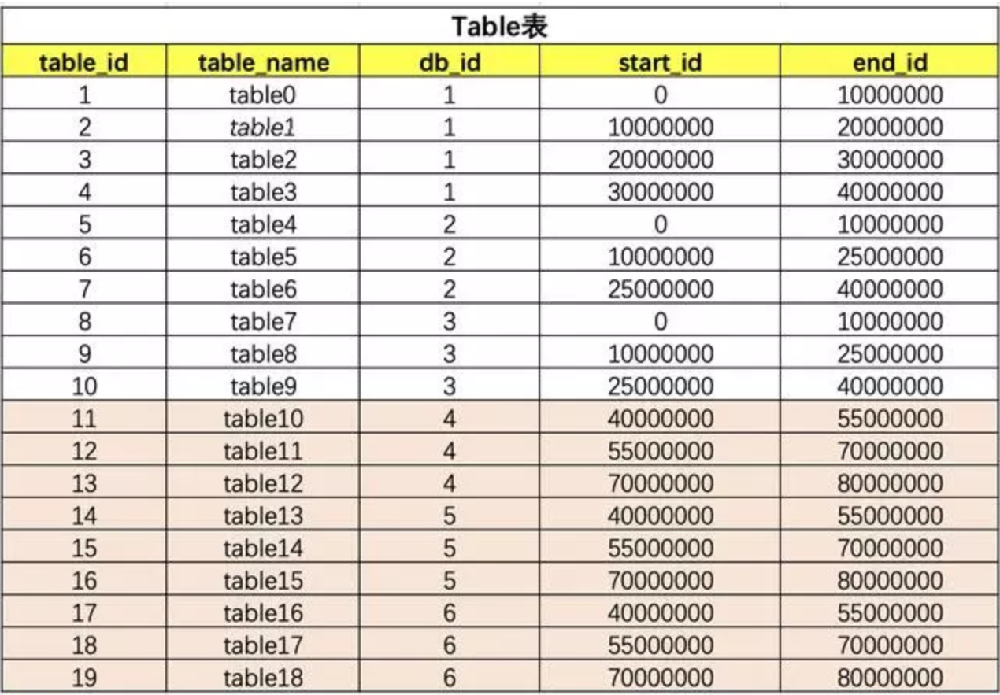
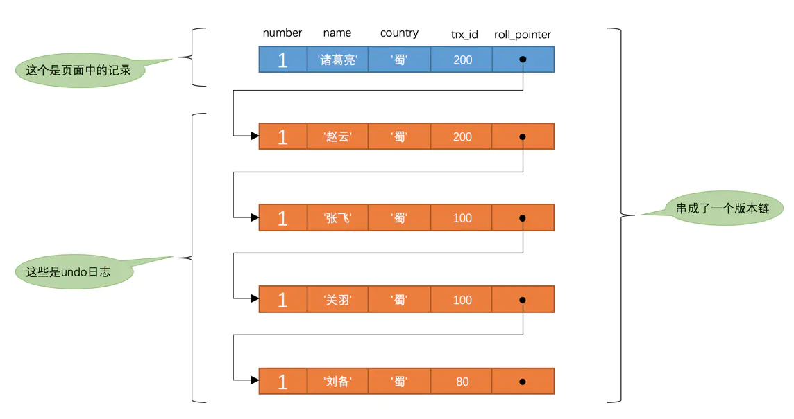

# MySQL

## 一、索引

### 1. 索引分类：

#### 1. 哈希表


注意字段值所对应的数组下标是哈希算法随机算出来的，所以可能出现**哈希冲突**。

那么对于这样一个索引结构，现在来执行下面的sql语句： 

select * from sanguo where name='鸡蛋'

可以直接对‘鸡蛋’按哈希算法算出来一个数组下标，然后可以直接从数据中取出数据并拿到所对应那一行数据的地址，进而查询那一行数据， 那么如果现在执行下面的sql语句：

select * from sanguo where name>'鸡蛋'

则无能为力，因为哈希表的特点就是**可以快速的精确查询，但是不支持范围查询**。

如果做成了索引，那速度也是很慢的，要全部扫描。

>  Hash表在哪些场景比较适合？

**等值查询的场景**，就只有KV（Key，Value）的情况，例如Redis、Memcached等这些NoSQL的中间件。

> 无序的Hash表，有序的数据结构？

**有序数组**，它就比较优秀了呀，它在等值查询的和范围查询的时候都很Nice。

**缺点**：
有序的适合静态数据，因为如果我们新增、删除、修改数据的时候就会改变他的结构。

比如你新增一个，那在你新增的位置后面所有的节点都会后移，成本很高。

适用场景：

可以用来做静态存储引擎，用来保存静态数据，例如你2019年的支付宝账单，2019年的淘宝购物记录等等都是很合适的，都是不会变动的历史数据。

#### 2. 完全平衡二叉树

二叉树的结构：


二叉树结构是有序的，支持**范围查找**

缺点：时间复杂度为 O(log(N))，为了维持这个时间复杂度，更新的时间复杂度也是O(log(N))。 所以此时为了保持平衡，就形成了完全平衡二叉树。但是此时如果数据非常多，树高会很高，查询的成本也会随着树高的增加而增加，所以大数据量的索引不建议使用完全平衡二叉树。

#### 3. B 树


B树与完全平衡二叉树的区别：

B 树比完全平衡二叉树要“矮”，原因是**B树中的一个节点可以存放多个元素**。

#### 4. B+树


对于同样的元素，B+树的表示要比B树要“胖”，原因在于B+树种的非叶子节点会冗余一份在叶子节点中，并且叶子节点之间用指针相连。

与前几种数据类型相比：Hash 由于不支持范围查询，二叉树树高很高导致数量大查询效率低，那么作为索引具有实际意义的就是B树与B+树结构。

B 树一个节点可以存储多个元素，相对于完全平衡二叉树整体的树高降低了，对于磁盘的IO效率提高了。

而 B+ 树是 B 树的升级版，只是把非叶子节点冗余一下，这么做的好处是为了**提高范围查询的查找效率**（会有指针指向下一个节点的叶子节点）

#### 索引数据结构小结

MySQL 选用 B+ 树这种数据结构作为索引，可以提高查询索引时的磁盘IO效率，并且可以提高范围查询的效率，并且 B+ 树的元素也是有序的。

#### 一个B+树节点存放多少元素最合适？

（也就是一个节点到底多大合适）

B+ 树中一个节点为一页或者页的倍数比较合适。因为如果一个节点的大小小于一页，那么读取整个节点的时候也会读出1页，造成了资源的浪费；如果一个节点的大小大于1页，比如 1.2 页，那么在读取这个节点的时候会读出2页，也会造成资源的浪费。所以为了减少资源的浪费，把最后一个节点的大小控制在1页或者页的倍数时最为合适。

>  “页”是MySQL自定义的单位，MySQL的Innodb 引擎中，一页大小是16K（如果操作系统中一页大小是4k，那么Mysql中1页=操作系统中4页），可以使用命令`SHOW GLOBALSTATUS like ‘Innodbpagesize‘;` 查看 
>
> 
>
> 
>
> * 各个数据页可以组成一个**双向链表**
> * 每个数据页中的记录又可以组成一个**单向链表**
> * 每个数据页都会为存储在里面的记录生成一个页目录，在通过**主键**查找某条记录时，可以在页目录里使用二分法快速定位到对应的槽，然后再遍历该槽对应分组中的记录即可快速找到指定的记录
> * 以**其他列**（非主键）作为搜索条件：**只能从最小记录开始依次遍历单链表中的每条记录**。
>
> 所以对于没有进行索引优化的普通SQL语句，例如：select * from user where username='丙丙'这样没有进行任何优化的sql语句，默认会这样做：
>
> * 定位到记录所在的页(需要遍历双向链表，找到所在的页)
> * 从所在的页内查找相应的记录
> * 由于不知主键查询，只能遍历所在页的单链表
>
> Mysql中Innodb中对B+树的实际应用（主要看主键索引），可以发现B+树中的一个节点存储的内容是：
>
> > § 非叶子节点：主键+指针
> >
> > § 叶子节点：数据
>
> 那么，假设我们一行数据大小为1K，那么一页就能存16条数据，也就是一个叶子节点能存16条数据；再看非叶子节点，假设主键ID为bigint类型，那么长度为8B，指针大小在Innodb源码中为6B，一共就是14B，那么一页里就可以存储16K/14=1170个(主键+指针)，那么一颗高度为2的B+树能存储的数据为：117016=18720条，一颗高度为3的B+树能存储的数据为：11701170*16=21902400（千万级条）。所以在InnoDB中B+树高度一般为1-3层，它就能满足千万级的数据存储。在查找数据时一次页的查找代表一次IO，所以通过主键索引查询通常只需要1-3次IO操作即可查找到数据。所以也就回答了我们的问题，1页=16k这么设置是比较合适的，是适用大多数的企业的，当然这个值是可以修改的，所以也能根据业务的时间情况进行调整。

#### 回表

回表大概就是我们有个主键为ID的索引，和一个普通name字段的索引，我们在普通字段上搜索：

select * from table where name = '丙丙'

执行的流程是先查询到name索引上的“丙丙”，然后找到他的id是2，最后去主键索引，找到id为2对应的值。

回到主键索引树搜索的过程，就是**回表**。不过也有方法避免回表，那就是**覆盖索引**。

#### 覆盖索引

**我们把这种只需要用到索引的查询方式称为`索引覆盖`。而不必通过二级索引查到主键之后再去查询数据(回表)。**

这个其实比较好理解，刚才我们是 select * ，查询所有的，我们如果只查询ID那，其实在Name字段的索引上就已经有了，那就不需要回表了。

**很不鼓励用`*`号作为查询列表，最好把我们需要查询的列依次标明**

覆盖索引可以减少树的搜索次数，提升性能，他也是我们在实际开发过程中经常用来优化查询效率的手段。

很多联合索引的建立，就是为了支持覆盖索引，特定的业务能极大的提升效率。

#### MySQL最多可建立多少索引和索引的限制

一个表最多16个索引,最大索引长度256字节.

#### 最左匹配原则

> 建立一个复合索引（col1,col2,col3）相当于建立了三个索引，但除此之外其他的条件组合方式不能使用这个复合索引。
>
> 比如：(col1,col3)、(col2m,col3)、（col2）、（col3）这四种条件无法使用索引

索引可以简单如一个列 (a)，也可以复杂如多个列 (a,b,c,d)，即**联合索引**。

如果是联合索引，那么key也由多个列组成，同时，索引只能用于查找key是否**存在（相等）**，遇到范围查询 (>、<、between、like左匹配)等就**不能进一步匹配**了，后续退化为线性查找。

因此，**列的排列顺序决定了可命中索引的列数**。

例子：

- 如有索引 (a,b,c,d)，查询条件 a=1 and b=2 and c>3 and d=4，则会在每个节点依次命中a、b、c，无法命中d。(c已经是范围查询了，d肯定是排不了序了)

同时要创建出好的索引要顾及到很多的方面：

* **最左前缀匹配原则**。这是非常重要、非常重要、非常重要（重要的事情说三遍）的原则，MySQL会一直向右匹配直到遇到范围查询 （>,<,BETWEEN,LIKE）就停止匹配。

  > 比如a = 1 and b = 2 and c > 3 and d = 4 如果建立(a,b,c,d)顺序的索引，d是用不到索引的，如果建立(a,b,d,c)的索引则都可以用到，a,b,d的顺序可以任意调整。

* 尽量选择**区分度高的列作为索引**，区分度的公式是 COUNT(DISTINCT col)/COUNT(*)。表示字段不重复的比率，比率越大我们扫描的记录数就越少。

* **索引列不能参与计算，尽量保持列“干净”**。比如， FROM_UNIXTIME(create_time)='2016-06-06' 就不能使用索引，原因很简单，**B+树中存储的都是数据表中的字段值**，但是进行检索时，需要把所有元素都应用函数才能比较，显然这样的代价太大。所以语句要写成 create_time=UNIX_TIMESTAMP('2016-06-06')。

* 尽可能的**扩展索引**，不要新建立索引。比如表中已经有了a的索引，现在要加（a,b）的索引，那么只需要修改原来的索引即可。

* 单个多列组合索引和多个单列索引的检索查询效果不同，因为在执行SQL时，~~**MySQL只能使用一个索引**，会从多个单列索引中选择一个限制最为严格的索引~~(经指正，在MySQL5.0以后的版本中，有“合并索引”的策略，翻看了《高性能MySQL 第三版》，书作者认为：**还是应该建立起比较好的索引，而不应该依赖于“合并索引”这么一个策略**)。

* “合并索引”策略简单来讲，就是使用多个单列索引，然后将这些结果用“union或者and”来合并起来

#### Index Skip Scan

[MySQL](https://cloud.tencent.com/product/cdb?from=10680) 8.0.13开始支持 index skip scan 也即索引跳跃扫描。该优化方式支持那些SQL**在不符合组合索引最左前缀的原则的情况，优化器依然能组使用组合索引**

**例子**：

> 表 t1，索引 (f1, f2)
>
> 执行 EXPLAIN SELECT f1, f2 FROM t1 WHERE f2 > 40\G
>
> ​         EXPLAIN SELECT f1, f2 FROM t1 WHERE f2 = 40\G

两个sql 的where条件 f2>40 和 f2=40 的执行计划中都包含了**Using index for skip scan** 并且 type 是range 。

整个执行计划大概如下:

```javascript
第一次从Index left side开始scan
第二次使用key(1,40) 扫描index，直到第一个range结束
使用key(1), find_flag =HA_READ_AFTER_KEY, 找到下一个Key值2
使用key(2,40)，扫描Index， 直到range结束
使用Key(2)，去找大于2的key值，上例中没有，因此结束扫描
```

> 从上述描述可以看到使用skip-scan的方式避免了全索引扫描，从而提升了性能

如果关闭 `skip_scan`特性，执行计划则变为**type=all, extre using where** 全表扫描。

**限制条件**：

* select 选择的字段不能包含非索引字段

* sql 中不能带 group by或者distinct 语法

* Skip scan仅支持单表查询，多表关联是无法使用该特性。

* 对于组合索引 ([A_1, …, A_k,] B_1, …, B_m, C [, D_1, …, D_n])，A,D 可以为空，但是B ,C 字段不能为空。

  > 需要强调的是数据库优化没有银弹。MySQL的优化器是基于成本来选择合适的执行计划，并不是所有的忽略最左前缀的条件查询，都能利用到 index skip scan。


### 2.SQL 优化

#### 1、explain出来的各种item的意义

* **id**:每个被独立执行的操作的标志，表示对象被操作的顺序。一般来说， id 值大，先被执行；如果 id 值相同，则顺序从上到下。

* **select_type**：查询中每个 select 子句的类型。

* **table**:名字，被操作的对象名称，通常的表名(或者别名)，但是也有其他格式。

* **partitions**:匹配的分区信息。

* **type**:join 类型。效率：system > const > eq_ref> ref > fulltext > ref_or_null > index_merge > unique_subquery > index_subquery > range > index > all。

  一般来说，得保证查询至少达到range级别，最好能达到ref。

  * **all**：全表扫描
  * **index**：这种连接类型只是另外一种形式的全表扫描，只不过它的扫描顺序是按照索引的顺序。这种扫描根据索引然后回表取数据，和all相比，他们都是取得了全表的数据，而且index要先读索引而且要回表随机取数据，因此index不可能会比all快（取同一个表数据），但为什么官方的手册将它的效率说的比all好，唯一可能的原因在于，按照索引扫描全表的数据是有序的。**index的效率比all高，但注意这需要相同的条件才成立（既需要排序）。**
  * **range**：range指的是有范围的索引扫描，相对于index的全索引扫描，它有范围限制，因此要优于index。
  * **ref**：查找条件列使用了索引而且不为主键和unique。其实，意思就是虽然使用了索引，但该索引列的值并不唯一，有重复。这样即使使用索引快速查找到了第一条数据，仍然不能停止，要进行目标值附近的小范围扫描。但它的好处是它并不需要扫全表，因为索引是有序的，即便有重复值，也是在一个非常小的范围内扫描。
  * **ref_eq**：唯一性索引扫描，对于每个索引键，表中只有一条记录与之匹配，常见主键或者唯一索引扫描
  * **const**：表示通过索引一次就找到了，const用于比较primary_key和union，由于只匹配一条数据，所以很快。

* **possible_keys**：列出可能会用到的索引。

* **key**:实际用到的索引。

* **key_len**:用到的索引键的平均长度，单位为字节。

* **ref**:表示本行被操作的对象的参照对象，可能是一个常量用 const 表示，也可能是其他表的 key 指向的对象，比如说驱动表的连接列。

* **rows**:估计每次需要扫描的行数。

* **filtered**:rows*filtered/100 表示该步骤最后得到的行数(估计值)。

* **extra**:重要的补充信息。

#### 2、profile的意义以及使用场景

Profile 用来分析 sql 性能的消耗分布情况。当用 explain 无法解决慢 SQL 的时候，需要用profile 来对 sql 进行更细致的分析，找出 sql 所花的时间大部分消耗在哪个部分，确认 sql的性能瓶颈。

#### 3、explain 中的索引问题

Explain 结果中，一般来说，要看到尽量用 index(type 为 const、 ref 等， key 列有值)，避免使用全表扫描(type 显式为 ALL)。比如说有 where 条件且选择性不错的列，需要建立索引。

被驱动表的连接列，也需要建立索引。被驱动表的连接列也可能会跟 where 条件列一起建立联合索引。当有排序或者 group by 的需求时，也可以考虑建立索引来达到直接排序和汇总的需求。

#### 4. exist 与 in 的区别

[参考文章](https://www.jianshu.com/p/f212527d76ff) 

```sql
select * from A where id in (select id from B);

select * from A where exists (select 1 from B where A.id=B.id);
```

对于以上两种情况，in是在内存里遍历比较，而exists需要查询数据库，所以当B表数据量较大时，exists效率优于in。

- IN适合于外表大（A）而内表小（B）的情况；
- EXISTS适合于外表小而内表大的情况。

##### 1、IN()语句内部工作原理

IN()只执行一次，它查出B表中的所有id字段并缓存起来。之后，检查A表的id是否与B表中的id相等，如果相等则将A表的记录加入结果集中，直到遍历完A表的所有记录。

##### 2、EXISTS()语句内部工作原理

exists()会执行A.length次，它并不缓存exists()结果集，因为exists()结果集的内容并不重要，重要的是其内查询语句的结果集空或者非空，空则返回false，非空则返回true.

### 3.普通索引和唯一索引的区别

从两种索引对查询语句和更新语句的性能影响的角度分析

#### 3.1、查询过程

> 假设，执行查询的语句是 select id from T where k=5。这个查询语句在索引树上查找的过程，先是通过B+树从树根开始，按层搜索到叶子节点，也就是图中右下角的这个数据页，然后可以认为数据页内部通过二分法来定位记录。

**对于普通索引来说，查找到满足条件的第一个记录(5,500)后，需要查找下一个记录，直到碰到第一个不满足k=5 条件的记录。**

**对于唯一索引来说，由于索引定义了唯一性，查找到第一个满足条件的记录后，就会停止继续检索。**

两种索引性能查询非常小

> InnoDB的数据是按数据页为单位来读写的。也就是说，当需要读一条记录的时候，并不是将这个记录本身从磁盘读出来，而是以页为单位，将其整体读入内存。在InnoDB中，每个数据页的大小默认是16KB。

因为引擎是按页读写的，所以说，当找到k=5的记录的时候，它所在的数据页就都在内存里了。那么，对于普通索引来说，要多做的那一次“查找和判断下一条记录”的操作，就只需要一次指针寻找和一次计算。

当然，如果k=5这个记录刚好是这个数据页的最后一个记录，那么要取下一个记录，必须读取下一个数据页，这个操作会稍微复杂一些。

对于整型字段，一个数据页可以放近千个key，因此出现这种情况的概率会很低。所以，我们计算平均性能差异时，仍可以认为这个操作成本对于现在的CPU来说可以忽略不计。

#### 3.2、更新过程

##### (1) change buffer

> 在MySQL5.5之前，叫`插入缓冲`(insert buffer)，只针对insert做了优化；现在对delete和update也有效，叫做`写缓冲`(change buffer)。

当需要更新一个数据页时，如果数据页在内存中就直接更新，而如果这个数据页还没有在内存中的话，在不影响数据一致性的前提下，InooDB会将这些更新操作缓存在change buffer中，这样就不需要从磁盘中读入这个数据页了。在下次查询需要访问这个数据页的时候，将数据页读入内存，然后执行change buffer中与这个页有关的操作。通过这种方式就能保证这个数据逻辑的正确性。

> 虽然名字叫作change buffer，实际上它是可以持久化的数据。也就是说，change buffer在内存中有拷贝，也会被写入到磁盘上。

将change buffer中的操作应用到原数据页，得到最新结果的过程称为merge。除了访问这个数据页会触发merge外，系统有后台线程会定期merge。在数据库正常关闭（shutdown）的过程中，也会执行merge操作。

显然，如果能够将更新操作先记录在change buffer，减少读磁盘，语句的执行速度会得到明显的提升。而且，数据读入内存是需要占用buffer pool的，所以这种方式还能够避免占用内存，提高内存利用率。

##### (2) 使用 change buffer

* 对于唯一索引来说

  >  将数据页从磁盘读入内存，判断是否唯一，再更新数据页。
  >
  > 更新前需要判断数据是否唯一（不能和表中数据重复），如果数据页在内存中，就可以直接判断并且更新，如果不在内存中，就需要去磁盘中读出来，判断一下是否唯一，是的话就更新。change buffer是用不到的。即使数据页不在内存中，还是要读出来。

  所有的更新操作都要先判断这个操作是否违反唯一性约束。比如，要插入(4,400)这个记录，就要先判断现在表中是否已经存在k=4的记录，而这必须要将数据页读入内存才能判断。如果都已经读入到内存了，那直接更新内存会更快，就没必要使用change buffer了。

因此，唯一索引的更新就不能使用change buffer，实际上也只有普通索引可以使用。

change buffer用的是buffer pool里的内存，因此不能无限增大。change buffer的大小，可以通过参数innodb_change_buffer_max_size来动态设置。这个参数设置为50的时候，表示change buffer的大小最多只能占用buffer pool的50%。

#### 3.3、 change buffer 的使用场景

> **change buffer 的作用是降低更新操作的频率，缓存更新操作。这样会有一个缺点，就是更新不及时，对于读操作比较频繁的表，不建议使用 change buffer。**
>
> 因为更新操作刚记录进change buffer中，就读取了该表，数据页被读到了内存中，数据马上就merge到数据页中了。这样不仅不会降低性能消耗，反而会增加维护change buffer的成本。

普通索引的所有场景，使用change buffer都可以起到加速作用吗？

因为merge的时候是真正进行数据更新的时刻，而change buffer的主要目的就是将记录的变更动作缓存下来，所以在一个数据页做merge之前，change buffer记录的变更越多（也就是这个页面上要更新的次数越多），收益就越大。

因此，对于**写多读少**的业务来说，页面在写完以后马上被访问到的概率比较小，此时change buffer的使用效果最好。这种业务模型常见的就是账单类、日志类的系统。

反过来，假设一个业务的更新模式是写入之后马上会做查询，那么即使满足了条件，将更新先记录在change buffer，但之后由于马上要访问这个数据页，会立即触发merge过程。这样随机访问IO的次数不会减少，反而增加了change buffer的维护代价。所以，对于这种业务模式来说，change buffer反而起到了副作用。

#### 3.4、 索引的选择和实践

这两类索引在查询能力上是没差别的，主要考虑的是对更新性能的影响。所以，建议尽量选择普通索引。

**如果所有的更新后面，都马上伴随着对这个记录的查询，那么你应该关闭change buffer。而在其他情况下，change buffer 都能提升更新性能。**

**在实际使用中，你会发现，普通索引和change buffer的配合使用，对于数据量大的表的更新优化还是很明显的。**

特别地，在使用机械硬盘时，change buffer这个机制的收效是非常显著的。所以，当你有一个类似“历史数据”的库，并且出于成本考虑用的是机械硬盘时，那你应该特别关注这些表里的索引，尽量使用普通索引，然后把change buffer 尽量开大，以确保这个“历史数据”表的数据写入速度。

#### 3.5、 redo log 和 change buffer

**WAL**（ Write-Ahead Logging，它的关键点就是先写日志，再写磁盘）提升性能的核心机制，也的确是尽量减少随机读写，这两个概念确实容易混淆。

现在，我们要在表上执行这个插入语句：

```
mysql> insert into t(id,k) values(id1,k1),(id2,k2);
```

这里，我们假设当前k索引树的状态，查找到位置后，k1所在的数据页在内存(InnoDB buffer pool)中，k2所在的数据页不在内存中。如图2所示是带change buffer的更新状态图。


分析这条更新语句，你会发现它涉及了四个部分：内存、redo log（ib_log_fileX）、 数据表空间（t.ibd）、系统表空间（ibdata1）。

这条更新语句做了如下的操作（按照图中的数字顺序）：

* Page 1在内存中，直接更新内存；
* Page 2没有在内存中，就在内存的change buffer区域，记录下“我要往Page 2插入一行”这个信息
* 将上述两个动作记入redo log中（图中3和4）

做完上面这些，事务就可以完成了。所以，你会看到，执行这条更新语句的成本很低，就是写了两处内存，然后写了一处磁盘（两次操作合在一起写了一次磁盘），而且还是顺序写的。

同时，图中的两个虚线箭头，是后台操作，不影响更新的响应时间。

那在这之后的读请求，要怎么处理呢？

比如，我们现在要执行 select * from t where k in (k1, k2)。这里，我画了这两个读请求的流程图。

如果读语句发生在更新语句后不久，内存中的数据都还在，那么此时的这两个读操作就与系统表空间（ibdata1）和 redo log（ib_log_fileX）无关了。


从图中可以看到：

读Page 1的时候，直接从内存返回。有几位同学在前面文章的评论中问到，WAL之后如果读数据，是不是一定要读盘，是不是一定要从redo log里面把数据更新以后才可以返回？其实是不用的。你可以看一下图3的这个状态，虽然磁盘上还是之前的数据，但是这里直接从内存返回结果，结果是正确的。

要读Page 2的时候，需要把Page 2从磁盘读入内存中，然后应用change buffer里面的操作日志，生成一个正确的版本并返回结果。

可以看到，直到需要读Page 2的时候，这个数据页才会被读入内存。

如果要简单地对比这两个机制在提升更新性能上的收益的话，**redo log 主要节省的是随机写磁盘的IO消耗（转成顺序写），而change buffer主要节省的则是随机读磁盘的IO消耗**

由于唯一索引用不上change buffer的优化机制，因此如果业务可以接受，从性能角度出发建议优先考虑非唯一索引。

### 4. 索引条件下推

`索引条件下推`（ `Index Condition Pushdown`，简称`ICP`）的功能，也就是把**查询中与被使用索引有关的查询条件下推到存储引擎中判断，而不是返回到`server`层再判断**（可以在索引遍历过程中，对索引中包含的字段先做判断，直接过滤掉不满足条件的记录，减少回表次数。）。不过需要注意的是，`索引条件下推`只是为了减少回表次数，也就是减少读取完整的聚簇索引记录的次数，从而减少`IO`操作。而对于`聚簇索引`而言不需要回表，它本身就包含着全部的列，也起不到减少`IO`操作的作用，所以设计`InnoDB`的大叔们规定这个**`索引条件下推`特性只适用于`二级索引`**。

注意点：

1、innodb引擎的表，索引下推只能用于二级索引。

> 就像之前提到的，innodb的主键索引树叶子结点上保存的是全行数据，所以这个时候索引下推并不会起到减少查询全行数据的效果

2、索引下推一般可用于所求查询字段（select列）不是/不全是联合索引的字段，查询条件为多条件查询且查询条件子句（where/order by）字段全是联合索引。

> 假设表t有联合索引（a,b）,下面语句可以使用索引下推提高效率
> select * from t where a > 2 and b > 10;

举例：

> 对于user_table表，我们现在有（username,age）联合索引
>
> `select * from user_table where username like '张%' and age > 10`
>
> 有两种执行可能：
>
> 1、根据（username,age）联合索引查询所有满足名称以“张”开头的索引，然后回表查询出相应的全行数据，然后再筛选出满足年龄小于等于10的用户数据.
>
> 2、根据（username,age）联合索引查询所有满足名称以“张”开头的索引，然后直接再筛选出年龄小于等于10的索引，之后再回表查询全行数据。
>
> 明显的，第二种方式需要回表查询的全行数据比较少，这就是mysql的索引下推。mysql默认启用索引下推，我们也可以通过修改系统变量optimizer_switch的index_condition_pushdown标志来控制
>
> `SET optimizer_switch = 'index_condition_pushdown=off';`

## 二、binlog、redo log、 undo log

### 1、什么是 binlog

`binlog`其实是在日常开发中听到很多的，因为很多数据的更新就依赖着`binlog`。

举个很简单的例子：我们的数据是保存在数据库里边的嘛，现在我们对某个商品的某个字段的内容改了（数据库变更），而**用户检索的出来数据是走搜索引擎的**。为了让用户能搜到最新的数据，我们需要把引擎的数据也改掉。

一句话：**数据库的变更，搜索引擎的数据也需要变更**。

于是，我们就会监听`binlog`的变更，如果`binlog`有变更了，那我们就需要将变更写到对应的数据源。

> 什么是`binlog` ？

`binlog`记录了数据库表结构和表数据变更，比如`update/delete/insert/truncate/create`。它不会记录`select`（因为这没有对表没有进行变更）

> `binlog`长什么样？

`binlog`我们可以简单理解为：存储着每条变更的`SQL`语句（当然从下面的图看来看，不止SQL，还有XID「事务Id」等等）


> `binlog`一般用来做什么

主要有两个作用：**复制和恢复数据**

- MySQL在公司使用的时候往往都是**一主多从**结构的，从服务器需要与主服务器的数据保持一致，这就是通过`binlog`来实现的
- 数据库的数据被干掉了，我们可以通过`binlog`来对数据进行恢复。

因为`binlog`记录了数据库表的变更，所以我们可以用`binlog`进行复制（主从复制)和恢复数据。

### 2、什么是 redo log

假设我们有一条sql语句：

```
update user_table set name='java3y' where id = '3'
```

MySQL执行这条SQL语句，肯定是先把`id=3`的这条记录查出来，然后将`name`字段给改掉。这没问题吧？

实际上Mysql的基本存储结构是**页**(记录都存在页里边)，所以MySQL是先把这条记录所在的**页**找到，然后把该页加载到内存中，将对应记录进行修改。

现在就可能存在一个问题：**如果在内存中把数据改了，还没来得及落磁盘，而此时的数据库挂了怎么办**？显然这次更改就丢了。


如果每个请求都需要将数据**立马**落磁盘之后，那速度会很慢，MySQL可能也顶不住。所以MySQL是怎么做的呢？

MySQL引入了`redo log`，内存写完了，然后会写一份`redo log`，这份`redo log`记载着这次**在某个页上做了什么修改**。


写`redo log`也是需要写磁盘的，但它的好处就是`顺序IO`（我们都知道顺序IO比随机IO快非常多）。

所以，`redo log`的存在为了：当我们修改的时候，写完内存了，但数据还没真正写到磁盘的时候。此时我们的数据库挂了，我们可以根据`redo log`来对数据进行恢复。因为`redo log`是顺序IO，所以**写入的速度很快**，并且`redo log`记载的是物理变化（xxxx页做了xxx修改），文件的体积很小，**恢复速度很快**。

### 3、binlog 与 redo log

#### 存储的内容

`binlog`记载的是`update/delete/insert`这样的SQL语句，而`redo log`记载的是物理修改的内容（xxxx页修改了xxx）。

所以在搜索资料的时候会有这样的说法：`redo log` 记录的是数据的**物理变化**，`binlog` 记录的是数据的**逻辑变化**

#### 功能

`redo log`的作用是为**持久化**而生的。写完内存，如果数据库挂了，那我们可以通过`redo log`来恢复内存还没来得及刷到磁盘的数据，将`redo log`加载到内存里边，那内存就能恢复到挂掉之前的数据了。

`binlog`的作用是复制和恢复而生的。

- 主从服务器需要保持数据的一致性，通过`binlog`来同步数据。
- 如果整个数据库的数据都被删除了，`binlog`存储着所有的数据变更情况，那么可以通过`binlog`来对数据进行恢复。

> ”如果整个数据库的数据都被删除了，那我可以用`redo log`的记录来恢复吗？
>
> **不能**
>
> 因为功能的不同，`redo log` 存储的是物理数据的变更，如果我们内存的数据已经刷到了磁盘了，那`redo log`的数据就无效了。所以`redo log`不会存储着**历史**所有数据的变更，**文件的内容会被覆盖的**。

#### binlog 与 redo log 写入的细节

`redo log`是MySQL的InnoDB引擎所产生的。

`binlog`无论MySQL用什么引擎，都会有的。

InnoDB是有事务的，事务的四大特性之一：持久性就是靠`redo log`来实现的（如果写入内存成功，但数据还没真正刷到磁盘，如果此时的数据库挂了，我们可以靠`redo log`来恢复内存的数据，这就实现了持久性）。

上面也提到，在修改的数据的时候，`binlog`会记载着变更的类容，`redo log`也会记载着变更的内容。（只不过一个存储的是物理变化，一个存储的是逻辑变化）。那他们的写入顺序是什么样的呢？

`redo log`**事务开始**的时候，就开始记录每次的变更信息，而`binlog`是在**事务提交**的时候才记录。

于是新有的问题又出现了：我写其中的某一个`log`，失败了，那会怎么办？现在我们的前提是先写`redo log`，再写`binlog`，我们来看看：

*　如果写`redo log`失败了，那我们就认为这次事务有问题，回滚，不再写`binlog`。
*　如果写`redo log`成功了，写`binlog`，写`binlog`写一半了，但失败了怎么办？我们还是会对这次的**事务回滚**，将无效的`binlog`给删除（因为`binlog`会影响从库的数据，所以需要做删除操作）
*　**如果写`redo log`和`binlog`都成功了，那这次算是事务才会真正成功。**

简单来说：MySQL需要保证`redo log`和`binlog`的**数据是一致**的，如果不一致，那就乱套了。

- 如果`redo log`写失败了，而`binlog`写成功了。那假设内存的数据还没来得及落磁盘，机器就挂掉了。那主从服务器的数据就不一致了。（从服务器通过`binlog`得到最新的数据，而主服务器由于`redo log`没有记载，没法恢复数据）
- 如果`redo log`写成功了，而`binlog`写失败了。那从服务器就拿不到最新的数据了。

### 二阶段提交

MySQL通过**两阶段提交**来保证`redo log`和`binlog`的数据是一致的


过程：

- 阶段1：InnoDB`redo log` 写盘，InnoDB 事务进入 `prepare` 状态
- 阶段2：`binlog` 写盘，InooDB 事务进入 `commit` 状态
- 每个事务`binlog`的末尾，会记录一个 `XID event`，标志着事务是否提交成功，也就是说，恢复过程中，`binlog` 最后一个 XID event 之后的内容都应该被 purge。


### 4、什么是 undo log

> undo log 有什么用？

`undo log`主要有两个作用：回滚和多版本控制(MVCC)

在数据修改的时候，不仅记录了`redo log`，还记录`undo log`，如果因为某些原因导致事务失败或回滚了，可以用`undo log`进行回滚

`undo log`主要存储的也是逻辑日志，比如我们要`insert`一条数据了，那`undo log`会记录的一条对应的`delete`日志。我们要`update`一条记录时，它会记录一条对应**相反**的update记录。

这也应该容易理解，毕竟回滚嘛，跟需要修改的操作相反就好，这样就能达到回滚的目的。因为支持回滚操作，所以我们就能保证：“**一个事务包含多个操作，这些操作要么全部执行，要么全都不执行**”。【原子性】

因为`undo log`存储着修改之前的数据，相当于一个**前版本**，MVCC实现的是读写不阻塞，读的时候只要返回前一个版本的数据就行了。

### todo 把`binlog` /`redo log`/`undo log`最核心的知识给讲了，还有一些细节性的东西可以自行去补充（比如`binlog`有几种的模式，以及文章提到的刷盘策略等等）

## 三、分库分表

一般中大型项目，数据量比较大时，就需要进行拆分。**有垂直和水平两种**。

**垂直拆分**比较简单，也就是本来一个数据库，数据量大之后，从业务角度进行拆分多个库。如下图，独立的拆分出订单库和用户库。


**水平拆分**的概念，是同一个业务数据量大之后，进行水平拆分。


上图中订单数据达到了4000万，我们也知道mysql单表存储量推荐是百万级，如果不进行处理，mysql单表数据太大，会导致性能变慢。使用方案可以参考数据进行水平拆分。把4000万数据拆分4张表或者更多。当然也可以分库，再分表；把压力从数据库层级分开。

### 分库分表方案

分库分表方案中有常用的方案：

* hash取模;
* range范围方案；

分库分表方案最主要就是路由算法，把路由的key按照指定的算法进行路由存放。

#### 1. Hash 取模


在我们设计系统之前，可以先预估一下大概这几年的订单量，如：4000万。每张表我们可以容纳1000万，也我们可以设计4张表进行存储。

> hash的方案就是对指定的路由key（如：id）对分表总数进行取模，上图中，id=12的订单，对4进行取模，也就是会得到0，那此订单会放到0表中。id=13的订单，取模得到为1，就会放到1表中。为什么对4取模，是因为分表总数是4。

**优点：**

订单数据可以均匀的放到那4张表中，这样此订单进行操作时，就不会有热点问题。

> 热点的含义：热点的意思就是对订单进行操作集中到1个表中，其他表的操作很少。
>
> 订单有个特点就是时间属性，一般用户操作订单数据，都会集中到这段时间产生的订单。如果这段时间产生的订单 都在同一张订单表中，那就会形成热点，那张表的压力会比较大。

**缺点**：

将来的数据迁移和扩容，会很难。

如：业务发展很好，订单量很大，超出了4000万的量，那我们就需要增加分表数。如果我们增加4个表


> 一旦我们增加了分表的总数，取模的基数就会变成8，以前id=12的订单按照此方案就会到4表中查询，但之前的此订单时在0表的，这样就导致了数据查不到。就是因为取模的基数产生了变化。

遇到这个情况，我们小伙伴想到的方案就是做数据迁移，把之前的4000万数据，重新做一个hash方案，放到新的规划分表中。也就是我们要做数据迁移。这个是很痛苦的事情。有些小公司可以接受晚上停机迁移，但大公司是不允许停机做数据迁移的。

> 当然做数据迁移可以结合自己的公司的业务，做一个工具进行，不过也带来了很多工作量，每次扩容都要做数据迁移

那有没有不需要做数据迁移的方案呢，我们看下面的方案

#### 2. range 范围方案

range方案也就是以范围进行拆分数据。


range方案比较简单，就是把一定范围内的订单，存放到一个表中；如上图id=12放到0表中，id=1300万的放到1表中。设计这个方案时就是前期把表的范围设计好。通过id进行路由存放。

**优点**：

此方案是不是有利于将来的扩容，不需要做数据迁移。即时再增加4张表，之前的4张表的范围不需要改变，id=12的还是在0表，id=1300万的还是在1表，新增的4张表他们的范围肯定是 大于 4000万之后的范围划分的。

**缺点**：

有热点问题，我们想一下，因为id的值会一直递增变大，那这段时间的订单是不是会一直在某一张表中，如id=1000万 ～ id=2000万之间，这段时间产生的订单是不是都会集中到此张表中，这个就导致1表过热，压力过大，而其他的表没有什么压力。

#### 3. 混合方案

**hash取模方案**：没有热点问题，但扩容迁移数据痛苦

**range方案**：不需要迁移数据，但有热点问题。

下面方案将实现：**根据服务器的性能以及存储高低，适当均匀调整存储**

**具体思路**：

* **首先用range方案让数据落地到一个范围里面**。这样以后id再变大，**那以前的数据是不需要迁移的**。
* 每次的扩容肯定会**事先设计好这次扩容的范围大小**，我们只要**保证这次的范围内的数据均匀**

**方案设计**：

我们先定义一个group组概念，这组里面包含了一些分库以及分表，如下图


上图有几个关键点：

> 1）id=0～4000万肯定落到group01组中
>
> 2）group01组有3个DB，那一个id如何路由到哪个DB？
>
> 3）根据hash取模定位DB，那模数为多少？模数要为所有此group组DB中的表数，上图总表数为10。为什么要去表的总数？而不是DB总数3呢？
>
> 4）如id=12，id%10=2；那值为2，落到哪个DB库呢？这是设计是前期设定好的，那怎么设定的呢？
>
> 5）一旦设计定位哪个DB后，就需要确定落到DB中的哪张表呢？

**核心主流程**


按照上面的流程，我们就可以根据此规则，定位一个id，我们看看有没有避免热点问题。

我们看一下，id在【0，1000万】范围内的，根据上面的流程设计，1000万以内的id都均匀的分配到DB_0,DB_1,DB_2三个数据库中的Table_0表中，为什么可以均匀，因为我们用了hash的方案，对10进行取模。

> 上面我们也提了疑问，为什么对表的总数10取模，而不是DB的总数3进行取模？我们看一下为什么DB_0是4张表，其他两个DB_1是3张表？

在我们安排服务器时，有些服务器的性能高，存储高，就可以安排多存放些数据，有些性能低的就少放点数据。如果我们取模是按照DB总数3，进行取模，那就代表着【0，4000万】的数据是平均分配到3个DB中的，那就不能够实现按照服务器能力适当分配了。

按照Table总数10就能够达到，看如何达到


上图中我们对10进行取模，如果值为【0，1，2，3】就路由到DB_0，【4，5，6】路由到DB_1，【7，8，9】路由到DB_2。现在小伙伴们有没有理解，这样的设计就可以把多一点的数据放到DB_0中，其他2个DB数据量就可以少一点。DB_0承担了4/10的数据量，DB_1承担了3/10的数据量，DB_2也承担了3/10的数据量。整个Group01承担了【0，4000万】的数据量。

**上面步骤就解决了热点的问题，以及可以按照服务器指标，设计数据量的分配**

**如何扩容**

扩容的时候再设计一个group02组，定义好此group的数据范围就ok了。


因为是新增的一个group01组，所以就没有什么数据迁移概念，完全是新增的group组，而且这个group组照样就防止了热点，也就是【4000万，5500万】的数据，都均匀分配到三个DB的table_0表中，【5500万～7000万】数据均匀分配到table_1表中。

**系统设计**

group和DB的关系


table和db的关系



**在开发的时候不要每次都去查询三张关联表，可以保存到缓存中（本地jvm缓存），这样不会影响性能**。

一旦需要扩容，是不是要增加一下group02关联关系，那应用服务需要重新启动吗？

简单点的话，就凌晨配置，重启应用服务就行了。但如果是大型公司，是不允许的，因为凌晨也有订单的。那怎么办呢？本地jvm缓存怎么更新呢？

**其实方案也很多，可以使用用zookeeper，也可以使用分布式配置，这里是比较推荐使用分布式配置中心的，可以将这些数据配置到分布式配置中心去。**

##　四、事务隔离级别

### 事务的特性（ACID）

**原子性（Atomicity）**
原子性是指事务是一个不可分割的工作单位，事务中的操作要么都发生，要么都不发生。
**一致性（Consistency）**
事务前后数据的完整性必须保持一致。
**隔离性（Isolation）**
事务的隔离性是多个用户并发访问数据库时，数据库为每一个用户开启的事务，不能被其他事务的操作数据所干扰，多个并发事务之间要相互隔离。
**持久性（Durability）**
持久性是指一个事务一旦被提交，它对数据库中数据的改变就是永久性的，接下来即使数据库发生故障也不应该对其有任何影响

### 1. 事务并发的问题

* 脏写（`Dirty Write`）：

  如果一个事务修改了另一个未提交事务修改过的数据，那就意味着发生了`脏写`，示意图如下：

  

  如上图，`Session A`和`Session B`各开启了一个事务，`Session B`中的事务先将`number`列为`1`的记录的`name`列更新为`'关羽'`，然后`Session A`中的事务接着又把这条`number`列为`1`的记录的`name`列更新为`张飞`。如果之后`Session B`中的事务进行了回滚，那么`Session A`中的更新也将不复存在，这种现象就称之为`脏写`。

* 脏读（`Dirty Read`）

  如果一个事务读到了另一个未提交事务修改过的数据，那就意味着发生了`脏读`

  

  `Session A`和`Session B`各开启了一个事务，`Session B`中的事务先将`number`列为`1`的记录的`name`列更新为`'关羽'`，然后`Session A`中的事务再去查询这条`number`为`1`的记录，如果读到列`name`的值为`'关羽'`，而`Session B`中的事务稍后进行了回滚，那么`Session A`中的事务相当于读到了一个不存在的数据，这种现象就称之为`脏读`。

* 不可重复读（Non-Repeatable Read）

  如果一个事务只能读到另一个已经提交的事务修改过的数据，并且其他事务每对该数据进行一次修改并提交后，该事务都能查询得到最新值，那就意味着发生了`不可重复读`

  

  我们在`Session B`中提交了几个隐式事务（注意是隐式事务，意味着语句结束事务就提交了），这些事务都修改了`number`列为`1`的记录的列`name`的值，每次事务提交之后，如果`Session A`中的事务都可以查看到最新的值，这种现象也被称之为`不可重复读`。

* 幻读（Phantom）

  如果一个事务先根据某些条件查询出一些记录，之后另一个事务又向表中插入了符合这些条件的记录，原先的事务再次按照该条件查询时，能把另一个事务插入的记录也读出来，那就意味着发生了`幻读`

  

  如上图，`Session A`中的事务先根据条件`number > 0`这个条件查询表`hero`，得到了`name`列值为`'刘备'`的记录；之后`Session B`中提交了一个隐式事务，该事务向表`hero`中插入了一条新记录；之后`Session A`中的事务再根据相同的条件`number > 0`查询表`hero`，得到的结果集中包含`Session B`中的事务新插入的那条记录，这种现象也被称之为`幻读`。

  `幻读`强调的是一个事务按照某个相同条件多次读取记录时，后读取时读到了之前没有读到的记录。

### 2. SQL标准中的四种隔离级别

- `READ UNCOMMITTED`：未提交读。
- `READ COMMITTED`：已提交读。
- `REPEATABLE READ`：可重复读。
- `SERIALIZABLE`：可串行化。

`SQL标准`中规定，针对不同的隔离级别，并发事务可以发生不同严重程度的问题，具体情况如下：

| 隔离级别           | 脏读         | 不可重复读   | 幻读         |
| ------------------ | ------------ | ------------ | ------------ |
| `READ UNCOMMITTED` | Possible     | Possible     | Possible     |
| `READ COMMITTED`   | Not Possible | Possible     | Possible     |
| `REPEATABLE READ`  | Not Possible | Not Possible | Possible     |
| `SERIALIZABLE`     | Not Possible | Not Possible | Not Possible |

- `READ UNCOMMITTED`隔离级别下，可能发生`脏读`、`不可重复读`和`幻读`问题。

- `READ COMMITTED`隔离级别下，可能发生`不可重复读`和`幻读`问题，但是不可以发生`脏读`问题。

- `REPEATABLE READ`隔离级别下，可能发生`幻读`问题，但是不可以发生`脏读`和`不可重复读`的问题。

  MySQL可重复读的隔离级别中并不是完全解决了幻读的问题，而是**解决了读数据情况下的幻读问题**。而对于**修改的操作依旧存在幻读问题，就是说MVCC对于幻读的解决时不彻底的**。

- `SERIALIZABLE`隔离级别下，各种问题都不可以发生。

### 3. MySQL中支持的四种隔离级别

不同的数据库厂商对`SQL标准`中规定的四种隔离级别支持不一样，比方说`Oracle`就只支持`READ COMMITTED`和`SERIALIZABLE`隔离级别。本书中所讨论的`MySQL`虽然支持4种隔离级别，但与`SQL标准`中所规定的各级隔离级别允许发生的问题却有些出入，MySQL在REPEATABLE READ隔离级别下，是可以禁止幻读问题的发生的（关于如何禁止我们之后会详细说明的）。

`MySQL`的默认隔离级别为`REPEATABLE READ`，我们可以手动修改一下事务的隔离级别。

#### 如何设置事务的隔离级别

我们可以通过下边的语句修改事务的隔离级别：

```sql
SET [GLOBAL|SESSION] TRANSACTION ISOLATION LEVEL level;
```

其中的`level`可选值有4个：

```sql
level: {
     REPEATABLE READ
   | READ COMMITTED
   | READ UNCOMMITTED
   | SERIALIZABLE
}
```

设置事务的隔离级别的语句中，在`SET`关键字后可以放置`GLOBAL`关键字、`SESSION`关键字或者什么都不放，这样会对不同范围的事务产生不同的影响，具体如下：

* 使用`GLOBAL`关键字（在全局范围影响）
  - 只对执行完该语句之后产生的会话起作用。
  - 当前已经存在的会话无效。
* 使用`SESSION`关键字（在会话范围影响）
  * 对当前会话的所有后续的事务有效
  * 该语句可以在已经开启的事务中间执行，但不会影响当前正在执行的事务。
  * 如果在事务之间执行，则对后续的事务有效。
* 上述两个关键字都不用（只对执行语句后的下一个事务产生影响）
  * 只对当前会话中下一个即将开启的事务有效。
  * 下一个事务执行完后，后续事务将恢复到之前的隔离级别。
  * 该语句不能在已经开启的事务中间执行，会报错的。

如果我们在服务器启动时想改变事务的默认隔离级别，可以修改启动参数`transaction-isolation`的值，比方说我们在启动服务器时指定了`--transaction-isolation=SERIALIZABLE`，那么事务的默认隔离级别就从原来的`REPEATABLE READ`变成了`SERIALIZABLE`。

想要查看当前会话默认的隔离级别可以通过查看系统变量`transaction_isolation`的值来确定：

```sql
mysql> SHOW VARIABLES LIKE 'transaction_isolation';
+-----------------------+-----------------+
| Variable_name         | Value           |
+-----------------------+-----------------+
| transaction_isolation | REPEATABLE-READ |
+-----------------------+-----------------+
1 row in set (0.02 sec)
```


## 五、MVCC 原理

Multi-Version Concurrent Control，即多版本并发控制。

### 1. 版本链

对于使用`InnoDB`存储引擎的表来说，它的聚簇索引记录中都包含两个必要的隐藏列（`row_id`并不是必要的，我们创建的表中有主键或者非NULL的UNIQUE键时都不会包含`row_id`列）：

- `trx_id`：每次一个事务对某条聚簇索引记录进行改动时，都会把该事务的`事务id`赋值给`trx_id`隐藏列。
- `roll_pointer`：每次对某条聚簇索引记录进行改动时，都会把旧的版本写入到`undo日志`中，然后这个隐藏列就相当于一个指针，可以通过它来找到该记录修改前的信息。

比方说我们的表`hero`现在只包含一条记录：

```sql
mysql> SELECT * FROM hero;
+--------+--------+---------+
| number | name   | country |
+--------+--------+---------+
|      1 | 刘备   | 蜀      |
+--------+--------+---------+
1 row in set (0.07 sec)
```

假设插入该记录的`事务id`为`80`，那么此刻该条记录的示意图如下所示：


> 实际上insert undo只在事务回滚时起作用，当事务提交后，该类型的undo日志就没用了，它占用的Undo Log Segment也会被系统回收（也就是该undo日志占用的Undo页面链表要么被重用，要么被释放）。虽然真正的insert undo日志占用的存储空间被释放了，但是roll_pointer的值并不会被清除，roll_pointer属性占用7个字节，第一个比特位就标记着它指向的undo日志的类型，如果该比特位的值为1时，就代表着它指向的undo日志类型为insert undo。所以我们之后在画图时都会把insert undo给去掉.

假设之后两个`事务id`分别为`100`、`200`的事务对这条记录进行`UPDATE`操作，操作流程如下：


> InnoDB使用锁来保证不会有脏写情况的发生，也就是在第一个事务更新了某条记录后，就会给这条记录加锁，另一个事务再次更新时就需要等待第一个事务提交了，把锁释放之后才可以继续更新

每次对记录进行改动，都会记录一条`undo日志`，每条`undo日志`也都有一个`roll_pointer`属性（`INSERT`操作对应的`undo日志`没有该属性，因为该记录并没有更早的版本），可以将这些`undo日志`都连起来，串成一个链表，所以现在的情况就像下图一样：



对该记录每次更新后，都会将旧值放到一条`undo日志`中，就算是该记录的一个旧版本，随着更新次数的增多，所有的版本都会被`roll_pointer`属性连接成一个链表，我们把这个链表称之为`版本链`，版本链的头节点就是当前记录最新的值。另外，每个版本中还包含生成该版本时对应的`事务id`.

### 2. ReadView

* 对于使用`READ UNCOMMITTED`隔离级别的事务来说，由于可以读到未提交事务修改过的记录，所以直接读取记录的最新版本就好了；

* 对于使用`SERIALIZABLE`隔离级别的事务来说，设计`InnoDB`的大叔规定使用加锁的方式来访问记录；

* 对于使用`READ COMMITTED`和`REPEATABLE READ`隔离级别的事务来说，都必须保证读到已经提交了的事务修改过的记录，也就是说假如另一个事务已经修改了记录但是尚未提交，是不能直接读取最新版本的记录的，核心问题就是：需要判断一下版本链中的哪个版本是当前事务可见的。

  为此，设计`InnoDB`的大叔提出了一个`ReadView`的概念，这个`ReadView`中主要包含4个比较重要的内容：

  * `m_ids`：表示在生成`ReadView`时当前系统中活跃的读写事务的`事务id`列表。

  * `min_trx_id`：表示在生成`ReadView`时当前系统中活跃的读写事务中最小的`事务id`，也就是`m_ids`中的最小值。

  * `max_trx_id`：表示生成`ReadView`时系统中应该分配给下一个事务的`id`值。

    >  注意max_trx_id并不是m_ids中的最大值，事务id是递增分配的。比方说现在有id为1，2，3这三个事务，之后id为3的事务提交了。那么一个新的读事务在生成ReadView时，m_ids就包括1和2，min_trx_id的值就是1，max_trx_id的值就是4。

  * `creator_trx_id`：表示生成该`ReadView`的事务的`事务id`。

    > 前边说过，只有在对表中的记录做改动时（执行INSERT、DELETE、UPDATE这些语句时）才会为事务分配事务id，否则在一个只读事务中的事务id值都默认为0。

有了这个`ReadView`，这样在访问某条记录时，只需要按照下边的步骤判断记录的某个版本是否可见：

- 如果被访问版本的`trx_id`属性值与`ReadView`中的`creator_trx_id`值相同，意味着当前事务在访问它自己修改过的记录，所以该版本可以被当前事务访问。
- 如果被访问版本的`trx_id`属性值小于`ReadView`中的`min_trx_id`值，表明生成该版本的事务在当前事务生成`ReadView`前已经提交，所以该版本可以被当前事务访问
- 如果被访问版本的`trx_id`属性值大于或等于`ReadView`中的`max_trx_id`值，表明生成该版本的事务在当前事务生成`ReadView`后才开启，所以该版本不可以被当前事务访问。
- 如果被访问版本的`trx_id`属性值在`ReadView`的`min_trx_id`和`max_trx_id`之间，那就需要判断一下`trx_id`属性值是不是在`m_ids`列表中，如果在，说明创建`ReadView`时生成该版本的事务还是活跃的，该版本不可以被访问；如果不在，说明创建`ReadView`时生成该版本的事务已经被提交，该版本可以被访问。

如果某个版本的数据对当前事务不可见的话，那就顺着版本链找到下一个版本的数据，继续按照上边的步骤判断可见性，依此类推，直到版本链中的最后一个版本。如果最后一个版本也不可见的话，那么就意味着该条记录对该事务完全不可见，查询结果就不包含该记录。

在`MySQL`中，`READ COMMITTED`和`REPEATABLE READ`隔离级别的的一个非常大的区别就是它们生成ReadView的时机不同。我们还是以表`hero`为例来，假设现在表`hero`中只有一条由`事务id`为`80`的事务插入的一条记录：

```sql
mysql> SELECT * FROM hero;
+--------+--------+---------+
| number | name   | country |
+--------+--------+---------+
|      1 | 刘备   | 蜀      |
+--------+--------+---------+
1 row in set (0.07 sec)
```

#### READ COMMITTED —— 每次读取数据前都生成一个ReadView

比方说现在系统里有两个`事务id`分别为`100`、`200`的事务在执行

```sql
# Transaction 100
BEGIN;

UPDATE hero SET name = '关羽' WHERE number = 1;

UPDATE hero SET name = '张飞' WHERE number = 1;
```

```sql
# Transaction 200
BEGIN;

# 更新了一些别的表的记录
...
```

> 事务执行过程中，只有在第一次真正修改记录时（比如使用INSERT、DELETE、UPDATE语句），才会被分配一个单独的事务id，这个事务id是递增的。所以我们才在Transaction 200中更新一些别的表的记录，目的是让它分配事务id。

此刻，表`hero`中`number`为`1`的记录得到的版本链表如下所示:


假设现在有一个使用`READ COMMITTED`隔离级别的事务开始执行:

```sql
# 使用READ COMMITTED隔离级别的事务
BEGIN;

# SELECT1：Transaction 100、200未提交
SELECT * FROM hero WHERE number = 1; # 得到的列name的值为'刘备'
```

这个`SELECT1`的执行过程如下：

- 在执行`SELECT`语句时会先生成一个`ReadView`，`ReadView`的`m_ids`列表的内容就是`[100, 200]`，`min_trx_id`为`100`，`max_trx_id`为`201`，`creator_trx_id`为`0`。
- 然后从版本链中挑选可见的记录，从图中可以看出，最新版本的列`name`的内容是`'张飞'`，该版本的`trx_id`值为`100`，在`m_ids`列表内，所以不符合可见性要求，根据`roll_pointer`跳到下一个版本。
- 下一个版本的列`name`的内容是`'关羽'`，该版本的`trx_id`值也为`100`，也在`m_ids`列表内，所以也不符合要求，继续跳到下一个版本。
- 下一个版本的列`name`的内容是`'刘备'`，该版本的`trx_id`值为`80`，小于`ReadView`中的`min_trx_id`值`100`，所以这个版本是符合要求的，最后返回给用户的版本就是这条列`name`为`'刘备'`的记录。

之后，我们把`事务id`为`100`的事务提交一下，就像这样：

```sql
# Transaction 100
BEGIN;

UPDATE hero SET name = '关羽' WHERE number = 1;

UPDATE hero SET name = '张飞' WHERE number = 1;

COMMIT;
```

然后再到`事务id`为`200`的事务中更新一下表`hero`中`number`为`1`的记录：

```sql
# Transaction 200
BEGIN;

# 更新了一些别的表的记录
...

UPDATE hero SET name = '赵云' WHERE number = 1;

UPDATE hero SET name = '诸葛亮' WHERE number = 1;
```

此刻，表`hero`中`number`为`1`的记录的版本链就长这样：


这个`SELECT2`的执行过程如下：

- 在执行`SELECT`语句时会又会单独生成一个`ReadView`，该`ReadView`的`m_ids`列表的内容就是`[200]`（`事务id`为`100`的那个事务已经提交了，所以再次生成快照时就没有它了），`min_trx_id`为`200`，`max_trx_id`为`201`，`creator_trx_id`为`0`。
- 然后从版本链中挑选可见的记录，从图中可以看出，最新版本的列`name`的内容是`'诸葛亮'`，该版本的`trx_id`值为`200`，在`m_ids`列表内，所以不符合可见性要求，根据`roll_pointer`跳到下一个版本。
- 下一个版本的列`name`的内容是`'赵云'`，该版本的`trx_id`值为`200`，也在`m_ids`列表内，所以也不符合要求，继续跳到下一个版本。
- 下一个版本的列`name`的内容是`'张飞'`，该版本的`trx_id`值为`100`，小于`ReadView`中的`min_trx_id`值`200`，所以这个版本是符合要求的，最后返回给用户的版本就是这条列`name`为`'张飞'`的记录。

以此类推，如果之后`事务id`为`200`的记录也提交了，再次在使用`READ COMMITTED`隔离级别的事务中查询表`hero`中`number`值为`1`的记录时，得到的结果就是`'诸葛亮'`了，具体流程我们就不分析了。总结一下就是：**使用READ COMMITTED隔离级别的事务在每次查询开始时都会生成一个独立的ReadView。**

#### REPEATABLE READ —— 在第一次读取数据时生成一个ReadView

对于使用`REPEATABLE READ`隔离级别的事务来说，只会在第一次执行查询语句时生成一个`ReadView`，之后的查询就不会重复生成了。我们还是用例子看一下是什么效果。

> 创建事务的时候，就生成了当前的global read view,一直维持到事务结束。这样就能实现可重复读。

比方说现在系统里有两个`事务id`分别为`100`、`200`的事务在执行：

```sql
# Transaction 100
BEGIN;

UPDATE hero SET name = '关羽' WHERE number = 1;

UPDATE hero SET name = '张飞' WHERE number = 1;
```

```sql
# Transaction 200
BEGIN;

# 更新了一些别的表的记录
...
```

此刻，表`hero`中`number`为`1`的记录得到的版本链表如下所示：


假设现在有一个使用`REPEATABLE READ`隔离级别的事务开始执行：

```sql
# 使用REPEATABLE READ隔离级别的事务
BEGIN;

# SELECT1：Transaction 100、200未提交
SELECT * FROM hero WHERE number = 1; # 得到的列name的值为'刘备'
```

这个`SELECT1`的执行过程如下：

- 在执行`SELECT`语句时会先生成一个`ReadView`，`ReadView`的`m_ids`列表的内容就是`[100, 200]`，`min_trx_id`为`100`，`max_trx_id`为`201`，`creator_trx_id`为`0`。
- 然后从版本链中挑选可见的记录，从图中可以看出，最新版本的列`name`的内容是`'张飞'`，该版本的`trx_id`值为`100`，在`m_ids`列表内，所以不符合可见性要求，根据`roll_pointer`跳到下一个版本。
- 下一个版本的列`name`的内容是`'关羽'`，该版本的`trx_id`值也为`100`，也在`m_ids`列表内，所以也不符合要求，继续跳到下一个版本。
- 下一个版本的列`name`的内容是`'刘备'`，该版本的`trx_id`值为`80`，小于`ReadView`中的`min_trx_id`值`100`，所以这个版本是符合要求的，最后返回给用户的版本就是这条列`name`为`'刘备'`的记录。

之后，我们把`事务id`为`100`的事务提交一下，就像这样：

```sql
# Transaction 100
BEGIN;

UPDATE hero SET name = '关羽' WHERE number = 1;

UPDATE hero SET name = '张飞' WHERE number = 1;

COMMIT;
```

然后再到`事务id`为`200`的事务中更新一下表`hero`中`number`为`1`的记录：

```sql
# Transaction 200
BEGIN;

# 更新了一些别的表的记录
...

UPDATE hero SET name = '赵云' WHERE number = 1;

UPDATE hero SET name = '诸葛亮' WHERE number = 1;
```

此刻，表`hero`中`number`为`1`的记录的版本链就长这样：


然后再到刚才使用`REPEATABLE READ`隔离级别的事务中继续查找这个`number`为`1`的记录，如下：

```sql
# 使用REPEATABLE READ隔离级别的事务
BEGIN;

# SELECT1：Transaction 100、200均未提交
SELECT * FROM hero WHERE number = 1; # 得到的列name的值为'刘备'

# SELECT2：Transaction 100提交，Transaction 200未提交
SELECT * FROM hero WHERE number = 1; # 得到的列name的值仍为'刘备'
```

这个`SELECT2`的执行过程如下：

- 因为当前事务的隔离级别为`REPEATABLE READ`，而之前在执行`SELECT1`时已经生成过`ReadView`了，所以此时直接复用之前的`ReadView`，之前的`ReadView`的`m_ids`列表的内容就是`[100, 200]`，`min_trx_id`为`100`，`max_trx_id`为`201`，`creator_trx_id`为`0`。
- 然后从版本链中挑选可见的记录，从图中可以看出，最新版本的列`name`的内容是`'诸葛亮'`，该版本的`trx_id`值为`200`，在`m_ids`列表内，所以不符合可见性要求，根据`roll_pointer`跳到下一个版本。
- 下一个版本的列`name`的内容是`'赵云'`，该版本的`trx_id`值为`200`，也在`m_ids`列表内，所以也不符合要求，继续跳到下一个版本。
- 下一个版本的列`name`的内容是`'张飞'`，该版本的`trx_id`值为`100`，而`m_ids`列表中是包含值为`100`的`事务id`的，所以该版本也不符合要求，同理下一个列`name`的内容是`'关羽'`的版本也不符合要求。继续跳到下一个版本。
- 下一个版本的列`name`的内容是`'刘备'`，该版本的`trx_id`值为`80`，小于`ReadView`中的`min_trx_id`值`100`，所以这个版本是符合要求的，最后返回给用户的版本就是这条列`c`为`'刘备'`的记录。

也就是说两次`SELECT`查询得到的结果是重复的，记录的列`c`值都是`'刘备'`，这就是`可重复读`的含义。如果我们之后再把`事务id`为`200`的记录提交了，然后再到刚才使用`REPEATABLE READ`隔离级别的事务中继续查找这个`number`为`1`的记录，得到的结果还是`'刘备'`，具体执行过程大家可以自己分析一下。

MySQL可重复读的隔离级别中并不是完全解决了幻读的问题，而是**解决了读数据情况下的幻读问题**。而对于**修改的操作依旧存在幻读问题，就是说MVCC对于幻读的解决时不彻底的**。

### 3. MVCC小结

所谓的`MVCC`（Multi-Version Concurrency Control ，多版本并发控制）指的就是在使用`READ COMMITTD`、`REPEATABLE READ`这两种隔离级别的事务在执行普通的`SELECT`操作时访问记录的版本链的过程，这样子可以使不同事务的`读-写`、`写-读`操作并发执行，从而提升系统性能。`READ COMMITTD`、`REPEATABLE READ`这两个隔离级别的一个很大不同就是：生成ReadView的时机不同，READ COMMITTD在每一次进行普通SELECT操作前都会生成一个ReadView，而REPEATABLE READ只在第一次进行普通SELECT操作前生成一个ReadView，之后的查询操作都重复使用这个ReadView就好了。

>  我们之前说执行DELETE语句或者更新主键的UPDATE语句并不会立即把对应的记录完全从页面中删除，而是执行一个所谓的delete mark操作，相当于只是对记录打上了一个删除标志位，这主要就是为MVCC服务的

> 所谓的MVCC只是在我们进行普通的SEELCT查询时才生效

## 关于purge

* `insert undo`在事务提交之后就可以被释放掉了，而`update undo`由于还需要支持`MVCC`，不能立即删除掉。
* 为了支持`MVCC`，对于`delete mark`操作来说，仅仅是在记录上打一个删除标记，并没有真正将它删除掉。

随着系统的运行，在确定系统中包含最早产生的那个`ReadView`的事务不会再访问某些`update undo日志`以及被打了删除标记的记录后，有一个后台运行的`purge线程`会把它们真正的删除掉。

## 六、锁

[锁类型参考](https://juejin.im/book/5bffcbc9f265da614b11b731/section/5c42cf94e51d45524861122d)

[加锁分析一](https://mp.weixin.qq.com/s?__biz=MzIxNTQ3NDMzMw==&mid=2247484169&idx=1&sn=f06eac890ea0f0810cedd6a2ca62fdd3&chksm=97968afba0e103ed979f2c0e75448cc78c42b094a895e1d43eb9cd81da97c013146621e422ea&scene=21#wechat_redirect)

[加锁分析二](https://mp.weixin.qq.com/s?__biz=MzIxNTQ3NDMzMw==&mid=2247484175&idx=1&sn=4c76fe1af7f34b3278e24fef2a91419f&chksm=97968afda0e103ebb04d6567170d2069af2b405b5b7177b461dce36698f1f79432ec0ff91c18&scene=21#wechat_redirect)

[加锁分析三](https://mp.weixin.qq.com/s?__biz=MzIxNTQ3NDMzMw==&mid=2247484194&idx=1&sn=26ce4a68683eee98eac143911d44e211&chksm=97968ad0a0e103c6d29e2a416ed05793190a9290a5445c6b0ec16c08cf4a48c54f6b5486f133&scene=21#wechat_redirect)

### 解决并发事务带来问题的两种基本方式

* 方案一：读操作利用多版本并发控制（`MVCC`），写操作进行`加锁`。
* 方案二：读、写操作都采用`加锁`的方式。

#### 一致性读

事务利用`MVCC`进行的读取操作称之为`一致性读`，或者`一致性无锁读`，有的地方也称之为`快照读`。所有普通的`SELECT`语句（`plain SELECT`）在`READ COMMITTED`、`REPEATABLE READ`隔离级别下都算是`一致性读`，`一致性读`并不会对表中的任何记录做`加锁`操作，其他事务可以自由的对表中的记录做改动。

#### 锁定读

- `共享锁`，英文名：`Shared Locks`，简称`S锁`。在事务要读取一条记录时，需要先获取该记录的`S锁`。

  ```sql
  SELECT ... LOCK IN SHARE MODE;
  ```

- `独占锁`，也常称`排他锁`，英文名：`Exclusive Locks`，简称`X锁`。在事务要改动一条记录时，需要先获取该记录的`X锁`。

  ```sql
  SELECT ... FOR UPDATE;
  ```

#### 写操作

* `DELETE`：

  对一条记录做`DELETE`操作的过程其实是先在`B+`树中定位到这条记录的位置，然后获取一下这条记录的`X锁`，然后再执行`delete mark`操作。我们也可以把这个定位待删除记录在`B+`树中位置的过程看成是一个获取`X锁`的`锁定读`。

* `UPDATE`：

  在对一条记录做`UPDATE`操作时分为三种情况：

  - 如果**未修改该记录的键值**并且**被更新的列占用的存储空间在修改前后未发生变化**，则先在`B+`树中定位到这条记录的位置，然后再获取一下记录的`X锁`，最后在原记录的位置进行修改操作。其实我们也可以把这个定位待修改记录在`B+`树中位置的过程看成是一个获取`X锁`的`锁定读`。
  - 如果**未修改该记录的键值**并且**至少有一个被更新的列占用的存储空间在修改前后发生变化**，则先在`B+`树中定位到这条记录的位置，然后获取一下记录的`X锁`，将该记录彻底删除掉（就是把记录彻底移入垃圾链表），最后再插入一条新记录。这个定位待修改记录在`B+`树中位置的过程看成是一个获取`X锁`的`锁定读`，新插入的记录由`INSERT`操作提供的`隐式锁`进行保护。
  - 如果**修改了该记录的键值**，则相当于在原记录上做`DELETE`操作之后再来一次`INSERT`操作，加锁操作就需要按照`DELETE`和`INSERT`的规则进行了。

* `INSERT`：

  一般情况下，新插入一条记录的操作并不加锁，设计`InnoDB`的大叔通过一种称之为`隐式锁`的东东来保护这条新插入的记录在本事务提交前不被别的事务访问

### 1. 锁的类型


根据锁的粒度区分：

* 行级锁

  * Record Locks（正经记录锁，**LOCK_REC_NOT_GAP**<官方>）

    * S 锁
    * X 锁

  * Gap Locks（间隙锁，**LOCK_GAP**<官方>）

    > 阻止其他事务在改记录前面的`间隙`插入新记录

  * Next-Key Locks（`正经记录锁`和一个`gap锁`的合体，**LOCK_ORDINARY**<官方>）

    > 锁住某条记录，并且阻止其他事务在该记录前边的`间隙`插入新记录

  * Insert Intention Locks（插入意向锁，**LOCK_INSERT_INTENTION**<官方>）

    > 一个事务在插入一条记录时需要判断一下插入位置是不是被别的事务加了所谓的`gap锁`（`next-key锁`也包含`gap锁`），如果有的话，插入操作需要等待（is_waiting = true），直到拥有`gap锁`的那个事务提交。但是设计`InnoDB`的大叔规定事务在等待的时候也需要在内存中生成一个`锁结构`，表明有事务想在某个`间隙`中插入新记录，但是现在在等待。

  * 隐式锁

    > 一个事务对新插入的记录可以不显式的加锁（生成一个锁结构），但是由于`事务id`这个牛逼的东东的存在，相当于加了一个`隐式锁`。别的事务在对这条记录加`S锁`或者`X锁`时，由于`隐式锁`的存在，会先帮助当前事务生成一个锁结构，然后自己再生成一个锁结构后进入等待状态。

* 表级锁

  * S 锁

    ```sql
    LOCK TABLES t READ
    ```

  * X 锁

    ```sql
    LOCK TABLES t WRITE
    ```

  * IS 锁（意向共享锁）

  * IX 锁（意向独占锁）

  * AUTO-INC 锁（自增锁）

### 2. 语句加锁分析

#### 1） 普通的 SELECT 语句

- `READ UNCOMMITTED`隔离级别下，不加锁，直接读取记录的最新版本，可能发生`脏读`、`不可重复读`和`幻读`问题。

- `READ COMMITTED`隔离级别下，不加锁，在每次执行普通的`SELECT`语句时都会生成一个`ReadView`，这样解决了`脏读`问题，但没有解决`不可重复读`和`幻读`问题。

- `REPEATABLE READ`隔离级别下，不加锁，只在第一次执行普通的`SELECT`语句时生成一个`ReadView`，这样把`脏读`、`不可重复读`和`幻读`问题都解决了。

  > 在`REPEATABLE READ`隔离级别下，`T1`第一次执行普通的`SELECT`语句时生成了一个`ReadView`，之后`T2`向`hero`表中新插入了一条记录便提交了，`ReadView`并不能阻止`T1`执行`UPDATE`或者`DELETE`语句来对改动这个新插入的记录（因为`T2`已经提交，改动该记录并不会造成阻塞），但是这样一来这条新记录的`trx_id`隐藏列就变成了`T1`的`事务id`，之后`T1`中再使用普通的`SELECT`语句去查询这条记录时就可以看到这条记录了，也就把这条记录返回给客户端了。因为这个特殊现象的存在，你也可以认为**`InnoDB`中的`MVCC`并不能完完全全的禁止幻读。**

- `SERIALIZABLE`隔离级别下，需要分为两种情况讨论：

- - 在系统变量`autocommit=0`时，也就是禁用自动提交时，普通的`SELECT`语句会被转为`SELECT ... LOCK IN SHARE MODE`这样的语句，也就是在读取记录前需要先获得记录的`S锁`，具体的加锁情况和`REPEATABLE READ`隔离级别下一样，我们后边再分析。
  - 在系统变量`autocommit=1`时，也就是启用自动提交时，普通的`SELECT`语句并不加锁，只是利用`MVCC`来生成一个`ReadView`去读取记录。

- 为啥不加锁呢？因为启用自动提交意味着一个事务中只包含一条语句，一条语句也就没有啥`不可重复读`、`幻读`这样的问题了

##### a. 锁定读的语句

- 语句一：`SELECT ... LOCK IN SHARE MODE;`
- 语句二：`SELECT ... FOR UPDATE;`
- 语句三：`UPDATE ...`
- 语句四：`DELETE ...`

我们说`语句一`和`语句二`是`MySQL`中规定的两种`锁定读`的语法格式，而`语句三`和`语句四`由于在执行过程需要首先定位到被改动的记录并给记录加锁，也可以被认为是一种`锁定读`。

#### **READ UNCOMMITTED/READ COMMITTED隔离级别下**

在`READ UNCOMMITTED`下语句的加锁方式和`READ COMMITTED`隔离级别下语句的加锁方式基本一致，所以就放到一块儿说了。值得注意的是，采用`加锁`方式解决并发事务带来的问题时，其实`脏读`和`不可重复读`在任何一个隔离级别下都不会发生（因为`读-写`操作需要排队进行）。

##### **对于使用主键进行等值查询的情况**

* 使用`SELECT ... LOCK IN SHARE MODE`来为记录加锁，聚簇索引中`number`值为`8`的记录，所以只需要给它加一个`S型正经记录锁`就好了

  > SELECT * FROM hero WHERE number = 8 LOCK IN SHARE MODE;

* 使用`SELECT ... FOR UPDATE`来为记录加锁，语句执行时只需要访问一下聚簇索引中`number`值为`8`的记录，所以只需要给它加一个`X型正经记录锁`就好了

  > SELECT * FROM hero WHERE number = 8 FOR UPDATE;

* 使用`UPDATE ...`来为记录加锁

  * `UPDATE`语句并没有更新二级索引列，加锁方式和上边所说的`SELECT ... FOR UPDATE`语句一致。

    > UPDATE hero SET country = '汉' WHERE number = 8;

  * 如果`UPDATE`语句中更新了二级索引列，实际执行步骤是首先更新对应的`number`值为`8`的聚簇索引记录，再更新对应的二级索引记录，所以加锁的步骤就是：

    > UPDATE hero SET name = 'cao曹操' WHERE number = 8;

    1. 为`number`值为`8`的聚簇索引记录加上`X型正经记录锁`（该记录对应的）。
    2. 为该聚簇索引记录对应的`idx_name`二级索引记录（也就是`name`值为`'c曹操'`，`number`值为`8`的那条二级索引记录）加上`X型正经记录锁`。

* 使用`DELETE ...`来为记录加锁，我们平时所说的“DELETE表中的一条记录”**其实意味着对聚簇索引和所有的二级索引中对应的记录做`DELETE`操作**，本例子中就是要先把`number`值为`8`的聚簇索引记录执行`DELETE`操作，然后把对应的`idx_name`二级索引记录删除，所以加锁的步骤和上边更新带有二级索引列的`UPDATE`语句一致

  > DELETE FROM hero WHERE number = 8;

##### **对于使用主键进行范围查询的情况**

* 使用`SELECT ... LOCK IN SHARE MODE`来为记录加锁

  > SELECT * FROM hero WHERE number <= 8 LOCK IN SHARE MODE;

  执行过程：

  1. 先到聚簇索引中定位到满足`number <= 8`的**第一条记录**，也就是`number`值为`1`的记录，然后为其加锁。

  2. 判断一下该记录是否符合`索引条件下推`中的条件。

     > `number <= 8`，而`number`列又是聚簇索引列，所以本例中并没有符合`索引条件下推`的查询条件，自然也就不需要判断该记录是否符合`索引条件下推`中的条件。

  3. 判断一下该记录是否符合范围查询的边界条件

  4. 将该记录返回到`server层`继续判断。

  5. 然后刚刚查询得到的这条记录（也就是`number`值为`1`的记录）组成的单向链表继续向后查找，得到了`number`值为`3`的记录，然后重复第`2`，`3`，`4`、`5`这几个步骤。

  但是这个过程有个问题：

  > 就是当找到`number`值为`8`的那条记录的时候，还得向后找一条记录（也就是`number`值为`15`的记录），在存储引擎读取这条记录的时候，也就是上述的第`1`步中，就得为这条记录加锁，然后在第3步时，判断该记录不符合`number <= 8`这个条件，又要释放掉这条记录的锁，这个过程导致`number`值为`15`的记录先被加锁，然后把锁释放掉。
  >
  > 这个过程有意思的一点就是，如果你先在事务`T1`中执行：
  >
  > ```sql
  > # 事务T1
  > BEGIN;
  > SELECT * FROM hero WHERE number <= 8 LOCK IN SHARE MODE;
  > ```
  >
  > 然后再到事务`T2`中执行
  >
  > ```sql
  > # 事务T2
  > BEGIN;
  > SELECT * FROM hero WHERE number = 15 FOR UPDATE;
  > ```
  >
  > 是没有问题的，因为在`T2`执行时，事务`T1`已经释放掉了`number`值为`15`的记录的锁.
  >
  > **但是如果你先执行`T2`，再执行`T1`，由于`T2`已经持有了`number`值为`15`的记录的锁，事务`T1`将因为获取不到这个锁而等待。**

  ```sql
  SELECT * FROM hero WHERE number >= 8 LOCK IN SHARE MODE;
  ```

  也是先到聚簇索引中定位到满足`number >= 8`这个条件的**第一条记录**，也就是`number`值为`8`的记录，然后就可以沿着由记录组成的单向链表一路向后找，每找到一条记录，就会为其加上锁，然后判断该记录符不符合范围查询的边界条件，不过这里的边界条件比较特殊：`number >= 8`，只要记录不小于8就算符合边界条件，所以判断和没判断是一样一样的。最后把这条记录返回给`server层`，`server层`再判断`number >= 8`这个条件是否成立，如果成立的话就发送给客户端，否则的话就结束查询。不过`InnoDB`存储引擎找到索引中的最后一条记录，也就是`Supremum`伪记录之后，在存储引擎内部就可以立即判断这是一条伪记录，不必要返回给`server层`处理，也没必要给它也加上锁（也就是说在第1步中就压根儿没给这条记录加锁）。整个过程会给`number`值为`8`、`15`、`20`这三条记录加上`S型正经记录锁`

* 使用`SELECT ... FOR UPDATE`语句来为记录加锁：

  和`SELECT ... FOR UPDATE`语句类似，只不过加的是`X型正经记录锁`。

* 使用`UPDATE ...`来为记录加锁

  > UPDATE hero SET country = '汉' WHERE number >= 8;

  这条`UPDATE`语句并没有更新二级索引列，加锁方式和上边所说的`SELECT ... FOR UPDATE`语句一致。

  如果`UPDATE`语句中更新了二级索引列

  > UPDATE hero SET name = 'cao曹操' WHERE number >= 8;

  这时候会首先更新聚簇索引记录，再更新对应的二级索引记录，所以加锁的步骤就是：

  1. 为`number`值为`8`的聚簇索引记录加上`X型正经记录锁`。
  2. 然后为上一步中的记录索引记录对应的`idx_name`二级索引记录加上`X型正经记录锁`。
  3. 为`number`值为`15`的聚簇索引记录加上`X型正经记录锁`。
  4. 然后为上一步中的记录索引记录对应的`idx_name`二级索引记录加上`X型正经记录锁`。
  5. 为`number`值为`20`的聚簇索引记录加上`X型正经记录锁`。
  6. 然后为上一步中的记录索引记录对应的`idx_name`二级索引记录加上`X型正经记录锁`。

  

  - 如果是下边这个语句：

  - > UPDATE hero SET namey = '汉' WHERE number <= 8;

  - 则会对`number`值为`1`、`3`、`8`聚簇索引记录以及它们对应的二级索引记录加`X型正经记录锁`，加锁顺序和上边语句中的加锁顺序类似，都是先对一条聚簇索引记录加锁后，再给对应的二级索引记录加锁。之后会继续对`number`值为`15`的聚簇索引记录加锁，但是随后`InnoDB`存储引擎判断它不符合边界条件，随即会释放掉该聚簇索引记录上的锁（**注意这个过程中没有对`number`值为`15`的聚簇索引记录对应的二级索引记录加锁**）。

* 使用`DELETE ...`来为记录加锁

  > DELETE FROM hero WHERE number >= 8;

  与

  > DELETE FROM hero WHERE number <= 8;

  这两个语句的加锁情况和更新带有二级索引列的`UPDATE`语句一致

##### **对于使用二级索引进行等值查询的情况**

> 在READ UNCOMMITTED和READ COMMITTED隔离级别下，使用普通的二级索引和唯一二级索引进行加锁的过程是一样的

* 使用`SELECT ... LOCK IN SHARE MODE`来为记录加锁

  > ```sql
  > SELECT * FROM hero WHERE name = 'c曹操' LOCK IN SHARE MODE;
  > ```

  这个语句的执行过程是先通过二级索引`idx_name`定位到满足`name = 'c曹操'`条件的二级索引记录，然后进行回表操作。

  1. 先要对二级索引记录加`S型正经记录锁`，
  2. 再给对应的聚簇索引记录加`S型正经记录锁`

  > 我们知道idx_name是一个普通的二级索引，到idx_name索引中定位到满足name= 'c曹操'这个条件的第一条记录后，就可以沿着这条记录一路向后找。可是从我们上边的描述中可以看出来，并没有对下一条二级索引记录进行加锁，这是为什么呢？这是因为设计InnoDB的大叔对**等值匹配的条件有特殊处理**，他们规定**在InnoDB存储引擎层查找到当前记录的下一条记录时，在对其加锁前就直接判断该记录是否满足等值匹配的条件，如果不满足直接返回（也就是不加锁了），否则的话需要将其加锁后再返回给server层。**所以这里也就不需要对下一条二级索引记录进行加锁了。

  **这里会出现一种死锁情况**，假设上面语句在事务`T1`中运行，下面事务`T2`运行以下语句

  ```sql
  UPDATE hero SET name = '曹操' WHERE number = 8;
  ```

  这两个语句都是要对`number`值为`8`的聚簇索引记录和对应的二级索引记录加锁，但是不同点是加锁的顺序不一样。这个`UPDATE`语句是先对聚簇索引记录进行加锁，后对二级索引记录进行加锁，如果在不同事务中运行上述两个语句，可能发生一种贼奇妙的事情：

  * 事务`T2`持有了聚簇索引记录的锁，事务`T1`持有了二级索引记录的锁。
  * 事务`T2`在等待获取二级索引记录上的锁，事务`T1`在等待获取聚簇索引记录上的锁。

  两个事务都分别持有一个锁，而且都在等待对方已经持有的那个锁，这种情况就是所谓的`死锁`，两个事务都无法运行下去，必须选择一个进行回滚，对性能影响比较大。

* 使用`SELECT ... FOR UPDATE`语句时,

  > SELECT * FROM hero WHERE name = 'c曹操' FOR UPDATE;

  与`SELECT ... LOCK IN SHARE MODE`语句的加锁情况类似，都是给访问到的二级索引记录和对应的聚簇索引记录加锁，只不过加的是`X型正经记录锁`罢了

* 使用`UPDATE ...`来为记录加锁

  更新二级索引记录的`SELECT ... FOR UPDATE`的加锁情况类似，不过**如果被更新的列中还有别的二级索引列的话，对应的二级索引记录也会被加锁**。

* 使用`DELETE ...`来为记录加锁

  与`SELECT ... FOR UPDATE`的加锁情况类似，不过如果表中还有别的二级索引列的话，对应的二级索引记录也会被加锁。

##### **对于使用二级索引进行范围查询的情况**

* 使用`SELECT ... LOCK IN SHARE MODE`来为记录加锁

  ```sql
  SELECT * FROM hero FORCE INDEX(idx_name)  WHERE name >= 'c曹操' LOCK IN SHARE MODE;
  ```

  > 因为优化器会计算使用二级索引进行查询的成本，在成本较大时可能选择以全表扫描的方式来执行查询，所以我们这里使用FORCE INDEX(idx_name)来强制使用二级索引idx_name来执行查询。

  这个语句的执行过程其实是先到二级索引中定位到满足`name >= 'c曹操'`的第一条记录，也就是`name`值为`c曹操`的记录，然后就可以沿着这条记录的链表一路向后找，从二级索引`idx_name`的示意图中可以看出，所有的用户记录都满足`name >= 'c曹操'`的这个条件，所以所有的二级索引记录都会被加`S型正经记录锁`，它们对应的聚簇索引记录也会被加`S型正经记录锁`。不过需要注意一下加锁顺序：

  1. 对一条二级索引记录加锁完后，
  2. 会接着对它相应的聚簇索引记录加锁，完后才会对下一条二级索引记录进行加锁，以此类推

  

  ```sql
  SELECT * FROM hero FORCE INDEX(idx_name) WHERE name <= 'c曹操' LOCK IN SHARE MODE;
  ```

  前边说在使用`number <= 8`这个条件的语句中，需要把`number`值为`15`的记录也加一个锁，之后又判断它不符合边界条件而把锁释放掉。而对于查询条件`name <= 'c曹操'`的语句来说，执行该语句需要使用到二级索引，而与二级索引相关的条件是可以使用`索引条件下推`这个特性的。

  设计`InnoDB`的大叔规定，如果一条记录不符合`索引条件下推`中的条件的话，直接跳到下一条记录（这个过程根本不将其返回到`server层`），如果这已经是最后一条记录，那么直接向`server层`报告查询完毕。

  但是这里头有个问题呀：**先对一条记录加了锁，然后再判断该记录是不是符合索引条件下推的条件，如果不符合直接跳到下一条记录或者直接向server层报告查询完毕，这个过程中并没有把那条被加锁的记录上的锁释放掉呀**

  本例中使用的查询条件是`name <= 'c曹操'`，在为`name`值为`'c曹操'`的二级索引记录以及它对应的聚簇索引加锁之后，会接着二级索引中的下一条记录，也就是`name`值为`'l刘备'`的那条二级索引记录，由于该记录不符合`索引条件下推`的条件，而且是范围查询的最后一条记录，会直接向`server层`报告查询完毕，重点是这个过程中并不会释放`name`值为`'l刘备'`的二级索引记录上的锁，也就导致了语句执行完毕时的加锁情况如下所示：

  

  这样子会造成一个尴尬情况，假如`T1`执行了上述语句并且尚未提交，`T2`再执行这个语句：

  ```sql
  SELECT * FROM hero WHERE name = 'l刘备' FOR UPDATE;
  ```

  `T2`中的语句需要获取`name`值为`l刘备`的二级索引记录上的`X型正经记录锁`，而`T1`中仍然持有`name`值为`l刘备`的二级索引记录上的`S型正经记录锁`，这就造成了`T2`获取不到锁而进入等待状态。

* 使用`SELECT ... FOR UPDATE`语句时：

  和`SELECT ... LOCK IN SHARE MODE;`语句类似，只不过加的是`X型正经记录锁`。

* 使用`UPDATE ...`来为记录加锁，

  ```sql
  UPDATE hero SET country = '汉' WHERE name >= 'c曹操';
  ```

  > **FORCE INDEX只对SELECT语句起作用**，UPDATE语句虽然支持该语法，但实质上不起作用，DELETE语句压根儿不支持该语法。

  假设该语句执行时使用了`idx_name`二级索引来进行`锁定读`，那么它的加锁方式和上边所说的`SELECT ... FOR UPDATE`语句一致。如果有其他二级索引列也被更新，那么也会为对应的二级索引记录进行加锁，就不赘述了。不过还有一个有趣的情况，比方说：

  ```sql
  UPDATE hero SET country = '汉' WHERE name <= 'c曹操';
  ```

  `索引条件下推`这个特性只适用于`SELECT`语句，也就是说`UPDATE`语句中无法使用，那么这个语句就会为`name`值为`'c曹操'`和`'l刘备'`的二级索引记录以及它们对应的聚簇索引进行加锁，之后在判断边界条件时发现`name`值为`'l刘备'`的二级索引记录不符合`name <= 'c曹操'`条件，再把该二级索引记录和对应的聚簇索引记录上的锁释放掉。这个过程如下图所示：

  

* 使用`DELETE ...`来为记录加锁

  ```sql
  DELETE FROM hero WHERE name >= 'c曹操';
  ```

  与

  ```sql
  DELETE FROM hero WHERE name <= 'c曹操';
  ```

  如果这两个语句采用二级索引来进行`锁定读`，那么它们的加锁情况和更新带有二级索引列的`UPDATE`语句一致！

##### 全表扫描的情况

* `SELECT ... LOCK IN SHARE MODE `

  ```sql
  SELECT * FROM hero WHERE country  = '魏' LOCK IN SHARE MODE;
  ```

  由于`country`列上未建索引，所以只能采用全表扫描的方式来执行这条查询语句，存储引擎每读取一条聚簇索引记录，就会为这条记录加锁一个`S型正常记录锁`，然后返回给`server层`，如果`server层`判断`country = '魏'`这个条件是否成立，如果成立则将其发送给客户端，否则会释放掉该记录上的锁

  

* `SELECT ... FOR UPDATE`进行加锁的情况，与上边类似，只不过加的是`X型正经记录锁`

* 对于`UPDATE ...`和`DELETE ...`的语句来说，在遍历聚簇索引中的记录，都会为该聚簇索引记录加上`X型正经记录锁`

  * 如果该聚簇索引记录不满足条件，直接把该记录上的锁释放掉。
  * 如果该聚簇索引记录满足条件，则会对相应的二级索引记录加上`X型正经记录锁`（**`DELETE`语句会对所有二级索引列加锁，`UPDATE`语句只会为更新的二级索引列对应的二级索引记录加锁**）。

#### **REPEATABLE READ隔离级别下**

采用`加锁`的方式解决并发事务产生的问题时，`REPEATABLE READ`隔离级别与`READ UNCOMMITTED`和`READ COMMITTED`这两个隔离级别相比，最主要的就是要解决`幻读`问题，`幻读`问题的解决还得靠我们之前讲过的`gap锁`。

##### 对于使用主键进行等值查询的情况

* 使用`SELECT ... LOCK IN SHARE MODE`来为记录加锁

  ```sql
  SELECT * FROM hero WHERE number = 8 LOCK IN SHARE MODE;
  ```

  主键具有唯一性，如果在一个事务中第一次执行上述语句时将得到的结果集中包含一条记录，第二次执行上述语句前肯定不会有别的事务插入多条`number`值为`8`的记录（主键具有唯一性），也就是说一个事务中两次执行上述语句并不会发生幻读，这种情况下和`READ UNCOMMITTED／READ COMMITTED`隔离级别下一样，我们只需要为这条`number`值为`8`的记录加一个`S型正经记录锁`就好了

  但是如果我们要查询主键值不存在的记录，

  ```sql
  SELECT * FROM hero WHERE number = 7 LOCK IN SHARE MODE;
  ```

  由于`number`值为`7`的记录不存在，**为了禁止`幻读`现象（也就是避免在同一事务中下一次执行相同语句时得到的结果集中包含`number`值为`7`的记录），在当前事务提交前我们需要预防别的事务插入`number`值为`7`的新记录，所以需要在`number`值为`8`的记录上加一个`gap锁`，也就是不允许别的事务插入`number`值在`(3, 8)`这个区间的新记录。**

  

  > 如果在`READ UNCOMMITTED／READ COMMITTED`隔离级别下一样查询了一条主键值不存在的记录，那么什么锁也不需要加，因为在`READ UNCOMMITTED／READ COMMITTED`隔离级别下，并不需要禁止`幻读`问题。

* 其余语句使用主键进行等值查询的情况与`READ UNCOMMITTED／READ COMMITTED`隔离级别下的情况类似

##### **对于使用主键进行范围查询的情况**

* 使用`SELECT ... LOCK IN SHARE MODE`语句来为记录加锁

  ```sql
  SELECT * FROM hero WHERE number >= 8 LOCK IN SHARE MODE;
  ```

  因为要解决幻读问题，所以需要禁止别的事务插入`number`值符合`number >= 8`的记录，又因为主键本身就是唯一的，所以我们不用担心在`number`值为`8`的前边有新记录插入，只需要保证不要让新记录插入到`number`值为`8`的后边就好了，所以：

  * 为`number`值为`8`的聚簇索引记录加一个`S型正经记录锁`。
  * 为`number`值大于`8`的所有聚簇索引记录都加一个`S型next-key锁`（包括`Supremum`伪记录）。

  

  > 什么不给Supremum记录加gap锁，而要加next-key锁呢？其实设计InnoDB的大叔在处理Supremum记录上加的next-key锁时就是当作gap锁看待的，只不过为了节省锁结构（我们前边说锁的类型不一样的话不能被放到一个锁结构中）才这么做的而已，大家不必在意。

  与`READ UNCOMMITTED/READ COMMITTED`隔离级别类似，在`REPEATABLE READ`隔离级别下，下边这个范围查询也是有点特殊:

  ```sql
  SELECT * FROM hero WHERE number <= 8 LOCK IN SHARE MODE;
  ```

  在`READ UNCOMMITTED/READ COMMITTED`隔离级别下，这个语句会为`number`值为`1`、`3`、`8`、`15`这4条记录都加上`S型正经记录锁`，然后由于`number`值为`15`的记录不满足边界条件`number <= 8`，随后便把这条记录的锁释放掉。

  在`REPEATABLE READ`隔离级别下的加锁过程与之类似，不过会为`1`、`3`、`8`、`15`这4条记录都加上`S型next-key锁`，但是有一点需要大家十分注意：**REPEATABLE READ隔离级别下，在判断number值为15的记录不满足边界条件 number <= 8 后，并不会去释放加在该记录上的锁！！！** 

  这样如果别的事务想要插入的新记录的`number`值在`(-∞, 1)`、`(1, 3)`、`(3, 8)`、`(8, 15)`之间的话，是会进入等待状态的。

  

  > 很显然这么粗暴的做法导致的一个后果就是别的事务竟然不允许插入number值在(8, 15)这个区间中的新记录，甚至不允许别的事务再获取number值为15的记录上的锁，而理论上只需要禁止别的事务插入number值在(-∞, 8)之间的新记录就好。

* 使用`SELECT ... FOR UPDATE`语句来为记录加锁

  和`SELECT ... LOCK IN SHARE MODE`语句类似，只不过需要将上边提到的`S型next-key锁`替换成`X型next-key锁`。

* 使用`UPDATE ...`来为记录加锁

  如果`UPDATE`语句未更新二级索引列

  ```sql
  UPDATE hero SET country = '汉' WHERE number >= 8;
  ```

  这条`UPDATE`语句并没有更新二级索引列，加锁方式和上边所说的`SELECT ... FOR UPDATE`语句一致。

  如果`UPDATE`语句中更新了二级索引列

  ```sql
  UPDATE hero SET name = 'cao曹操' WHERE number >= 8;
  ```

  对聚簇索引记录加锁的情况和`SELECT ... FOR UPDATE`语句一致，也就是对`number`值为`8`的聚簇索引记录加`X型正经记录锁`，对`number`值`15`、`20`的聚簇索引记录以及`Supremum`记录加`X型next-key锁`。但是因为也要更新二级索引`idx_name`，所以也会对`number`值为`8`、`15`、`20`的聚簇索引记录对应的`idx_name`二级索引记录加`X型正经记录锁`

  

  如果是下边这个语句：

  ```sql
  UPDATE hero SET name = 'cao曹操' WHERE number <= 8;
  ```

  则会对`number`值为`1`、`3`、`8`、`15`的聚簇索引记录加`X型next-key`，其中`number`值为`15`的聚簇索引记录不满足`number <= 8`的边界条件，虽然在`REPEATABLE READ`隔离级别下不会将它的锁释放掉，**但是也并不会对这条聚簇索引记录对应的二级索引记录加锁，也就是说只会为`number`值为`1`、`3`、`8`的聚簇索引记录对应的`idx_name`二级索引记录加`X型正经记录锁`**

  

* 使用`DELETE ...`来为记录加锁

  ```sql
  DELETE FROM hero WHERE number >= 8;
  ```

  与

  ```sql
  DELETE FROM hero WHERE number <= 8;
  ```

  这两个语句的加锁情况和更新带有二级索引列的`UPDATE`语句一致

##### **对于使用唯一二级索引进行等值查询的情况**

* 使用`SELECT ... LOCK IN SHARE MODE`语句来为记录加锁，

  由于唯一二级索引具有唯一性，如果在一个事务中第一次执行上述语句时将得到一条记录，第二次执行上述语句前肯定不会有别的事务插入多条`name`值为`'c曹操'`的记录（二级索引具有唯一性），也就是说一个事务中两次执行上述语句并不会发生幻读，这种情况下和`READ UNCOMMITTED／READ COMMITTED`隔离级别下一样，我们只需要为这条`name`值为`'c曹操'`的二级索引记录加一个`S型正经记录锁`，然后再为它对应的聚簇索引记录加一个`S型正经记录锁`就好了，注意加锁顺序：

  1. 先对二级索引记录加锁，
  2. 再对聚簇索引加锁。

  

  如果对唯一二级索引列进行等值查询的记录并不存在

  ```sql
  SELECT * FROM hero WHERE name = 'g关羽' LOCK IN SHARE MODE;
  ```

  为了禁止幻读，所以需要保证别的事务不能再插入`name`值为`'g关羽'`的新记录。在唯一二级索引`uk_name`中，键值比`'g关羽'`大的第一条记录的键值为`l刘备`，所以需要在这条二级索引记录上加一个`gap锁`

  > 注意，这里只对二级索引记录进行加锁，并不会对聚簇索引记录进行加锁。

  

* 使用`SELECT ... FOR UPDATE`语句来为记录加锁

  和`SELECT ... LOCK IN SHARE MODE`语句类似，只不过加的是`X型正经记录锁`

* 使用`UPDATE ...`来为记录加锁

  与`SELECT ... FOR UPDATE`的加锁情况类似，不过如果被更新的列中还有别的二级索引列的话，这些对应的二级索引记录也会被加`X型正经记录锁`。

* 使用`DELETE ...`来为记录加锁

  与`SELECT ... FOR UPDATE`的加锁情况类似，不过如果表中还有别的二级索引列的话，这些对应的二级索引记录也会被加`X型正经记录锁`。

##### **对于使用唯一二级索引进行范围查询的情况**

* 使用`SELECT ... LOCK IN SHARE MODE`语句来为记录加锁

  ```sql
  SELECT * FROM hero FORCE INDEX(uk_name) WHERE name >= 'c曹操' LOCK IN SHARE MODE;
  ```

  这个语句的执行过程其实是先到二级索引中定位到满足`name >= 'c曹操'`的**第一条记录**，也就是`name`值为`c曹操`的记录，然后就可以沿着由记录组成的单向链表一路向后找。从二级索引`idx_name`的示意图中可以看出，所有的用户记录都满足`name >= 'c曹操'`的这个条件，所以所有的二级索引记录都会被加`S型next-key锁`，它们对应的聚簇索引记录也会被加`S型正经记录锁`，二级索引的最后一条`Supremum`记录也会被加`S型next-key锁`。不过需要注意一下加锁顺序：

  1. 对一条二级索引记录加锁完后，
  2. 接着对它响应的聚簇索引记录加锁，完后才会对下一条二级索引记录进行加锁，以此类推～

  

  > 稍等一下，不是说`uk_name`是唯一二级索引么？唯一二级索引本身就能保证其自身的值是唯一的，那为啥还要给`name`值为`'c曹操'`的记录加上`S型next-key锁`，而不是`S型正经记录锁`呢？

  ```sql
  SELECT * FROM hero WHERE name <= 'c曹操' LOCK IN SHARE MODE;
  ```

  这个语句先会为`name`值为`'c曹操'`的二级索引记录加`S型next-key锁`以及它对应的聚簇索引记录加`S型正经记录锁`。

  然后还要给`name`值为`'l刘备'`的二级索引记录加`S型next-key锁`，**`name`值为`'l刘备'`的二级索引记录不满足索引条件下推的`name <= 'c曹操'`条件，压根儿不会释放掉该记录的锁就直接报告`server层`查询完毕了。这样可以禁止其他事务插入`name`值在`('c曹操', 'l刘备')`之间的新记录，从而防止幻读产生。**

  

  > 设计`InnoDB`的大叔在这里给`name`值为`'l刘备'`的二级索引记录加的是`S型next-key锁`，而不是简单的`gap锁`。

* 使用`SELECT ... FOR UPDATE`语句来为记录加锁

  和`SELECT ... LOCK IN SHARE MODE`语句类似，只不过加的是`X型正经记录锁`。

* 使用`UPDATE ...`来为记录加锁

  ```sql
  UPDATE hero SET country = '汉' WHERE name >= 'c曹操';
  ```

  假设该语句执行时使用了`uk_name`二级索引来进行`锁定读`（如果二级索引扫描的记录太多，也可能因为成本过大直接使用全表扫描的方式进行`锁定读`），而这条`UPDATE`语句并没有更新二级索引列，那么它的加锁方式和上边所说的`SELECT ... FOR UPDATE`语句一致。如果有其他二级索引列也被更新，那么也会为这些二级索引记录进行加锁.

  需要强调一种情况：

  ```sql
  UPDATE hero SET country = '汉' WHERE name <= 'c曹操';
  ```

  `索引条件下推`这个特性只适用于`SELECT`语句，也就是说`UPDATE`语句中无法使用，无法使用`索引条件下推`这个特性时需要先进行回表操作，那么这个语句就会为`name`值为`'c曹操'`和`'l刘备'`的二级索引记录加`X型next-key锁`，对它们对应的聚簇索引记录进行加`X型正经记录锁`。**不过之后在判断边界条件时，虽然`name`值为`'l刘备'`的二级索引记录不符合`name <= 'c曹操'`的边界条件，但是在REPEATABLE READ隔离级别下并不会释放该记录上加的锁**

  

* 使用`DELETE ...`来为记录加锁

  ```sql
  DELETE FROM hero WHERE name >= 'c曹操';
  ```

  与

  ```sql
  DELETE FROM hero WHERE name <= 'c曹操';
  ```

  如果这两个语句采用二级索引来进行`锁定读`，那么它们的加锁情况和更新带有二级索引列的`UPDATE`语句一致

##### **对于使用普通二级索引进行等值查询的情况**

* 使用`SELECT ... LOCK IN SHARE MODE`语句来为记录加锁

  ```sql
  SELECT * FROM hero WHERE name = 'c曹操' LOCK IN SHARE MODE;
  ```

  由于普通的二级索引没有唯一性，所以一个事务在执行上述语句之后，要阻止别的事务插入`name`值为`'c曹操'`的新记录，设计`InnoDB`的大叔采用下边的方式对上述语句进行加锁：

  * 对所有`name`值为`'c曹操'`的二级索引记录加`S型next-key锁`，它们对应的聚簇索引记录加`S型正经就锁`。
  * 对最后一个`name`值为`'c曹操'`的二级索引记录的下一条二级索引记录加`gap锁`。

  

  如果对普通二级索引等值查询的值并不存在

  ```sql
  SELECT * FROM hero WHERE name = 'g关羽' LOCK IN SHARE MODE;
  ```

  加锁方式和我们上边唠叨过的唯一二级索引的情况是一样的

- 使用`SELECT ... FOR UPDATE`语句来为记录加锁，比如：

  和`SELECT ... LOCK IN SHARE MODE`语句类似，只不过加的是`X型正经记录锁`。

- 使用`UPDATE ...`来为记录加锁，比方说：

  与`SELECT ... FOR UPDATE`的加锁情况类似，不过如果被更新的列中还有别的二级索引列的话，这些对应的二级索引记录也会被加锁。

- 使用`DELETE ...`来为记录加锁，比方说：

  与`SELECT ... FOR UPDATE`的加锁情况类似，不过如果表中还有别的二级索引列的话，这些对应的二级索引记录也会被加锁。

##### **对于使用普通二级索引进行范围查询的情况**

与唯一二级索引加锁情况一致

##### **全表扫描的情况**

```sql
SELECT * FROM hero WHERE country  = '魏' LOCK IN SHARE MODE;
```

由于`country`列上未建索引，所以只能采用全表扫描的方式来执行这条查询语句，存储引擎每读取一条聚簇索引记录，就会为这条记录加锁一个`S型next-key锁`，然后返回给`server层`，如果`server层`判断`country = '魏'`这个条件是否成立，如果成立则将其发送给客户端，否则会向`InnoDB`存储引擎发送释放掉该记录上的锁的消息，不过在REPEATABLE READ隔离级别下，InnoDB存储引擎并不会真正的释放掉锁，**所以聚簇索引的全部记录都会被加锁，并且在事务提交前不释放。**


全部记录都被加了next-key锁！此时别的事务别说想向表中插入啥新记录了，就是对某条记录加`X`锁都不可以，这种情况下会极大影响访问该表的并发事务处理能力，所以如果可能的话，尽可能为表建立合适的索引吧～

使用`SELECT ... FOR UPDATE`进行加锁的情况与上边类似，只不过加的是`X型正经记录锁`，就不赘述了。

对于`UPDATE ...`语句来说，加锁情况与`SELECT ... FOR UPDATE`类似，不过如果被更新的列中还有别的二级索引列的话，这些对应的二级索引记录也会被加`X型正经记录锁`。

和`DELETE ...`的语句来说，加锁情况与`SELECT ... FOR UPDATE`类似，不过如果表中还有别的二级索引列的话，这些对应的二级索引记录也会被加`X型正经记录锁`。

#### 2）**INSERT语句**

`INSERT`语句一般情况下不加锁，不过当前事务在插入一条记录前需要先定位到该记录在`B+树`中的位置，如果该位置的下一条记录已经被加了`gap锁`（`next-key锁`也包含`gap锁`，之后就不强调了），那么当前事务会在该记录上加上一种类型为`插入意向锁`的锁，并且事务进入等待状态。

下边要看的是两种`INSERT`语句遇到的特殊情况:

**遇到重复键（duplicate key）**

在插入一条新记录时，首先要做的事情其实是定位到这条新记录应该插入到`B+树`的哪个位置。如果定位位置时发现了有已存在记录的主键或者唯一二级索引列与待插入记录的主键或者唯一二级索引列相同（不过可以有多条记录的唯一二级索引列的值同时为`NULL`），那么此时此时是会报错的。比方说我们插入新记录，该记录的主键值已经被包含在`hero`表中了

```sql
mysql> BEGIN;
Query OK, 0 rows affected (0.01 sec)

mysql> INSERT INTO hero VALUES(20, 'g关羽', '蜀');
ERROR 1062 (23000): Duplicate entry '20' for key 'PRIMARY'
```

当然，在生成报错信息前，其实还需要做一件非常重要的事情 —— 对聚簇索引中number值为20的那条记录加S锁。不过具体的行锁类型在不同隔离级别下是不一样的：

- 在`READ UNCOMMITTED/READ COMMITTED`隔离级别下，加的是`S型正经记录锁`。

- 在`REPEATABLE READ/SERIALIZABLE`隔离级别下，加的是`S型next-key锁`。

- 如果是唯一二级索引列值重复

  ```sql
  mysql> BEGIN;
  Query OK, 0 rows affected (0.01 sec)
  
  mysql> INSERT INTO hero VALUES(30, 'c曹操', '魏');
  ERROR 1062 (23000): Duplicate entry 'c曹操' for key 'uk_name'
  ```

  `hero`表中之前就包含`name`值为`'c曹操'`的记录，如果再插入一条`name`值为`'c曹操'`的新记录时，虽然插入对应的聚簇索引记录没问题，但是在插入`uk_name`唯一二级索引记录时便会报错，不过在报错之前还是会把`name`值为`'c曹操'`那条二级索引记录加一个`S锁`。需要注意的是，不管是哪个隔离级别，针对在插入新记录时遇到重复的唯一二级索引列的情况，会对已经在B+树中的唯一二级索引记录加next-key锁。

- 另外，如果我们使用的是`INSERT ... ON DUPLICATE KEY ...`这样的语法来插入记录时，如果遇到主键或者唯一二级索引列值重复的情况，会对`B+树`中已存在的相同键值的记录加`X锁`，而不是`S锁`。

**外键检查**

```sql
CREATE TABLE horse (
    number INT PRIMARY KEY,
    horse_name VARCHAR(100),
    FOREIGN KEY (number) REFERENCES hero(number)
)Engine=InnoDB CHARSET=utf8;
```

新建一张horse子表，这样`hero`表就算是一个父表，新建的`horse`表就算一个子表，其中`horse`表的`number`列是参照`hero`表的`number`列。现在如果我们向子表中插入一条记录时：

* 如果待插入记录的`number`值在`hero`表中能找到。

  比方说我们为`horse`表中新插入的记录的`number`值为`8`，而在`hero`表中`number`值为`8`的记录代表`曹操`，他的马是`绝影`：

  ```sql
  mysql> BEGIN;
  Query OK, 0 rows affected (0.00 sec)
  
  mysql> INSERT INTO horse VALUES(8, '绝影');
  Query OK, 1 row affected (5 min 58.04 sec)
  ```

  在插入成功之前，不论当前事务的隔离级别是什么，只需要直接给父表`hero`的`number`值为`3`的记录加一个`S型正经记录锁`。

* 如果待插入记录的`number`值在`hero`表中找不到

  比方说我们为`horse`表中新插入的记录的`number`值为`2`，而在`hero`表中不存在`number`值为`2`的记录：

  ```sql
  mysql> BEGIN;
  Query OK, 0 rows affected (0.00 sec)
  
  mysql> INSERT INTO horse VALUES(5, '绝影');
  Query OK, 1 row affected (5 min 58.04 sec)
  ```

  虽然插入失败了，但是这个过程中需要对父表`hero`的某些记录进行加锁：

  - - 在`READ UNCOMMITTED/READ COMMITTED`隔离级别下，并不对记录加锁。
    - 在`REPEATABLE READ/SERIALIZABLE`隔离级别下，加的是`gap锁`

## 七、死锁分析

[死锁分析](https://mp.weixin.qq.com/s?__biz=MzIxNTQ3NDMzMw==&mid=2247484213&idx=1&sn=ed15932e0d0562ad3d777733dd364201&chksm=97968ac7a0e103d1d2541385821b198ade96d31d500f35d105668c91a9d68809d83275c4286e&scene=21#wechat_redirect)