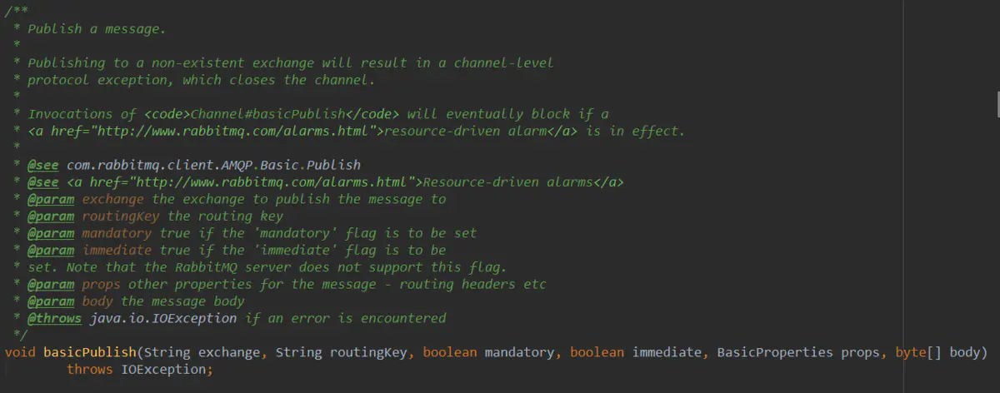

# RabbitMQ

RabbitMQ所使用的协议是AMQP 0-9-1版本，AMQP（高级消息队列协议）是一个网络协议，它支持符合要求的客户端应用（application）和消息中间件代理（messaging middleware broker）之间进行通信。

## AMQP模型简介

AMQP的工作流程如图所示：消息（message）被发布者（publisher）发送给交换机（exchange），交换机常常被比喻成邮局或者邮箱。然后交换机将收到的消息根据路由规则分发给绑定的队列（queue）。最后AMQP代理会将消息投递给订阅了此队列的消费者，或者消费者按照需求自行获取。


从安全角度考虑，网络是不可靠的，接收消息的应用也有可能在处理消息的时候失败。基于此原因，AMQP模块包含了一个**消息确认（message acknowledgements）**的概念：当一个消息从队列中投递给消费者后（consumer），消费者会通知一下消息代理（broker），这个可以是自动的也可以由处理消息的应用的开发者执行。当“消息确认”被启用的时候，消息代理不会完全将消息从队列中删除，直到它收到来自消费者的确认回执（acknowledgement）。

在生产端来看，当一个消息无法被成功路由时，消息或许被返回给生产者并被丢弃。或者消息代理执行了延期操作，消息会被放入死信队列中。

## RabbitMQ

RabbitMQ，是一个使用 erlang 编写的 AMQP (高级消息队列协议) 的服务实现。通常谈到队列服务，会有三个概念， 发消息者、队列 、收消息者，工作流程就是：生产者把消息放到队列中去, 然后消费者从队列中取出消息。而RabbitMQ 在这个基本概念之上，多做了一层抽象，在生产者和队列之间，加入了交换器(Exchange) 。这样生产者和队列就没有直接联系, 转而变成发生产者把消息给交换器 , 交换器根据调度策略再把消息再给队列。当然，多一层抽象会增加复杂度，但是同时，功能上也更灵活。

RabbitMQ 的4+1的物种角色

| 角色      | 描述                                                         |
| --------- | ------------------------------------------------------------ |
| Producing | 生产者，产生消息的角色                                       |
| Consuming | 消费者，把消息从队中取出的角色                               |
| Exchange  | 交换器，在得到生产者的消息后，把消息扔到队列中的角色         |
| Queue     | 队列，消息暂存的地方                                         |
| Message   | 消息，RabbitMQ 中消息有自己的一系列属性，某些属性对信息流有直接影响 |

**信道**

RabbitMQ中还引入了**Channel——信道**的概念，多路复用连接中的一条独立的双向数据流通道。**信道是建立在真实的TCP连接内地虚拟连接，AMQP 命令都是通过信道发出去的，不管是发布消息、订阅队列还是接收消息，这些动作都是通过信道完成**。因为对于操作系统来说建立和销毁 TCP 都是非常昂贵的开销，所以引入了信道的概念，以复用一条 TCP 连接。

常用机制

| 角色     | 描述                                                         |
| -------- | ------------------------------------------------------------ |
| 持久化   | 服务重启时，是否能回复队列中的数据                           |
| 调度策略 | 交换器如何把消息给到哪些队列，是每一个队列给一条，或者把一个消息给到多条队列 |
| 分配策略 | 队列面对消费者时，如何把消息吐出去，来一个消费者就把消息全部给它，还是只给一条 |
| 状态反馈 | 当消息从某一个队列中被提出后，这个消息的生命周期就此结束，还是说需要一个具体的信号已明确标识消息已被正确处理 |

### 1. 消息路由机制

AMQP 中消息路由过程与 Java 常用的 JMS 存在一些差异，AMQP 中增加了 Exchange 与 Binding 的角色，队列通过路由键（routing key，某种确定的规则）绑定到交换器，生产者将消息发布到交换器，交换器根据绑定的路由键将消息路由到指定队列，然后订阅这个队列的消费者接收。


### 2. Exchange 类型

Exchange分发消息时根据类型的不同分发策略有区别，目前共四种类型：`direct`、`fanout`、`topic`、headers 。其中headers 交换器和 direct 交换器完全一致，但性能差很多，目前几乎用不到了，所以直接看另外三种类型：

* Direct

  

  消息中的路由键（`Routing Key`）如果和 `Binding` 中的 `Binding Key` 一致， 交换器就将消息发到对应的队列中。路由键与队列名完全匹配，它是**完全匹配、单播**的模式。

* Fanout

  

  每个发到 Fanout 类型交换器的消息都会分到所有绑定的队列上去。Fanout 交换器不处理路由键，只是简单的将队列绑定到交换器上，每个发送到交换器的消息都会被转发到与该交换器绑定的所有队列上。**很像子网广播，每台子网内的主机都获得了一份复制的消息。**Fanout 类型转发消息是最快的。

* Topic

  

  Topic交换器通过模式匹配分配消息的路由键属性，将路由键和某个模式进行匹配，此时队列需要绑定到一个模式上。它将路由键和绑定键的字符串切分成单词，这些单词之间用点隔开。它同样也会识别两个通配符：符号“`#`”和符号“`*`”。`#`匹配0个或多个单词，`*`匹只是一个单词。

  在日志文件归档上有比较好的应用，比如设置路由键的规则为 **服务器+“.”+日志级别+“.”+应用模块名**，如：`A.info.shop`。

  - 如要关注A服务器发送的所有应用错误的消息，可声明队列名称为“a-app-error-queue”并绑定到交换器上：
     `channel. queueBind (‘a-app-error-queue’,’logs-change’,’A.error.*’)`
  - 关注B服务器发送的的所有日志，声明队列名称为“b-all-queue”并绑定到交换器上：
     `channel. queueBind (b-all-queue’,’logs-change’,’ B.#’)`或
     `channel. queueBind (b-all-queue’,’logs-change’,’ B.*.*’)`

### 3. 消息发布时的选择

消息在发布时需要在性能和安全级别上进行权衡，一般来说，安全级别越高即消息传递的可靠性越高，但也需要消耗更多的性能。持久化的消息机制安全性越高，而无任何确认机制的消息传递性能上也最卓越。按照可靠性级别由低到高进行划分：

**(1)、失败确认**，在发送消息时设置`mandatory`标志，如果消息不可路由，应该将消息返回给发送者，并通知失败（等同于开启了故障检测模式，只会让RabbitMQ向你通知失败，而不会通知成功）。如果消息正确路由到队列，则发布者不会受到任何通知。这种模式的问题也是显而易见的，无法确保发布消息一定是成功的，在网络故障的情况下，通知失败的消息可能会丢失。

```java
channel.basicPublish(EXCHANGE_NAME, severity,true, null, message.getBytes());
```

可以打开RabbitMQ客户端的发布方法`basicPublish()`查看源码参数



**(2)、发送方确认模式**，生产者将`channel`设置成`confirm`模式，开启之后，`channel`上面发布的消息都将会被指派一个唯一的ID(从1开始)，并对该ID消息的确认。broker回传给生产者的确认消息中`deliver-tag`域包含了确认消息的序列号，此外broker也可以设置basic.ack的multiple域，表示到这个序列号之前的所有消息都已经得到了处理。

- 不可路由的消息，broker会进行确认操作，表示收到了消息，且如果发送方设置了mandatory模式，则会先调用`addReturnListener`监听器。
- 可路由的消息，要等到消息被投递到所有匹配的队列之后，broker会发送一个确认给生产者(包含消息ID)；如果开启了持久化机制，那么确认消息会在将消息写入磁盘之后发出，broker回传给生产者的确认消息中`delivery-tag`域包含了确认消息的序列号。

`confirm`模式是异步运行的，消息发送不依赖返回确认，生产者收到ACK确认之后，可以在回调方法来做相应的处理；如果RabbitMQ因为自身内部错误导致消息丢失，就会发送一条NACK消息，生产者应用程序同样可以在回调方法中处理该Nack消息决定下一步的处理。

在Java的生产者客户端所需要做的事情可以分为以下：

1. 启用发送者确认模式

   ```java
   channel.confirmSelect();
   ```

2. 消息发送后等待 ack 确认

   ```java
   channel.basicPublish(EXCHANGE_NAME, ROUTE_KEY, true,null, message.getBytes());
   if(channel.waitForConfirms()){
          log.info("send success");
          //...success业务处理...
   }else{
          log.info("send failure");
          //...failure业务处理...
   }
   ```

   **异步ACK**：上述写法是同步操作的代码写法，RabbitMQ还支持异步方法来处理返回结果，省略迪掉 `channel.basicPublish()` 代码后面的 ack 业务，添加一个监听器即可以实现异步化处理：

   ```java
   channel.addConfirmListener(new ConfirmListener() {
               public void handleAck(long deliveryTag, boolean multiple) 
                      throws IOException {
                    log.info("send success");
                    //...success业务处理...
               }
   
               public void handleNack(long deliveryTag, boolean multiple)
                       throws IOException {
                    log.info("send failure");
                    //...failure业务处理...
               }
           });
   ```

3. 事务模式

4. AMQP事务机制在RabbitMQ也已经实现，RabbitMQ中与事务机制有关的方法有三个：`txSelect()`, `txCommit()`以及`txRollback()`，

   - `txSelect()`用于将当前channel设置成transaction模式
   - `txCommit()`用于提交事务
   - `txRollback()`用于回滚事务

   使用的时候，可通过txSelect开启事务之后，我们便可以发布消息给broker代理服务器了，如果txCommit提交成功了，则消息一定到达了broker了，如果在txCommit执行之前broker异常崩溃或者由于其他原因抛出异常，这个时候我们便可以捕获异常通过txRollback回滚事务了。

   ```java
   //当前channel设置成transaction模式
   channel.txSelect();
   try {
        channel.basicPublish(EXCHANGE_NAME, severity, true,null, message.getBytes());
   }
   //事务提交
   channel.txCommit();
   } catch (IOException e) {
      e.printStackTrace();
      //出错进行回滚
      channel.txRollback();
   } catch (InterruptedException e) {
      e.printStackTrace();
   }
   ```

   上述代码中实际完成了五个步骤：

   - 客户端发送给服务器`Tx.Select`(开启事务模式)
   - 服务器端返回`Tx.Select-Ok`（开启事务模式ok）
   - 推送消息
   - 客户端发送给事务提交`Tx.Commit`
   - 服务器端返回`Tx.Commit-Ok`

   以上就完成了事务的交互流程，任意环节出现问题，就会抛出`IoException`异常，用户就可以拦截异常进行事务回滚，或决定要不要重复消息。但是请注意，开启事务对性能的牺牲非常大，在对消息的可靠性要求不是那么高的情况下并不需要开启事务机制，用ACK模式就能很好的达成消息可靠的保证。最后，**事务和ACK只能二选一，已经在transaction事务模式的channel是不能再设置成confirm模式的，即这两种模式是不能共存的。**

### 4. 持久化机制

为了保证 RabbitMQ 在退出或者 crash 等情况下数据没有丢失，需要将 queue，exchange 和 message 都持久化

* queue的持久化是通过durable=true来实现的。`channel.queueDeclare("queue.persistent.name", true, false, false, null);`

* 消息持久化：队列是可以被持久化，但是里面的消息是否为持久化那还要看消息的持久化设置。也就是说，重启之前那个queue里面还没有发出去的消息的话，重启之后那队列里面是不是还存在原来的消息，这个就要取决于发生着在发送消息时对消息的设置了持久化。

  ```java
  channel.basicPublish("exchange.persistent", "persistent", 
    MessageProperties.PERSISTENT_TEXT_PLAIN, "persistent_test_message".getBytes());
  ```

* exchange的持久化，经过前面队列和消息的持久化，如果不设置exchange的持久化对消息的可靠性来说没有什么影响，但是同样如果exchange不设置持久化，那么当broker服务重启之后，exchange将不复存在，那么既而发送方rabbitmq producer就无法正常发送消息。也建议同样设置exchange的持久化。

### 5.消息接收时的选择

#### （1）消费方式的选择

* **Pull模式：**首先是client端发送Get请求，然后broker响应请求回传消息，最后client端发送Ack. 可以看到有别于push模式，broker端不会在client端没有请求的情况下来回传消息。**Pull属于一种轮询模型，发送一次Get请求，获得一个消息**。如果此时RabbitMQ中没有消息，会获得一个表示空的回复。对我们实现者来说，要在一个循环里，不断去服务器get消息。总的来说，这种方式性能比较差！**
* **Push模式**：属于一种推送模型。注册一个消费者后，RabbitMQ会在消息可用时，自动将消息进行推送给消费者。

#### （2）应答方式的选择

RabbitMQ允许消费者消费一条消息的时间可以很长，**消费者收到的每一条消息都必须进行确认**，而不会因为其消费超时而判断为未确认，**它判断此消息是否需要重新投递给消费者的唯一依据是消费该消息的消费者连接是否已经断开**。

* **自动确认**
   指定`autoAck`参数，当`autoAck=true`时，一旦消费者接收到了消息，就视为自动确认了消息。如果消费者在处理消息的过程中，中间出错就无法重新处理该消息，所以需要经常性的在代码里进行手动确认。
* **手动确认**
  需设置`autoAck=false`，此时RabbitMQ会等待消费者显式发回ACK信号后才从内存(或磁盘)中移去消息，消费者就有足够的时间处理消息(任务)，不用担心处理消息过程中消费者进程挂掉后消息丢失的问题，因为RabbitMQ会一直持有消息直到消费者显式调用basicAck为止。(消息此处会有两份，投递出去的和broke自留的，如果投递未收到Ack且连接断开，broker将会把消息投递给下一个消费者)
   一般使用手动确认会将消息的处理放在`try/catch`语句块中，成功处理了，就给MQ一个确认应答，如果处理异常了，就在catch中，进行消息的拒绝。

`com.rabbitmq.client.Channel`包中手动确认开启方法的源码：

```java
    /**
     * Start a non-nolocal, non-exclusive consumer, with
     * a server-generated consumerTag.
     * @param queue the name of the queue
     * @param autoAck true if the server should consider messages
     * acknowledged once delivered; false if the server should expect
     * explicit acknowledgements
     * @param callback an interface to the consumer object
     * @return the consumerTag generated by the server
     * @throws java.io.IOException if an error is encountered
     */
    String basicConsume(String queue, boolean autoAck, Consumer callback) throws IOException;
```

* **Qos预取模式**
   在实际使用过程中，由于消费者自身处理能力有限，从Rabbitmq获取一定数量的消息后，希望Rabbitmq不再将队列中的消息推送过来，当对消息处理完后（即对消息进行了Ack，并且有能力处理更多的消息）再接收来自队列的消息。在这种场景下，我们可以通过设置 `basic.qos`信令中的`prefetch_count`来达到这种效果。这种机制**一方面可以实现限速（将消息暂存到RabbitMQ内存中）的作用，一方面可以保证消息确认质量（比如确认了但是处理有异常的情况）**。

> 综合上述来看，在消费者端事务+Pull模式的选择可靠性最高，但是性能最低；
>
> 反之，Qos预取模式下性能最高但是牺牲了一定的可靠性，且Qos的`prefetch_count=2500`下的可达到一个性能最优的效果。
>
> 在兼顾性能和可靠性方面，生产者可以采用Ack确认机制而消费者采用Qos预取模式。

### 消息拒绝

消息正常处理了可以通过Ack反馈MQ，但如果消息本身或者消息的处理过程出现问题怎么办？需要一种机制，通知RabbitMQ消息让别的消费者进行处理。这里就有两种机制，`Reject`和`Nack`。

- Reject，一次只能拒绝一条消息。在拒绝消息时，可以使用`requeue`标识，告诉RabbitMQ需要重新发送给别的消费者，否则这个消息就会被RabbitMQ丢弃。
- Nack则可以一次性拒绝多个消息。

### 死信队列

DLX，Dead-Letter-Exchange。利用DLX， 当消息在一个队列中变成死信（dead message）之后，它能被重新publish到另一个Exchange，这个Exchange就是DLX。消息变成死信一向有一下几种情况：

- 消息被拒绝（basic.reject/ basic.nack）并且requeue=false
- 消息TTL过期（参考：[RabbitMQ之TTL（Time-To-Live 过期时间）](http://blog.csdn.net/u013256816/article/details/54916011)）
- 队列达到最大长度

DLX也是一个正常的交换器，和一般的交换器没有区别，它能在任何的队列上被指定，实际上就是设置某个队列的属性，当这个队列中有死信时，RabbitMQ就会自动的将这个消息重新发布到设置的交换器上去，进而被路由到另一个队列，可以监听这个队列中消息做相应的处理，这个特性可以弥补RabbitMQ 3.0以前支持的immediate参数——[【RabbitMQ之死信队列】](https://blog.csdn.net/u013256816/article/details/54933065)。注意DLX与备用交换器的区别，备用交换器是主交换器无法路由消息，那么消息将被路由到这个新的备用交换器，而死信交换器则是接收过期或者被拒绝的消息。

## RabbitMQ集群高可用之——镜像队列

如果RabbitMQ集群只有一个broker节点，那么该节点的失效将导致整个服务临时性的不可用，并且可能会导致message的丢失。如果RabbitMQ集群是由多个broker节点构成的，那么从服务的整体可用性上来讲，该集群对于单点失效是有弹性的，但是同时也需要注意：尽管exchange和binding能够在单点失效问题上幸免于难，但是queue和其上持有的message却不行，这是因为queue及其内容仅仅存储于单个节点之上，所以一个节点的失效表现为其对应的queue不可用。

这里就可以引入RabbitMQ的**镜像队列机制**，将queue镜像到cluster中其他的节点之上。如果集群中的一个节点失效了，queue能自动地切换到镜像中的另一个节点以保证服务的可用性。通常的做法是：**针对每一个镜像队列都包含一个master和多个slave，分别对应于不同的节点。slave会准确地按照master执行命令的顺序进行命令执行，故slave与master上维护的状态应该是相同的。除了publish外所有动作都只会向master发送，然后由master将命令执行的结果广播给slave们，故看似从镜像队列中的消费操作实际上是在master上执行的。**

一旦完成了选中的slave被提升为master的动作，发送到镜像队列的message将不会再丢失：publish到镜像队列的所有消息总是被直接publish到master和所有的slave之上。这样一旦master失效了，message仍然可以继续发送到其他slave上。RabbitMQ的镜像队列同时支持publisher confirm和事务两种机制。在事务机制中，只有当前事务在全部镜像queue中执行之后，客户端才会收到Tx.CommitOk的消息。同样的，在publisher confirm机制中，向publisher进行当前message确认的前提是该message被全部镜像所接受了。

##### 镜像队列的应用

有两种方式可以实现RabbitMQ的镜像队列：1、控制台，2、Admin管理后台，在[RabbitMQ之镜像队列](https://blog.csdn.net/u013256816/article/details/71097186)有较为详细的说明。镜像队列本身不能作为负载均衡使用，因为每个操作在所有节点都要做一遍。处理节点选择，故障服务器检测和负载分布可以使用HAProxy。

通常在系统负载较高时，已接受到的消息若不能很快被消费掉，这些消息就会进入到很深的队列中去，增加处理每个消息的平均开销。因为要花更多的时间和资源处理“积压”的消息，所以用于处理新来的消息的能力就会降低，使得后来的消息又被积压进入很深的队列，继续加大处理每个消息的平均开销，这样情况就会越来越恶化，使得系统的处理能力大大降低。根据官网资料，应对这一问题，有三个措施：

- 进行流量控制(限流)。
- 增加prefetch的值，即一次发送多个消息给接收者，加快消息被消费掉的速度。
- 采用multiple ack，降低处理ack带来的开销。