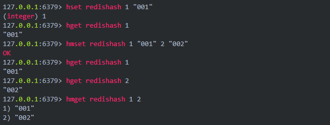
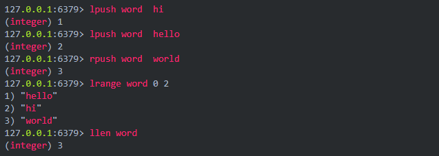
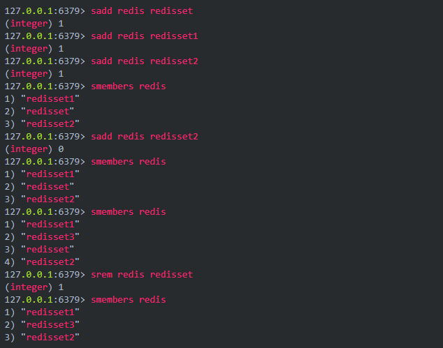
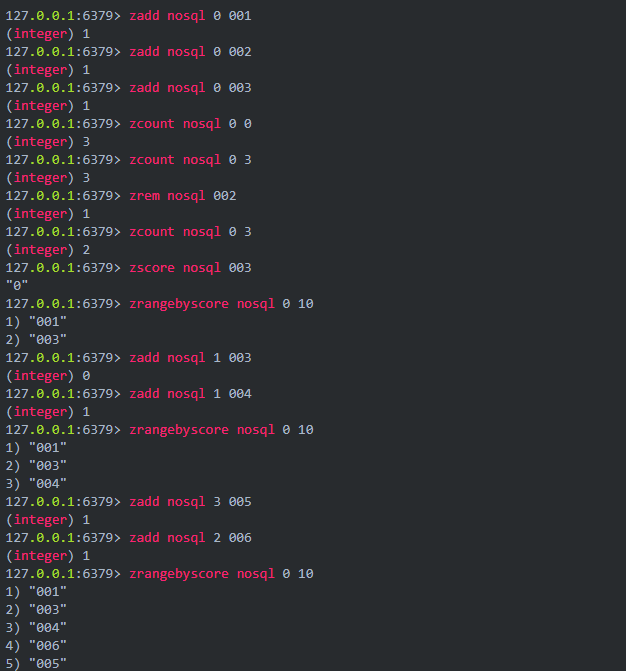
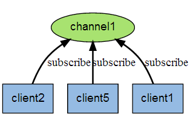
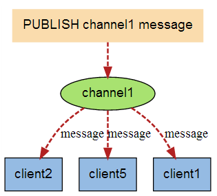

# Redis

## 什么是 Redis

Redis 是一种支持是一种支持 Key-Value 等**多种数据结构**的存储系统。

## 应用场景 

* **缓存**
* **消息的发布或订阅**（消息通知）
* **消息队列**，例如：支付，活动排行榜、计数等
* 商品列表、评论列表

## 支持的数据类型

* 字符串 String
* 哈希 Hash
* 列表 List
* 集合 Set
* 有序集合 ZSet

### 1. 字符串 String <key, value>

Redis 最基本的数据类型，一个键对应一个值，需要注意的是**一个键值最大存储512MB**


### 2. 哈希 Hash <key, field, value>

Redis Hash 是一个键值对的集合，是一个 String 类型的 field 和 value 的映射表，适合存储对象



### 3. 列表 List <key, value>

Redis 的简单的字符串列表，部分功能类似于队列，按照插入的顺序排序



### 4. 集合 Set <key, value>

Redis 中字符串类型的**无序集合**，**不可重复**。



### 5. 有序集合 ZSet <key, value>

Redis 中 String 类型的有序集合，不可重复。

有序集合中的每个元素都需要制定一个分数（**权值**），根据分数对元素进行升序排序，如果多个元素有相同的分数，则按照字典序进行升序排序，适合实现排名的场景。



## Redis 服务相关的命令

```shell
select # 选择数据库(数据库编号0-15)
info # Redis 的信息
config get # 获取数据库的配置
flushdb # 删除当前数据库的所有 key
flushall # 删除当前 Redis 下所有数据库的 key
```

**[常用命令](http://www.cnblogs.com/themost/p/8464490.html)**

## Redis 的发布与订阅

Redis 的发布与订阅（发布/订阅）是它的一种消息通信模式，一方发送消息，一方接收消息。如下图所示：



如果有新的消息发送给频道1时，就会将消息发送给订阅它的三个客户端：



### Redis 订阅与发布的 5 个命令：

| 命令         | 用例与描述                                                   |
| ------------ | ------------------------------------------------------------ |
| SUBSCRIBE    | subscribe channel [channel ...] —— 订阅给定的一个或者多个频道 |
| UBSUBSCRIBE  | unsubscribe channel [channel ...] —— 退订一个或多个频道      |
| PUBLISH      | publish channel  message —— 向给定频道发送消息               |
| PSUBSCRIBE   | psubscribe pattern [pattern...]  —— 订阅给定模式匹配的所有频道 |
| PUNSUBSCRIBE | punsubscribe pattern [pattern ...] —— 退订一个或多个给定模式的频道，如果执行时没有给定任何模式，则退订所有模式 |

## Redis 的持久化

Redis 持久化的有两种方式：

* 快照（RDB）：

  可以将存在于某一时刻的所有数据都写入硬盘中。

  默认存放于 dump.rdb

* 仅附加文件（AOF）

  在执行**写命令**时，将被执行写命令复制到硬盘里。

这两种持久化方式既可以单独使用，也可以同时使用。

**实际操作**

* RDB 方式：（**配置文件中默认开启**）

  * 客户端向 Redis 发送 **`BGSAVE`** 命令，创建快照。

    Redis 会调用 **`FORK`** 创建一个子进程，然后子进程负责将快照写入硬盘，而父进程则继续处理命令请求

  * 客户端还可以向 Redis 发送 **`SAVE`** 命令，**若 Redis 接收到 SAVE 命令，那么 Redis 服务器在快照创建完毕之前将不再响应任何其他命令**，**`SAVE`**命令并不常用，只有在没有足够内存去执行 BGSAVE 命令的情况下，或者在无所谓等待时间的情况下使用。

    ```shell
    save 60 1000
    ```

    设置Redis从最近一次创建快照之后算起，每当**60 秒内有1000 写入**，这个条件满足时，Redis 会自动触发快照的 BGSAVE 命令，若用户设置了多个 save 配置，则只要满族任意一个配置，就会触发 BGSAVE 命令。

  * Redis 通过 **`SHUTDOWN`**命令接收到关闭服务器命令时，或者接收到 **`TERM`**信号时，会执行一个 SAVE 命令，阻塞所有客户端，不再执行客户端发送的任何命令，在SAVE 命令结束后关闭服务器。

  * 在 Redis 集群配置的情况下，某一服务器向其他服务器发送的 **`SYNC`** 命令时，如果主服务器目前没有执行 **`BGSAVE`** 操作，或者主服务器并非刚刚执行完 **`BGSAVE`** 操作，那么主服务器就会执行 **`BGSAVE`**  命令。 

* AOF 方式：