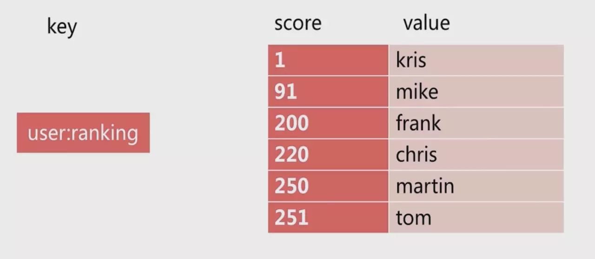
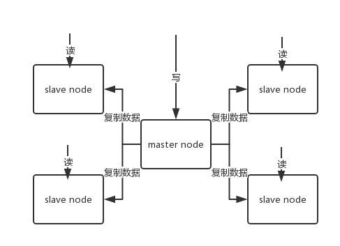
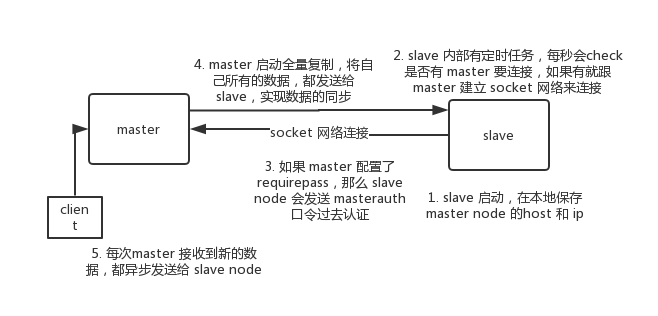

# Redis

## 什么是 Redis

Redis 是一种支持是一种支持 Key-Value 等**多种数据结构**的存储系统。

## 使用 Redis 的原因

解决两个问题： **高性能、高并发**。

## 使用缓存带来的问题：

* 缓存与数据库双写不一致
* 缓存雪崩、缓存穿透
* 缓存并发竞争

下文详细解释。

## 应用场景 

* **缓存**
* **消息的发布或订阅**（消息通知）
* **消息队列**，例如：支付，活动排行榜、计数等
* 商品列表、评论列表

## 支持的数据类型

* 字符串 String
* 哈希 Hash
* 列表 List
* 集合 Set
* 有序集合 ZSet

### 1. 字符串 String <key, value>

Redis 最基本的数据类型，一个键对应一个值，需要注意的是**一个键值最大存储512MB**


### 2. 哈希 Hash <key, field, value>

Redis Hash 是一个键值对的集合，是一个 String 类型的 field 和 value 的映射表，适合存储对象


### 3. 列表 List <key, value>

Redis 的简单的字符串列表，部分功能类似于双向链表，按照插入的顺序排序

可存储一些列表性的数据结构，例如：粉丝列表、文章的评论列表等

还可以做一个简单的消息队列，从 List 的头放入消息，List 的尾巴消费。

```shell
lpush mylist 1
lpush mylist 2
lpush mylist 3 4 5

# 1
rpop mylist
```

基本操作：


### 4. 集合 Set <key, value>


Redis 中字符串类型的**无序集合**，**不可重复**。

* 可以使用 Set 做去重，在分布式情况下，可以使用 Redis 进行全局的 Set 去重。

* 还可以基于 Set 做交集、并集、查集的操作。例如找出两人的共同好友：

  ```
  #-------操作一个set-------
  # 添加元素
  sadd mySet 1
  
  # 查看全部元素
  smembers mySet
  
  # 判断是否包含某个值
  sismember mySet 3
  
  # 删除某个/些元素
  srem mySet 1
  srem mySet 2 4
  
  # 查看元素个数
  scard mySet
  
  # 随机删除一个元素
  spop mySet
  
  #-------操作多个set-------
  # 将一个set的元素移动到另外一个set
  smove yourSet mySet 2
  
  # 求两set的交集
  sinter yourSet mySet
  
  # 求两set的并集
  sunion yourSet mySet
  
  # 求在yourSet中而不在mySet中的元素
  sdiff yourSet mySet
  ```


* 基本操作：


### 5. 有序集合 ZSet <key, value>



Redis 中 String 类型的有序集合，不可重复。

有序集合中的每个元素都需要制定一个分数（**权值**），根据分数对元素进行**升序排序**（**默认是升序，所以需要 rev 改为降序`zrevrange `**），如果多个元素有相同的分数，则按照字典序进行升序排序，适合实现排名的场景。

```shell
zadd board 85 zhangsan
zadd board 72 lisi
zadd board 96 wangwu
zadd board 63 zhaoliu

# 获取排名前三的用户（默认是升序，所以需要 rev 改为降序）
zrevrange board 0 3

# 获取某用户的排名
zrank board zhaoliu
# 获取某用户的排名
zrank board zhaoliu
```


* 基本操作：


## Redis 服务相关的命令

```shell
select # 选择数据库(数据库编号0-15)
info # Redis 的信息
config get # 获取数据库的配置
flushdb # 删除当前数据库的所有 key
flushall # 删除当前 Redis 下所有数据库的 key
```

**[常用命令](http://www.cnblogs.com/themost/p/8464490.html)**

## Redis 的发布与订阅

Redis 的发布与订阅（发布/订阅）是它的一种消息通信模式，一方发送消息，一方接收消息。如下图所示：


如果有新的消息发送给频道1时，就会将消息发送给订阅它的三个客户端：


### Redis 订阅与发布的 5 个命令：

| 命令         | 用例与描述                                                   |
| ------------ | ------------------------------------------------------------ |
| SUBSCRIBE    | subscribe channel [channel ...] —— 订阅给定的一个或者多个频道 |
| UBSUBSCRIBE  | unsubscribe channel [channel ...] —— 退订一个或多个频道      |
| PUBLISH      | publish channel  message —— 向给定频道发送消息               |
| PSUBSCRIBE   | psubscribe pattern [pattern...]  —— 订阅给定模式匹配的所有频道 |
| PUNSUBSCRIBE | punsubscribe pattern [pattern ...] —— 退订一个或多个给定模式的频道，如果执行时没有给定任何模式，则退订所有模式 |

## Redis 的持久化

Redis 持久化的有两种方式：

* 快照（RDB）：

  可以将存在于某一时刻的所有数据都写入硬盘中。

  默认存放于 dump.rdb

* 仅附加文件（AOF）

  在执行**写命令**时，将被执行写命令复制到硬盘里。

这两种持久化方式既可以单独使用，也可以同时使用。

**实际操作**

* RDB 方式：（**配置文件中默认开启**）

  * 客户端向 Redis 发送 **`BGSAVE`** 命令，创建快照。

    Redis 会调用 **`FORK`** 创建一个子进程，然后子进程负责将快照写入硬盘，而父进程则继续处理命令请求

  * 客户端还可以向 Redis 发送 **`SAVE`** 命令，**若 Redis 接收到 SAVE 命令，那么 Redis 服务器在快照创建完毕之前将不再响应任何其他命令**，**`SAVE`**命令并不常用，只有在没有足够内存去执行 BGSAVE 命令的情况下，或者在无所谓等待时间的情况下使用。

    ```shell
    save 60 1000
    ```

    设置Redis从最近一次创建快照之后算起，每当**60 秒内有1000 个写入命令**，这个条件满足时，Redis 会自动触发快照的 BGSAVE 命令，若用户设置了多个 save 配置，则只要满族任意一个配置，就会触发 BGSAVE 命令。

  * Redis 通过 **`SHUTDOWN`**命令接收到关闭服务器命令时，或者接收到 **`TERM`**信号时，会执行一个 SAVE 命令，阻塞所有客户端，不再执行客户端发送的任何命令，在SAVE 命令结束后关闭服务器。

  * 在 Redis 集群配置的情况下，某一服务器向其他服务器发送的 **`SYNC`** 命令时，如果主服务器目前没有执行 **`BGSAVE`** 操作，或者主服务器并非刚刚执行完 **`BGSAVE`** 操作，那么主服务器就会执行 **`BGSAVE`**  命令。 

* AOF 方式：

  需要在配置文件中打开配置：

  ```shell
  appendonly yes
  ```

  并且可以设置 AOF 的同步频率进行设置

  | 选项     | 同步频率                                                     |
  | -------- | ------------------------------------------------------------ |
  | always   | 每个 Redis 写命令都要写入硬盘，这样会严重降低 Redis 的速度。 |
  | everysec | 每秒执行一次同步，显式地将多个写命令同步到硬盘**<兼顾数据安全和写入性能>** |
  | no       | 让操作系统来决定何时进行同步                                 |


## Redis 与 Memcached 的比较

|              | Memcached                                          | Redis                                                        |
| ------------ | -------------------------------------------------- | ------------------------------------------------------------ |
| 线程         | 多线程                                             | 单线程                                                       |
| 性能         | 在 100K 以上的数据中，Memcached 的性能要高于 Redis | Redis 为单线程工作模式，只能使用单核，而 Memcached 支持多线程，可以使用多核。 |
| 数据结构     | key-value 结构                                     | String、Hash、List、Set、ZSet                                |
| 内存使用效率 | key-value 存储效率上，Memcached 高                 | Hash 结构存储时，Redis 效率高                                |
| 数据备份恢复 | 服务宕机后，数据不可恢复                           | 1. 服务宕机后，可通过 AOF 的方式恢复；2. 支持数据备份，即 Master-Slave 主从模式数据备份 |
| 数据存储     | 内存，不可持久化，不可超过内存大小                 | 内存，可通过 RDB/AOF 的方式持久化                            |
| 集群         | 本身不支持集群，依赖客户端集群                     | 支持集群                                                     |

### 一、性能

	Redis 为单线程工作模式，只能使用单核，而 Memcached 支持多线程，可以使用多核。
	
	Redis 平均在每一个核存储小数据时比 Memcached 性能高；
	
	在 100K 以上的数据中，Memcached 的性能要高于 Redis。

### 二、数据结构

	Memcached 只支持简单的 key-value 结构的数据，
	
	Redis 支持 String、Hash、List、Set、ZSet 结构。 **Redis 内部使用一个 redisObject 对象来表示所有的 key 和 value**

### 三、内存使用效率

	key-value 时，Memcached 更胜一筹，
	
	    Redis 使用 Hash 结构时，则 Redis 效率更高

### 四、Redis 支持服务端的操作

	Redis 相比 Memcached，拥有更多的数据结构，并支持丰富的数据操作。
	
	在 Memcached 中，需要将数据拿到客户端进行类似修改再 Set 回去，**序列化再反序列化**，这样大大增加了网络 IO 的次数和数据体积。

### 五、数据备份和恢复

	Memcached 挂掉后，数据不可恢复；
	
	Redis 数据丢失后，可以通过 AOF 的方式恢复，并且 Redis 支持数据的备份 —— Master-Slave 主从模式的数据备份。

### 六、数据存储

	Redis 与 Memcached 都是将数据存储放在内存中。

 * Memcached 还可以用于缓存图片、视频等；挂掉后数据丢失，数据不能超过内存大小

 * Redis 有部分存放在硬盘上，这样能够保证数据的持久性，**Memcached 不支持化**；

   当系统物理内存用完时：

   * Redis 可以将很久没用到的value 交换到硬盘上；
   * Memcached 会抹掉前面的数据。

### 七、内存管理机制

	传统C语言的 **malloc/free 函数**是最常用的分配和释放内存的方法，但是这种方法存在很大缺陷：

* **首先，对于开发人员来说不匹配的 malloc和free 容易造成内存的泄露；**

* **其次，频繁的调用会造成大量的内存的碎片无法重新利用，降低内存利用；**

* **最后最为系统调用，其系统开销远远大于一般函数调用**

  所以，为了提高内存的管理效率，高效的内存管理方案都不会直接使用 malloc/free 调用

#### Memcached 默认使用 **Slab Allocation** 机制管理内存

	主要思想是 **按照预先规定的大小，将分配内存分割成特定长度的块一存储响应长度的 key-value 数据机构，以完全解决内存碎片问题**。


	如图所示，这种机制首先会**从操作系统申请一大块区域，并将其分割成各种尺寸的块 Chunk，并把尺寸相同的块分成组 Slab Class**。**Chunk 就是用来存储 key-value数据的最小单位**。
	
	当Memcached 接收到客户端发送过来的数据首先会根据收到数据的大小，选择一个最合适的 Slab Class，然后通过查询 Memcached 保存着的该 Slab Class 内空闲 Chunk 的列表就可以找到一个以用于存储数据的 Chunk。当一条数据过期或丢弃时，该记录所占用的 Chunk 就可以回收，重新添加到空闲列表中。
	
	这种方式的效率高，不会造成内存碎片，但是最大的缺点就是**会导致空间浪费，因为每个Chunk 都分配了特定长度的内存空间，所以边长数据无法充分利用这些空间。**

#### Redis 采用的是包装的malloc/free

	Redis 通过源码中的 zmalloc.h 和 zmalloc.c 两个文件实现，Redis 为了方便内存的管理，在分配一块内存后，会将这块内存的大小存入内存块的头部。


	如图所示，real_ptr 是 Redis 调用 malloc 后返回的指针，redis 将内存块的大小 size 存入头部，size 所占据的内存大小是一直的，为 size_t 类型的长度，然后返回 ret_ptr。当需要释放内存的时候，ret_ptr 被传给内存管理程序。 通过 ret_ptr，程序可以很容易算出 real_ptr 的值，然后将 real_ptr 传给 free 释放内存。

## 为什么 Redis 单线程模型也能保持高效率？

* 纯内存操作；
* 核心是基于非阻塞的 IO 多路复用机制；
* 单线程反而避免了多线程的频繁上下文切换问题。

## Redis 的线程模型

	Redis 内部使用文件事件处理器 `file event handler`，这个文件事件处理器是单线程的，所以 Redis 才叫做单线程的模型，它采用 **IO 多路复用机制** 同时监听多个 socket，根据 socket 上的事件来选择对应的事件处理器进行处理。
	
	文件事件处理器包含 4 个部分：

* 多个 socket

* IO 多路复用程序

* 文件事件分派器

* 事件处理器（连接应答处理器、命令请求处理器、命令回复处理器）

  	多个 socket 可能会并发不同的操作，每个操作对应不同的文件事件，但是 IO 多路复用程序会监听多个 socket，会将 socket 产生的事件放入队列中排队，事件分派器每次从队列中取出一个事件，把该事件交给对应的事件处理器处理。

  	客户端与 Redis 的一次通信过程：

  

  	客户端 socket01 向 Redis 的 sever socket 请求建立连接，此时 server socket 会产生一个 `AE_READABLE` 事件，IO多路复用程序监听到 sever socket 产生的事件后，将该事件压入队列中。文件事件分派器从队列中获取该事件，交给**连接应答处理器**。连接应答处理器会创建一个能与客户端通信的 socket01，并将该 socket01 的 `AE_READABLE` 事件与命令处理器关联。

  	假设此时客户端发送了一个 `set key value` 请求，此时Redis 中的 socket01 会产生`AE_READABLE` 事件，IO 多路复用程序将事件压入队列，此时事件分派器从队列中获取到该事件，由于前面 socket01 的 `AE_READABLE` 事件已经与命令请求处理器关联，因此事件分派器将事件交给命令请求处理器来处理。命令请求处理器获取 socket01 的 `key value` 并在自己内存中完成 `key value` 的设置。操作完成后，它会将 socket01 的 `AE_WRITABLE` 事件与命令回复处理器关联。

  	如果此时客户端准备好接收返回结果了，那么 Redis 中的 socket01 会产生一个 `AE_WRITABLE` 事件与命令回复处理器的关联。

## Redis 过期策略

**Redis 的过期策略是： 定期删除+惰性删除**

### 定期删除

	定期删除是指 Redis 默认是每隔 100ms 就随机抽取一些设置了过期时间的 key，检查是否过期，如果过期就删除。

	特殊情况：若一次性向 Redis 存储 10w 个key，都设置了过期时间，每隔几百毫秒，这样需要检查10w个key，性能消耗巨大，可能导致服务宕机。

	**注意：**这里不是每隔100ms 就遍历所有设置过期时间的 key，实际上***Redis每隔 100ms 随机抽取一些 key 来检查和删除的。***

	定期删除可能会导致很多过期的 key 到了时间并没有被删除掉，此时就需要依赖惰性删除了。

### 惰性删除

	在获取某个 key 时，redis 会检查一下，这个 key 如果设置了过期时间，判断是否过期，如果过期则会删除，不会返回任何东西。

> 获取可以 key 的时候，如果此时 key 已经过期，则删除 key， 不会返回任何东西。

	即使是 定期删除+惰性删除，也会有漏洞，假设此时定期删除漏掉了很多过期的 key，调用者在获取也没有检查，也没走惰性删除，此时如果有大量 key 堆积在内存，也有可能会使 Redis 内存块耗尽。所以此时需要 Redis 使用 **内存淘汰机制**

### 内存淘汰机制

	Redis 内存淘汰机制分为以下几种：（假设此时当内存不足以容纳新写数据时）

| 方式            | 方式原理                                                     | 是否常用               |
| --------------- | ------------------------------------------------------------ | ---------------------- |
| noeviction      | 新的写入操作会报错                                           | 不建议使用             |
| **allkeys-lru** | 在**键空间**中，移除最近最少未使用的 key                     | **这种方式时最常用的** |
| allkeys-random  | 在**键空间**中，随机移除某个 key。                           | 不常用                 |
| volatile-lru    | 在**设置了过期时间的键空间**中，移除最近最少未使用的 key     | 不常用                 |
| volatile-random | 在**设置了过期时间的键空间**中，随机移除某个 key             | 不常用                 |
| volatile-ttl    | 在**设置了过期时间的键空间**中，有**更早过期时间** 的key 优先移除 | 不常用                 |

### 手写 LRU 算法

手写一个简单的 LRU 算法（利用已有JDK数据结构构建 Java 版的 LRU 算法）

```java
class LRUCache<K, V> entends LinkedHashMap<K, V> {
    private final int CACHE_SIZE;
    
    /**
     * 传递进来最多能缓存多少数据
     *
     * @param cacheSize 缓存大小
     */
    public LRUCache(int cacheSize) {
        // true 表示让 LinkedHashMap 按照访问顺序来进行排序，最近访问的放在头部，最老访问的放在尾部。
        super((int)Math.ceil(cacheSize / 0.75) + 1, 0.75f, true)
    	CACHE_SIZE = cacheSize;
    }
    
    @Override
    protected boolean removeEldestEntry(Map.Entry<K, V> eldest) {
        // 当 map 中的数据量大于指定的缓存个数时，就自动删除最老的数据。
        return size() > CACHE_SIZE
    }
}
```


## Redis 的高并发和高可用

* Redis 实现**高并发**主要依赖**主从架构**，一主多从，单个主服务器（master）用来写数据，多个从服务器（salve）用来查询数据。多个从实例可以提供**每秒 10w 的 QPS**。
* Redis **高可用**，如果是做主从架构，那么加上哨兵即可，就可以实现，任何一个实例宕机，可以进行主备切换。

## Redis 主从架构

单机的 Redis，可以承载 **上万~几万的 QPS**。

对于缓存来说，一般都是用来 **支撑*读高并发***的。所以此时可以设计成主从（master-slave）架构，一主多从，并且将数据复制到其他的 slave 节点，从节点负责读。所有的 **读请求全部走从节点**。这样也可以很轻松的实现水平扩容，**支撑读高并发**。



redis replication -> 主从架构 -> 读写分离 -> 水平扩容支撑读高并发。

### Redis replication(复制) 的核心机制

* Redis 采用一步方式复制数据到 slave 节点。

  **注意：**从 Redis 2.8 开始，slave node 会周期性地确认自己每次复制的数据量；

* 一个 master node 是可以配置多个 slave node 的；

* slave node 也可以连接其他的 slave node；

* slave node 做复制的时候，不会 block master node 的正产工作；

* slave node 在做复制的时候，也不会 block 对自己的查询操作，它会用旧的数据集来提供服务；但是复制完成的时候，需要删除旧的数据集，加载新的数据集，**此时会暂停对外服务**；

* slave node  主要用来进行横向扩容，做读写分离，扩容的 slave node 可以提高读的吞吐量。

**注意：**

* 如果采用了主从架构，**必须开启 master node 的持久化**，不建议用 slave node 作为 master node 的数据热备。因为存在一种情况，如果你关掉了 master 的持久化，可能在 master 宕机重启的时候，数据是空的，然后可能已经过复制，slave node 的数据也丢了。

* 对 master 需要做周全的备份方案。解决在本地所有文件丢了的情况下，可以从备份中挑选一份 rdb 去恢复 master，这样才能**确保Redis启动的时候，是有数据的**。**即使采用了高可用机制，slave node 可以自动接管 master node**，但是还是存在 slave node 还没检测到 master failure ，master node 就自动重启的情况，那么也有可能导致上面的 slave node 数据被清空。

### Redis 主从复制的核心原理

	当启动一个 slave node 的时候，它会发送一个 `PSYNC` 命令给 master node。

	如果 slave node 是初次连接到 master node，那么会触发一次 `full resynchronization` **全量复制**。此时 master node 会启动一个后台线程，开始生成一份 `RDB` 快照文件，同时还会**将从客户端 client 新收到的所有的写命令缓存在内存中**。`RDB` 文件生成完毕后，master 会将这个 `RDB` 发送给 slave，slave 会先**写入本地磁盘，然后再从本地磁盘加载到内存**中，接着 master 会将内存中缓存的写命令发送到 slave，slave 也会同步这些数据。slave node 如果跟 master node 有网络故障，断开了连接，连接之后 master node 仅会复制给 slave 部分缺少的数据。


#### 主从复制的端点续传

	从 Redis 2.8 开始，就支持主从复制的断点续传，如果主从复制过程中，网络连接断掉了，那么可以接着上次复制复制下去，而不是从头开始复制一份。

	master node 会在内存中维护一个 backlog，master 和 slave 都会保存一个 replica offset 还有一个 master run id，offset	就保存在 backlog 中的。如果 master 和 slave 网络连接断掉，slave 会让 master 从上次 replica offset 开始继续复制，如果又找到对应的 offset，那么就会执行一次 `resynchronization`。

> 如果根据 host+ip 定位 master node，是不靠谱，如果 master node 重启或者数据出现了变化，那么 slave node 应该根据不同的 run id 区分。

#### 无磁盘化复制

	master 在内存中直接创建 `RDB`，然后发送给 slave，不会再自己本地落地磁盘了。只需要在配置文件中开启 `repl-diskless-sync yes` 即可。

```shell
repl-diskless-sync yes

# 等待 5s 后再开始复制，因为要等更多 slave 重新链接过来
repl-diskless-sync-delay 5
```

#### 过期 key 处理

	slave 不会过期 key，只会等待 master 过期 key。如果 master 过期了一个 key，或者通过 LRU 淘汰了一个 key，那条 del 命令发送给 slave。

### 复制的完整流程

	slave node 启动时，会在自己本地保存 master node 的信息，包括 master node 的 `host` 和 `ip`，但是复制流程没开始。

	slave node 内部有个定时任务，每秒检查是否有新的 master node 要连接和复制，如果发现，就跟 master node 建立 socket 网络连接。然后 slave node 发送 `ping` 命令给 master node。如果 master 设置了 requirepass，那么 slave node 必须发送 masterauth 的口令进行认证。 master node **第一次执行全量复制**，将所有数据发送给 slave node。而在后续，master node 持续将写命令**异步复制**给 slave node。



#### 全量复制

* master 执行 `bgsave`，在本地生成一份 `RDB` 快照文件。
* master node6 将 `RDB` 快照文件发送给 slave node，如果 `RDB` 复制时间超过 60 秒（repl-timeout），那么 slave node 就会认为复制失败，可以适当调大这个参数（对于千兆网卡的机器，一般每秒传输 100MB，6G文件，很可能超过 60s）
* master node 再生成 `RDB` 时，会将所有新的写命令缓存在内存中，在 slave node 保存了 `RDB` 之后，再将新的写命令复制给 slave node。
* 如果复制期间，内存缓存区持续消耗超过 64MB，或者一次性超过 256MB，那么停止复制，复制失败。

```shell
client-output-buffer-limit slave 256MB 64MB 60
```

* slave node 接收到 `RDB` 之后，清空自己的旧数据，然后重新加载 `RDB` 到自己的内存中，同时**基于旧的数据版本**对外提供服务。
* 如果 slave node 开启了 `AOF`，那么会立即执行 `BGREWRITEAOF`，重写 AOF。

### 增量复制

* 如果全量复制过程中，master-slave 网络连接断掉了，那么 slave 重新连接 master 时，会触发增量复制。
* master 直接从自己的 backlog 中获取部分丢失的数据，发送给 slave node，默认 backlog 就是 1MB。
* master 就是根据 slave 发送的 psync 中的 offset 来从 backlog 中获取 数据的。

#### Heartbeat —— 心跳机制

* 主从节点互相都会发送 heartbeat 信息。
* master 默认**每隔 10 秒**发送一次 heartbeat，slave node **每隔 1 秒** 发送一个heartbeat。

#### 异步复制

	master 每次接收到写命令之后，先在内部写入数据，然后异步发送给 slave node。

## Redis 如何才能做到高可用

**高可用：**如果系统在**99.99%**的时间里都能够持续对外提供服务，那么可以说该系统是高可用的。

如果一个 slave 挂掉了，是不会影响可用性的，还有其他的 slave 在提供相同数据下的相同的对外查询服务。

但是如果 master node 挂掉了，此时没有解决方案的话，slave node 没有 master node 给它们复制数据，系统相当于不可用了。

**Redis 的高可用架构：** `failover` **故障转移**，也可以叫做主备切换。

主备切换：master node 在故障时，自动检测，并且将每个 slave node 自动切换为 master node 的过程，称之为主备切换。这个过程实现了 Redis 在主从架构下的高可用。

### Redis 哨兵集群实现高可用

#### 哨兵的介绍

sentinel，中文名为哨兵。哨兵是 Redis 集群机构中非常重要的一个组件，主要有以下功能：

* **集群监控**：负责监控 Redis master 和 slave 进程是否正常工作。
* **消息通知**：如果某个 Redis 实例有故障，那么哨兵负责发送消息作为报警通知给管理员。
* **故障转移**：如果 master node 挂掉了，会自动转移到 slave node 上。
* **配置中心**：如果故障转移发生了，通知 client 客户端新的 master 地址。

哨兵用于实现 Redis 集群的高可用，本身也是分布式的，作为哨兵集群去运行，互相协同工作。

* 故障转移时，判断一个 master node 是否宕机了，需要大部分哨兵都同意了才通过，涉及到了分布式选举的问题。
* 即使部分哨兵节点挂掉了，哨兵集群还是能正常工作的，因为如果一个作为高可用机制的重要组成部分的故障转移系统本身是单点的，那么是很荒唐的。

#### 哨兵的核心知识

* 哨兵至少需要 3 个实例，来保证自己的健壮性。
* 哨兵 + Redis 主从的部署架构，是**不能保证数据领丢失**的，只能保证 Redis 集群的高可用性。
* 对于哨兵 + Redis 主从这种复杂的部署架构，尽量都在测试环境和生产环境，都进行充足的测试和演练。

哨兵集群必须部署 >2 个节点，如果哨兵集群只部署了 2 个哨兵实例，`quorum = 1`。

```shell
+----+         +----+
| M1 |---------| R1 |
| S1 |         | S2 |
+----+         +----+
```

如果 `quorum = 1` ，如果 master 宕机， s1 和 s2 中只有一个哨兵认为 master 宕机了，就可以进行切换，同时 s1 和 s2 会选举出一个 哨兵来执行故障转移。但是同时这个时候，需要 `majority`，也就是大多数哨兵都是运行的

```
2 个哨兵，majority=2
3 个哨兵，majority=2
4 个哨兵，majority=2
5 个哨兵，majority=3
...
```

如果此时仅仅是 M1 进程宕机了，哨兵 s1 正常运行，那么故障转移是 OK 的。但是如果整个 M1 和 s1 运行的机器宕机了，那么哨兵只有一个，此时就没有 `majority` 来允许执行故障转移，虽然另外一台机器上还有一个 R1，但是故障转移不会执行。

经典的 3 节点哨兵集群：

```
       +----+
       | M1 |
       | S1 |
       +----+
          |
+----+    |    +----+
| R2 |----+----| R3 |
| S2 |         | S3 |
+----+         +----+   
```

配置 `quorum = 2`，如果  M1 所在机器宕机了，那么三个哨兵还剩下2个，s2 和 s3 可以一致认为 master 宕机了，然后选举出一个来执行故障转移，同时 3 个哨兵的 `majority` 是 2，所以还剩下的 2 个哨兵运行着，就可以允许执行故障转移。