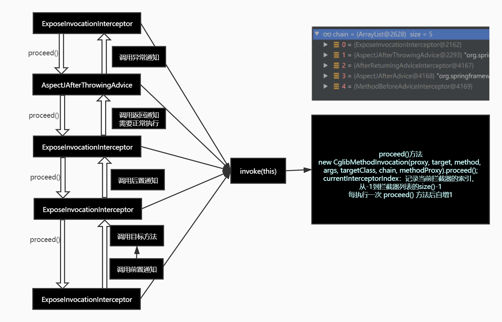
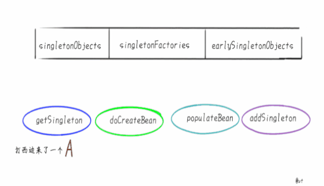

# Spring 注解驱动

## IOC 容器

### 给容器中注册组件的方式：

* 包扫描+组件标记注解(@Controller/@Service/@Repository/@Component)

* `@Bean`[导入第三方包里的组件]

* `@Import` 快速给容器中导入组件

  * **导入的组件bean的 id 默认为组件的全类名**

  * ImportSelector : 返回需要导入的组件的全类名数组，相当于直接在 Import 中直接写。

  * ImportBeanDefinitionRegistrar ： 手动将 bean 注册到容器中：

    所有需要添加到容器中的 bean，使用 BeanDefinitionRegistry.registerBeanDefinition 这个方法.

    ```java
       /**
         * AnnotationMetadata : 当前类的注解相关的信息
         * BeanDefinitionRegistry ： 所有需要添加到容器中的 bean，使用BeanDefinitionRegistry.registerBeanDefinition 这个方法
         * 手动将 bean 注册到容器中
         */
        public void registerBeanDefinitions(AnnotationMetadata importingClassMetadata, BeanDefinitionRegistry registry) {
            boolean existRed = registry.containsBeanDefinition("com.atguigu.bean.Red");
            boolean existGreen = registry.containsBeanDefinition("com.atguigu.bean.Green");
            if (existGreen && existRed) {
                RootBeanDefinition beanDefinition = new RootBeanDefinition(RainBow.class);
                registry.registerBeanDefinition("rainBow", beanDefinition);
            }
        }
    ```

  * 使用 Spring 提供的 FactoryBean(工厂 Bean)

    * 默认获取到的是工厂Bean调用 getObject 返回的对象

    * 若要返回工厂Bean本身，则需要在Id前加上 `&`

       例如：`Object beanSelf = context.getBean("&colorFactoryBean");`

### Bean 的生命周期

####  单实例与多实例：

`@Scope（"prototype")` 多实例注解

*  单实例：在容器启动时，就创建对象，在容器关闭时销毁
*  多实例：在每次获取的时候创建对象，容器不会管理这个Bean，容器关闭时，不会调用Bean的销毁方法。

#### 容器管理Bean的生命周期：

	我们可以自定义初始化和销毁方法：容器在Bean进行到当前生命周期的时候，来调用我们自定义的初始化与销毁的方法。

*  指定初始化和销毁方法；

    	通过 `@Bean`注解指定 init-method 与 destroy-method

  `@Bean(initMethod = "init", destroyMethod = "destroy")`

* 通过让Bean实现`InitializingBean`接口（定义初始化逻辑）, `DisposableBean`接口（定义销毁逻辑）

* 可以使用`JSR250`Java规范中定义的注解：

  * `@PostConstruct`：在Bean创建完成，并且属性赋值完成，来执行初始化方法
  * `@PreDestroy`：在容器销毁Bean之前，执行的方法。

* `BeanPostProcessor`：Bean的后置处理器接口

  * `postProcessBeforeInitialization`方法：初始化之前执行的方法；

  * `postProcessAfterInitialization`方法：Bean **在实例初始化之后，在任何初始化方法执行之前**的方法

    `populateBean(beanName, mbd, instanceWrapper);`：给Bean属性赋值

    `initailizeBean`：

    `applyBeanPostProcessorsBeforeInitialization(wrappedBean, beanName);`：遍历得到容器中所有的 BeanPostProcessor，并调用其 BeforeInitialization 方法，一旦其中一个返回 null，则跳出循环，不会执行后续的 BeanPostProcessor 的 BeforeInitialization 方法。

    `invokeInitMethods(beanName, wrappedBean, mbd);`执行自定义初始化

    `applyBeanPostProcessorsAfterInitialization(wrappedBean, beanName);`
  
  * Spring 底层对 BeanPostProcessor 的应用：
  
    * `ApplicationContextAwareProcessor`
    * bean 赋值
    * 注入其他组件
    * @Autoware
    * 生命周期注解功能
    * @Async
    * xxxBeanPostProcesser

#### 属性赋值

##### @Value 

* 基本数值
* 可以写 SpEL: #{}
* 可以写 ${} 取出配置文件的 properties 的值（运行环境变量的值）

##### @PropertySource

指定外部配置文件配置文件路径，加载到运行时变量中

#### 自动装配

Spring 利用依赖注入（DI），完成对各个组件之间的依赖关系赋值。

##### @Autoware

自动注入。

* 默认优先按照类型去容器中找对应的组件：applycationContext.getBean(Class clazz);
* 如果找到多个相同类型的组件，再根据属性名称作为组件的ID去查找：applycationContext.getBean(String beanName);
* 使用 @Qualify
* 自动装配一定需要在容器中找到对应组件，如果没有的时候就会报错. 因为 **required** 的属性默认是 true，如果改为 false 则不会报错
* @Primary ，指定Spring进行自动装配的时候，使有@Primay注解的Bean作为首选Bean

可以为构造器、参数、方法、属性上使用

1. 标注在方法上，Spring 创建构造对象时，就会调用该方法，完成赋值；方法使用的参数，自定义类型的值从 ioc 容器中获取
2. 标注在构造器上，Spring 默认使用无参构造器创建对象，如果标注在有参构造器上，那么 Spring 创建对象时，就会默认使用该有参构造器创建，并且方法使用的参数，自定义类型从 ioc 容器中获取。 **如果当前只有一个有参构造器，也可以将 @Autoware 注解省略，并且参数也是从 ioc 容器中获取**
3. 标注在参数上，那么该参数从 ioc 容器中获取

注意：**使用 @Bean 注解时，方法的参数也是从ioc容器中获取**

##### @Qualify

明确指定需要装配的组件ID，而不是使用属性进行装配

##### @Resource

JSR250规范中定义，默认按照组件名称进行自动装配

1. 如果同时指定了name和type，则从Spring上下文中找到唯一匹配的bean进行装配，找不到则抛出异常
2. 如果指定了name，则从上下文中查找名称（id）匹配的bean进行装配，找不到则抛出异常
3. 如果指定了type，则从上下文中找到类型匹配的唯一bean进行装配，找不到或者找到多个，都会抛出异常
4. 如果既没有指定name，又没有指定type，则自动按照byName方式进行装配；如果没有匹配，则回退为一个原始类型进行匹配，如果匹配则自动装配；

##### 构造器注入

1. 不可变对象：所以为什么依赖对象前面要加个final
2. 确保依赖对象不为null: 不致于在正调用时才报错，直接启动就报错。

##### @Inject

JSR330规范中定义。与 @Autoware 功能大致相同，不支持 require=false

##### AutowiredAnnotationBeanPostProcessor 

该 BeanPostProcessor 解析完成自动装配


##### Aware 接口

自定义组件可以实现对应的 xxxAware 接口，获取Spring 底层的组件（ApplycationContext，BeanFactory，xxx）

xxxAware 是由对应的 xxxProcessor 处理的。

##### @Profile

Spring 提供可以根据当前环境，动态激活和切换一系列组件的功能

1. 与 @Bean 配合使用，指定该组件在哪个环境下注册到容器中，默认时 default 环境
2. 加在类上，与 @Component/@Configuration 配合使用，只有在指定环境下，该配置类才生效
3. 没有标识 @Profile 注解的 bean，在任何环境下都会注册到容器

使用方式：

1. 使用命令行

    -Dspring.profiles.active=xxx 

2. 使用代码的方式:

   ```java
   AnnotaionConfigApplycationContext applycationContext = new AnnotaionConfigApplycationContext();
   // 1. 创建一个 applycationContext
   // 2. 设置需要激活的环境
   applycationContext.getEnvironment().setActiveProfiles("test", "dev");
   // 3. 注册主配置类
   applycationContext.register(xxxConfig.class);
   // 4. 启动刷新容器
   applycationContext.refresh();
   ```

#### 常用装配方式的区别

* @Resource
  * 没有支持 @Primary 功能，并且没有支持 @Autoware(required=false) 功能
* 构造器方式
  * 使用构造器注入可以提前预知循环依赖问题
  * 

## AOP（动态代理）

> 指在程序运行期间动态的讲某段代码切入到指定方法指定位置进行运行的编程方式

### 一、使用步骤(示例)：

1. 导入 aop 模块；Spring AOP:(spring-aspects)
2. 定义一个业务逻辑类（MathCalulator）；在业务逻辑运行的时候将日志进行打印（方法调用前、方法调用后、方法返回时、方法执行异常时）
3. 定义一个日志切面类（LogAspects）：切面类里面需要动态感知 MathCalculator.div 运行到哪里执行
4. 给切面类的目标标注何时何地运行（通知注解）
5. 将切面类和业务逻辑类（目标方法所在类）都加入到容器中
6. 必须告诉 Spring 哪个类切面类（给切面类上加一个注解：**`@Aspect`**）
7. **给配置类中加入 `@EnableAspectJAutoProxy`【开启基于注解的 aop 模式】**

### 二、通知方法

#### 1. 前置通知（`@Before`）

> 在目标方法运行之前执行。

#### 2. 后置通知（`@After`）

> 在目标方法运行之后运行（无论方法是正常结束还是异常结束）

#### 3. 返回通知（`@AfterReturning`）

> 在目标方法正常返回之后运行

#### 4. 异常通知（`@AfterThrowing`）

> 在目标方法出现异常以后运行

#### 5. 环绕通知（@Around）

> 动态代理，手动推进目标方法运行（joinPoint.proceed()）

### 三、AOP 原理

> 容器中注册了什么组件？
>
> 这个组件什么时候工作？
>
> 这个组件的功能是什么？

#### 1. `@EnableAspectJAutoProxy`

> 开启基于注解的 aop 模式

拥有很重要的一个注解：**`@Import(AspectJAutoProxyRegistrar.class)`**

> 给容器中导入 **`AspectJAutoProxyRegistrar`**，利用  **`AspectJAutoProxyRegistrar`** 自定义给容器中注册 bean：BeanDefinition

其中：`internalAutoProxyCreator=AnnotationAwareAspectJAutoProxyCreator`

> AopConfigUtils.class	

```java
@Nullable
public static BeanDefinition registerAspectJAnnotationAutoProxyCreatorIfNecessary(
    BeanDefinitionRegistry registry, @Nullable Object source) {

    return registerOrEscalateApcAsRequired(AnnotationAwareAspectJAutoProxyCreator.class, registry, source);
}
```

给容器中注册一个 `AnnotationAwareAspectJAutoProxyCreator`

#### 2. `AnnotationAwareAspectJAutoProxyCreator`

`AnnotationAwareAspectJAutoProxyCreator`

​	-> `AspectJAwareAdvisorAutoProxyCreator`

​		-> `AbstractAdvisorAutoProxyCreator`

​			-> `AbstractAutoProxyCreator`：**`implements SmartInstantiationAwareBeanPostProcessor, BeanFactoryAware`**

这里是一个实现了后置处理器（在 bean 初始化完成前后做事情）与 自动装配 BeanFactory 的接口

1. `AbstractAutoProxyCreator` **有后置处理器逻辑，需要关注**

2. 自动装配 `beanFactory` 实际上调用的子类重写的方法

   `AbstractAutoProxyCreator.setBeanFactory()->initBeanFactory()-> AnnotationAwareAspectJAutoProxyCreator.initBeanFactory()`

#### 3. 创建和注册`AnnotationAwareAspectJAutoProxyCreator`的过程

1. 传入配置类，创建 ioc 容器

2. 注册配置类，调用 `refresh()` 刷新容器：

3. `registerBeanPostProcessors(beanFactory);`注册所有的 bean 的后置处理来方便拦截 bean 的创建；

   1. 先获取 ioc 容器已经定义了的需要创建对象的所有 `BeanPostProcessor`
   2. 给容器中加入别的 `BeanPostProcessor`
   3. 优先注册实现了 `PriorityOrdered` 接口的 `BeanPostProcessor`
   4. 再给容器中注册实现了 `Ordered`接口的 `BeanPostProcessor`
   5. 注册没实现优先级接口的 `BeanPostProcessor`
   6. 注册 `BeanPostProcessor`，实际上就是创建 `BeanPostProcessor`对象，保存在容器中；（**以创建`AnnotationAwareAspectJAutoProxyCreator` 为例**）
      1. 创建 Bean 的示例
      2. `popluationBean`：给 bean 的各种属性赋值
      3. `initializeBean`：初始化 bean
         1. `invokeAwareMethods()`：处理 aware 接口的方法回调
         2. `applyBeanPostProcessorsBeforeInstantiation()`：应用后置处理器的 `postProcessBeforeInitializtion()`
         3. `invokeInitMethods()`：执行自定义的初始化方法
         4. `applyBeanPostProcessorsAfterInitialization()`：调用后置处理器的 `postProcessAfterInitialization()`
      4. `BeanPostProcessor`(`AnnotationAwareAspectJAutoProxyCreator`)  创建成功 -->  `aspectJAdvisorsBuilder`
   7. 把 `BeanPostProssor` 注册到 `BeanFactory` 中：`beanFactory.addBeanPostProcessor(postProcessor);`

4. `finishBeanFactoryInitialization(beanFactory)`：完成`BeanFactory` 的初始化工作；创建剩下的单实例 Bean

   1. 遍历容器中所有的 Bean，依次创建对象 `getBean(beanName)；`

      `getBean()` -> `doGetBean()` -> `getSingleton()`

   2. 创建 bean

      > AnnotationAwareAspectJAutoProxyCreator 在所有 bean 创建之前会有一个拦截，InstantiationAwareBeanPostProcessor 会调用 postProcessBeforeInstantiation()

      1. 先从缓存中获取当前 bean，如果能获取到，说明 bean 是之前被创建过的，直接使用，否则再创建

      2. `createBean()`：创建 bean

         > AnnotationAwareAspectJAutoProxyCreator 会在任何bean创建之前先尝试返回bean的实例

         > BeanPostProcessor是在Bean对象创建完成初始化前后调用的

         > InstantiationAwareBeanPostProcessor是在创建Bean实例之前先尝试用后置处理器返回对象的

         1. resolveBeforeInstantiation(beanName, mbdToUse); 解析 BeforeInstantiation 希望后置处理器在此能能够返回一个代理对象；如果能够返回代理对象，就直接使用该代理对象，否则继续往下执行

            1. 后置处理器先尝试返回对象：

               `bean = applyBeanPostProcessorsBeforeInstantiation()`：拿到所有后置处理器，如果是 `InstantiationAwareBeanPostProcessor` 就执行 `postProcessBeforeInstantiation`

               ```java
               if (bean != null) {
               						bean = applyBeanPostProcessorsAfterInitialization(bean, beanName);
               					}
               ```

            2. `doCreateBean(beanName, mbdToUse, args);`真正的去创建一个bean实例；和3.6流程一样

#### 4. `AnnotationAwareAspectJAutoProxyCreator`【`InstantiationAwareBeanPostProcessor`】 的作用

1. 每一个`bean`创建之前，调用`postProcessBeforeInstantiation()`
   1. 判断当前 `bean` 是否在 `advisedBean` 中（保存了所有需要增强的 `bean`）
   2. 判断当前 `bean` 是否是基础类型的 `Advice`、`Pointcut`、`AopInfrastructureBean`、或者是否是切面（`@Aspect`）
   3. 是否需要跳过
      1. 获取候选的增强器（切面里的通知方法）`List<Advisor> candidateAdvisors`
         1. 每个封装的通知方法的增强器是 `InstantiationModelAwarePointcutAdvisor`
         2. 判断每一个增强器是否是 `AspectJPointcutAdvisor` 类型的，返回 true，
      2. 否则调用父类的方法，永远返回 false

2. 创建对象

   `postProcessAfterInitialization`

   ```
   return wrapIfNecessary(bean, beanName, cacheKey);//包装如果需要的情况下
   ```

   1. 获取当前 bean 所有增强器（通知方法）`Object[]  specificInterceptors`

      1. 找到候选的所有增强器（找哪些通知方法是需要切入当前 bean 方法的）
      2. 获取到能在 bean 使用的增强器
      3. **给增强器排序**

   2. 保存当前 `bean` 在 `advisedBeans` 中

   3. 如果当前 bean 需要增强，创建当前 bean 的代理对象

      1. 获取所有的增强器（通知方法）

      2. 保存到 `proxyFactory`

      3. 创建代理对象：Spring 自动决定

         ```
         JdkDynamicAopProxy(config);jdk动态代理；
         ObjenesisCglibAopProxy(config);cglib的动态代理；
         ```

      4. 给容器中返回当前组件使用 `cglib` 增强了的代理对象

      5. 以后容器中获取到的就是这个组件的代理对象，执行目标方法时，代理对象就会执行通知方法的流程

3. 目标方法的执行（**CglibAopProxy.DynamicAdvisedInterceptor.intercept()**）

   容器中保存了组件的代理对象（`cglib` 增强后的对象），这个对象中保存了详细信息（比如增强器，目标对象等等）

   1. `CglibAopProxy.DynamicAdvisedInterceptor.intercept()`：拦截目标方法执行

   2. 根据 ProxyFactory 对象获取将要执行的目标方法拦截器链

      ```java
      List<Object> chain = this.advised.getInterceptorsAndDynamicInterceptionAdvice(method, targetClass);
      ```

      1. `List<Object> interceptorList`保存所有拦截器（5个）

         一个默认的`ExposeInvocationInterceptor` 和 4个增强器；

      2. 遍历所有的增强器，将其转为 `Interceptor`;

         `registry.getInterceptors(advisor);`

      3. 将增强器转为 `List<MethodInterceptor>；`

         如果是`MethodInterceptor`，直接加入到集合中

         如果不是，使用`AdvisorAdapter`将增强器转为`MethodInterceptor`；

         转换完成返回`MethodInterceptor`数组；

   3. 如果没有拦截器链，直接执行目标方法;

      拦截器链（每一个通知方法又被包装为方法拦截器，利用 `MethodInterceptor` 机制）

   4. 如果有拦截器链，把需要执行的目标对象，目标方法，拦截器链等信息传入创建一个 **CglibMethodInvocation** 对象，调用 `proceed()` 方法

      ```java
      Object retVal = new CglibMethodInvocation(proxy, target, method, args, targetClass, chain, methodProxy).proceed();
      ```

      （`CglibAopProxy.DynamicAdvisedInterceptor.class`）

   5. 拦截器触发过程：

      1. 如果没有拦截器执行目标方法，或者拦截器的索引和拦截器数组-1大小一样（指定到了最后一个拦截器）执行目标方法
      2. 链式获取每一个拦截器，拦截器执行 invoke 方法，每一个拦截器等待下一个拦截器执行完成后再来执行

      拦截器链的机制，保证通知方法与目标方法的执行顺序. 

      

#### 四、总结

1. **`@EnableAspectJAutoProxy`** 开启 AOP 功能
2. **`@EnableAspectJAutoProxy`**  会给容器中注册一个组件 **`AnnotationAwareAspectJAutoProxyCreator`**
3. **`AnnotationAwareAspectJAutoProxyCreator`** 是一个后置处理器
4. 容器创建流程
   1. **`registerBeanPostProcessors()`** 方法注册后置处理器；创建 **`AnnotationAwareAspectJAutoProxyCreator`** 对象
   2. **`finishBeanFactoryIntialization()`** 初始化剩下的单实例 bean
      1. 创建业务路基组件和切面组件
      2. **`AnnotationAwareAspectJAutoProxyCreator`** 拦截组件创建过程
      3. 组件创建完之后，判断目标方法是偶需要增强
         * 是：切面的通知方法，包装成增强器（Advisor），给业务逻辑组件创建一个代理对象（cglib）
5. 执行目标方法：
   1. 代理对象执行目标方法
   2. **`CglibAopProxy.DynamicAdvisedInterceptor.intercept()`**
      1. 得到目标方法的拦截器链（增强器包装成拦截器 **`MethodInterceptor`**）
      2. 利用拦截器的链式机制，依次进入每一个拦截器进行执行
      3. 效果：
         * 正常执行：前置通知 -> 目标方法 -> 后置通知 -> 返回通知
         * 异常执行：前置通知 -> 目标方法 -> 后置通知 -> 异常通知

## 声明式事务

### 一、开启声明式事务步骤

1. **`@EnableTransactionManagement`** 开启基于注解的是管理功能

2. 配置事务管理器来控制事务

   ```java
   @Bean
   public PlatformTransactionManager transactionManager() {
        return new DataSourceTransactionManager(dataSource());
   }
   ```

3. 在目标方法上加上 **@Transctional** 注解

### 二、原理

1. **`@EnableTransactionManagement`** 利用 **`TransactionManagementConfigurationSelector`** 给容器中会导入组件

   导入两个组件：

   * **`AutoProxyRegistrar.class`**
   * **`ProxyTransactionManagementConfiguration.class`**

2. **`AutoProxyRegistrar.class`** 给容器中注册一个 **`InfrastructureAdvisorAutoProxyCreator`** 组件

   **`InfrastructureAdvisorAutoProxyCreator`**  类似 AOP 中的 `AnnotationAwareAspectJAutoProxyCreator` 
   1. `InfrastructureAdvisorAutoProxyCreator` 如何工作？

      利用后置处理器机制在对象创建以后，包装对象，返回一个代理对象（包含增强器），带对象执行方法利用拦截器链进行调用

3. `ProxyTransactionManagementConfiguration` 做了什么？

   1. 给容器中注册事务增强器

      1. 事务增强器要用事务注解的信息，`AnnotationTransactionAttributeSource` 解析事务注解

      2. 事务拦截器：

         **`TransactionInterceptor`**  保存了事务属性信息，事务管理器

         它是一个 MethodInterceptor，再目标方法执行的时候执行拦截器链；

4. 事务拦截器工作步骤

   1. 先获取事务相关的属性
   2. 在获取 **`PlatformTransactionManager`**，如果事先没有添加任何 transactionManager，最终会从容器中按照类型获取一个 `PlatformTransactionManager`
   3. 执行目标方法
      * 如果异常：获取到事务管理器，利用事务管理回滚操作
      * 如果正常，利用事务管理器，提交事务

## 扩展原理

### 一、 BeanPostProcessor

> Bean 的后置处理器，bean 创建对象初始化前后进行拦截工作的

### 二、BeanFactoryPostProcessor 原理

1. ioc 创建容器对象

   AbstractApplicationContext.class

   ```java
   // Invoke factory processors registered as beans in the context.
   				invokeBeanFactoryPostProcessors(beanFactory);
   ```

2. 如何找到所有的 BeanFactoryPostProcessor 并执行它们的方法：

   1. 直接再 BeanFactory 中找到所有类型位 BeanFactoryPostProcessor 的组件，并执行它们的方法
   2. 在初始化创建其他组件前面执行

### 三、BeanDefinitionRegistryPostProcessor

> ```java
> public interface BeanDefinitionRegistryPostProcessor extends BeanFactoryPostProcessor {
>     void postProcessBeanDefinitionRegistry(BeanDefinitionRegistry registry) throws BeansException;
> }
> ```

在所有 bean 定义信息将要被加载， bean 实例还未创建的时候执行

**特点**：优先于 BeanFactoryPostProcessor 执行

**用处**：可以利用 BeanDefinitionRegistryPostProcessor 给容器中再额外添加一些组件

**原理**：

1. ioc 创建对象
2. refresh() ->  invokeBeanFactoryPostProcessors(beanFactory);
3. 从容器中获取到所有的 BeanDefinitionRegistryPostProcessor 组件
   1. 依次触发所有的 postProcessBeanDefinitionRegistry() 方法
   2. 再来触发的 postProcessorBeanFactory() 方法
4. 再从容器中找到所有的 BeanFactoryPostProcessor 组件，然后依次触发  postProcessorBeanFactory() 方法

### 四、ApplicationListener

```java
public interface ApplicationListener<E extends ApplicationEvent> extends EventListener { 
    /**    
      * Handle an application event.    
      * @param event the event to respond to    
      */   
    void onApplicationEvent(E event);
                                                                }
```

监听容器中发布的时间。 **事件驱动模型开发**.

监听 ApplicationEvent 以及其子类

**步骤：**

1. 方式一：写一个监听器（ApplicationListener 实现类）来监听某个事件（ApplicationEvent 以及其子类）

   方式二：可以方法上加上 @EventListener 注解

   原理：

   1. 使用 EventListenerMethodProcessor 处理器来解析方法上的 @EventListener
   2. SmartInitializingSingleton 原理，下面介绍

2. 把监听器加入到容器中！

3. 只要容器中有相关事件的发布，就可以监听到这个事件（**观察者模式**）

4. 发布一个事件：

   applicationContext.publishEvent();

**原理：**

1. ContextRefreshEvent 事件：
   1. 容器创建对象：refresh()；
   2. finishRefresh()；容器刷新完成会发布 ContextRefreshedEvent 事件
2. 自己发布的事件
3. 容器关闭会发布事件 ContextClosedEvent；

#### 事件发布流程

> ```java
> // Publish the final event.
> publishEvent(new ContextRefreshedEvent(this));
> ```

1. 获取时间的多播器（派发器）：`getApplicationEventMulticaster()`

2. multicasetEvent 派发事件：

   ```java
   @Override
   public void multicastEvent(final ApplicationEvent event, @Nullable ResolvableType eventType) {   
       ResolvableType type = (eventType != null ? eventType : resolveDefaultEventType(event));   
      	// 获取到所有的 listener
       for (final ApplicationListener<?> listener : getApplicationListeners(event, type)) {   
           // 如果有 Executor，可以支持使用 Executor 进行异步派发
           Executor executor = getTaskExecutor();      
           if (executor != null) {         
               executor.execute(() -> invokeListener(listener, event));      
           } else {        
               // 否则，同步的方式直接执行 listener 方法，拿到 listener 回调 onApplicationEvent 方法
               invokeListener(listener, event);      
           }   
       }
   }
   ```

#### 事件多播器（派发器）

1. 容器创建对象：refresh()
2. `initApplicationEventMulticaster();` 初始化 applicationEventMulticaster;
   1. 先去容器中找有没有 id="initApplicationEventMulticaster();" 组件
   2. 如果没有则 `this.applicationEventMulticaster = new SimpleApplicationEventMulticaster(beanFactory);`并且加入到容器中，就可以在其他组件要派发事件，自动注入这个 applicationEventMulticaster

#### 监听器创建原理

1. 容器创建对象：**refresh()**

2. `registerListeners();`

   1. 从容器中拿到所有的监听器，把他们注册到applicationEventMulticaster中；

   ​      `String[] listenerBeanNames = getBeanNamesForType(ApplicationListener.class, true, false);`       

   2.  将listener注册到ApplicationEventMulticaster中         `getApplicationEventMulticaster().addApplicationListenerBean(listenerBeanName);`

#### SmartInitializingSingleton 原理

```java
public interface SmartInitializingSingleton {   
    void afterSingletonsInstantiated();
}
```

1. ioc 容器创建对象并 refresh();
2. `finishBeanFactoryInitialization(beanFactory);` -> `beanFactory.preInstantiateSingletons();`
   1. 先创建所有单实例 bean： getBean();
   2. 获取所有创建好的单实例 bean，判断是否是 `SmartInitializingSingleton` 类型的，如果是就调用 `afterSingletonsInstantiated()`

## refresh() 方法

### 一、prepareRefresh();

> 刷新前的预处理

1. `initPropertySources();`  初始化一些属性设置；子类自定义个性化的属性设置方法
2. `getEnvironment().validateRequiredProperties();` 检验属性的合法
3. `this.earlyApplicationEvents = new LinkedHashSet<>();` 保存容器中的一些早期事件

### 二、obtainFreshBeanFactory();

> 获取 BeanFactory

1. `refreshBeanFactory(); `刷新创建 BeanFactory

   创建一个`this.beanFactory = new DefaultListableBeanFactory();` 

   设置 id

2. `getBeanFactory();` 返回刚才 GenericApplicationContext 创建的 BeanFactory 对象

3. 将创建好的 BeanFactory <ConfigurableListableBeanFactory> 返回

### 三、prepareBeanFactory(beanFactory);

> BeanFactory 的预准备工作（Bean Factory 进行一些设置）

1. 设置 BeanFactory 的类加载器、支持表达式解析器...
2. 添加部分 BeanPostProcessor（ApplicationContextAwareProcessor）
3. 设置忽略的自动装配的接口 EnvironmentAware、EmbeddedValueResolverAware、xxx..
4. 注册可以解析的自动装配，我们能够直接再任何组件中自动注入：BeanFactory、ResourceLoader、ApplicationEventPublisher、ApplicationContext
5. 添加 BeanPostProcessor（ApplicationListenerDetector）
6. 添加编译时 AspectJ
7. 给 BeanFactory 中注册一些能用的组件：
   environment、systemProperties、systemEnvironment

### 四. postProcessBeanFactory(beanFactory);

> BeanFactory 准备工作完成后进行后置处理器工作；

1. 子类通过重写这个方法来在 BeanFactory 创建并预准备完成以后做进一步的设置

> 以上四步是 BeanFactory 的创建以及与准备工作

### 五、invokeBeanFactoryPostProcessors(beanFactory);

> 执行 BeanFactoryPostProcessor 的方法

BeanFactoryProcessor ：BeanFactory 的后置处理器，在 BeanFactory 标准初始化之后执行；

两个接口:

* BeanFactoryProcessor
* BeanDefinitionRegistryPostProcessor

1. 执行 BeanFactoryPostProcessor 的方法

   **先执行 BeanDefinitionRegistryPostProcessor**

   1. 获取所有的 BeanDefinitionRegistryPostProcessor
   2. 整理实现了 PriorityOrdered 接口的 BeanDefinitionRegistryPostProcessor、postProcessor.postProcessBeanDefinitionRegistry(registry)
   3. 整理实现了 Ordered 接口的 BeanDefinitionRegistryPostProcessor、postProcessor.postProcessBeanDefinitionRegistry(registry)
   4. 最后执行没有实现优先级以及顺序接口的 BeanDefinitionRegistryPostProcessor、postProcessor.postProcessBeanDefinitionRegistry(registry)

   **再执行BeanFactoryPostProcessor的方法**

   1. 获取所有的BeanFactoryPostProcessor
   2. 看先执行实现了PriorityOrdered优先级接口的BeanFactoryPostProcessor、   postProcessor.postProcessBeanFactory()
   3. 在执行实现了Ordered顺序接口的BeanFactoryPostProcessor；   postProcessor.postProcessBeanFactory()
   4. 最后执行没有实现任何优先级或者是顺序接口的BeanFactoryPostProcessor；   postProcessor.postProcessBeanFactory()

### 六、registerBeanPostProcessors(beanFactory);

> 注册 BeanPostProcessor（Bean 的后置处理器）【 intercept bean creation】
>
> 不同接口类型的 BeanPostProcessor，在 Bean 创建前后的执行时机是不一样的：
>
> * BeanPostProcessor
> * DestructionAwareBeanPostProcessor
> * InstantiationAwareBeanPostProcessor
> * SmartInstantiationAwareBeanPostProcessor
> * MergedBeanDefinitionPostProcessor【internalPostProcessors】、

1. 获取所有的 BeanPostProcessor; 后置处理器都默认可以通过 PriorityOrdered、Ordered 接口来设置优先级
2. 先注册 PriorityOrdered 优先级接口的 BeanPostProcessor，把每一个 BeanPostProcessor 添加到 BeanFactory 中 `beanFactory.addBeanPostProcessor(postProcessor);`
3. 再注册 Ordered 接口的
4. 最后注册没有实现任何优先级接口的
5. 最终注册 MergedBeanDefinitionPostProcessor
6. 注册一个ApplicationListenerDetector；来在Bean创建完成后检查是否是ApplicationListener，如果是   `applicationContext.addApplicationListener((ApplicationListener<?>) bean);`

### 七、initMessageSource(); 

> 初始化 MessageSource 组件（做国际化功能，消息绑定，消息解析）

1.  获取 BeanFactory

2. 看容器中是否有 id="messageSource" 的，类型是 MessageSource 的组件

   如果有，直接使用，如果没有需要创建一个 DelegatingMessageSource；

   MessageSource：去除国际化配置文件中的某个 key 值，能按照区域信息获取

3. 把创建好的 MessageSource 注册在容器中，以后获取国际化配置文件的值的时候，可以自动注入 MessageSource

   ```java
   beanFactory.registerSingleton(MESSAGE_SOURCE_BEAN_NAME, this.messageSource);				
   MessageSource.getMessage(String code, Object[] args, String defaultMessage, Locale locale);
   ```

### 八、initApplicationEventMulticaster(); 

> 初始化事件派发器

1. 获取 BeanFactory
2. 从 BeanFactory 中获取 applicationEventMulticaster 的 ApplicationEventMulticaster
3. 如果上一步没有配置，创建一个 SimpleApplicationEventMulticaster
4. 将创建的ApplicationEventMulticaster添加到BeanFactory中，以后其他组件直接自动注入

### 九、onRefresh();

> 留给子容器（子类），子类重写这个方法，在容器刷新的时候可以实现自定义逻辑

### 十、registerListeners();

> 留给子容器（子类），子类重写这个方法，在容器刷新的时候可以实现自定义逻辑留给子容器（子类），子类重写这个方法，在容器刷新的时候可以实现自定义逻辑

1. 从容器中拿到所有的 Application Listener

2. 将每个监听器添加到事件派发器中

   `getApplicationEventMulticaster().addApplicationListenerBean(listenerBeanName);`

3. 派发之前步骤产生的事件

### 十一、 finishBeanFactoryInitialization(beanFactory);

> 初始化所有剩下的单实例 bean

1. beanFactory.preInstantiateSingletons(); 初始化剩下的单实例 bean

   1. 获取 bean 的定义信息，RootBeanDefinition

   2. Bean 不是抽象的，是单实例的，是懒加载的

      1. 判断是否是 FactoryBean；是否实现 FactoryBean 接口的 Bean

      2. 不是 FactoryBean，利用 getBean(beanName) 创建对象

         0. getBean(beanName); AbstractBeanFactory.getBean(beanName)

         1. doGetBean(beanName, null, null, false);

         2. 先获取缓存中保存的单实例 Bean. 如果能获取到，说明这个 bean 之前被创建过（所有创建过的 bean 都会被缓存起来）

            从`private final Map<String, Object> singletonObjects = new ConcurrentHashMap<String, Object>(256);`获取的

         3. 缓存中获取不到，开始 Bean 的创建对象流程

         4. 标记当前 Bean 已经被创建

         5. 获取 Bean 的定义信息

         6. **获取当前 Bean 依赖的其他 Bean，如果有依赖，按照 getBean() 把依赖 Bean 先创建出来**

         7. 启动单实例 Bean 的创建流程：

            1. createBean(beanName, mbd, args);

            2. `Object bean = resolveBeforeInstantiation(beanName, mbdToUse);`

               让 BeanPostProcessor 先拦截返回代理对象

               `InstantiationAwareBeanPostProcessor` 提前执行：

               ```java
               bean = applyBeanPostProcessorsBeforeInstantiation(targetType, beanName);					
               if (bean != null) {
                   bean = applyBeanPostProcessorsAfterInitialization(bean, beanName);					
               }
               ```

            3. 如果前面的 `InstantiationAwareBeanPostProcessor`没有返回代理对象，继续往下走，调用步骤4

            4. `Object beanInstance = doCreateBean(beanName, mbdToUse, args);`

               1. **创建 Bean 实例：** `createBeanInstance(beanName, mbd, args);`

                  利用工厂方法或者对象的构造器创建出 Bean 的实例

               2. `applyMergedBeanDefinitionPostProcessors(mbd, beanType, beanName);` 调用 `MergedBeanDefinitionPostProcessor` 的 `postProcessMergedBeanDefinition(mbd, beanType, beanName);`

               3. **Bean 属性赋值：**`populateBean(beanName, mbd, instanceWrapper);` 赋值之前：

                  1. 拿到 `InstantiationAwareBeanPostProcessor` 后置处理器，执行 postProcessAfterInstantiation();

                  2. 拿到 `InstantiationAwareBeanPostProcessor` 后置处理器，执行 postProcessPropertyValues();

                     > 以上是赋值前操作

                  3. 应用Bean属性的值；为属性利用setter方法等进行赋值 `applyPropertyValues(beanName, mbd, bw, pvs);`

               4. **Bean初始化：**initializeBean(beanName, exposedObject, mbd);   

                  1. 【执行Aware接口方法】invokeAwareMethods(beanName, bean);执行xxxAware接口的方法         BeanNameAware\BeanClassLoaderAware\BeanFactoryAware    
                  2. 【执行后置处理器初始化之前】applyBeanPostProcessorsBeforeInitialization(wrappedBean, beanName);         BeanPostProcessor.postProcessBeforeInitialization（）;     
                  3. 【执行初始化方法】invokeInitMethods(beanName, wrappedBean, mbd);        
                     1.  是否是InitializingBean接口的实现；执行接口规定的初始化；        
                     2. 是否自定义初始化方法；    
                  4. 【执行后置处理器初始化之后】applyBeanPostProcessorsAfterInitialization         BeanPostProcessor.postProcessAfterInitialization()；    
                  5. 注册Bean的销毁方法；
            
            5. 将创建的Bean添加到缓存中singletonObjects；

ioc容器就是这些Map；很多的Map里面保存了单实例Bean，环境信息。。。。；

所有Bean都利用getBean创建完成以后；   检查所有的Bean是否是SmartInitializingSingleton接口的；如果是；就执行afterSingletonsInstantiated()；

### 十二、finishRefresh();

> 最后，广播事件，ApplicationContext 初始化完成

完成BeanFactory的初始化创建工作；IOC容器就创建完成； 

1. initLifecycleProcessor(); 初始化和生命周期有关的后置处理器；LifecycleProcessor         

   默认从容器中找是否有lifecycleProcessor的组件【LifecycleProcessor】；如果没有new DefaultLifecycleProcessor();加入到容器；      

   写一个LifecycleProcessor的实现类，可以在BeanFactory     

   void onRefresh();         

    void onClose();        

	2. getLifecycleProcessor().onRefresh();   拿到前面定义的生命周期处理器（BeanFactory）；回调onRefresh()；  
 	3. getLifecycleProcessor().onRefresh();   拿到前面定义的生命周期处理器（BeanFactory）；回调onRefresh()；
 	4. liveBeansView.registerApplicationContext(this);

 ### 总结

1. Spring容器在启动的时候，先会保存所有注册进来的Bean的定义信息；  

   1. xml注册bean；<bean>  
   2. 注解注册Bean；@Service、@Component、@Bean、xxx

2. Spring容器会合适的时机创建这些Bean  

   1. 用到这个bean的时候；利用getBean创建bean；创建好以后保存在容器中；  
   2. 统一创建剩下所有的bean的时候；finishBeanFactoryInitialization()；

3. 后置处理器；BeanPostProcessor   1）、每一个bean创建完成，都会使用各种后置处理器进行处理；来增强bean的功能；      AutowiredAnnotationBeanPostProcessor:处理自动注入      AnnotationAwareAspectJAutoProxyCreator:来做AOP功能；   

   xxx....      

   增强的功能注解：      

   AsyncAnnotationBeanPostProcessor    

   ....

4. 事件驱动模型：

   ApplicationListener；事件监听；   

   ApplicationEventMulticaster；事件派发：

## Spring 解决循环依赖

[参考博客](https://mp.weixin.qq.com/s/2u7k_jt-3p_dgTXy4tB7Tg)

Spring 内部维护了 3 个 Map，也就是通常说的三级缓存

Spring 的 DefaultSingletonBeanRegistry 类中，有三个 Map:

* singletonObjects ，俗称“单线池”“容器”，缓存创建完成单实例 Bean 的地方
* singletonFactories，映射创建 Bean 的原始工厂
* earlySingletonObjects 映射 Bean 的早期引用，也就是说在这个 Map 里的 Bean 不是完整的，甚至还不能称之为 Bean，只是一个 instance

后两个Map其实是“垫脚石”级别的，只是创建Bean的时候，用来借助了一下，创建完成就清掉了。

假设最终放在singletonObjects的Bean是你想要的一杯“凉白开”。

那么Spring准备了两个杯子，即singletonFactories和earlySingletonObjects来回“倒腾”几番，把热水晾成“凉白开”放到singletonObjects中。

下图17个步骤：



循环依赖的本质：

```java
	/**
     * 放置创建好的bean Map
     */
    private static Map<String, Object> cacheMap = new HashMap<>(2);

    public static void main(String[] args) {
        // 假装扫描出来的对象
        Class[] classes = {A.class, B.class};
        // 假装项目初始化实例化所有bean
        for (Class aClass : classes) {
            getBean(aClass);
        }
        // check
        System.out.println(getBean(B.class).getA() == getBean(A.class));
        System.out.println(getBean(A.class).getB() == getBean(B.class));
    }

    @SneakyThrows
    private static <T> T getBean(Class<T> beanClass) {
        // 本文用类名小写 简单代替bean的命名规则
        String beanName = beanClass.getSimpleName().toLowerCase();
        // 如果已经是一个bean，则直接返回
        if (cacheMap.containsKey(beanName)) {
            return (T) cacheMap.get(beanName);
        }
        // 将对象本身实例化
        Object object = beanClass.getDeclaredConstructor().newInstance();
        // 放入缓存
        cacheMap.put(beanName, object);
        // 把所有字段当成需要注入的bean，创建并注入到当前bean中
        Field[] fields = object.getClass().getDeclaredFields();
        for (Field field : fields) {
            field.setAccessible(true);
            // 获取需要注入字段的class
            Class<?> fieldClass = field.getType();
            String fieldBeanName = fieldClass.getSimpleName().toLowerCase();
            // 如果需要注入的bean，已经在缓存Map中，那么把缓存Map中的值注入到该field即可
            // 如果缓存没有 继续创建
            field.set(object, cacheMap.containsKey(fieldBeanName)
                    ? cacheMap.get(fieldBeanName) : getBean(fieldClass));
        }
        // 属性填充完成，返回
        return (T) object;
    }
```

类似于 two sum 问题：

给定一个数组，给定一个数字。返回数组中可以相加得到指定数字的两个索引。比如：给定nums = [2, 7, 11, 15], target = 9 那么要返回 [0, 1]，因为2 + 7 = 9

这道题的优解是，一次遍历+HashMap，先去Map中找需要的数字，没有就将当前的数字保存在Map中，如果找到需要的数字，则一起返回。

```java
class Solution {
    public int[] twoSum(int[] nums, int target) {
        Map<Integer, Integer> map = new HashMap<>();
        for (int i = 0; i < nums.length; i++) {
            int complement = target - nums[i];
            if (map.containsKey(complement)) {
                return new int[] { map.get(complement), i };
            }
            map.put(nums[i], i);
        }
        throw new IllegalArgumentException("No two sum solution");
    }
}
```

