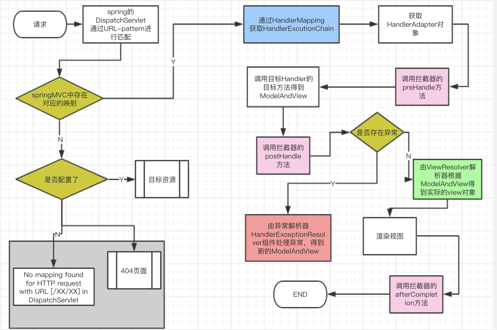
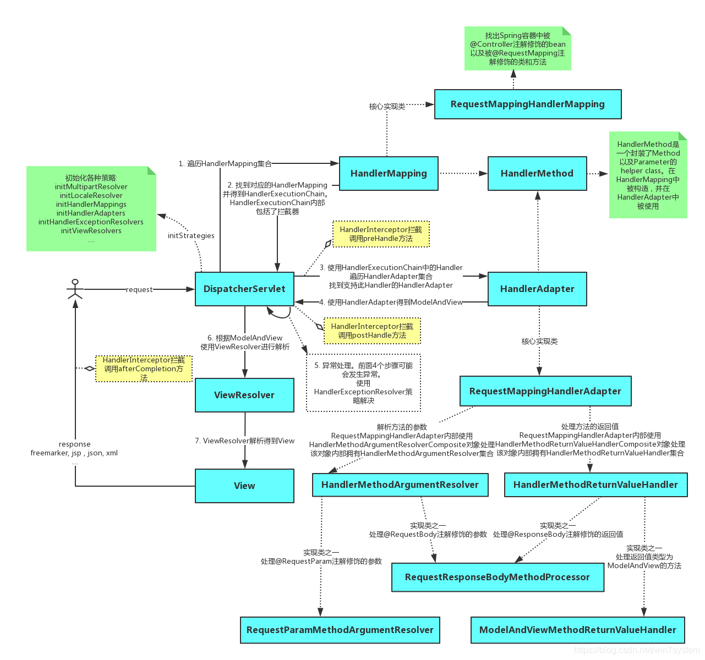

# SpringMVC 总结

## 一、为什么使用 SpringMVC？

为什么需要使用SpringMVC 而放弃 Structs?

主要Structs2 存在以下缺点:

* Structs2 存在漏洞（后续搜索）
* 运行速度比 SpringMVC 慢
* 配置的内容比较多【需要使用 Strcuts.xml 文件】
* 比较重量级【相对于 SpringMVC 而言】
* Strusts2 能做的功能，SpringMVC 都可以满足

## 二、SpringMVC 工作流程

步骤：

* 浏览器发送请求
* 请求交由核心控制器处理（DispatcherServlet）
* 核心控制器调用 HandlerMapping 根据 URL 知道对应的 Handler（也就是平常说的 Controller 控制器）后，开始有 HandlerAdapter 适配器处理
* HandlerAdapter 会根据 Hnalder 来调用真正的处理器来处理器请求，并处理相应的业务逻辑
* 处理器处理完业务逻辑后，会返回一个 ModelAndView 对象，Model 时返回数据对象，View 是个逻辑上的 View
* ViewResolver 会根据 View 查找实际的 View
* DispatcherServlet 把返回的 Model 传给 View （视图渲染）
* 把 View 返回给浏览器

