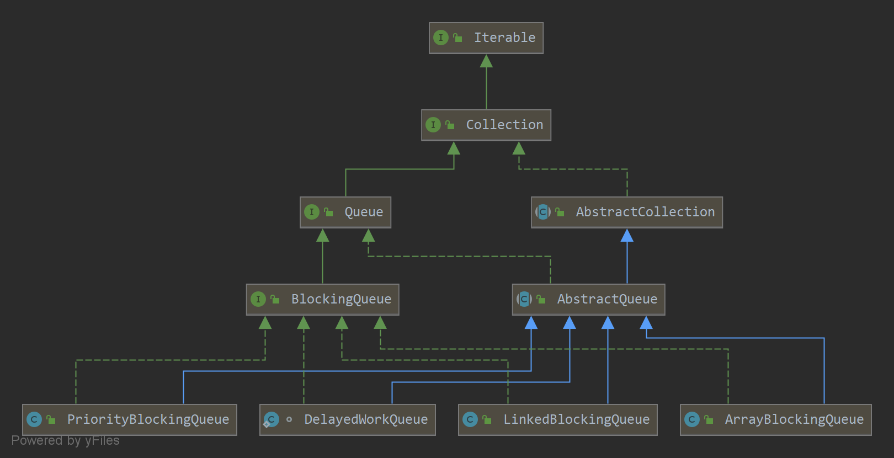
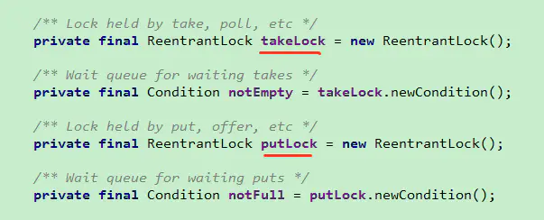
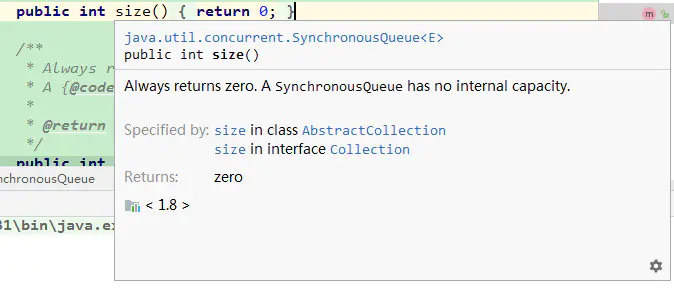

# .深入理解Java线程池：ThreadPoolExecutor

## 线程池介绍

在web开发中，服务器需要接受并处理请求，所以会为一个请求来分配一个线程来进行处理。如果每次请求都新创建一个线程的话实现起来非常简便，但是存在一个问题：
**如果并发的请求数量非常多，但每个线程执行的时间很短，这样就会频繁的创建和销毁线程，如此一来会大大降低系统的效率。可能出现服务器在为每个请求创建新线程和销毁线程上花费的时间和消耗的系统资源要比处理实际的用户请求的时间和资源更多。**
那么有没有一种办法使执行完一个任务，并不被销毁，而是可以继续执行其他的任务呢？
这就是线程池的目的了。线程池为线程生命周期的开销和资源不足问题提供了解决方案。通过对多个任务重用线程，线程创建的开销被分摊到了多个任务上。

* **什么时候使用线程池？**
  * 单个任务处理时间短
  * 需要处理的任务数量很大
* **使用线程池的好处**
  * 降低资源消耗。可定义重复利用已创建的线程降低线程创建和销毁造成的消耗
  * 提高响应速度。当任务到达时，任务可以不需要等到线程创建就能立即执行。
  * 提高线程的可管理性。线程是稀缺资源，如果无限制的创建，不经会消耗系统的资源，也会降低系统的稳定性，使用线程池可以为进行统一的分配，调优和监控。
* **Java中线程池是用`ThreadPoolExecutor` 类来实现的**

### 线程池的类图


### 线程池执行流程


### Executor 框架接口

`Executor` 框架是一个根据一组执行策略调用，调度，执行和控制的异步任务的框架，目的是提供一种将“任务提交”与“任务如何运行”分离开的机制。

`J.U.C` 中有三个 `Executor` 接口：

* **`Executor`：**一个运行新任务的简单接口；
* **`ExecutorService`：**拓展了`Executor`接口，添加了一些用来管理执行器生命周期和任务生命周期的方法；
* **`ScheduleExecutorService`：**拓展了`ExecutorService`，支持 `Future`和定期执行任务。

### Executor 接口

```java
public interface Executor {
	void execute(Runnable command)
}
```

`Executor` 接口只有一个 `execute` 方法，用来替代通常创建或者启动线程的方法。

例如，使用 Thread 来创建并启动线程的代码如下：

```java
Thread t = new Thread();
t.start();
```

使用 `Executor` 来启动线程执行任务的代码如下：

```java
Thread t = new Thread();
executor.execute();
```

对于不同的 `Executor` 实现，`execute()`方法可能是创建一个新的线程并启动，也有可能是使用已有的工作线程来运行传入的任务，也可能是根据设置线程池的容量或者阻塞队列的容量来决定是否要将传入的线程放入阻塞队列中或者拒绝接受传入的线程。

### ExecutorService 接口

`ExecutorService` 接口继承`Executor`接口，提供了管理终止的方法，以及可为跟踪一个或多个异步任务执行状况而生成 `Future` 的方法。增加了 `shutdown()`， `shutdownNow()`， `invokeAll()`, `invokeAny()`,  `submit()` 等方法。如果需要支持即时关闭，月就是 `shutdownNow()`方法，则任务需要正确处理中断。

### ScheduledExecutorService 接口

`ScheduledExecutorService` 拓展了 `ExecutorService` 接口并增加了 `schdule()`方法。调用`schedule()`方法可以在指定的延时后执行一个 `Runnable` 或者 `Callable` 任务。

`ScheduledExecutorService` 接口还定义了按照指定时间间隔定期执行任务的 `scheduleAtFixedRate()`方法和`scheduleWithFixedDelay()`方法。

* `scheduleAtFiexRate()`：该方法设置执行周期，下次执行时间相当于是上一次的执行时间加上 period，她是采用已固定的频率来执行任务。
* `scheduleFixedDalay()`：该方法设置了执行周期，与`scheduleAtFixedRate`方法不同的是，下一次执行时间是上一次任务执行完的系统时间加上 period，因而具体执行时间不是固定的，但周期是固定的，是采用相对固定的延迟来执行任务的。

## ThreadPoolExecutor 分析

`ThreadPoolExecutor`继承自 `AbstractExecutorService`，也是实现了 `ExecutorService`接口。

### 几个重要的字段

```java
    private final AtomicInteger ctl = new AtomicInteger(ctlOf(RUNNING, 0));
    private static final int COUNT_BITS = Integer.SIZE - 3;
    private static final int CAPACITY   = (1 << COUNT_BITS) - 1;

    // runState is stored in the high-order bits
    private static final int RUNNING    = -1 << COUNT_BITS;
    private static final int SHUTDOWN   =  0 << COUNT_BITS;
    private static final int STOP       =  1 << COUNT_BITS;
    private static final int TIDYING    =  2 << COUNT_BITS;
    private static final int TERMINATED =  3 << COUNT_BITS;
```

* `ctl`：它是对线程池的运行状态和线程池中有效线程的数量进行控制的一个字段，它包含两部分信息：

  * 线程池的运行状态(`runState`)
  * 线程池内有效线程的数量(`workerCount`)

  这里可以看到，使用了 `Integer`类型来保存，**高3位保存`runState`，低29位`workerCount`**。

* `CAPACITY`：就是**1左移29位减1**，这个常量表示`workerCount`的上限值，536870911（大约为5亿）

### 线程池的运行状态

线程池一共有五种状态：

* **`RUNNING`**：能接受新提交的任务，并且也能够处理阻塞队列中的任务；
* **`SHUTDOWN`**：关闭状态，不再接受新提交的任务，但却可以继续处理阻塞队列中已保存的任务。**在线程池处于`RUNNING`状态时，调用`shutdown()`方法会使线程池进入到该状态。**(`finalize()`方法再执行过程中也会调用`shutdown()`方法进入该状态)；
* **`STOP`**：不能接受新任务，也不处理阻塞队列中的任务，会终端正在处理任务的线程。**在线程池处于`RUNNING`或者`SHUTDOWN`状态时，调用`shutdownNow()`方法会使线程池进入该状态。**
* **`TIDYING`**：如果所有的任务都已终止了，`workCount`（有效线程数）为0，线程池进入该状态后会调用`terminated()`方法进入`TERMINATED`状态；
* **`TERMINATED`**：在 `terminated()`方法执行完后进入该状态，默认`terminated()`方法中什么没有做。进入`TERMINATED`状态的条件为：
  * 线程池不是`RUNNING`状态；
  * 线程池不是`TIDYING`状态或者`TERMINATED`状态
  * 如果线程池状态是`SHUTDOWN`并且`workerQueue`为空
  * `workerCount`为0
  * 设置`TIDYING`状态成功。

下图为线程池的状态转换过程：


### ctl的相关方法

下面是对`ctl`进行计算的方法：

```java
    // Packing and unpacking ctl
    private static int runStateOf(int c)     { return c & ~CAPACITY; }
    private static int workerCountOf(int c)  { return c & CAPACITY; }
    private static int ctlOf(int rs, int wc) { return rs | wc; }
```

* `runStateOf()`：获取运行状态
* `wokerCountOf`：获取活动线程数
* `ctlOf`：获取运行状态和活动线程数的值

### ThreadPoolExecutor 的构造方法

```java
    public ThreadPoolExecutor(int corePoolSize,
                              int maximumPoolSize,
                              long keepAliveTime,
                              TimeUnit unit,
                              BlockingQueue<Runnable> workQueue,
                              ThreadFactory threadFactory,
                              RejectedExecutionHandler handler) {
        if (corePoolSize < 0 ||
            maximumPoolSize <= 0 ||
            maximumPoolSize < corePoolSize ||
            keepAliveTime < 0)
            throw new IllegalArgumentException();
        if (workQueue == null || threadFactory == null || handler == null)
            throw new NullPointerException();
        this.acc = System.getSecurityManager() == null ?
                null :
                AccessController.getContext();
        this.corePoolSize = corePoolSize;
        this.maximumPoolSize = maximumPoolSize;
        this.workQueue = workQueue;
        this.keepAliveTime = unit.toNanos(keepAliveTime);
        this.threadFactory = threadFactory;
        this.handler = handler;
    }
```

构造方法中的字段含义如下：

* `corePoolSize`：核心线程数量，当有新任务在 `execute()`方法提交时，会执行以下判断：

  * 如果运行的线程少于`corePoolSize`，则创建新线程来处理任务，即使线程池中其他线程是空闲的。
  * 如果运行的线程数量大于等于`corePoolSize`并且小于`maximumPoolSize`，则只有当`workerQueue`满时，才创建新的线程去处理任务。
  * 如果设置的 `corePoolSize` 与 `maximumPoolSize`相同，则创建的线程池大小是固定的，这是如果有新任务提交，如果 `workQueue`未满，则将请求放入`workQueue`中，等待有空闲的线程去从 `workQueue` 取任务并处理。
  * 如果运行的线程数量大于等于`maximumPoolSize`，这是如果 `workQueue`已经满了，则通过`handler`所指定的策略处理任务；

  所以，任务提交时，判断的顺序为：`corePoolSize --> workQueue --> maximumPoolSize`

* `maximumPoolSize`：线程池最大线程数量

* `workQueue`：等待队列（保存等待执行的任务的阻塞队列），当任务提交时，如果线程池中的线程数量大于等于 `corePoolSize`的时候，把该任务封装成一个 `Worker`对象放入等待队列；

  当提交一个新的任务到线程池以后，线程池会根据当前线程池中正在运行着的线程数量来决定对该任务的处理方式，主要为以下几种处理方式：

  * **直接切换**：这种方式常用的队列是`SynchronousQueue`
  * **使用无界队列**：一般使用基于链表的阻塞队列 `LinkedBlockingQueue`，如果使用这种方式，那么线程池中能够创建的最大线程数就是 `corePoolSize`，而 `maximumPoolSize` 就不会起作用了。当线程池中所有的核心线程都是处于`RUNNING`状态时，这时一个新的任务提交就会被放入等待队列中。
  * **使用有界队列**：一般使用`ArrayBlockingQueue`。这种方式可以将线程池的最大线程数量限制为 `maximumPoolSize`，这样能够降低资源的消耗，但同时这种方式也使得线程池对线程的丢变得更加困难，因为线程池和队列的容量都是有限的值，所以要想使线程池处理任务的吞吐率达到一个相对合理的范围，又想使线程调度相对简单，并且还要尽可能降低线程池对资源的消耗，就需要合理的设置这两个数量：
    * 如果要想降低系统资源的消耗（包括CPU的使用率，操作系统资源的消耗，上下文环境切换的开销等），可以设置较大的队列容量和较小的线程池容量，但这样也会降低线程处理任务的吞吐量。
    * 如果提交的任务经常发生阻塞，那么可以考虑通过调用`setMaximumPoolSize()`方法来重新设定线程池的容量。
    * 如果队列的容量设置的较小，通常需要将线程池的容量设置的大一些，这样CPU的使用率会相对高一些，但是如果线程池的容量设置的过大，则在提交任务数量太多的情况下，并发量会增加，那么线程之间的调度就是一个要考虑的问题，因为这样反而有可能降低处理任务的吞吐量。

* `keepAliveTime`：线程池维护线程所允许的空闲时间。当线程池的线程数量大于`corePoolSize`的时候，如果这时候没有新的任务提交，核心线程外的线程不会立即销毁，而是会等待，直到等待的时间超过了 `keepAliveTime`.

* `threadFactory`：`ThreadFactory` 类型的变量，用来创建线程。默认使用 `Executors.defaultThreadFactory()`来创建线程。使用默认的 `ThreadFactory`来创建线程时，会使新创建的线程具有相同的`NORM_PROIORITY`优先级并且非守护线程，同时也设置了线程的名称。

* `handler`：它是`RejectExecutionHandler`类型的变量，表示线程池的饱和策略。如果阻塞队列塞满了并且没有空闲的线程，这是如果继续提交任务，就需要采取一种策略处理该任务。线程池提供了4钟策略：

  * `AbortPolicy`：直接抛出异常，这是**默认策略**。
  * `CallerRunPolicy`：用调用者所在的线程来执行任务。
  * `DiscardOldestPolicy`：丢弃阻塞队列中最靠前的任务，并执行当前任务。
  * `DiscardPolicy`：直接丢弃任务。

### execute() 方法

`execute()`方法用来提交任务。代码如下：

```java
    public void execute(Runnable command) {
        if (command == null)
            throw new NullPointerException();
        /*
         * ctl 记录着 runState 与 workerCount
         */
        int c = ctl.get();
        /*
         * workerCountOf() 取出低29位的值，表示当前活动的线程数量
         * 如果当前活动的线程数量小于 corePoolSize, 则创建一个新的线程放入线程池中，
         * 并把任务添加给该线程。
         */
        if (workerCountOf(c) < corePoolSize) {
            /*
             * addWorker() 方法中第二个参数表示限制添加线程的参数是根据 corePoolSize 来判断还是 maximumPoolSize
             * true：根据 corePoolSize
             * false：根据 maximumPoolSize
             */
            if (addWorker(command, true))
                return;
            /*
             * 如果添加失败，则重新获取 ctl 值
             */
            c = ctl.get();
        }
        /*
         * 如果当前线程池是运行状态，并且任务成功添加到队列中
         */
        if (isRunning(c) && workQueue.offer(command)) {
            // 重新获取 ctl 值
            int recheck = ctl.get();
            /*
             * 再次判断线程池的运行状态，如果不是运行状态，由于之前已经把 command 添加到 workerQueue 中了，
             * 这时需要移除 command,
             * 执行完成后，通过 handler 使用拒绝策略对该任务进行处理，整个方法返回。
             */
            if (! isRunning(recheck) && remove(command))
                reject(command);
            /*
             * 获取线程池中有效线程数，如果数量是0，则执行 addWorker 方法
             * 这里传入的参数表示：
             * 1.第一个参数为 null,表示在线程池中创建一个线程，但是不启动。
             * 2.第二个参数为 false, 表示将线程池的有效线程数量上限设置为 maximumPoolSize，
             *   添加线程时，根据 maximumPoolSize 判断
             * 如果判断 workerCount > 0, 则直接返回，在 workerQueue 中新增的 command 会在将来的某个时刻执行
             */
            else if (workerCountOf(recheck) == 0)
                addWorker(null, false);
        }
        /*
         * 如果执行到这里，有两种情况
         * 1. 线程池已经不是 RUNNING 状态了；
         * 2. 线程池是 RUNNING 状态，但是 workerCount >= corePoolSize 并且 workerQueue 已满。
         * 这时，再次调用 addWorker() 方法，但是第二个参数传入false，将线程池的有限线程数量的上限设置为maximumPoolSize
         * 如果失败则拒绝该任务。
         */
        else if (!addWorker(command, false))
            reject(command);
    }
```

简单来说，在执行 `execute()`方法时，如果状态一直是 `RUNNING`时，它的执行过程如下：

1. 如果 `workerCount < corePoolSize`，则创建并启动一个线程来执行新提交的任务；

2. 如果`workerCount >= corePoolSize`，且线程池内的阻塞队列未满，则将任务添加到该阻塞队列中；

3. 如果`workerCount >= corePoolSize && workerCount < maximumPoolSize`，且线程池内的阻塞队列已满，则创建并启动一个线程来执行新提交的任务；

4. 如果`workerCount >= maximumPoolSize`，并且线程池内的阻塞队列已满，则根据拒绝策略来处理该任务，默认的处理方式是直接抛异常。

   这里要注意一下`addWoker(null, false);`，也就是创建一个线程，但是并没有传入任务，因为任务已经被添加到了 `workerQueue` 中了，所以`worker`在执行时，会直接从`workQueue`中获取任务。所以在 `workerCountOf(recheck) == 0`时执行`addWorker(null, false;`也是为了保证线程池在`RUNNING`状态瞎必须要有一个线程来执行任务。

   `execute`方法执行流程如下：

   

   ### addWoker() 方法

   `addWorker()`方法的主要工作是在线程池中创建一个新的线程并执行，`firstTask`参数用于指定新增的线程执行的第一个任务，`core`参数为 true 时表示新增线程时会判断当前活动线程数量是否少于`corePoolSize`，false 表示新增线程前是否需要判断当前活动线程数是否少于`maximumPoolSize`，代码如下：

   ```java
       private boolean addWorker(Runnable firstTask, boolean core) {
           retry:
        for (;;) {
               int c = ctl.get();
               // 获取运行状态
               int rs = runStateOf(c);
   
               /*
                * 这个 if 判断：
                * 如果 rs >= SHUTDOWN，则表示此时不再接受新任务
                * 接着判断以下三个条件：
                * 1. 如果 rs == SHUTDOWN，表示关闭状态，不再接收新提交的任务，但是可以继续处理阻塞队列中已经保存的任务
                * 2. firstTask 为空
                * 3. 阻塞队列不为空
                *
                * 首先考虑 rs == SHUTDOWN 的情况，这种情况下不会接收新的任务，所以在 firstTask 不为空时，也会返回false,
                * 如果 firstTask 为空，并且阻塞队列workerQueue 也是空，则返回 false
                * 因为阻塞队列中已经没有任务了，不需要添加线程了
                *
                */
               if (rs >= SHUTDOWN &&
                       ! (rs == SHUTDOWN &&
                               firstTask == null &&
                               ! workQueue.isEmpty()))
                   return false;
   
               for (;;) {
                   // 获取线程数
                   int wc = workerCountOf(c);
                   /*
                    * 如果 wc 超过 CAPACITY，也就是的 ctl 的低29位的最大值(二进制29个1)，返回 false
                    * 这里的 core 是 addWorker 的第二个参数，如果为 true 表示根据 corePoolSize 来比较
                    * 如果为 false,则根据 maximumPoolSize 来比较
                    */
                   if (wc >= CAPACITY ||
                           wc >= (core ? corePoolSize : maximumPoolSize))
                       return false;
                   // 尝试增加 workerCount，如果成功则跳出第一个 for 循环
                   if (compareAndIncrementWorkerCount(c))
                       break retry;
                   // 如果增加 workerCount 失败，则重新获取 ctl 的值
                   c = ctl.get();  // Re-read ctl
                   // 如果当前的运行状态不等于 rs，说明状态已改变，返回第一个 for 循环继续执行
                   if (runStateOf(c) != rs)
                       continue retry;
                   // else CAS failed due to workerCount change; retry inner loop
               }
           }
   
           boolean workerStarted = false;
           boolean workerAdded = false;
           ThreadPoolExecutor.Worker w = null;
           try {
               // 根据 firstTask 来创建 worker 对象
               w = new ThreadPoolExecutor.Worker(firstTask);
               // 每一个 worker 对象都会创建一个线程
               final Thread t = w.thread;
               if (t != null) {
                   final ReentrantLock mainLock = this.mainLock;
                   mainLock.lock();
                   try {
                       // Recheck while holding lock.
                       // Back out on ThreadFactory failure or if
                       // shut down before lock acquired.
                       int rs = runStateOf(ctl.get());
                       /*
                        * rs < SHUTDOWN 表示是 RUNNING 状态，
                        * 如果 rs 是 RUNNING 状态或者 rs 是 SHUTDOWN 状态并且 firstTask 为 null，向线程池中添加线程
                        * 因为 SHUTDOWN 时不会添加新的任务，但还是会执行 workerQueue 中的任务
                        */
                       if (rs < SHUTDOWN ||
                               (rs == SHUTDOWN && firstTask == null)) {
                           if (t.isAlive()) // precheck that t is startable
                               throw new IllegalThreadStateException();
                           // workers 是一个 HashSet
                           workers.add(w);
                           int s = workers.size();
                           // largestPoolSize 记录着线程池中出现过的最大线程数量
                           if (s > largestPoolSize)
                               largestPoolSize = s;
                           workerAdded = true;
                       }
                   } finally {
                       mainLock.unlock();
                   }
                   if (workerAdded) {
                       // 启动线程
                       t.start();
                       workerStarted = true;
                   }
               }
           } finally {
               if (! workerStarted)
                   addWorkerFailed(w);
           }
           return workerStarted;
       }
   ```
   
   注意一下这里的 `t.start()`这个语句，启动时会调用 `Worker` 类 中的 `run()` 方法，Worker 本身实现了 `Runnable`接口，所以一个 `Worker` 类型的对象也是一个线程

### Worker 类

线程池中的每一个线程被封装成一个 `Worker` 对象，`ThreadPool`维护的启示就是一组 `Worker` 对象，看一下 `Worker` 对象的定义：

```java
private final class Worker
    extends AbstractQueuedSynchronizer
        implements Runnable
    {
        /**
         * This class will never be serialized, but we provide a
         * serialVersionUID to suppress a javac warning.
         */
        private static final long serialVersionUID = 6138294804551838833L;

        /** Thread this worker is running in.  Null if factory fails. */
        final Thread thread;
        /** Initial task to run.  Possibly null. */
        Runnable firstTask;
        /** Per-thread task counter */
        volatile long completedTasks;

        /**
         * Creates with given first task and thread from ThreadFactory.
         * @param firstTask the first task (null if none)
         */
        Worker(Runnable firstTask) {
            setState(-1); // inhibit interrupts until runWorker
            this.firstTask = firstTask;
            this.thread = getThreadFactory().newThread(this);
        }

        /** Delegates main run loop to outer runWorker  */
        public void run() {
            runWorker(this);
        }

        // Lock methods
        //
        // The value 0 represents the unlocked state.
        // The value 1 represents the locked state.

        protected boolean isHeldExclusively() {
            return getState() != 0;
        }

        protected boolean tryAcquire(int unused) {
            if (compareAndSetState(0, 1)) {
                setExclusiveOwnerThread(Thread.currentThread());
                return true;
            }
            return false;
        }

        protected boolean tryRelease(int unused) {
            setExclusiveOwnerThread(null);
            setState(0);
            return true;
        }

        public void lock()        { acquire(1); }
        public boolean tryLock()  { return tryAcquire(1); }
        public void unlock()      { release(1); }
        public boolean isLocked() { return isHeldExclusively(); }

        void interruptIfStarted() {
            Thread t;
            if (getState() >= 0 && (t = thread) != null && !t.isInterrupted()) {
                try {
                    t.interrupt();
                } catch (SecurityException ignore) {
                }
            }
        }
    }
```

`Worker` 类继承了 `AQS`，并实现了`RUNNABLE`接口，注意其中`firstTask`和`thread`属性：`firstTask`用它来保存传入的任务；`thread`是在调用构造方式通过 `ThreadFactory`来创建的线程，是用来处理任务的线程。

在调用构造方式时，需要把任务传入，这里通过 `getThreadFactory().newThread(this)`来新建一个线程，`newThread`方法传入的参数是 `this`，因为`Worker`本身继承了`Runnable`接口，也就是一个线程，所以一个`Worker`对象在启动的时候会调用 `Worker` 类的 `run`方法。

`Worker`继承了 `AQS`，使用`AQS`来实现独占锁的功能。为什么不使用 `ReentrantLock`来实现呢？可以看到 `tryAcquire()`方法，它是不允许重入的，而 `ReentrantLock`是允许重入的：

1. `lock`方法一旦获取了独占锁，表示当前线程正在执行任务中；
2. 如果正在执行任务，则不应该中断线程；
3. 如果该线程现在不是独占锁的状态，也即是空闲的状态，说明它没有在处理任务，这是可以对线程进行中断；
4. 线程池在执行 `shutdown()`方法或者`tryTerminate()`方法时会调用`interruptIdleWorkers()`方法来中断空闲的线程，`interruptIdleWorkers()`方法会使用`tryLock`方法来判断线程池中的线程是否是空闲状态；
5. **之所以设置为不可重入，是因为不希望任务在调用时像 `setCorePoolSize`这样的线程池控制方法时重新获取锁**。如果使用`ReentrantLock`，它是可重入的，这样如果在任务中调用了如`setCorePoolSize`，这类线程池控制的方法，会中断正在运行的线程。

所以，`Worker`继承自`AQS`，用于判断是否空闲以及是否可以被中断。

此外，在构造方法中执行了 `setState(-1)`，把 `state` 变量设置为 -1，为什么这么做呢？是因为在`AQS`中默认的`state`是0，如果刚创建了一个`Worker`对象，还没有执行任务时，这时就不应该被中断。看一下`tryAcquire`方法：

```java
protected boolean tryAcquire(int unused) {
    if (compareAndSetState(0, 1)) {
        setExclusiveOwnerThread(Thread.currentThread());
        return true;
    }
    return false;
}
```

`tryAcquire`方法是根据 `state` 是否是0来判断的，所以，`setState(-1)`将 `state`设置为-1是为了禁止在执行任务前对线程进行中断。

正是因为如此，在 `addWorker()`方法中会先调用`Worker`对象的`unlock`方法将`state`设置为0；

### runWorker 方法

在`Worker`类中的`run`方法调用了`runWorker()`方法来执行任务，`runWorker()`方法的代码如下：

```java
final void runWorker(ThreadPoolExecutor.Worker w) {
    Thread wt = Thread.currentThread();
    // 获取第一个任务
    Runnable task = w.firstTask;
    w.firstTask = null;
    // 允许中断
    w.unlock(); // allow interrupts
    // 是否因为异常而退出循环
    boolean completedAbruptly = true;
    try {
        // 如果 task 为空，则通过 getTask 来获取任务
        while (task != null || (task = getTask()) != null) {
            w.lock();
            // If pool is stopping, ensure thread is interrupted;
            // if not, ensure thread is not interrupted.  This
            // requires a recheck in second case to deal with
            // shutdownNow race while clearing interrupt
            if ((runStateAtLeast(ctl.get(), STOP) ||
                 (Thread.interrupted() &&
                  runStateAtLeast(ctl.get(), STOP))) &&
                !wt.isInterrupted())
                wt.interrupt();
            try {
                beforeExecute(wt, task);
                Throwable thrown = null;
                try {
                    task.run();
                } catch (RuntimeException x) {
                    thrown = x; throw x;
                } catch (Error x) {
                    thrown = x; throw x;
                } catch (Throwable x) {
                    thrown = x; throw new Error(x);
                } finally {
                    afterExecute(task, thrown);
                }
            } finally {
                task = null;
                w.completedTasks++;
                w.unlock();
            }
        }
        completedAbruptly = false;
    } finally {
        processWorkerExit(w, completedAbruptly);
    }
}
```

这里的第一个 if 判断，目的是：

* 如果线程池正在停止，那么要保证当前线程是中断状态；
* 如果不是的话，则要保证当前线程不是中断状态；

这里要考虑执行该 if  语句期间可能也执行了`shutdownNow()`方法，`shutdownNow()`方法会把状态设置为`STOP`：

> 不能接受新的任务，也不处理队列中的任务，会中端正在处理任务的线程。在线程池处于`RUNNING`或`SHUTDOWN`状态时，调用`shutdownNow()`方法会使线程池进入到该状态。

`STOP`状态要中断线程池中所有的线程，而这里使用`Thread.interrupted()`来判断是否中断是为了确保在`RUNNING`或者`SHUTDOWN`状态时，线程是非中断状态的，因为`Thread.interrupted()`方法会复位中断的状态。

总结一下`runWorker`方法的执行过程：

1. while 循环不断地通过 `getTask()`方法获取任务；
2. `getTask()`方法从阻塞队列中取任务;
3. 如果线程池正在停止，那么要保证当前线程是中断状态，否则要保证当前线程不是中断状态；
4. 调用`task.run()`执行任务；
5. 如果`task`为null，则跳出循环，执行`processWorkerExit()`方法；
6. `runWorker`方法执行完毕，也代表着`Worker`中的`run`方法执行完毕，销毁线程。

这里的 `beforeExecute()`方法和`afterExecute()`方法是在`ThreadPoolExecutor`类中是空实现，留给子类具体实现的。

`completedAbruptly`变量是来表示在执行任务过程中是否出现了异常，在`processWorkerExit`方法中会该变量进行判断。

### getTask 方法

`getTask()`方法用于从阻塞队列中取任务，代码如下：

```java
    private Runnable getTask() {
        // timeOut 变量的值表示上次从阻塞队列中取任务是否超时
        boolean timedOut = false; // Did the last poll() time out?

        for (;;) {
            int c = ctl.get();
            int rs = runStateOf(c);

            // Check if queue empty only if necessary.
            /**
             * 如果线程池状态: rs >= SHUTDOWN，也就是非 RUNNING 状态，再进行以下判断：
             * 1. rs >= STOP 线程池是否正在 STOP；
             * 2. 阻塞队列是否为空
             * 如果上述条件满足，则将 workerCount 减1并返回null
             * 因为如果当前线程池状态的值是 SHUTDOWN 或以上时，不允许在向阻塞队列中添加任务
             */
            if (rs >= SHUTDOWN && (rs >= STOP || workQueue.isEmpty())) {
                decrementWorkerCount();
                return null;
            }

            int wc = workerCountOf(c);

            // Are workers subject to culling?
            /**
             * timed 变量用于判断是否需要进行超时控制
             * allowCoreThreadTimeOut 默认是false,就是核心线程不允许进行超时
             * wc > corePoolSize，表示当前线程池中的最大线程数量
             * 对于超过核心线程数量的这些线程，需要进行超时控制
             */
            boolean timed = allowCoreThreadTimeOut || wc > corePoolSize;

            /**
             * wc > maximumPoolSize 的情况是因为可能在此方法执行阶段同时执行了 setMaximumPoolSize()
             * timed && timedOut 如果为 true，表示当前操作需要进行超时控制，并且上次从阻塞队列中获取任务发生了超时
             * 接下来判断，如果有效线程数量大于1，或者阻塞队列是空的，那么尝试将 workerCount 减1；
             * 如果减1失败，则返回重试。
             * 如果 wc == 1时，也就说明当前线程是线程池中唯一的一个线程了。
             */
            if ((wc > maximumPoolSize || (timed && timedOut))
                    && (wc > 1 || workQueue.isEmpty())) {
                if (compareAndDecrementWorkerCount(c))
                    return null;
                continue;
            }

            try {
                /**
                 * 根据 timed 来判断，如果为 true，则通过阻塞队列的 poll 方法进行超时控制，
                 * 如果在 keepAliveTime 时间内没有获取到任务，则返回 null，
                 * 否则通过 take() 方法，如果这是队列为空，则 take()方法会阻塞知道队列不为空。
                 */
                Runnable r = timed ?
                        workQueue.poll(keepAliveTime, TimeUnit.NANOSECONDS) :
                        workQueue.take();
                if (r != null)
                    return r;
                // 如果 r == null,说明已经超时，timeOut 设置为 true
                timedOut = true;
            } catch (InterruptedException retry) {
                // 如果在获取任务时当前线程发生了中断，则设置 timeOut 为 false 并返回循环重试。
                timedOut = false;
            }
        }
    }
```

这里重要的地方是第二个 if 判断，目的是控制线程池中有效的线程数量。由上文中分析可以知道，在执行 `execute()`方法时，如果当前线程池的线程数量超过了 `corePoolSize`并且小于`maximumPoolSize`，并且`workQueue`已满时，则可以增加工作线程，但这是如果超时没有获取到任务，也就是 `timeOut`为 true 时，说明 `workQueue`已经为空了，也就说明了当前线程池中不需要那么多的线程来执行任务了，可以把多于`corePoolSize`数量的线程销毁掉，保持线程数量在`corePoolSize`即可。

什么时候销毁？当然是在 `runWorker()`方法执行之后，也就是 `Worker`中的`run()`方法执行完，`JVM`自动回收。

`getTask()`方法返回 null 时，在`runWorker()`方法中会跳出 while 循环，然后会执行`processWorkerExit()`方法。

### processWorkerExit 方法

```java
private void processWorkerExit(ThreadPoolExecutor.Worker w, boolean completedAbruptly) {
    // 如果 completedAbruptly 值为 true，则说明线程执行时出现了异常，需要将 workerCount 减1‘
    // 如果线程执行时没有出现异常，说明 getTask() 方法中已经对 workerCount 进行了减1操作
    if (completedAbruptly) // If abrupt, then workerCount wasn't adjusted
        decrementWorkerCount();

    final ReentrantLock mainLock = this.mainLock;
    mainLock.lock();
    try {
        // 统计完成的任务数
        completedTaskCount += w.completedTasks;
        // 从 workers 中移除，也就表示着从线程池中移除了一个工作线程
        workers.remove(w);
    } finally {
        mainLock.unlock();
    }

    // 根据线程池状态进行判断是否结束线程池
    tryTerminate();

    int c = ctl.get();
    /**
      * 当线程池是 RUNNING 或 SHUTDOWN 状态时，如果 worker 是异常结束，那么会直接 addWorker;
      * 如果 allowCoreThreadTimeOut = true，并且等待队列有任务，至少保留一个 worker;
      * 如果 allowCoreThreadTimeOut = false, workerCount 不少于 corePoolSize
      */
    if (runStateLessThan(c, STOP)) {
        if (!completedAbruptly) {
            int min = allowCoreThreadTimeOut ? 0 : corePoolSize;
            if (min == 0 && ! workQueue.isEmpty())
                min = 1;
            if (workerCountOf(c) >= min)
                return; // replacement not needed
        }
        addWorker(null, false);
    }
}
```

至此，`processWorkerExit`执行完之后，工作线程被销毁，以上就是整个工作线程的生命周期，从 `execute` 方法开始， `Worker`使用`ThreadFactory`创建新的工作线程，`runWorker`通过`getTask`获取任务，然后执行任务，如果`getTask`返回null，进入`processWorkerExit`方法，整个线程结束，如下图所示：


### tryTerminate 方法

`tryTerminate()`方法根据线程池状态进行判断是否结束线程池，代码如下：

```java
final void tryTerminate() {
    for (;;) {
        int c = ctl.get();
        /**
             * 当前线程池的状态为以下几种情况时，直接返回：
             * 1. RUNNING，因为此时线程池还在运行当中，不能停止
             * 2. TIDYING或TERMINATED，因为线程池中已经没有正在运行的线程了
             * 3. SHUTDOWN 并且等待队列非空，这是要执行完 workerQueue 中的 task
             */
        if (isRunning(c) ||
            runStateAtLeast(c, TIDYING) ||
            (runStateOf(c) == SHUTDOWN && ! workQueue.isEmpty()))
            return;
        // 如果线程数量不为0，则中断一个空闲的工作线程，并返回
        if (workerCountOf(c) != 0) { // Eligible to terminate
            interruptIdleWorkers(ONLY_ONE);
            return;
        }

        final ReentrantLock mainLock = this.mainLock;
        mainLock.lock();
        try {
            // 这里尝试设置状态为 TIDYING，如果设置成功，则调用 terminated() 方法
            if (ctl.compareAndSet(c, ctlOf(TIDYING, 0))) {
                try {
                    // 这里为空实现，需要子类继承时实现
                    terminated();
                } finally {
                    // 设置状态为 TERMINATED
                    ctl.set(ctlOf(TERMINATED, 0));
                    termination.signalAll();
                }
                return;
            }
        } finally {
            mainLock.unlock();
        }
        // else retry on failed CAS
    }
}
```

### SHUTDOWN 方法

`shutdown` 方法要将线程池切换到`SHUTDOWN`状态，并调用`interruptIdleWorkers`方法请求中断所有空闲的`worker`，最后调用`tryTerminate`尝试结束线程池。

```java
public void shutdown() {
    final ReentrantLock mainLock = this.mainLock;
    mainLock.lock();
    try {
        // 安全策略判断
        checkShutdownAccess();
        // 切换状态为 SHUTDOWN
        advanceRunState(SHUTDOWN);
        // 中断空闲线程
        interruptIdleWorkers();
        onShutdown(); // hook for ScheduledThreadPoolExecutor
    } finally {
        mainLock.unlock();
    }
    // 尝试结束线程池
    tryTerminate();
}
```

这里思考一个问题：在`runWorker`方法中，执行任务时对`Worker`对象w进行了`lock`操作，为什么要在执行任务的时候对每一个工作线程都加锁呢？

下面仔细分析一下：

* 在`getTask`方法中，如果这是线程池的状态时`SHUTDOWN`并且`workQueue`为空，那么就应该返回null来结束这个工作线程，而使线程池进入`SHUTDOWN`状态需要滴啊用`shutdown()`方法。
* `shutdown()`方法会调用`interruptIdleWorkers`来判断中断空闲的线程，`interruptIdleWorkers`只有`mainLock`，会遍历`workers`来煮个判断工作线程是否空闲。但是`getTask()`方法中没有`mainLock`。
* 在`getTask()`方法中，如果判断当前线程池状态时`RUNNING`，并且阻塞队列为空，那么会调用`workerQueue.take()`进行阻塞。
* 如果当判断当前线程池状态为`RUNNING`后，这时调用了`shutdown()`方法把状态改为了`SHUTDOWN`，这是如果不进行中断，那么当前工作线程在调用了`workQueue.take()`后会一直阻塞而不会被销毁，因为在`SHUTDOWN`状态下不允许在有新的任务添加到`workQueue`中，这样一来线程池永远都关闭不了了。
* 由上可知，`shutdown()`方法与`getTask()`方法（从队列中获取任务时）存在**竞态条件**
* 解决质疑问题就需要用到线程的中断，也就是为什么要用`interruptIdleWorkers()`方法。在调用`workQueue.take()`时，如果发现当前线程在执行之前或者执行期间是中断状态，则会抛出`interruptedException`，解除阻塞状态。
* 但是要中断工作线程，还要判断工作线程是否空闲的，如果工作线程正在处理任务，就不应该发生中断。
* 所以`Worker`继承自`AQS`，在工作线程处理任务是会进行`lock`，`interruptIdleWorkers`在进行中断时会使用`tryLock`来判断该工作线程是否正在处理任务，如果`tryLock`返回true，说明该工作线程未执行任务，这是才可以被中断。

下面来看一下`interruptIdelWorkers()`方法

```java
private void interruptIdleWorkers() {
    interruptIdleWorkers(false);
}

private void interruptIdleWorkers(boolean onlyOne) {
    final ReentrantLock mainLock = this.mainLock;
    mainLock.lock();
    try {
        for (Worker w : workers) {
            Thread t = w.thread;
            if (!t.isInterrupted() && w.tryLock()) {
                try {
                    t.interrupt();
                } catch (SecurityException ignore) {
                } finally {
                    w.unlock();
                }
            }
            if (onlyOne)
                break;
        }
    } finally {
        mainLock.unlock();
    }
}
```

`interruptIdleWorkers`遍历`workers`中所有的工作线程，若线程没有被中断`tryLock`成功，就中断该线程。

为什么需要持有`mainLock`？因为`workers`是`HashSet`类型的，不能保证线程安全。

### shutdownNow方法

```java
public List<Runnable> shutdownNow() {
    List<Runnable> tasks;
    final ReentrantLock mainLock = this.mainLock;
    mainLock.lock();
    try {
        checkShutdownAccess();
        advanceRunState(STOP);
        // 中断所有工作线程，无论是否空闲
        interruptWorkers();
        // 取出队列中没有被执行的任务
        tasks = drainQueue();
    } finally {
        mainLock.unlock();
    }
    tryTerminate();
    return tasks;
}
```

`shutdownNow()`方法与`shutdown()`方法类似，不同的地方在于：

1. 设置状态为`STOP`；
2. 中断所有工作线程，无论是否空闲的；
3. 取出阻塞队列中没有被执行的任务并返回。

`shutdownNow()`方法执行完后调用`tryTerminate()`方法，目的是使线程池的状态设置为`TERMINATED`

## 线程池的监控

通过线程池提供的参数进行监控。线程池中有一些属性在监控线程池的时候可以使用：

* **`getTaskCount()`：**线程池已经执行的和未执行的任务总数
* **`getCompletedTaskCount`：**线程池已完成的任务数量，该值小于等于`taskCount`
* **`getLargestPoolSize`：**线程池曾经创建过的最大线程数量。通过这个数据可以知道线程池是否满过，也就是达到了`maximumPoolSize`；
* **`getPoolSize`：**线程池当前的线程数量；
* **`getActiveCount`**：当前线程池中正在执行任务的线程数量

通过这些方法，就可以对线程池进行监控，在 `ThreadPoolExecutor`类中提供了几个空方法，如`beforeExecute()`方法、`afterExecute()`方法、`terminated()`方法，可以拓展这些方法在执行前或者执行后增加一些新的操作，例如统计线程池的执行任务的时间，可以继承自 `ThreadPoolExecutor`来进行拓展。

## 总结

本文比较详细的线程池的工作线程，总体来说有如下几个内容：

* 分析了线程的创建，任务的提交，状态的转换以及线程池的关闭；
* 这里通过`execute()`方法来展开线程池的工作流程，`execue()`方法通过`corePoolSize`，`maximumPoolSize`以及阻塞队列的大小来判断决定传入的任务应该被立即执行，还是应该添加到阻塞队列中，还是应该拒绝任务。
* 介绍了线程池关闭时的过程，也分析了`shutdonw()`方法与`getTask()`方法存在竞态条件；
* 在获取任务时，要通过线程池的状态来判断应该结束工作线程还是阻塞线程等待新的任务，也结束了为什么关闭线程池时要中断工作线程，以及为什么每一个`worker`都需要`lock`

在想线程池提交任务时，除了`execute()`方法，还有一个`submit()`方法，`submit`方法会返回一个`Future`对象用于获取返回值。

## 常见的 BlockQueue



### 1. ArrayBlockingQueue

这是一个由数组结构组成的有界阻塞队列。首先看下它的构造方法，有三个构造方法


> 第一个可以指定队列大小
>
> 第二个还可以指定是否公平，不指定的话，默认非公平。 基于 ReentrantLock 的公平锁与非公平锁实现。简单理解就是，ReentrantLock 内部会维护一个有先后顺序的等待队列，假如有五个任务一起过来，都被阻塞了。如果是公平的，则等待队列中等待最久的任务就会先进入阻塞队列。如果是非公平的，那么这五个线程就需要抢锁，谁先抢到，谁就先进入阻塞队列。
>
> 第三个可以初始化一个集合元素到队列中

另外，**ArrayBlockingQueue 没有实现读写分离**，也就是说，读和写是不能同时进行的。因为，它读写时用的是同一把锁，如下图所示：


### 2. LinkedBlockingQueue

这是一个由链表结构组成的有界阻塞队列，它的构造方法有三个


LinkedBlockingQueue 可以不指定队列的大小，默认值是 Integer.MAX_VALUE 。

> 最好不要这样做，建议指定一个固定大小。因为，如果生产者的速度比消费者的速度大的多的情况下，这会导致阻塞队列一直膨胀，直到系统内存被耗尽（此时，还没达到队列容量的最大值）。

**LinkedBlockingQueue 实现了读写分离**，可以实现数据的读和写互不影响，这在高并发的场景下，对于效率的提高无疑是非常巨大的



### 3. SynchronusQueue

这是一个没有缓冲的无界队列。



总是返回 0 ，因为它是一个没有容量的队列。

当执行插入元素的操作时，必须等待一个取出操作。也就是说，put元素的时候，必须等待 take 操作。这适用于并发任务不大，而且生产者和消费者的速度相差不多的场景下，直接把生产者和消费者对接，不用经过队列的入队出队这一系列操作。所以，效率上会高一些。

可以去查看一下 Excutors.newCachedThreadPool 方法用的就是这种队列。

这个队列有两个构造方法，用于传入是公平还是非公平，默认是非公平。


### 4. PriorityBlockingQueue

这是一个支持优先级排序的无界队列。


可以指定初始容量大小（注意初始容量并不代表最大容量），或者不指定，默认大小为 11。也可以传入一个比较器，把元素按一定的规则排序，不指定比较器的话，默认是自然顺序。

PriorityBlockingQueue 是基于二叉树最小堆实现的，每当取元素的时候，就会把**优先级最高的元素取出来。**

### 5. DelayQueue

这是一个带有延迟时间的无界阻塞队列。队列中的元素，只有等延时时间到了，才能取出来。此队列一般用于过期数据的删除，或任务调度。

测试：

首先定义数据元素，需要实现 Delayed 接口，实现 getDelay 方法用于计算剩余时间，和 CompareTo方法用于优先级排序。

```java
public class DelayData implements Delayed {

    private int id;
    private String name;
    //数据到期时间
    private long endTime;
    private TimeUnit timeUnit = TimeUnit.MILLISECONDS;

    public int getId() {
        return id;
    }

    public void setId(int id) {
        this.id = id;
    }

    public String getName() {
        return name;
    }

    public void setName(String name) {
        this.name = name;
    }

    public long getEndTime() {
        return endTime;
    }

    public void setEndTime(long endTime) {
        this.endTime = endTime;
    }

    public DelayData(int id, String name, long endTime) {
        this.id = id;
        this.name = name;
        //需要把传入的时间endTime 加上当前系统时间，作为数据的到期时间
        this.endTime = endTime + System.currentTimeMillis();
    }

    public DelayData() {
    }

    @Override
    public long getDelay(TimeUnit unit) {
        return this.endTime - System.currentTimeMillis();
    }

    @Override
    public int compareTo(Delayed o) {
        return o.getDelay(this.timeUnit) - this.getDelay(this.timeUnit) < 0 ? 1: -1;
    }

}
```

模拟三条数据，分别设置不同的过期时间：

```java
public class ProcessData {
    public static void main(String[] args) throws InterruptedException {
        DelayQueue<DelayData> delayQueue = new DelayQueue<>();

        DelayData a = new DelayData(5, "A", 5000);
        DelayData b = new DelayData(8, "B", 8000);
        DelayData c = new DelayData(2, "C", 2000);

        delayQueue.add(a);
        delayQueue.add(b);
        delayQueue.add(c);

        System.out.println("开始计时时间:" + System.currentTimeMillis());
        for (int i = 0; i < 3; i++) {
            DelayData data = delayQueue.take();
            System.out.println("id:"+data.getId()+"，数据:"+data.getName()+"被移除，当前时间:"+System.currentTimeMillis());
        }
    }
}
```

最后结果：

```java
开始计时时间:1583333583216
id:2，数据:C被移除，当前时间:1583333585216
id:5，数据:A被移除，当前时间:1583333588216
id:8，数据:B被移除，当前时间:1583333591216
```

## ThreadPoolExecutor 四种拒绝策略

`ThreadPoolExecutor.AbortPolicy`:丢弃任务并抛出RejectedExecutionException异常。 **默认策略**
`ThreadPoolExecutor.DiscardPolicy`：也是丢弃任务，但是不抛出异常。 
`ThreadPoolExecutor.DiscardOldestPolicy`：丢弃队列最前面的任务，执行后面的任务，不抛出异常。 

`ThreadPoolExecutor.CallerRunsPolicy`：由调用线程池的线程（比如main线程）处理该任务 ，不抛出异常。 


