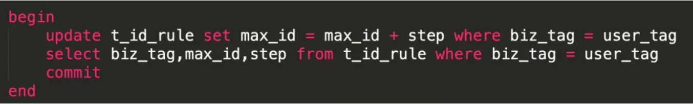

# 分布式唯一ID生成方案

## 一、原因

分布式系统中我们会对一些数据量大的业务进行分拆，如：用户表，订单表。因为数据量巨大一张表无法承接，就会对其进行分库分表。

但一旦涉及到分库分表，就会引申出分布式系统中唯一主键ID的生成问题，永不迁移数据和避免热点的文章中要求需要唯一ID的特性：

- 整个系统ID唯一
- ID是数字类型，而且是**趋势递增**的
- ID简短，查询效率快

**什么是递增？**如：第一次生成的ID为12，下一次生成的ID是13，再下一次生成的ID是14。这个就是生成ID递增。

**什么是趋势递增？**如：在一段时间内，生成的ID是递增的趋势。如：再一段时间内生成的ID在【0，1000】之间，过段时间生成的ID在【1000，2000】之间。但在【0-1000】区间内的时候，ID生成有可能第一次是12，第二次是10，第三次是14。

##　二、分布式ID的几种生成方案

### 2.1、UUID

这个方案是小伙伴们第一个能过考虑到的方案

**优点：**

- 代码实现简单。
- 本机生成，没有性能问题
- 因为是全球唯一的ID，所以迁移数据容易

**缺点：**

- 每次生成的ID是无序的，无法保证趋势递增
- UUID的字符串存储，查询效率慢
- 存储空间大
- ID本事无业务含义，不可读

**应用场景：**

- 类似生成token令牌的场景
- 不适用一些要求有趋势递增的ID场景

### 2.2、MySQL主键自增

这个方案就是利用了MySQL的主键自增auto_increment，默认每次ID加1。

**优点：**

- 数字化，id递增
- 查询效率高
- 具有一定的业务可读

**缺点：**

- 存在单点问题，如果mysql挂了，就没法生成iD了
- 数据库压力大，高并发抗不住

###　2.3、MySQL多实例主键自增

这个方案就是解决mysql的单点问题，在auto_increment基本上面，设置step步长


每台的初始值分别为1,2,3...N，步长为N（这个案例步长为4）

**优点：**

- 解决了单点问题

**缺点：**

- 一旦把步长定好后，就无法扩容；而且单个数据库的压力大，数据库自身性能无法满足高并发

**应用场景：**

- 数据不需要扩容的场景

### 2.4、雪花snowflake算法

这个算法网上介绍了很多，老顾这里就不详细介绍。雪花算法生成64位的二进制正整数，然后转换成10进制的数。64位二进制数由如下部分组成：


- 1位标识符：始终是0
- 41位时间戳：41位时间截不是存储当前时间的时间截，而是存储时间截的差值（当前时间截 - 开始时间截 )得到的值，这里的的开始时间截，一般是我们的id生成器开始使用的时间，由我们程序来指定的
- 10位机器标识码：可以部署在1024个节点，如果机器分机房（IDC）部署，这10位可以由 5位机房ID + 5位机器ID 组成
- 12位序列：毫秒内的计数，12位的计数顺序号支持每个节点每毫秒(同一机器，同一时间截)产生4096个ID序号

**优点：**

- 此方案每秒能够产生409.6万个ID，性能快
- 时间戳在高位，自增序列在低位，整个ID是趋势递增的，按照时间有序递增
- 灵活度高，可以根据业务需求，调整bit位的划分，满足不同的需求

**缺点：**

- 依赖机器的时钟，如果服务器时钟回拨，会导致重复ID生成

在分布式场景中，服务器时钟回拨会经常遇到，一般存在10ms之间的回拨；小伙伴们就说这点10ms，很短可以不考虑吧。但此算法就是建立在毫秒级别的生成方案，一旦回拨，就很有可能存在重复ID。

### 2.5、Redis生成方案

利用redis的incr原子性操作自增，一般算法为：

年份 + 当天距当年第多少天 + 天数 + 小时 + redis自增

**优点：**

- 有序递增，可读性强

**缺点：**

- 占用带宽，每次要向redis进行请求

整体测试了这个性能如下：

```
需求：同时10万个请求获取ID
1、并发执行完耗时：9s左右
2、单任务平均耗时：74ms
3、单线程最小耗时：不到1ms
4、单线程最大耗时：4.1s
```

性能还可以，如果对性能要求不是太高的话，这个方案基本符合老顾的要求。

## 三、美团ID生成方案

### 3.1、改造数据库主键自增

根据数据库自增主键的特性,可以实现分布式ID,这个ID比较简短明了，适合做userId，正好符合如何永不迁移数据和避免热点? 根据服务器指标分配数据量(揭秘篇)文章中的ID的需求。但这个方案有严重的问题：

- 一旦步长定下来，不容易扩容
- 数据库压力山大

> 是因为我们每次获取ID的时候，都要去数据库请求一次。那我们可以不可以不要每次去取？
>
> 思路我们可以请求数据库得到ID的时候，可设计成获得的ID是一个ID区间段。


上图中，有张ID规则表：

> 1、id表示为主键，无业务含义。
>
> 2、biz_tag为了表示业务，因为整体系统中会有很多业务需要生成ID，这样可以共用一张表维护
>
> 3、max_id表示现在整体系统中已经分配的最大ID
>
> 4、desc描述
>
> 5、update_time表示每次取的ID时间

实际业务整体流程:

> 1、【用户服务】在注册一个用户时，需要一个用户ID；会请求【生成ID服务(是独立的应用)】的接口
>
> 2、【生成ID服务】会去查询数据库，找到user_tag的id，现在的max_id为0，step=1000
>
> 3、【生成ID服务】把max_id和step返回给【用户服务】；并且把max_id更新为max_id = max_id + step，即更新为1000
>
> 4、【用户服务】获得max_id=0，step=1000；
>
> 5、 这个用户服务可以用ID=【max_id + 1，max_id+step】区间的ID，即为【1，1000】
>
> 6、【用户服务】会把这个区间保存到jvm中
>
> 7、【用户服务】需要用到ID的时候，在区间【1，1000】中依次获取id，可采用AtomicLong中的getAndIncrement方法。
>
> 8、如果把区间的值用完了，再去请求【生产ID服务】接口，获取到max_id为1000，即可以用【max_id + 1，max_id+step】区间的ID，即为【1001，2000】

这个方案就非常完美的解决了数据库自增的问题，而且可以自行定义max_id的起点，和step步长，非常方便扩容。

而且也解决了数据库压力的问题，因为在一段区间内，是在jvm内存中获取的，而不需要每次请求数据库。即使数据库宕机了，系统也不受影响，ID还能维持一段时间。

### 3.2 竞争问题

以上方案中，如果是多个用户服务，同时获取ID，同时去请求【ID服务】，在获取max_id的时候会存在并发问题

> 如用户服务A，取到的max_id=1000 ;用户服务B取到的也是max_id=1000，那就出现了问题，Id重复了。那怎么解决？

其实方案很多，加分布式锁，保证同一时刻只有一个用户服务获取max_id。当然也可以用数据库自身的锁去解决。



利用事务方式加行锁，上面的语句，在没有执行完之前，是不允许第二个用户服务请求过来的，第二个请求只能阻塞。

### 3.2 突发阻塞问题


上图中，多个用户服务获取到了各自的ID区间，在高并发场景下，ID用的很快，如果3个用户服务在某一时刻都用完了，同时去请求【ID服务】。因为上面提到的竞争问题，所有只有一个用户服务去操作数据库，其他二个会被阻塞。

> 实际场景中，出现的现象就是一会儿突然系统耗时变长，一会儿好了，就是这个原因导致的

### 3.4 双 buffer 方案

在一般的系统设计中，双buffer会经常看到，怎么去解决上面的问题也可以采用双buffer方案。


在设计的时候，采用双buffer方案，上图的流程：

> 1、当前获取ID在buffer1中，每次获取ID在buffer1中获取
>
> 2、当buffer1中的Id已经使用到了100，也就是达到区间的10%
>
> 3、达到了10%，先判断buffer2中有没有去获取过，如果没有就立即发起请求获取ID线程，此线程把获取到的ID，设置到buffer2中。
>
> 4、如果buffer1用完了，会自动切换到buffer2
>
> 5、buffer2用到10%了，也会启动线程再次获取，设置到buffer1中
>
> 6、依次往返

双buffer的方案，这样就达到了业务场景用的ID，都是在jvm内存中获得的，从此不需要到数据库中获取了。允许数据库宕机时间更长了。

因为会有一个线程，会观察什么时候去自动获取。两个buffer之间自行切换使用。就解决了突发阻塞的问题。

> 当然此方案美团还做了一些别的优化，监控ID使用频率，自动设置步长step，从而达到对ID节省使用。