## 一、网络基础

### 1.**session 和 cookie 是什么，有什么区别**

* cookie

  HTTP Cookie（也叫 Web Cookie或浏览器 Cookie）是服务器发送到用户浏览器并保存在本地的一小块数据，它会在浏览器下次向同一服务器再发起请求时被携带并发送到服务器上。通常，它用于告知服务端两个请求是否来自同一浏览器，如保持用户的登录状态。Cookie 使基于无状态的 HTTP 协议记录稳定的状态信息成为了可能。

  Cookie 主要用于以下三个方面：

  - 会话状态管理（如用户登录状态、购物车、游戏分数或其它需要记录的信息）
  - 个性化设置（如用户自定义设置、主题等）
  - 浏览器行为跟踪（如跟踪分析用户行为等）

* session

  Session 代表着服务器和客户端一次会话的过程。Session 对象存储特定用户会话所需的属性及配置信息。这样，当用户在应用程序的 Web 页之间跳转时，存储在 Session 对象中的变量将不会丢失，而是在整个用户会话中一直存在下去。当客户端关闭会话，或者 Session 超时失效时会话结束。

* 不同之处

  * 作用范围不同

    Cookie 保存在客户端（浏览器），Session 保存在服务器端。

  * 存取方式的不同

    Cookie 只能保存 ASCII，Session 可以存任意数据类型，一般情况下我们可以在 Session 中保持一些常用变量信息，比如说 UserId 等。

  * 有效期不同

    Cookie 可设置为长时间保持，比如我们经常使用的默认登录功能，Session 一般失效时间较短，客户端关闭或者 Session 超时都会失效。

  * 隐私策略不同

    Cookie 存储在客户端，比较容易遭到不法获取，早期有人将用户的登录名和密码存储在 Cookie 中导致信息被窃取；Session 存储在服务端，安全性相对 Cookie 要好一些。

  * 存储大小不同

     单个 Cookie 保存的数据不能超过 4K，Session 可存储数据远高于 Cookie。

* 服务端怎么设置cookie?

  在 Http-Header 里设置 `Set-Cookie`

### 2.**在浏览器输入一个网址会发生什么**

访问 https://toutiao.com 过程中发生了什么    

- dns（nslookup, dig） -> tcp -> http -> https（SSL） 
- 网关 -> service -> client 
- 浏览器渲染

3. **三次握手过程**


* 为什么需要三次握手？

  三次握手的目的是建立可靠的通信信道，说到通讯，简单来说就是数据的发送与接收，而三次握手最主要的目的就是 双方确认自己与对方的发送与接收是正常的。

  * 第一次握手：
    Client 什么都不能确认；
    Server 确认了对方发送正常 
  * 第二次握手：
    Client 确认了：自己发送、接收正常，对方发送、接收正常；
    Server 确认了：自己接收正常，对方发 送正常
  * 第三次握手：
    Client 确认了：自己发送、接收正常，对方发送、接收正常；
    Server 确认了：自己发送、接收正常， 对方发送接收正常\

* 四次挥手

  

  * 客户端-发送一个 FIN，用来关闭客户端到服务器的数据传送 
  * 服务器-收到这个 FIN，它发回一 个 ACK，确认序号为收到的序号加1 。和 SYN 一样，一个 FIN 将占用一个序号 
  * 服务器-关闭与客户端的连接，发送一个FIN给客户端
  * 客户端-发回 ACK 报文确认，并将确认序号设置为收到序号加1

### 3.**为什么需要四次挥手**

任何一方都可以在数据传送结束后发出连接释放的通知，待对方确认后进入半关闭状态。当另一方也没有数据再发送 的时候，则发出连接释放通知，对方确认后就完全关闭了TCP连接

### 4.**为啥挥手等待时间（TIME_WAIT）有个2倍最大报文时长（2MSL）**

通过四次挥手过程可知，由于 A 发送 FIN, B 回复 ACK，B 发送 FIN，第四步需要等待 A 回复 ACK，B 才可以释放这个 TCP 连接，无需等待时间。 但是对于 A 来说，不能确定 B 是否受到 ACK，那么可能会出现的两种情况：

* B 没有收到 ACK，会超时重传 FIN，A 再次接受到 FIN，会再次发送 ACK
* B 收到了 ACK，也不会再发送任何信息

这两种情况都需要 A 等待，为了防止这种情况发生，所以要取这两种情况中最坏的情况，这种最快的情况就是 ACK 消息最大的存活时间（MSL） + 来自 B 重新发送的 FIN 消息的最大存活时间（MSL）= 2MSL

等待超过这个时间，A 就可以放心的释放 TCP 占用的资源

* SYN FLOOD 攻击

  syn flood 是一种经典的 ddos攻击手段，这里面用到了TCP 三次握手存在的漏洞。
  在上面的图中，可以看到当服务端接收到 SYN 后进入 SYN-RECV 状态，此时的连接称为**半连接**，同时会被服务端写入一个 半连接队列。
  想象一下，如果攻击者在短时间内不断的向服务端发送大量的 SYN 包而不响应，那么服务器的 半连接队列很快会被写满，从而导致无法工作。
  实现 syn flood 的手段，可以通过伪造源 IP 的方式，这样服务器的响应就永远到达不了客户端(握手无法完成)；
  当然，通过设定客户端防火墙规则也可以达到同样的目的。

  对 syn flood 实现拦截是比较困难的，可以通过启用 syn_cookies 的方式实现缓解，但这通常不是最佳方案。
  最好的办法是通过专业的防火墙来解决，基本上所有的云计算大T 都具备这个能力。

### 5.**握手成功后协商什么数据**

MTU 与 MSS

- `MTU`：一个网络包的最大长度，以太网中一般为 `1500` 字节；
- `MSS`：除去 IP 和 TCP 头部之后，一个网络包所能容纳的 TCP 数据的最大长度；

协商双方的 MSS 值，当 TCP 层l发先数据超过 MSS 后，就会先进行分片，这样它形成的 IP 包长度也不会大于 MTU，就不需要 IP 分片，达到最佳传输效能。

MSS 在每次执行TCP 发送消息的函数时，都会重新计算一次 MSS，再进行分段操作

经过 TCP 层分片后，如果一个 TCP 分片丢失后，**进行重发时也是以 MSS 为单位**，而不用重传所有的分片，大大增加了重传的效率。

### 6.**子网掩码的作用是什么?**

它是用来划分IP地址中哪一部分是网络号，哪一部分是机器号

子网掩码就是用来遮掩IP地址并划分网段的工具，根据**遮掩的位数不同**来划分不同的网段。

1. **TCP为啥可靠**

   * 校验和

   * 序列号

   * 确认应答

   * 超时重传

   * 连接管理

   * 流量控制

     TCP根据接收端对数据的处理能力，决定发送端的发送速度，这个机制就是流量控制。

   * 拥塞控制

     对于数据的发送端所使用的窗口大小就是拥塞窗口了，拥塞窗口不代表缓存，拥塞窗口指某一源端数据流在一个RTT内可以最多发送的[数据包](http://baike.baidu.com/view/25880.htm)数

### 7. **TCP 滑动窗口、阻塞避免**

* 滑动窗口

  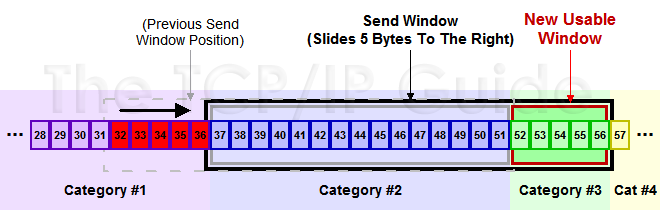

  * 发送窗口：已经发送，还没收到 ACK 的部分
  * 可用窗口：还没发送，但是接收端允许发送的部分

  TCP并不是每一个报文段都会回复ACK的，可能会对两个报文段发送一个ACK，也可能会对多个报文段发送1个ACK【累计ACK】，比如说发送方有1/2/3 3个报文段，先发送了2,3 两个报文段，但是接收方期望收到1报文段，这个时候2,3报文段就只能放在缓存中等待报文1的空洞被填上，如果报文1，一直不来，报文2/3也将被丢弃，如果报文1来了，那么会发送一个ACK对这3个报文进行一次确认。

  举一个例子来说明一下滑动窗口的原理：

  1. 假设32~45 这些数据，是上层Application发送给TCP的，TCP将其分成四个Segment来发往internet

  2. seg1 32~34 seg3 35~36 seg3 37~41 seg4 42~45  这四个片段，依次发送出去，此时假设接收端之接收到了seg1 seg2 seg4

  3. 此时接收端的行为是回复一个ACK包说明已经接收到了32~36的数据，并将seg4进行缓存（保证顺序，产生一个保存seg3 的hole）

  4. 发送端收到ACK之后，就会将32~36的数据包从发送并没有确认切到发送已经确认，提出窗口，这个时候窗口向右移动

  5. 假设接收端通告的Window Size仍然不变，此时窗口右移，产生一些新的空位，这些是接收端允许发送的范畴

  6. 对于丢失的seg3，如果超过一定时间，TCP就会重新传送（重传机制），重传成功会seg3 seg4一块被确认，不成功，seg4也将被丢弃

  就是不断重复着上述的过程，随着窗口不断滑动，将真个数据流发送到接收端，实际上接收端的Window Size通告也是会变化的，接收端根据这个值来确定何时及发送多少数据，从对数据流进行流控。

* 通告窗口是接受数据端使用的窗口大小，用来告知发送端接收端的缓存大小，以此可以控制发送端发送数据的大小，从而达到流量控制的目的。


* 阻塞避免

  阻塞避免是发送方使用 的[流量控制](http://baike.baidu.com/view/190232.htm)，而通告窗口则是接收方进行的流量控制。前者是发送方感受到的[网络拥塞](http://baike.baidu.com/view/1452069.htm)的估 计，而后者则与接收方在该连接上的可用[缓存大小](http://baike.baidu.com/view/3749508.htm)有关。

### 8. **什么是快重传**

* 超时重传

  当发送端发送数据，发生丢包时，则丢掉的包的ACK一直不会返回。此时发送端就一直等那个ACK返回，若超时，则重传该数据包。对于超时时间RTO，有很多复杂的算法。RTO的选择很重要，选短了，可能只是返回时间长但并未丢包，却当做丢包。选长了，迟迟不发丢的包也是个问题。

* 快速重传

  丢包了，接收端重复发送丢包前的ACK，发送端每发送一个包过来，接收端就发相同的ACK回去，这个ACK是对丢包之前的确认。当接收端连续收到3个相同的ACK，它就知道发生丢包了，根据ACK序号就能重发丢的包。

### 9. **tcp连接client和server有哪些状态，time_wait状态**（主动关闭连接的一方有的状态）

* 为什么要拥有 TIME_WAIT 的状态
  * 防止具有相同「四元组」的「旧」数据包被收到；
  * 保证「被动关闭连接」的一方能被正确的关闭，即保证最后的 ACK 能让被动关闭方接收，从而帮助其正常关闭；
* TIME_WAIT 过多的危害
  * 内存资源占用；
  * 端口资源的占用，一个 TCP 连接至少消耗一个本地端口；

### 10. **UDP用在啥协议里了**

* UDP支持的协议：

  NFS（网络文件系统）、SNMP（简单网络管理系统）、DNS（主域名称系统）、TFTP（通用文件传输系统）

* TCP 支持的协议

  Telnet(远程登录)、FTP(文件传输协议)、SMTP(简单邮件传输协议)。TCP用于传输数据量大，可靠性要求高的应用。

### 11. **https是安全的，说一下为啥安全，加密过程说下，https原理，数字签名，数字证书，非对称加密[算法](https://www.nowcoder.com/jump/super-jump/word?word=算法)过程，有什么问题**


* 为什么安全？

   HTTPS = HTTP + SSL / TLS，数据传输过程是加密的

* 数字证书

  数字 CA (Certification Authority)证书，证书是需要申请的，并由专门的数字证书认证机构(CA)通过非常严格的审核之后颁发的电子证书 (当然了是要钱的，安全级别越高价格越贵)。颁发证书的同时会产生一个私钥和公钥。私钥由服务端自己保存，不可泄漏。公钥则是附带在证书的信息中，可以公开的。

  证书本身也附带一个证书电子签名，这个签名用来验证证书的完整性和真实性，可以防止证书被篡改。

* 非对称加密算法过程

  甲方生成一对密钥并将其中的一把作为公钥对外公开；

  得到该公钥的乙方使用公钥对机密信息进行加密后再发送给甲方；

  甲方再用自己保存的私钥对加密后的信息进行解密。

* 

### 12. **ssl协议建立连接的过程说一下**

- 商定双方通信所使用的的 TLS 版本 (例如 TLS1.0, 1.2, 1.3等等)；
- 确定双方所要使用的密码组合；
- 客户端通过服务器的公钥和数字证书 (上篇文章已有介绍)上的数字签名验证服务端的身份；
- 生成会话密钥，该密钥将用于握手结束后的对称加密。


### 13. **https 如何抓包（Fiddler or Charles）**

Charles本身是一个协议代理工具，如果只是普通的HTTP请求，因为数据本身没经过再次加密，因此作为代理可以知道所有客户端发送到服务端的请求内容以及服务端返回给客户端的数据内容，这也就是抓包工具能够将数据传输内容直接展现出来的原因。

Charles需要做的事情是对客户端伪装服务端，对服务端伪装客户端，具体

- 截获真实客户端的HTTPS请求，伪装客户端向真实服务端发送HTTPS请求
- 接受真实服务器响应，用Charles自己的证书伪装服务端向真实客户端发送数据内容

### 14. **状态码 301，302，401，403、502是什么错误?详细说一-下**

**3开头 （请求被重定向）表示要完成请求，需要进一步操作。 通常，这些状态代码用来重定向。**

301  （永久移动） 请求的网页已永久移动到新位置。 服务器返回此响应（对 GET 或 HEAD 请求的响应）时，会自动将请求者转到新位置。
302  （临时移动） 服务器目前从不同位置的网页响应请求，但请求者应继续使用原有位置来进行以后的请求。

**4开头 （请求错误）这些状态代码表示请求可能出错，妨碍了服务器的处理。**

401  （未授权） 请求要求身份验证。 对于需要登录的网页，服务器可能返回此响应。 
403  （禁止） 服务器拒绝请求。

**5开头（服务器错误）这些状态代码表示服务器在尝试处理请求时发生内部错误。 这些错误可能是服务器本身的错误，而不是请求出错。**

502（错误网关） 服务器作为网关或代理，从上游服务器收到无效响应。 

### 14. **http请求头，expires，cache-control字段**

典型的请求头有：

* User-Agent：产生请求的浏览器类型。

* Accept：客户端可识别的内容类型列表。

* Host：请求的主机名，允许多个域名同处一个IP地址，即虚拟主机。

* expires：本地请求资源的缓存过期时间

* cache-control 

  可以用来设置静态资源缓存，必须由服务端开启才起作用

  **cache-control: max-age=0这和按F5键是一样的效果**

### 15. get 与 post 的区别（是否可以缓存）

| 分类             | GET                                                          | POST                                                         |
| :--------------- | :----------------------------------------------------------- | :----------------------------------------------------------- |
| 后退按钮/刷新    | 无害                                                         | 数据会被重新提交（浏览器应该告知用户数据会被重新提交）。     |
| 书签             | 可收藏为书签                                                 | 不可收藏为书签                                               |
| 缓存             | 能被缓存                                                     | 不能缓存                                                     |
| 编码类型         | application/x-www-form-urlencoded                            | application/x-www-form-urlencoded 或 multipart/form-data。为二进制数据使用多重编码。 |
| 历史             | 参数保留在浏览器历史中。                                     | 参数不会保存在浏览器历史中。                                 |
| 对数据长度的限制 | 是的。当发送数据时，GET 方法向 URL 添加数据；URL 的长度是受限制的（URL 的最大长度是 2048 个字符）。 | 无限制。                                                     |
| 对数据类型的限制 | 只允许 ASCII 字符。                                          | 没有限制。也允许二进制数据。                                 |
| 安全性           | 与 POST 相比，GET 的安全性较差，因为所发送的数据是 URL 的一部分。在发送密码或其他敏感信息时绝不要使用 GET ！ | POST 比 GET 更安全，因为参数不会被保存在浏览器历史或 web 服务器日志中。 |
| 可见性           | 数据在 URL 中对所有人都是可见的。                            | 数据不会显示在 URL 中。                                      |

### 16. TCP/IP 模型与 OSI 模型

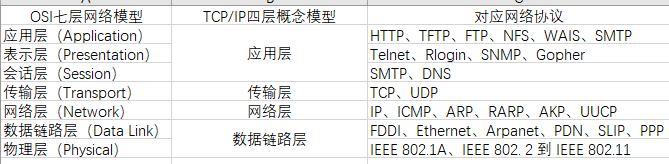

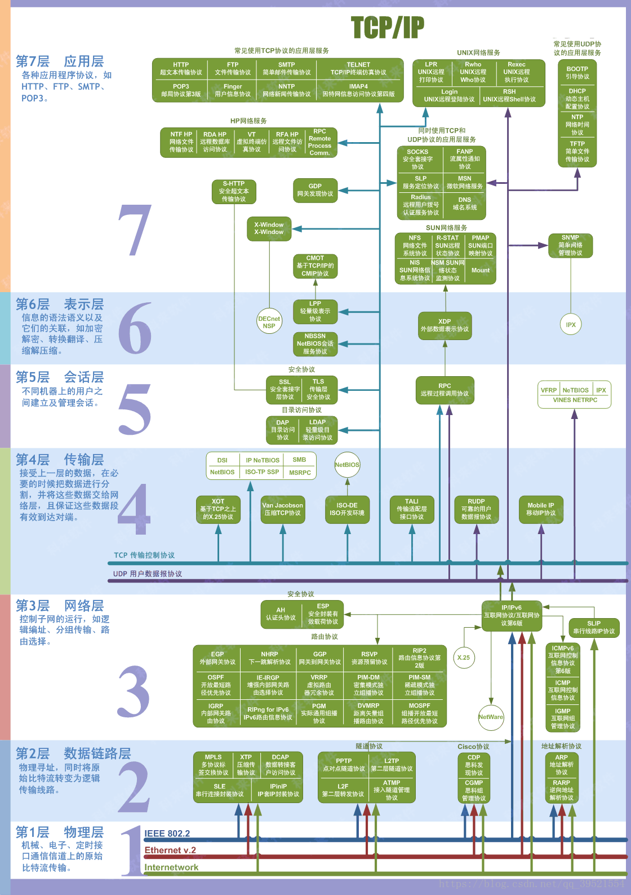

### 17. Http建立连接的过程

第1步：TCP通过三次握手建立双方连接；
第2步：客户端通过发送请求报文及请求数据给服务端；
第3步：服务端返回响应报文及响应数据给客户端；
第4步：TCP通过四次挥手进行断开连接。

### 18. 重定向与转发的区别

* 转发（forword）

  是服务器请求资源,服务器直接访问目标地址的URL,把那个URL的响应内容读取过来,然后把这些内容再发给浏览器.浏览器根本不知道服务器发送的内容从哪里来的,因为这个跳转过程实在服务器实现的，并不是在客户端实现的所以客户端并不知道这个跳转动作，所以它的地址栏还是原来的地址.

* 重定向（redirect）

  是服务端根据逻辑,发送一个状态码,告诉浏览器重新去请求那个地址.所以地址栏显示的是新的URL.

转发是服务器行为，重定向是客户端行为。

* 区别

  * 地址更新

    forward是服务器请求资源,服务器直接访问目标地址的URL,把那个URL的响应内容读取过来,然后把这些内容再发给浏览器.浏览器根本不知道服务器发送的内容从哪里来的,所以它的地址栏还是原来的地址.

    redirect是服务端根据逻辑,发送一个状态码,告诉浏览器重新去请求那个地址.所以地址栏显示的是新的URL.

  * 数据是否共享

    forward:转发页面和转发到的页面可以共享request里面的数据.
    redirect:不能共享数据.

  * 效率

    forward:高.
    redirect:低.

### 19. linux最多可以建立多少个tcp连接，client端，server端，超过了怎么办

- **TCP连接的客户端机：**每一个ip可建立的TCP连接理论受限于ip_local_port_range参数，也受限于65535。但可以通过配置多ip的方式来加大自己的建立连接的能力。
- **TCP连接的服务器机：**每一个监听的端口虽然理论值很大，但这个数字没有实际意义。最大并发数取决你的内存大小，每一条静止状态的TCP连接大约需要吃3
  .3K的内存。
- error 1040: Too many connections

## 二、IO 

### 1. IO 模型的演进

* **阻塞式IO模型（blocking IO）**

  最基础的I/O模型就是阻塞I/O模型，也是最简单的模型。所有的操作都是顺序执行的

  阻塞IO模型中，用户空间的应用程序执行一个系统调用（recvform），会导致应用程序被阻塞，直到内核缓冲区的数据准备好，并且将数据从内核复制到用户进程。最后进程才被系统唤醒处理数据

  在R1、R2连续两个阶段，整个进程都被阻塞

  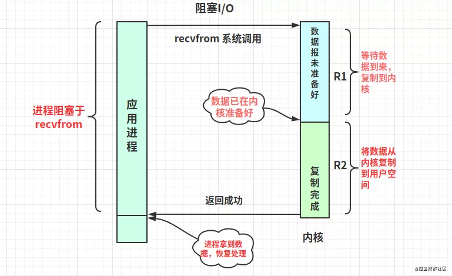

* **非阻塞式IO模型（nonblocking IO）**

  - 非阻塞IO也是一种同步IO。它是基于轮询（polling）机制实现，在这种模型中，套接字是以非阻塞的形式打开的。就是说I/O操作不会立即完成，但是I/O操作会返回一个错误代码(EWOULDBLOCK)，提示操作未完成
  - 轮询检查内核数据，如果数据未准备好，则返回EWOULDBLOCK。进程再继续发起recvfrom调用，当然你可以暂停去做其他事
  - 直到内核数据准备好，再拷贝数据到用户空间，然后进程拿到非错误码数据，接着进行数据处理。需要注意，拷贝数据整个过程，进程仍然是属于阻塞的状态
  - 进程在R2阶段阻塞，虽然在R1阶段没有被阻塞，但是需要不断轮询

* **多路复用I/O (IO multiplexing)**

  - **一般后端服务都会存在大量的socket连接，如果一次能查询多个套接字的读写状态，若有任意一个准备好，那就去处理它，效率会高很多**。这就是“I/O多路复用”，多路是指多个socket套接字，复用是指复用同一个进程
  - linux提供了select、poll、epoll等多路复用I/O的实现方式，是现阶段主流框架常用的高性能I/O模型
  - select和poll、epoll是阻塞调用
  - 与阻塞IO不同，select不会等到socket数据全部到达再处理，而是有了一部分socket数据准备好就会恢复用户进程来处理。怎么知道有一部分数据在内核准备好了呢？答案：交给了系统系统处理吧
  - 进程在R1、R2阶段也是阻塞；不过在R1阶段有个技巧，在多进程、多线程编程的环境下，我们可以只分配一个进程（线程）去阻塞调用select，其他线程不就可以解放了吗
  - Java NIO 基于多路复用IO模型

  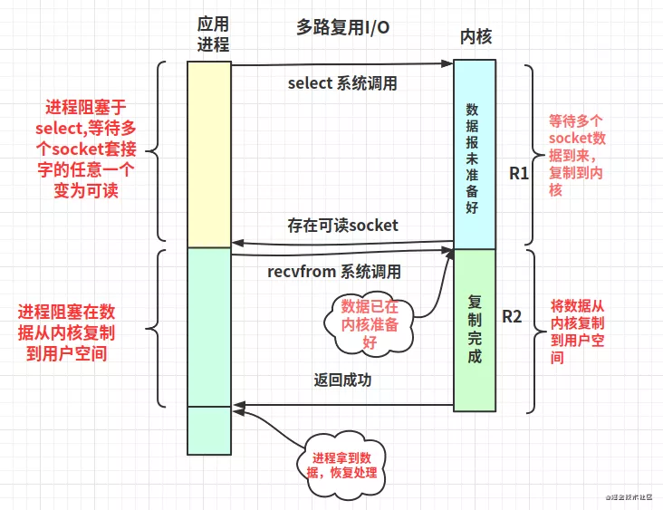

* **信号驱动式I/O (SIGIO)**

  - 需要提供一个信号捕捉函数，并和socket套接字关联；发起sigaction调用之后进程就能解放去处理其他事
  - 当数据在内核准备好后，进程会收到一个SIGIO信号，继而中断去运行信号捕捉函数，调用recvfrom把数据从内核读取到用户空间，再处理数据
  - 可以看出用户进程是不会阻塞在R1阶段，但R2还是会阻塞等待
  - 性能优于多路复用I/O

  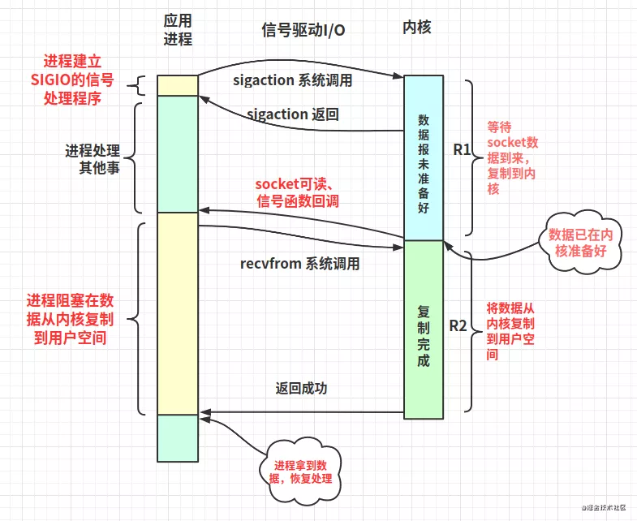

  

* **异步IO (POSIX的aio_系列函数)**

  - 相对同步IO，异步IO在用户进程发起异步读（aio_read）系统调用之后，无论内核缓冲区数据是否准备好，都不会阻塞当前进程；在aio_read系统调用返回后进程就可以处理其他逻辑
  - socket数据在内核就绪时，系统直接把数据从内核复制到用户空间，然后再使用信号通知用户进程
  - R1、R2两阶段时进程都是非阻塞的
  - 性能高于信号驱动式I/O
  - Java AIO 基于异步 IO 模型

  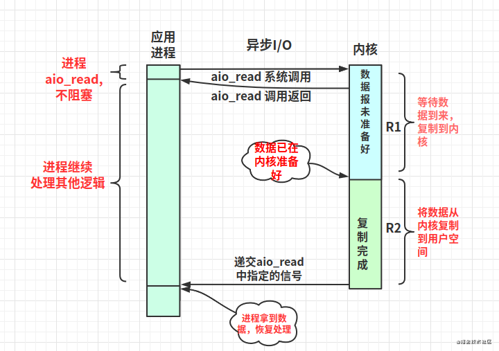

### 2. **select**

* 执行步骤

  1）使用copy_from_user从用户空间拷贝fd_set到内核空间

  2）注册回调函数__pollwait

  3）遍历所有fd，调用其对应的poll方法（对于socket，这个poll方法是sock_poll，sock_poll根据情况会调用到tcp_poll,udp_poll或者datagram_poll）

  4）以tcp_poll为例，其核心实现就是__pollwait，也就是上面注册的回调函数

  5）__pollwait的主要工作就是把current（当前进程）挂到设备的等待队列中，不同的设备有不同的等待队列，对于tcp_poll来说，其等待队列是sk->sk_sleep（注意把进程挂到等待队列中并不代表进程已经睡眠了）。在设备收到一条消息（网络设备）或填写完文件数据（磁盘设备）后，会唤醒设备等待队列上睡眠的进程，这时current便被唤醒了

  6）poll方法返回时会返回一个描述读写操作是否就绪的mask掩码，根据这个mask掩码给fd_set赋值

  7）如果遍历完所有的fd，还没有返回一个可读写的mask掩码，则会调用schedule_timeout（调用select的进程，也就是current）进入睡眠

  8） 当设备驱动发生自身资源可读写后，会唤醒其等待队列上睡眠的进程。如果超过一定的超时时间（timeout指定），还是没人唤醒，则调用select的进程会重新被唤醒获得CPU，进而重新遍历fd，判断有没有就绪的fd

  9）把fd_set从内核空间拷贝到用户空间

* 缺点

  * 每次调用select，都需要把fd集合从用户态拷贝到内核态，这个开销在fd很多时会很大
  * 同时每次调用select都需要在内核遍历传递进来的所有fd，这个开销在fd很多时也很大
  * select支持的文件描述符数量太小了，默认是1024

### 3. **poll**

poll的实现和select非常相似，只是描述fd集合的方式不同，poll使用pollfd结构而不是select的fd_set结构，其他的都差不多,管理多个描述符也是进行轮询，根据描述符的状态进行处理，但是poll没有最大文件描述符数量的限制。poll和select同样存在一个缺点就是，包含大量文件描述符的数组被整体复制于用户态和内核的地址空间之间，而不论这些文件描述符是否就绪，它的开销随着文件描述符数量的增加而线性增大。

- 它将用户传入的数组拷贝到内核空间

- 然后查询每个fd对应的设备状态：

- - 如果设备就绪 在设备等待队列中加入一项继续遍历
  - 若遍历完所有fd后，都没发现就绪的设备 挂起当前进程，直到设备就绪或主动超时，被唤醒后它又再次遍历fd。这个过程经历多次无意义的遍历。

没有最大连接数限制，因其基于链表存储，其缺点： - 大量fd数组被整体复制于用户态和内核地址空间间，而不管是否有意义 - 如果报告了fd后，没有被处理，那么下次poll时会再次报告该fd

### 4. **epoll**

* epoll 调用步骤

  - 调用epoll_create，会在内核cache里建个**红黑树**用于存储以后epoll_ctl传来的socket，同时也会再建立一个**rdllist双向链表**用于存储准备就绪的事件。当epoll_wait调用时，仅查看这个rdllist双向链表数据即可
  - epoll_ctl在向epoll对象中添加、修改、删除事件时，是在rbr红黑树中操作的，非常快
  - 添加到epoll中的事件会与设备(如网卡)建立回调关系，设备上相应事件的发生时会调用回调方法，把事件加进rdllist双向链表中；这个回调方法在内核中叫做ep_poll_callback

* epoll 的两种触发方式

  - epoll有EPOLLLT和EPOLLET两种触发模式，LT是默认的模式，ET是“高速”模式（只支持no-block socket）

  - - LT（水平触发）模式下，只要这个文件描述符还有数据可读，**每次epoll_wait都会触发它的读事件**
    - ET（边缘触发）模式下，检测到有I/O事件时，通过 epoll_wait 调用会得到有事件通知的文件描述符，对于文件描述符，如可读，则必须将该文件描述符一直读到空（或者返回EWOULDBLOCK），**否则下次的epoll_wait不会触发该事件**

* epoll 相比 select 的优点

  * 解决select三个缺点

  * - **对于第一个缺点**：epoll的解决方案在epoll_ctl函数中。每次注册新的事件到epoll句柄中时（在epoll_ctl中指定EPOLL_CTL_ADD），会把所有的fd拷贝进内核，而不是在epoll_wait的时候重复拷贝。epoll保证了每个fd在整个过程中只会拷贝一次(epoll_wait不需要复制)
    - **对于第二个缺点**：epoll为每个fd指定一个回调函数，当设备就绪，唤醒等待队列上的等待者时，就会调用这个回调函数，而这个回调函数会把就绪的fd加入一个就绪链表。epoll_wait的工作实际上就是在这个就绪链表中查看有没有就绪的fd(不需要遍历)
    - **对于第三个缺点**：epoll没有这个限制，它所支持的FD上限是最大可以打开文件的数目，这个数字一般远大于2048，举个例子，在1GB内存的机器上大约是10万左右，一般来说这个数目和系统内存关系很大

  * epoll的高性能

  * - epoll使用了红黑树来保存需要监听的文件描述符事件，epoll_ctl增删改操作快速
    - epoll不需要遍历就能获取就绪fd，直接返回就绪链表即可
    - linux2.6 之后使用了mmap技术，数据不在需要从内核复制到用户空间，零拷贝

* epoll 的 IO 模型式异步还是同步

  同步

  - 概念定义

  - - 同步I/O操作：导致请求进程阻塞，直到I/O操作完成
    - 异步I/O操作：不导致请求进程阻塞，异步只用处理I/O操作完成后的通知，并不主动读写数据，由系统内核完成数据的读写
    - 阻塞，非阻塞：进程/线程要访问的数据是否就绪，进程/线程是否需要等待

  - 异步IO的概念是要求无阻塞I/O调用。前面有介绍到I/O操作分两阶段：R1等待数据准备好。R2从内核到进程拷贝数据。虽然epoll在2.6内核之后采用mmap机制，使得其在R2阶段不需要复制，但是它在R1还是阻塞的。因此归类到同步IO

### 5. select、epoll 的区别

select，poll，epoll都是IO多路复用机制，即可以监视多个描述符，一旦某个描述符就绪（读或写就绪），能够通知程序进行相应读写操作。 但select，poll，epoll本质上都是**同步I/O**，因为他们都需要在读写事件就绪后自己负责进行读写，也就是说这个读写过程是阻塞的，而异步I/O则无需自己负责进行读写，异步I/O的实现会负责把数据从内核拷贝到用户空间。

- select，poll实现需要自己不断轮询所有fd集合，直到设备就绪，期间可能要睡眠和唤醒多次交替。而epoll其实也需要调用epoll_wait不断轮询就绪链表，期间也可能多次睡眠和唤醒交替，但是它是设备就绪时，调用回调函数，把就绪fd放入就绪链表中，并唤醒在epoll_wait中进入睡眠的进程。虽然都要睡眠和交替，但是select和poll在“醒着”的时候要遍历整个fd集合，而epoll在“醒着”的时候只要判断一下就绪链表是否为空就行了，这节省了大量的CPU时间。这就是回调机制带来的性能提升。
- select，poll每次调用都要把fd集合从用户态往内核态拷贝一次，并且要把current往设备等待队列中挂一次，而epoll只要一次拷贝，而且把current往等待队列上挂也只挂一次（在epoll_wait的开始，注意这里的等

### 6. 零拷贝

在 Linux 中零拷贝技术主要有 3 个实现思路：用户态直接 I/O、减少数据拷贝次数以及写时复制技术。

- **用户态直接 I/O**：应用程序可以直接访问硬件存储，操作系统内核只是辅助数据传输。这种方式依旧存在用户空间和内核空间的上下文切换，硬件上的数据直接拷贝至了用户空间，不经过内核空间。因此，直接 I/O 不存在内核空间缓冲区和用户空间缓冲区之间的数据拷贝。
- **减少数据拷贝次数**：在数据传输过程中，避免数据在用户空间缓冲区和系统内核空间缓冲区之间的CPU拷贝，以及数据在系统内核空间内的CPU拷贝，这也是当前主流零拷贝技术的实现思路。
- **写时复制技术**：写时复制指的是当多个进程共享同一块数据时，如果其中一个进程需要对这份数据进行修改，那么将其拷贝到自己的进程地址空间中，如果只是数据读取操作则不需要进行拷贝操作。

**Linux 零拷贝对比**

| 拷贝方式                   | CPU拷贝 | DMA拷贝 | 系统调用   | 上下文切换 |
| -------------------------- | ------- | ------- | ---------- | ---------- |
| 传统方式（read+write）     | 2       | 2       | read/write | 4          |
| 内存映射（mmap+write）     | 1       | 2       | mmap/write | 4          |
| sendfile                   | 1       | 2       | sendfile   | 2          |
| sendfile + DMA gathor copy | 0       | 2       | sendfile   | 2          |
| splice                     | 0       | 2       | splice     | 2          |

1. 用户态直接I/O

   用户态直接 I/O 使得应用进程或运行在用户态（user space）下的库函数直接访问硬件设备，数据直接跨过内核进行传输，内核在数据传输过程除了进行必要的虚拟存储配置工作之外，不参与任何其他工作，这种方式能够直接绕过内核，极大提高了性能。

   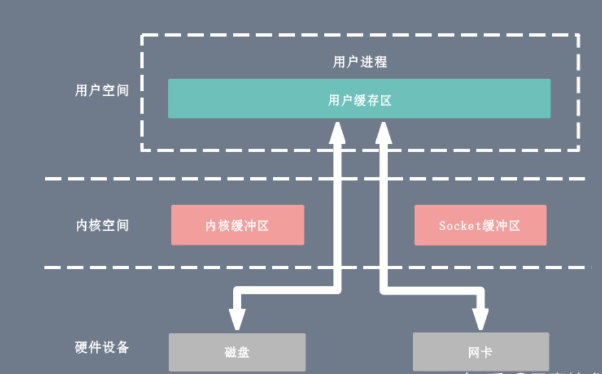

   用户态直接 I/O 只能适用于不需要内核缓冲区处理的应用程序，这些应用程序通常在进程地址空间有自己的数据缓存机制，称为自缓存应用程序，如数据库管理系统就是一个代表。其次，这种零拷贝机制会直接操作磁盘 I/O，由于 CPU 和磁盘 I/O 之间的执行时间差距，会造成大量资源的浪费，解决方案是配合异步 I/O 使用。

2. mmap + write

   一种零拷贝方式是使用 mmap + write 代替原来的 read + write 方式，减少了 1 次 CPU 拷贝操作。mmap 是 Linux 提供的一种内存映射文件方法，即将一个进程的地址空间中的一段虚拟地址映射到磁盘文件地址，mmap + write 的伪代码如下：

   ```
   tmp_buf = mmap(file_fd, len);
   write(socket_fd, tmp_buf, len);
   ```

   使用 mmap 的目的是将内核中读缓冲区（read buffer）的地址与用户空间的缓冲区（user buffer）进行映射，从而实现内核缓冲区与应用程序内存的共享，省去了将数据从内核读缓冲区（read buffer）拷贝到用户缓冲区（user buffer）的过程，然而内核读缓冲区（read buffer）仍需将数据到内核写缓冲区（socket buffer），大致的流程如下图所示：

   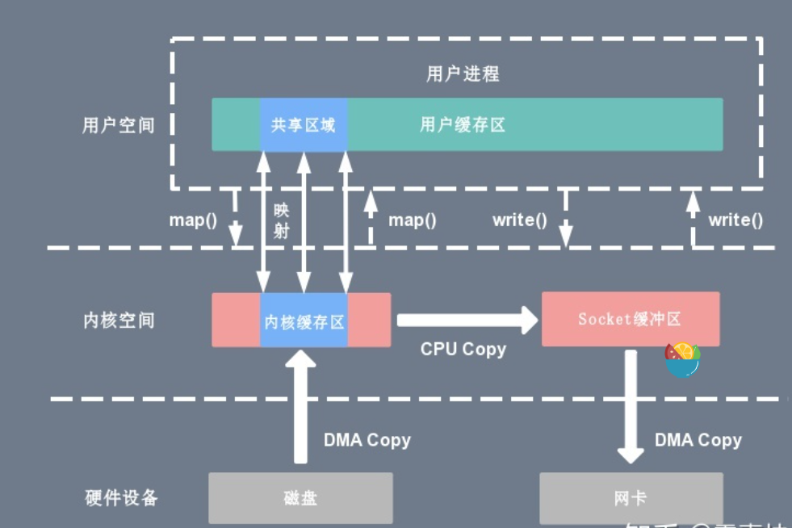

   基于 mmap + write 系统调用的零拷贝方式，整个拷贝过程会发生 4 次上下文切换，1 次 CPU 拷贝和 2 次 DMA 拷贝，用户程序读写数据的流程如下：

   1. 用户进程通过 mmap() 函数向内核（kernel）发起系统调用，上下文从用户态（user space）切换为内核态（kernel space）。
   2. 将用户进程的内核空间的读缓冲区（read buffer）与用户空间的缓存区（user buffer）进行内存地址映射。
   3. CPU利用DMA控制器将数据从主存或硬盘拷贝到内核空间（kernel space）的读缓冲区（read buffer）。
   4. 上下文从内核态（kernel space）切换回用户态（user space），mmap 系统调用执行返回。
   5. 用户进程通过 write() 函数向内核（kernel）发起系统调用，上下文从用户态（user space）切换为内核态（kernel space）。
   6. CPU将读缓冲区（read buffer）中的数据拷贝到的网络缓冲区（socket buffer）。
   7. CPU利用DMA控制器将数据从网络缓冲区（socket buffer）拷贝到网卡进行数据传输。
   8. 上下文从内核态（kernel space）切换回用户态（user space），write 系统调用执行返回。

   mmap 主要的用处是提高 I/O 性能，特别是针对大文件。对于小文件，内存映射文件反而会导致碎片空间的浪费，因为内存映射总是要对齐页边界，最小单位是 4 KB，一个 5 KB 的文件将会映射占用 8 KB 内存，也就会浪费 3 KB 内存。

   mmap 的拷贝虽然减少了 1 次拷贝，提升了效率，但也存在一些隐藏的问题。当 mmap 一个文件时，如果这个文件被另一个进程所截获，那么 write 系统调用会因为访问非法地址被 SIGBUS 信号终止，SIGBUS 默认会杀死进程并产生一个 coredump，服务器可能因此被终止。

3. sendfile

   sendfile 系统调用在 Linux 内核版本 2.1 中被引入，目的是简化通过网络在两个通道之间进行的数据传输过程。sendfile 系统调用的引入，不仅减少了 CPU 拷贝的次数，还减少了上下文切换的次数，它的伪代码如下：

   ```cpp
   sendfile(socket_fd, file_fd, len);
   ```

   通过 sendfile 系统调用，数据可以直接在内核空间内部进行 I/O 传输，从而省去了数据在用户空间和内核空间之间的来回拷贝。与 mmap 内存映射方式不同的是， sendfile 调用中 I/O 数据对用户空间是完全不可见的。也就是说，这是一次完全意义上的数据传输过程。

   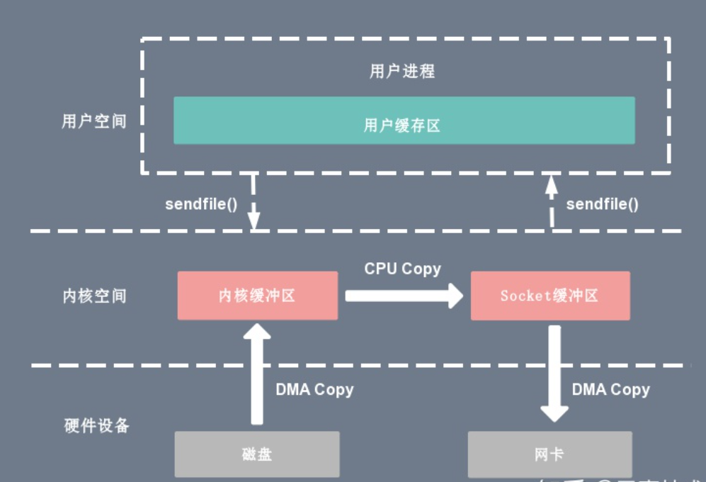

   基于 sendfile 系统调用的零拷贝方式，整个拷贝过程会发生 2 次上下文切换，1 次 CPU 拷贝和 2 次 DMA 拷贝，用户程序读写数据的流程如下：

   1. 用户进程通过 sendfile() 函数向内核（kernel）发起系统调用，上下文从用户态（user space）切换为内核态（kernel space）。
   2. CPU 利用 DMA 控制器将数据从主存或硬盘拷贝到内核空间（kernel space）的读缓冲区（read buffer）。
   3. CPU 将读缓冲区（read buffer）中的数据拷贝到的网络缓冲区（socket buffer）。
   4. CPU 利用 DMA 控制器将数据从网络缓冲区（socket buffer）拷贝到网卡进行数据传输。
   5. 上下文从内核态（kernel space）切换回用户态（user space），sendfile 系统调用执行返回。

   相比较于 mmap 内存映射的方式，sendfile 少了 2 次上下文切换，但是仍然有 1 次 CPU 拷贝操作。sendfile 存在的问题是用户程序不能对数据进行修改，而只是单纯地完成了一次数据传输过程。

4. sendfile + DMA gather copy

   Linux 2.4 版本的内核对 sendfile 系统调用进行修改，为 DMA 拷贝引入了 gather 操作。它将内核空间（kernel space）的读缓冲区（read buffer）中对应的数据描述信息（内存地址、地址偏移量）记录到相应的网络缓冲区（ socket buffer）中，由 DMA 根据内存地址、地址偏移量将数据批量地从读缓冲区（read buffer）拷贝到网卡设备中，这样就省去了内核空间中仅剩的 1 次 CPU 拷贝操作，sendfile 的伪代码如下：

   ```cpp
   sendfile(socket_fd, file_fd, len);
   ```

   在硬件的支持下，sendfile 拷贝方式不再从内核缓冲区的数据拷贝到 socket 缓冲区，取而代之的仅仅是缓冲区文件描述符和数据长度的拷贝，这样 DMA 引擎直接利用 gather 操作将页缓存中数据打包发送到网络中即可，本质就是和虚拟内存映射的思路类似。

   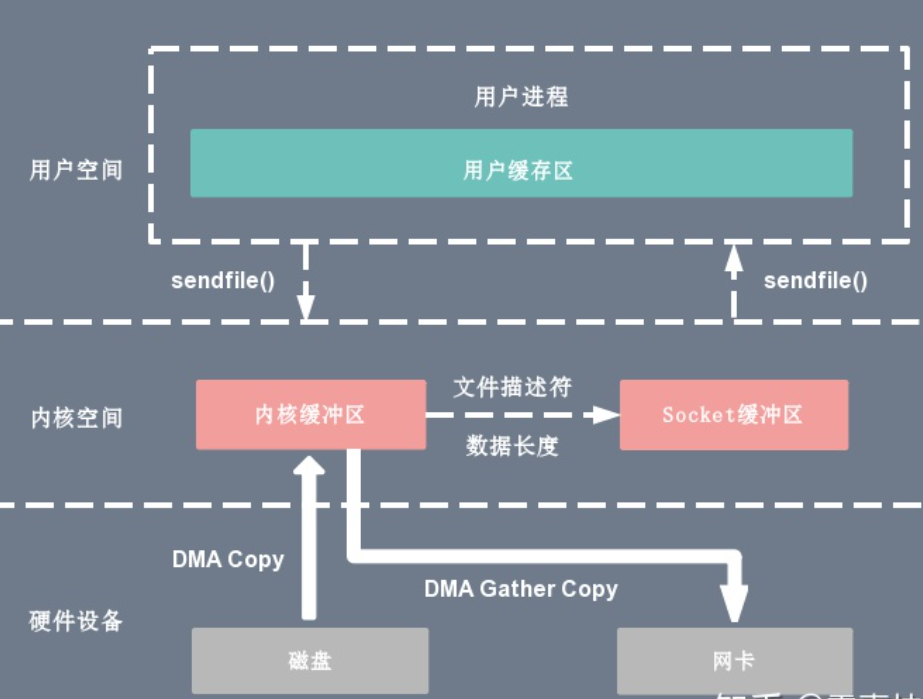

   基于 sendfile + DMA gather copy 系统调用的零拷贝方式，整个拷贝过程会发生 2 次上下文切换、0 次 CPU 拷贝以及 2 次 DMA 拷贝，用户程序读写数据的流程如下：

   1. 用户进程通过 sendfile() 函数向内核（kernel）发起系统调用，上下文从用户态（user space）切换为内核态（kernel space）。
   2. CPU 利用 DMA 控制器将数据从主存或硬盘拷贝到内核空间（kernel space）的读缓冲区（read buffer）。
   3. CPU 把读缓冲区（read buffer）的文件描述符（file descriptor）和数据长度拷贝到网络缓冲区（socket buffer）。
   4. 基于已拷贝的文件描述符（file descriptor）和数据长度，CPU 利用 DMA 控制器的 gather/scatter 操作直接批量地将数据从内核的读缓冲区（read buffer）拷贝到网卡进行数据传输。
   5. 上下文从内核态（kernel space）切换回用户态（user space），sendfile 系统调用执行返回。

   sendfile + DMA gather copy 拷贝方式同样存在用户程序不能对数据进行修改的问题，而且本身需要硬件的支持，它只适用于将数据从文件拷贝到 socket 套接字上的传输过程。

5. splice

   sendfile 只适用于将数据从文件拷贝到 socket 套接字上，同时需要硬件的支持，这也限定了它的使用范围。Linux 在 2.6.17 版本引入 splice 系统调用，不仅不需要硬件支持，还实现了两个文件描述符之间的数据零拷贝。splice 的伪代码如下：

   ```cpp
   splice(fd_in, off_in, fd_out, off_out, len, flags);
   ```

   splice 系统调用可以在内核空间的读缓冲区（read buffer）和网络缓冲区（socket buffer）之间建立管道（pipeline），从而避免了两者之间的 CPU 拷贝操作。

   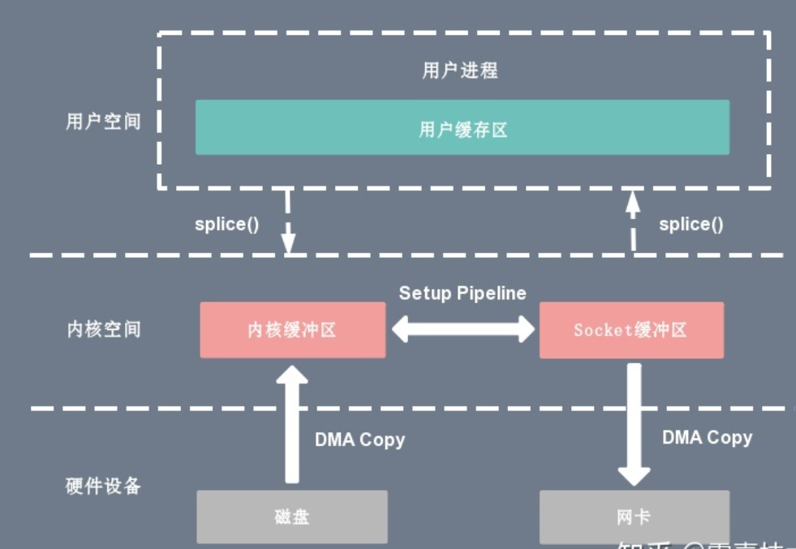

   基于 splice 系统调用的零拷贝方式，整个拷贝过程会发生 2 次上下文切换，0 次 CPU 拷贝以及 2 次 DMA 拷贝，用户程序读写数据的流程如下：

   1. 用户进程通过 splice() 函数向内核（kernel）发起系统调用，上下文从用户态（user space）切换为内核态（kernel space）。
   2. CPU 利用 DMA 控制器将数据从主存或硬盘拷贝到内核空间（kernel space）的读缓冲区（read buffer）。
   3. CPU 在内核空间的读缓冲区（read buffer）和网络缓冲区（socket buffer）之间建立管道（pipeline）。
   4. CPU 利用 DMA 控制器将数据从网络缓冲区（socket buffer）拷贝到网卡进行数据传输。
   5. 上下文从内核态（kernel space）切换回用户态（user space），splice 系统调用执行返回。

   splice 拷贝方式也同样存在用户程序不能对数据进行修改的问题。除此之外，它使用了 Linux 的管道缓冲机制，可以用于任意两个文件描述符中传输数据，但是它的两个文件描述符参数中有一个必须是管道设备。

6. 写时复制

   在某些情况下，内核缓冲区可能被多个进程所共享，如果某个进程想要这个共享区进行 write 操作，由于 write 不提供任何的锁操作，那么就会对共享区中的数据造成破坏，写时复制的引入就是 Linux 用来保护数据的。

   写时复制指的是当多个进程共享同一块数据时，如果其中一个进程需要对这份数据进行修改，那么就需要将其拷贝到自己的进程地址空间中。这样做并不影响其他进程对这块数据的操作，每个进程要修改的时候才会进行拷贝，所以叫写时拷贝。这种方法在某种程度上能够降低系统开销，如果某个进程永远不会对所访问的数据进行更改，那么也就永远不需要拷贝。

7. 缓冲区共享

   缓冲区共享方式完全改写了传统的 I/O 操作，因为传统 I/O 接口都是基于数据拷贝进行的，要避免拷贝就得去掉原先的那套接口并重新改写，所以这种方法是比较全面的零拷贝技术，目前比较成熟的一个方案是在 Solaris 上实现的 fbuf（Fast Buffer，快速缓冲区）。

   fbuf 的思想是每个进程都维护着一个缓冲区池，这个缓冲区池能被同时映射到用户空间（user space）和内核态（kernel space），内核和用户共享这个缓冲区池，这样就避免了一系列的拷贝操作。

   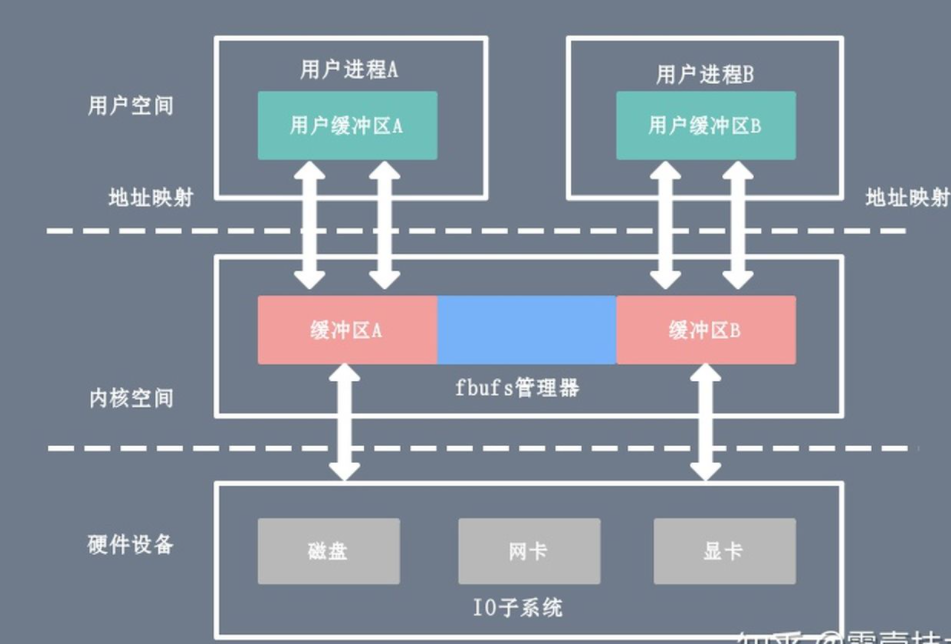

   缓冲区共享的难度在于管理共享缓冲区池需要应用程序、网络软件以及设备驱动程序之间的紧密合作，而且如何改写 API 目前还处于试验阶段并不成熟。

**Java NIO 零拷贝**

在 Java NIO 中的通道（Channel）就相当于操作系统的内核空间（kernel space）的缓冲区，而缓冲区（Buffer）对应的相当于操作系统的用户空间（user space）中的用户缓冲区（user buffer）。

- 通道（Channel）是全双工的（双向传输），它既可能是读缓冲区（read buffer），也可能是网络缓冲区（socket buffer）。
- 缓冲区（Buffer）分为堆内存（HeapBuffer）和堆外内存（DirectBuffer），这是通过 malloc() 分配出来的用户态内存。

堆外内存（DirectBuffer）在使用后需要应用程序手动回收，而堆内存（HeapBuffer）的数据在 GC 时可能会被自动回收。因此，在使用 HeapBuffer 读写数据时，为了避免缓冲区数据因为 GC 而丢失，NIO 会先把 HeapBuffer 内部的数据拷贝到一个临时的 DirectBuffer 中的本地内存（native memory），这个拷贝涉及到 sun.misc.Unsafe.copyMemory() 的调用，背后的实现原理与 memcpy() 类似。 最后，将临时生成的 DirectBuffer 内部的数据的内存地址传给 I/O 调用函数，这样就避免了再去访问 Java 对象处理 I/O 读写。

**Netty零拷贝**

Netty 中的零拷贝和上面提到的操作系统层面上的零拷贝不太一样, 我们所说的 Netty 零拷贝完全是基于（Java 层面）用户态的，它的更多的是偏向于数据操作优化这样的概念，具体表现在以下几个方面：

- Netty 通过 DefaultFileRegion 类对 java.nio.channels.FileChannel 的 tranferTo() 方法进行包装，在文件传输时可以将文件缓冲区的数据直接发送到目的通道（Channel）
- ByteBuf 可以通过 wrap 操作把字节数组、ByteBuf、ByteBuffer 包装成一个 ByteBuf 对象, 进而避免了拷贝操作
- ByteBuf 支持 slice 操作, 因此可以将 ByteBuf 分解为多个共享同一个存储区域的 ByteBuf，避免了内存的拷贝
- Netty 提供了 CompositeByteBuf 类，它可以将多个 ByteBuf 合并为一个逻辑上的 ByteBuf，避免了各个 ByteBuf 之间的拷贝

其中第 1 条属于操作系统层面的零拷贝操作，后面 3 条只能算用户层面的数据操作优化。

**RocketMQ 与 Kafka 的零拷贝**

RocketMQ 选择了 mmap + write 这种零拷贝方式，适用于业务级消息这种小块文件的数据持久化和传输；而 Kafka 采用的是 sendfile 这种零拷贝方式，适用于系统日志消息这种高吞吐量的大块文件的数据持久化和传输。但是值得注意的一点是，Kafka 的索引文件使用的是 mmap + write 方式，数据文件使用的是 sendfile 方式。

| 消息队列 | 零拷贝方式   | 优点                                                         | 缺点                                                         |
| -------- | ------------ | ------------------------------------------------------------ | ------------------------------------------------------------ |
| RocketMQ | mmap + write | 适用于小块文件传输，频繁调用时，效率很高                     | 不能很好的利用 DMA 方式，会比 sendfile 多消耗 cpu，内存安全性控制复杂，需要避免 JVM crash 问题 |
| Kafka    | sendfile     | 可以利用 DMA 方式，消耗CPU较少，大块文件传输效率高，无内存安全性问题 | 小块文件效率低于 mmap 方式，只能是 BIO 方式传输，不能使用 NIO 方式 |


## 三、Linux

### 1. 僵尸进程与孤儿进程

* 孤儿进程：

  一个父进程退出，而它的一个或多个子进程还在运行，那么那些子进程将成为孤儿进程。孤儿进程将被init进程(进程号为1)所收养，并由init进程对它们完成状态收集工作。

* 僵尸进程：
* 一个进程使用fork创建子进程，如果子进程退出，而父进程并没有调用wait或waitpid获取子进程的状态信息，那么子进程的进程描述符仍然保存在系统中。这种进程称之为僵死进程。

### 2. Kill -9 的执行过程

kill 命令会向操作系统内核发送一个信号（多是终止信号）和目标进程的 PID，然后系统内核根据收到的信号类型，对指定进程进行相应的操作。-9 表示强制结束，不等进程结束当前IO等操作

### 3. 进程、线程、协程

1. **进程**

> 进程是系统资源分配的最小单位, 系统由一个个进程(程序)组成 一般情况下，包括文本区域（text region）、数据区域（data region）和堆栈（stack region）。
>
> - 文本区域存储处理器执行的代码
> - 数据区域存储变量和进程执行期间使用的动态分配的内存；
> - 堆栈区域存储着活动过程调用的指令和本地变量。

因此进程的创建和销毁都是相对于系统资源,所以是一种比较昂贵的操作。 进程有三个状态:

1. 等待态：等待某个事件的完成；
2. 就绪态：等待系统分配处理器以便运行；
3. 运行态：占有处理器正在运行。

进程是抢占式的争夺CPU运行自身,而CPU单核的情况下同一时间只能执行一个进程的代码,但是多进程的实现则是通过CPU飞快的切换不同进程,因此使得看上去就像是多个进程在同时进行.

> 通信问题:   由于进程间是隔离的,各自拥有自己的内存内存资源, *因此相对于线程比较安全*, 所以不同进程之间的数据只能通过 *IPC(Inter-Process Communication)* 进行通信共享.

2. **线程**

> - 线程属于进程
> - 线程共享进程的内存地址空间
> - 线程几乎不占有系统资源 通信问题:  进程相当于一个容器,而线程而是运行在容器里面的,因此对于容器内的东西,线程是共同享有的,因此线程间的通信可以直接通过全局变量进行通信,但是由此带来的例如多个线程读写同一个地址变量的时候则将带来不可预期的后果,因此这时候引入了各种锁的作用,例如互斥锁等。

同时多线程是不安全的,当一个线程崩溃了,会导致整个进程也崩溃了,即其他线程也挂了, 但多进程而不会,一个进程挂了,另一个进程依然照样运行。

- ***进程是系统分配资源的最小单位***
- ***线程是CPU调度的最小单位***
- *由于默认进程内只有一个线程,所以多核CPU处理多进程就像是一个进程一个核心*

**线程和进程的上下文切换**

进程切换分3步:

1. 切换页目录以使用新的地址空间
2. 切换内核栈
3. 切换硬件上下文

而线程切换只需要第2、3步,因此进程的切换代价比较大

3. **协程**

> - 协程是属于线程的。协程程序是在线程里面跑的，因此协程又称微线程和纤程等
> - 协没有线程的上下文切换消耗。协程的调度切换是用户(程序员)手动切换的,因此更加灵活,因此又叫用户空间线程.
> - 原子操作性。由于协程是用户调度的，所以不会出现执行一半的代码片段被强制中断了，因此无需原子操作锁。

### 协程的实现：迭代器和生成器

- 迭代器： 实现了迭代接口的类,接口函数例如:current,key,next,rewind,valid。迭代器最基本的规定了对象可以通过next返回下一个值，而不是像数组，列表一样一次性返回。语言实现：在Java的foreach遍历迭代器对(数组)，Python的for遍历迭代器对象(tuple，list，dist)。
- 生成器： 使用 *yield* 关键字的函数,可以多次返回值，生成器实际上也算是实现了迭代器接口(协议)。即生成器也可通过next返回下一个值。

### 4. 管道的理解，管道除了存内容还可以存什么

* Linux 管道是一个操作方式为文件的内存缓冲区
* | 是匿名管道，父子进程间使用，父进程先打开一个管道，然后 fork 出子进程，子进程通过拷贝父进程的地址空间拿到管道的描述符，从而可以读写

### 5. 进程怎么实现一个阻塞队列

### 6. 进程间怎么通信

1. 管道pipe：管道是一种半双工的通信方式，数据只能单向流动，而且只能在具有亲缘关系的进程间使用。进程的亲缘关系通常是指父子进程关系。
2. 高级管道(popen)：将另一个程序当做一个新的进程在当前程序进程中启动，则它算是当前程序的子进程，这种方式我们成为高级管道方式。
3. 有名管道 (named pipe) ： 有名管道也是半双工的通信方式，但是它允许无亲缘关系进程间的通信。
4. 消息队列( message queue ) ： 消息队列是由消息的链表，存放在内核中并由消息队列标识符标识。消息队列克服了信号传递信息少、管道只能承载无格式字节流以及缓冲区大小受限等缺点。
5. 信号量( semophore ) ： 信号量是一个计数器，可以用来控制多个进程对共享资源的访问。它常作为一种锁机制，防止某进程正在访问共享资源时，其他进程也访问该资源。因此，主要作为进程间以及同一进程内不同线程之间的同步手段。
6. 信号 ( sinal ) ： 信号是一种比较复杂的通信方式，用于通知接收进程某个事件已经发生。
7. 共享内存( shared memory ) ：共享内存就是映射一段能被其他进程所访问的内存，这段共享内存由一个进程创建，但多个进程都可以访问。共享内存是最快的 IPC 方式，它是针对其他进程间通信方式运行效率低而专门设计的。它往往与其他通信机制，如信号两，配合使用，来实现进程间的同步和通信。
8. 套接字( socket ) ： 套接口也是一种进程间通信机制，与其他通信机制不同的是，它可用于不同机器间的进程通信。

### 7. 虚拟内存，虚拟地址和物理地址怎么转换，内存分段，内存分页，优缺点

## 四、Java 基础

### 1. Sychronized 底层原理

### 2. volatile 的语义

### 3. ConcurrentHashMap 介绍

* 为什么比 HashTable 效率高

  ConcurrntHashMap：

  * 1.7 的时候使用分段锁，对整个数组进行分割分段（Segment），每一把锁只锁住其中一部分数据，多线程访问容器里不同的数据段的数据，就不会存在锁竞争
  * 1.8 是使用 Node 数组+链表+红黑树的数据结构优化，并发控制使用 synchronized 和 CAS 进行操作，JDK1.6 对 synchronized 进行优化

  HashTable：

  * 使用 synchronized 来保证线程安全，当一个线程访问同步方法时，其他线程也访问同步方法，可能会进入阻塞或者轮询状态，如 put 方法，另一个线程也不能使用 put / get 方法。

* CAS 操作，有什么问题，解决方案

  1. **ABA 问题**

  如果一个变量V初次读取的时候是A值，并且在准备赋值的时候检查到它仍然是A值，那我们就能说明它的值没有被其他线程修改过了吗？很明显是不能的，因为在这段时间它的值可能被改为其他值，然后又改回A，那CAS操作就会误认为它从来没有被修改过。这个问题被称为CAS操作的 **"ABA"问题。**

  JDK 1.5 以后的 `AtomicStampedReference 类`就提供了此种能力，其中的 `compareAndSet 方法`就是首先检查当前引用是否等于预期引用，并且当前标志是否等于预期标志，如果全部相等，则以原子方式将该引用和该标志的值设置为给定的更新值。

  2. **循环时间开销大**

  **自旋CAS（也就是不成功就一直循环执行直到成功）如果长时间不成功，会给CPU带来非常大的执行开销。** 如果JVM能支持处理器提供的pause指令那么效率会有一定的提升，pause指令有两个作用，第一它可以延迟流水线执行指令（de-pipeline）,使CPU不会消耗过多的执行资源，延迟的时间取决于具体实现的版本，在一些处理器上延迟时间是零。第二它可以避免在退出循环的时候因内存顺序冲突（memory order violation）而引起CPU流水线被清空（CPU pipeline flush），从而提高CPU的执行效率。

  **3. 只能保证一个共享变量的原子操作**

  CAS 只对单个共享变量有效，当操作涉及跨多个共享变量时 CAS 无效。但是从 JDK 1.5开始，提供了`AtomicReference类`来保证引用对象之间的原子性，你可以把多个变量放在一个对象里来进行 CAS 操作.所以我们可以使用锁或者利用`AtomicReference类`把多个共享变量合并成一个共享变量来操作。

### 4. 线程池

* 处理流程

* 为什么先判断 corePoolSize，再入队列，最后再判断 maxPoolSize

  线程池创建线程需要获取mainlock这个全局锁，会影响并发效率，所以使用阻塞队列把第一步创建核心线程与第三步创建最大线程隔离开来，起一个缓冲的作用。
  引入阻塞队列，是为了在执行execute()方法时，尽可能的避免获取全局锁。

### 5. 类加载机制介绍

每一个类都有一个对应它的类加载器。系统中的 ClassLoader 在协同工作的时候会默认使用**双亲委派模型**。即在类加载的时候，系统会首先判断当前类是否被加载过；已经记载的类会直接返回，否则才会尝试加载。加载的时候，首先会把该请求委派该父类加载器的`loadClass()`处理，因此所有的请求最终都应该传送到顶层的启动器`BootstrapClassLoader`中；当父类加载器无法处理时，才由自己处理。当父类加载器位 null 时，会使用启动类加载器`BootstrapClassLoader`作为父类加载器。

* 为什么需要双亲委派

  双亲委派模型保证了 Java 程序的稳定运行，可以避免类的重复加载（JVM 区分不同类的方式不仅根据类名，相同的类文件被不同的类加载器加载产生的是两个不同的类），也保证了 Java 的核心API不被篡改. 如果没有使用双亲委派模型，而是使用每个类加载器加载自己的话就会出现一些问题，比如我们编写一个称为 `java.lang.Object`类的话，那么程序运行就会出现多个 `Object` 类。

### 6. 反射是什么

[Java 反射由浅入深 ](https://juejin.im/post/598ea9116fb9a03c335a99a4)

[面试官: 谈谈你对Java反射的理解](https://juejin.im/post/5dac4edff265da5b5f7588d1#comment)

Java 反射机制在程序**运行时**，对于任意一个类，都能够知道这个类的所有属性和方法；对于任意一个对象，都能够调用它的任意一个方法和属性。这种 **动态的获取信息** 以及 **动态调用对象的方法** 的功能称为 **java 的反射机制**。

### 7. ThreadLocal 底层

### 8. Java 内存模型

### 9. GC 原理

### 10. 线程属于哪块区域

### 11. HashMap 如何实现线程安全的操作

* 为什么使用红黑树，红黑树的特性，与平衡搜索二叉树的区别，时间复杂度

  说它不严格是因为它不是严格控制左、右子树高度或节点数之差小于等于1。
  但红黑树高度依然是平均log(n)，且最坏情况高度不会超过2log(n)，这有数学证明。所以它算平衡树，只是不严格。不过严格与否并不影响数据结构的复杂度。
  不用严格控制高度，使得插入效率更高。

  红黑树的本质是基于2-3-4树的，算法导论里的红黑树就是这样，Robert Sedgewick后来又改进了红黑树的实现，基于2-3树，他把这个叫做左倾红黑树，它比AVL树高效的地方就在于它不强制要求左右子树高度差不超过1，这样它的写操作复杂度就较AVL要低一点，但是查询的速度要稍慢于AVL。所以红黑树并不是一定就比avl高效，只是它的综合性能要比avl好一点。

  |      | 红黑树                                        | AVL                                           |
  | ---- | --------------------------------------------- | --------------------------------------------- |
  | 删除 | 节点旋转次数是O(1)，平衡因子调整次数是O(logn) | 都是O(logN)                                   |
  | 插入 | 节点旋转次数是O(1)，平衡因子调整次数是O(logn) | 节点旋转次数是O(1)，平衡因子调整次数是O(logn) |

  

### 12. Lock 与 sychronized 的区别

| 类别     | synchronized                                                 | Lock                                                         |
| -------- | ------------------------------------------------------------ | ------------------------------------------------------------ |
| 存在层次 | Java的关键字，在jvm层面上                                    | 是一个类                                                     |
| 锁的释放 | 1、以获取锁的线程执行完同步代码，释放锁 <br />2、线程执行发生异常，jvm会让线程释放锁 | 在finally中必须释放锁，不然容易造成线程死锁                  |
| 锁的获取 | 假设A线程获得锁，B线程等待。如果A线程阻塞，B线程会一直等待   | 分情况而定，Lock有多个锁获取的方式，具体下面会说道，大致就是可以尝试获得锁，线程可以不用一直等待 |
| 锁状态   | 无法判断                                                     | 可以判断                                                     |
| 锁类型   | 可重入 不可中断 非公平                                       | 可重入 可判断 可公平（两者皆可）                             |
| 性能     | 少量同步                                                     | 大量同步                                                     |


### 13. 乐观锁与悲观锁

- 乐观锁：乐观锁在操作数据时非常乐观，认为别人不会同时修改数据。因此乐观锁不会上锁，只是在执行更新的时候判断一下在此期间别人是否修改了数据：如果别人修改了数据则放弃操作，否则执行操作。
- 悲观锁：悲观锁在操作数据时比较悲观，认为别人会同时修改数据。因此操作数据时直接把数据锁住，直到操作完成后才会释放锁；上锁期间其他人不能修改数据。

### 14. 如何中断线程，await和sleep区别

1. wait()来自Object类，sleep()来自Thread类
2. 调用 sleep()方法，线程不会释放对象锁。而调用 wait() 方法线程会释放对象锁；
3. sleep()睡眠后不出让系统资源，wait()让其他线程可以占用 CPU；
4. sleep(millionseconds)需要指定一个睡眠时间，时间一到会自然唤醒。而wait()需要配合notify()或者notifyAll()使用

### 15. jvm 用了哪些参数。调整JVM内存占用整个容器的比率

* -XX:NewRatio
* -XX:SurvivorRatio

### 16. jvm内存划分有哪些？

### 17. 线程私有的有哪些？


### 18. Java Object 类方法

1. clone()

2. equals()

3. finalize()

4. getClass()

5. hashCode()

6. notify()

7. notifyAll()

8. toString()

9. wait()

10. registerNatives()

    > 一个Java程序要想调用一个本地方法，需要执行两个步骤：第一，通过System.loadLibrary()将包含本地方法实现的动态文件加载进内存；第二，当Java程序需要调用本地方法时，虚拟机在加载的动态文件中定位并链接该本地方法，从而得以执行本地方法。registerNatives()方法的作用就是取代第二步

### 19. 对象到老年代步骤

* **大对象直接进入老年代**

  大对象就是需要大量连续内存空间的对象（比如：字符串、数组）

  为了避免大对象分配内存时由于分配担保机制带来的复制而降低效率

* **长期存活的对象直接进入老年代**

  如果对象在 Eden 出生并经过第一次 Minor GC 后仍然能够存活，并且能被对象 Survivor 容纳的话，将会被移动到 Survivor 空间中，并将对象年龄设置为 1，对象在 Survivor 中每熬过一次 Minor GC ，年龄就会增加1，当他的年龄增加到一定程度（默认为15岁），就会被晋升到老年代中。对象晋升到老年代年龄阈值，可以通过参数`-XX:MaxTenuringThreshold` 来设置。


## 五、MySQL

### 1. Innodb 索引结构

* 为什么使用B+树，与B的区别

### 2. 事务、隔离级别、幻读、间隙锁

### 3. 主键索引和唯一索引有什么不同？

### 4. 普通索引、唯一索引之间的性能差别

唯一索引需要保证再插入前没有数据，普通索引可以再写入磁盘前加 change buffer

### 5. MVCC

### 6. 二阶段提交

- 阶段1：InnoDB`redo log` 写盘，InnoDB 事务进入 `prepare` 状态
- 阶段2：`binlog` 写盘，InooDB 事务进入 `commit` 状态
- 每个事务`binlog`的末尾，会记录一个 `XID event`，标志着事务是否提交成功，也就是说，恢复过程中，`binlog` 最后一个 XID event 之后的内容都应该被 purge。

两阶段提交的主要用意是：为了保证redolog和binlog数据的安全一致性。只有在这两个日志文件逻辑上高度一致了。你才能放心地使用redolog帮你将数据库中的状态恢复成crash之前的状态，使用binlog实现数据备份、恢复、以及主从复制。而两阶段提交的机制可以保证这两个日志文件的逻辑是高度一致的。没有错误、没有冲突。

### 7. Innodb 默认事务隔离级别RR，实现方式（MVCC+间隙锁）

### 8. explian 命令后关注哪些字段


## 六、Redis

### 1. 单线程模式

### 2. 数据结构

String，Hash，List，Set，Sorted Set。

高级数据结构：Bitmaps，Hyperloglogs，GEO。

**Bitmaps**

一般的使用场景：

- 各种实时分析.
- 存储与对象ID关联的节省空间并且高性能的布尔信息.

例如，想象一下你想知道访问你的网站的用户的最长连续时间。你开始计算从0开始的天数，就是你的网站公开的那天，每次用户访问网站时通过SETBIT命令设置bit为1，可以简单的用当前时间减去初始时间并除以3600*24（结果就是你的网站公开的第几天）当做这个bit的位置。

这种方法对于每个用户，都有存储每天的访问信息的一个很小的string字符串。通过BITCOUN就能轻易统计某个用户连续访问网站的天数。另外通过调用BITPOS命令，或者客户端获取并分析这个bitmap，就能计算出最长停留时间。

**HyperLogLogs**

在redis中HLL是一个不同的数据结构，它被编码成Redis字符串。因此可以通过调用GET命令序列化一个HLL，也可以通过调用SET命令将其反序列化到redis服务器。

HLL的API类似使用SETS数据结构做相同的任务，SETS结构中，通过SADD命令把每一个观察的元素添加到一个SET集合，用SCARD命令检查SET集合中元素的数量，集合里的元素都是唯一的，已经存在的元素不会被重复添加。

而使用HLL时并不是真正添加项到HLL中（这一点和SETS结构差异很大），因为HLL的数据结构只包含一个不包含实际元素的状态，API是一样的：

- **PFADD**命令用于添加一个新元素到统计中。
- **PFCOUNT**命令用于获取到目前为止通过PFADD命令添加的唯一元素个数近似值。
- **PFMERGE**命令执行多个HLL之间的联合操作。

与 Bitmaps 的区别：

* HLL数据结构的一个使用场景就是计算用户每天在搜索框中执行的唯一查询，即搜索页面UV统计。

* 而Bitmaps则用于判断某个用户是否访问过搜索页面。这是它们用法的不同。

**GEO**

Redis的GEO特性在 Redis3.2版本中推出，这个功能可以将用户给定的地理位置（经度和纬度）信息储存起来，并对这些信息进行操作。

### 3. 跳跃表的实现，如何插入节点

### 4. mget 与 pipline 的区别

* mget 与 pipline 都是多命令一起执行，只有一次往返网络IO
* mget 在集群下可以并行去获取，pipline 还是串行

### 5. 主从同步细节

* 全同步
* 增量同步

### 6. Memcache 或者多线程 Redis

### 7. Redis 分布式锁

* setnx 做分布式锁有什么问题

  与设置失效时间不是原子性操作

* 在主从模式下，分布式锁会有什么问题？

  

### 8. Redis 如何批量查找

### 9. scan 的时间复杂度

### 10. Redis缓存过期策略

### 11. 哨兵机制与集群的区别

### 12. Redis 内存满了，加入数据会出现什么问题

### 13. Redis 持久化方式

## 七、Spring

### 1. Spring 的优势

- 方便解耦，简化开发 

Spring就是一个大工厂，可以将所有对象的创建和依赖关系的维护，交给Spring管理。

- AOP编程的支持 

Spring提供面向切面编程，可以方便的实现对程序进行权限拦截、运行监控等功能。 

- 声明式事务的支持 

只需要通过配置就可以完成对事务的管理，而无需手动编程。 

- 方便程序的测试 

Spring对Junit4支持，可以通过注解方便的测试Spring程序。 

- 方便集成各种优秀框架

Spring不排斥各种优秀的开源框架，其内部提供了对各种优秀框架的直接支持（如：Struts、Hibernate、MyBatis等）。

- 降低JavaEE API的使用难度 

Spring对JavaEE开发中非常难用的一些API（JDBC、JavaMail、远程调用等），都提供了封装，使这些API应用难度大大降低。

### 2. 如何自己设计一个IOC容器

第一步：

创建自定义的注解（带有我们自定义注解的类才进行对象的实例化和装配）；

第二步：

需要读取用户配置文件；（用户可自定义哪些包需要进行扫描bean的装配）；

第三步：

扫描文件进行类加载（根据用户的配置扫描对应的包加载对应包里面的class放到一个容器里面）;

第四步：

把扫描出来的class中带有自定义注解的类和属性分别进行实例化和属性注入;

第五步：

把实例化好的对象放到一个容器里并提供调用方法;

根据以上思路我们整理出来需要使用的技术有注解相关技术、配置文件加载技术、类加载技术、反射技术;

### 3. Spring 是如何解决的循环依赖？

Spring 为了解决单例的循环依赖问题，使用了三级缓存。其中一级缓存为单例池（`singletonObjects`），二级缓存为提前曝光对象（`earlySingletonObjects`），三级缓存为提前曝光对象工厂（`singletonFactories`）。

```java
protected Object doCreateBean(final String beanName, final RootBeanDefinition mbd, final @Nullable Object[] args)
  throws BeanCreationException {
  // 省略其他代码
  
  // 1. 调用构造函数创建该bean对象，若不存在构造函数注入，顺利通过
  instanceWrapper = createBeanInstance(beanName, mbd, args);

  // 2. 在singletonFactories缓存中，放入该bean对象，以便解决循环依赖问题
  addSingletonFactory(beanName, () -> getEarlyBeanReference(beanName, mbd, bean));
     
  // 3. populateBean方法：bean对象的属性赋值
  populateBean(beanName, mbd, instanceWrapper);

  // 省略其他代码
}
```


假设A、B循环引用，实例化 A 的时候就将其放入三级缓存中，接着填充属性的时候，发现依赖了 B，同样的流程也是实例化后放入三级缓存，接着去填充属性时又发现自己依赖 A，这时候从缓存中查找到早期暴露的 A，没有 AOP 代理的话，直接将 A 的原始对象注入 B，完成 B 的初始化后，进行属性填充和初始化，这时候 B 完成后，就去完成剩下的 A 的步骤，如果有 AOP 代理，就进行 AOP 处理获取代理后的对象 A，注入 B，走剩下的流程。

### 4. 为什么要使用三级缓存呢？二级缓存能解决循环依赖吗？

如果没有 AOP 代理，二级缓存可以解决问题，但是有 AOP 代理的情况下，只用二级缓存就意味着所有 Bean 在实例化后就要完成 AOP 代理，这样违背了 Spring 设计的原则，Spring 在设计之初就是通过 `AnnotationAwareAspectJAutoProxyCreator` 这个后置处理器来在 Bean 生命周期的最后一步来完成 AOP 代理，而不是在实例化后就立马进行 AOP 代理。

### 5. 什么情况下无法解决循环依赖的问题

* 在主bean中通过构造函数注入所依赖的bean。

  由于 doCreateBean 解决循环依赖时，先通过构造函数实例化 bean，再将 bean 放入缓存中，再调用 setter 为属性赋值，如果直接再构造函数注入，则会导致先实例化所依赖的 bean，而为所依赖的 bean 的属性赋值时，又需要注入主 bean，但是此时主 bean 还未实例化完成。

  ```Java
  @RestController
  public class AccountController {
      private static final Logger LOG = LoggerFactory.getLogger(AccountController.class);
  
      private AccountService accountService;
  
      // 构造函数依赖注入
      // 不管是否设置为required为true，都会出现循环依赖问题
      @Autowire
      // @Autowired(required = false)
      public AccountController(AccountService accountService) {
          this.accountService = accountService;
      }
      
  }
  
  @Service
  public class AccountService {
      private static final Logger LOG = LoggerFactory.getLogger(AccountService.class);
      
      // 属性值依赖注入
      @Autowired
      private AccountController accountController;
      
  }
  ```

  解决：

  如果是在主bean中通过属性值或者setter方法注入所依赖的bean，而在所依赖的bean使用了构造函数注入主bean对象，这种情况则不会出现循环依赖问题。

  或者都使用 Setter 的方式注入。

## 八、ElasticSearch

### 1. ES 索引分类

1. 

## 九、算法

### 1. 一致性Hash介绍

### 2. Hash 冲突解决方案

### 3. LFU 如何实现


## 十、场景题

### 1. 总共 2T 文件，内存2G，求出现次数 Top10 的文件

用Hash将文件分区，每个区的总量小于2G，再遍历每个区使用 HashMap，key 为文件，value 出现次数，再使用堆排序取出top10。

### 2. 实现feed页

* 推模式
* 拉模式

### 3. 让你来推广广告，你会怎么设计？

### 4. 设计一个秒杀系统

### 5. 接口的幂等性（重复提交问题）

分场景考虑分为**强校验**与**弱校验**

**强校验**：

多用于与金钱相关的场景

你监听到用户支付成功的消息，你监听到了去加GMV是不是要调用加钱的接口，那加钱接口下面再调用一个加流水的接口，**两个放在一个事务，成功一起成功失败一起失败**。

每次消息过来都要拿着**订单号+业务场景这样的唯一标识**（比如天猫双十一活动）去流水表查，看看有没有这条流水，有就直接return不要走下面的流程了，没有就执行后面的逻辑。

之所以用**流水表**，是因为涉及到金钱这样的活动，有啥问题后面也可以去流水表**对账**，还有就是帮助开发人员定位问题。

**弱校验**

多用于不是很重要的场景

比如给谁发短信啥的，我就把这个id+场景唯一标识作为**Redis**的key，放到缓存里面失效时间看你场景，**一定时间内**的这个消息就去Redis判断。

用KV就算消息丢了可能这样的场景也没关系，重发一次即可

## 十一、中间件

### 1. eureka原理，强一致性么，为什么，怎么保证强一致性，多级缓存怎么保证一致性，eureka集群，宕机了服务还能调用么

### 2. hystrix原理，半开状态知道么，具体的一个转换过程，它的隔离是怎么实现的

### 3. zookeeper一致性保证，zab协议原理，半数原则如果查询到另外一半呢，那zookeeper属于哪种一致性，强一致性么，还是最终一致性

### 4. zookeeper选举机制，选举过程有什么问题

