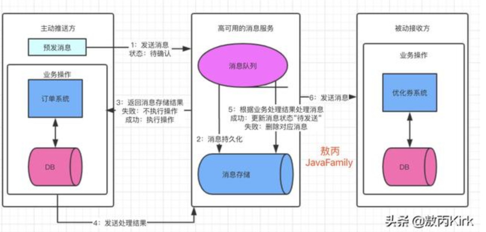

# 面试总结

### 1.Java Object 类方法

1. clone()

2. equals()

3. finalize()

4. getClass()

5. hashCode()

6. notify()

7. notifyAll()

8. toString()

9. wait()

10. registerNatives()

    > 一个Java程序要想调用一个本地方法，需要执行两个步骤：第一，通过System.loadLibrary()将包含本地方法实现的动态文件加载进内存；第二，当Java程序需要调用本地方法时，虚拟机在加载的动态文件中定位并链接该本地方法，从而得以执行本地方法。registerNatives()方法的作用就是取代第二步

### 2.wait() 与 sleep() 的区别

1. wait()来自Object类，sleep()来自Thread类
2. 调用 sleep()方法，线程不会释放对象锁。而调用 wait() 方法线程会释放对象锁；
3. sleep()睡眠后不出让系统资源，wait()让其他线程可以占用 CPU；
4. sleep(millionseconds)需要指定一个睡眠时间，时间一到会自然唤醒。而wait()需要配合notify()或者notifyAll()使用

### 3.CMS 与 G1 的区别

[参考](https://www.cnblogs.com/greatLong/articles/11450753.html)

### 4.对象到老年代步骤

* **大对象直接进入老年代**

  大对象就是需要大量连续内存空间的对象（比如：字符串、数组）

  为了避免大对象分配内存时由于分配担保机制带来的复制而降低效率

*  **长期存活的对象直接进入老年代**

  如果对象在 Eden 出生并经过第一次 Minor GC 后仍然能够存活，并且能被对象 Survivor 容纳的话，将会被移动到 Survivor 空间中，并将对象年龄设置为 1，对象在 Survivor 中每熬过一次 Minor GC ，年龄就会增加1，当他的年龄增加到一定程度（默认为15岁），就会被晋升到老年代中。对象晋升到老年代年龄阈值，可以通过参数`-XX:MaxTenuringThreshold` 来设置。

### 5.ConcurrentHashMap 与 HashTable

主要体现在线程安全上的不同

* **底层数据结构**：
  * ConcurrentHashMap：采用分段的数组+链表（1.7）/数组+链表（红黑二叉树）（1.8）
  * HashTable：数组+链表
* **实现线程安全的方式**：
  * ConcurrntHashMap：
    * 1.7 的时候使用分段锁，对整个数组进行分割分段（Segment），每一把锁只锁住其中一部分数据，多线程访问容器里不同的数据段的数据，就不会存在锁竞争
    * 1.8 是使用 Node 数组+链表+红黑树的数据结构优化，并发控制使用 synchronized 和 CAS 进行操作，JDK1.6 对 synchronized 进行优化
  * HashTable：使用 synchronized 来保证线程安全，当一个线程访问同步方法时，其他线程也访问同步方法，可能会进入阻塞或者轮询状态，如 put 方法，另一个线程也不能使用 put / get 方法。

### 6.如何给身份证创建合适的索引

#### 前缀索引

- 顾名思义，对于列值较长，比如`BLOB`、`TEXT`、`VARCHAR`，就 "必须" 使用**前缀索引**，即将值的前一部分作为索引。因为索引的存储也是需要空间的，同样索引太长维护起来也比较困难。
- 比如我们给`User`表中的邮箱添加前缀索引，如下:

```
 　　alter table user add index index1(email(7));
```

- 上述语句将email的前7个字符作为索引。

但是如果对于使用前缀区分度不太好的情况，比如，我们国家的身份证号，一共18位，其中前6位是地址码，所以同一个县的人的身份证号前6位一般会是相同的。 这时候如果对身份证号做长度为6的前缀索引的话，这个索引的区分度就非常低了。

#### 使用倒序存储

如果你存储身份证号的时候把它倒过来存，每次查询的时候，你可以这么写：

```
 　　select field_list from t where id_card = reverse('输入的身份证号');
```

由于身份证号的**最后6位**没有地址码这样的重复逻辑，所以最后这6位很可能就提供了足够的区分度。

#### 前缀索引对覆盖索引的影响

- 前缀索引会导致覆盖索引失效，查询语句如下：

```
　　select id,name from user where email="chenmou1995@xxx";
```

- 由于使用了前缀索引，因此必须会**回表**验证查询到的时候正确，此处使用了覆盖索引也是无效的。
- 也就是说，使用前缀索引就用不上覆盖索引对查询性能的优化了，这也是你在选择是否使用前缀索引时需要考虑的一个因素

### 7.SQL 执行顺序

1. from
2. on
3. join
4. in
5. where
6. group by
7. avg、sum...
8. having
9. select
10. distinct
11. order by
12. limit

### 8.使用 Redis 做消息队列

1. 基于List的 LPUSH+BRPOP 的实现
2. PUB/SUB，订阅/发布模式
3. 基于Sorted-Set的实现
4. 基于Stream类型的实现

#### 基于异步消息队列List lpush-brpop(rpush-blpop)

使用**rpush**和**lpush**操作入队列，**lpop**和**rpop**操作出队列。
**List支持多个生产者和消费者并发进出消息**，每个消费者拿到都是**不同**的列表元素。
但是当队列为空时，lpop和rpop会一直空轮训，消耗资源；所以引入阻塞读blpop和brpop（b代表blocking），阻塞读在队列没有数据的时候进入休眠状态，
一旦数据到来则立刻醒过来，消息延迟几乎为零。

**注意**
你以为上面的方案很完美？还有个问题需要解决：**空闲连接的问题**。
如果线程一直阻塞在那里，Redis客户端的连接就成了闲置连接，闲置过久，服务器一般会主动断开连接，减少闲置资源占用，这个时候blpop和brpop或抛出异常，
所以在编写客户端消费者的时候要小心，如果捕获到异常，还有重试。

**缺点：**

- 做消费者确认ACK麻烦，不能保证消费者消费消息后是否成功处理的问题（宕机或处理异常等），通常需要维护一个Pending列表，保证消息处理确认。
- 不能做广播模式，如pub/sub，消息发布/订阅模型
- 不能重复消费，一旦消费就会被删除
- 不支持分组消费

#### PUB/SUB,订阅/发布模式

> SUBSCRIBE，用于订阅信道
> PUBLISH，向信道发送消息
> UNSUBSCRIBE，取消订阅

此模式允许生产者只生产一次消息，由中间件负责将消息复制到多个消息队列，每个消息队列由对应的消费组消费。

**优点**

- 典型的广播模式，一个消息可以发布到多个消费者
- 多信道订阅，消费者可以同时订阅多个信道，从而接收多类消息
- 消息即时发送，消息不用等待消费者读取，消费者会自动接收到信道发布的消息

**缺点**

- 消息一旦发布，不能接收。换句话就是发布时若客户端不在线，则消息丢失，不能寻回
- 不能保证每个消费者接收的时间是一致的
- 若消费者客户端出现消息积压，到一定程度，会被强制断开，导致消息意外丢失。通常发生在消息的生产远大于消费速度时
  **可见，Pub/Sub 模式不适合做消息存储，消息积压类的业务，而是擅长处理广播，即时通讯，即时反馈的业务。**

#### 基于Sorted-Set的实现

Sortes Set(有序列表)，类似于java的SortedSet和HashMap的结合体，一方面她是一个set，保证内部value的唯一性，另一方面它可以给每个value赋予一个score，代表这个value的
排序权重。内部实现是“跳跃表”。
有序集合的方案是在自己确定消息顺ID时比较常用，使用集合成员的Score来作为消息ID，保证顺序，还可以保证消息ID的单调递增。通常可以使用时间戳+序号的方案。确保了消息ID的单调递增，利用SortedSet的依据
Score排序的特征，就可以制作一个有序的消息队列了。

**优点**
就是可以自定义消息ID，在消息ID有意义时，比较重要。
**缺点**
缺点也明显，不允许重复消息（因为是集合），同时消息ID确定有错误会导致消息的顺序出错。

#### 基于Stream类型的实现

Stream为redis 5.0后新增的数据结构。支持多播的可持久化消息队列，实现借鉴了Kafka设计。

[参考](http://www.cdeason.cn/2019/08/25/Redis实现消息队列的方案)

### 9.最左匹配原则

最左匹配原则:最左优先,以最左边的为起点任何连续的索引都能匹配上。同时遇到范围查询(>、<、between、like)就会停止匹配。

> 建立一个复合索引（col1,col2,col3）相当于建立了三个索引，但除此之外其他的条件组合方式不能使用这个复合索引。
>
> 比如：(col1,col3)、(col2m,col3)、（col2）、（col3）这四种条件无法使用索引

**匹配列前缀**

如果列是字符型的话它的比较规则是先比较字符串的第一个字符，第一个字符小的哪个字符串就比较小，如果两个字符串第一个字符相通，那就再比较第二个字符，第二个字符比较小的那个字符串就比较小，依次类推，比较字符串。

如果a是字符类型，那么前缀匹配用的是索引，后缀和中缀只能全表扫描了

[参考](https://blog.csdn.net/sinat_41917109/article/details/88944290)

### 10.MySQL 为什么使用 B+ 树作为索引，其他数据结构不适合的原因是什么？

[参考](https://zhuanlan.zhihu.com/p/84493668)

1) 二叉查找树(BST)：解决了排序的基本问题，但是由于无法保证平衡，可能退化为链表；

2) 平衡二叉树(AVL)：通过旋转解决了平衡的问题，但是旋转操作效率太低；

3) 红黑树：通过舍弃严格的平衡和引入红黑节点，解决了AVL旋转效率过低的问题，但是在磁盘等场景下，树仍然太高，IO次数太多；

4) B树：通过将二叉树改为多路平衡查找树，解决了树过高的问题；

5) B+树：在B树的基础上，将非叶节点改造为不存储数据的纯索引节点，进一步降低了树的高度；此外将叶节点使用指针连接成链表，范围查询更加高效。

### 11. SpringBoot 自动装配原理

1）、SpringBoot启动的时候加载主配置类，开启了自动配置功能 @EnableAutoConfiguration

**2）、@EnableAutoConfiguration 作用：**

 1. EnableAutoConfigurationImportSelector

 2. 执行方法 selectImports() 

 3. selectImports() 调用 List<String> configurations = getCandidateConfigurations(annotationMetadata,      attributes);

    获取候选的配置

    > ```
    > List<String> configurations = SpringFactoriesLoader.loadFactoryNames(      getSpringFactoriesLoaderFactoryClass(), getBeanClassLoader());
    > ```
    >
    > 扫描所有jar包类路径下  META-INF/spring.factories
    > 把扫描到的这些文件的内容包装成properties对象
    > 从properties中获取到EnableAutoConfiguration.class类（类名）对应的值，然后把他们添加在容器中

3）、每一个自动配置类进行自动配置功能；

### 12. Spring 注入 Bean 的方式有哪些？

[参考](https://juejin.im/post/5ca81a536fb9a05e6538aa39#comment)

### 13. final 关键字

1. final 修饰变量，如果是基础数据类型的变量，则其数值一旦在初始化之后便不能改变，如果是引用类型的变量，则在对其初始化后，不能在让其指向另一个对象
2. final 修饰类，这个类不能被继承，final 类中所有**成员方法**都会被隐式的指定为 final 方法
3. final 修饰方法。 将方法锁定，防止子类修改其含义；提升效率，在早期的 Java 版本中，会将 final 转为内嵌调用。但是如果方法过于庞大，可能看不到内嵌调用带来的任何性能提升（现在 Java 版本已经不需要使用 final 方法进行这种优化了）。类中所有的 private 方法都被隐式得指定为 final 修饰

### 14. 类加载顺序

**1.**加载静态成员/代码块

**2.**加载非静态成员/代码块（实例块在创建对象时才会被加载。而静态成员在不创建对象时可以加载）

**3.**调用构造方法

**Java程序在执行过程中，类，对象以及它们成员加载、初始化的顺序如下**： 

1、首先加载要创建对象的类及其直接与间接父类。

 2、在类被加载的同时会将静态成员进行加载，主要包括静态成员变量的初始化，静态语句块的执行，在加载时按代码的先后顺序进行。

 3、需要的类加载完成后，开始创建对象，首先会加载非静态的成员，主要包括非静态成员变量的初始化，非静态语句块的执行，在加载时按代码的先后顺序进行。

 4、最后执行构造器，构造器执行完毕，对象生成。

**父类静态变量->父类静态代码块->子类静态变量->子类静态代码块->父类非静态变量->父类非静态代码块->父类构造函数->子类非静态变量->子类非静态代码块->子类构造函数。**

### 15. JDK 的动态代理与Cglib的动态代理

JDK代理是不需要第三方库支持，只需要JDK环境就可以进行代理，使用条件:

1）实现InvocationHandler 

2）使用Proxy.newProxyInstance产生代理对象

3）被代理的对象必须要实现接口

CGLib必须依赖于CGLib的类库，但是它需要类来实现任何接口代理的是指定的类生成一个子类，

覆盖其中的方法，是一种继承但是针对接口编程的环境下推荐使用JDK的代理；

1、**JDK 动态代理**

利用拦截器(拦截器必须实现InvocationHanlder)加上反射机制生成一个实现代理接口的匿名类，

在调用具体方法前调用InvokeHandler来处理。

2、**CGLIB 动态代理**

利用ASM开源包，对代理对象类的class文件加载进来，**通过修改其字节码生成子类来处理。**

3、**二者区别**

1）JDK动态代理只能对实现了接口的类生成代理，而不能针对类。

2）CGLIB是针对类实现代理，主要是对指定的类生成一个子类，覆盖其中的方法，并覆盖其中方法实现增强，但是因为采用的是继承，所以该类或方法最好不要声明成final，对于final类或方法，是无法继承的。

3）使用CGLib实现动态代理，CGLib底层采用ASM字节码生成框架，使用字节码技术生成代理类，

在jdk6之前比使用Java反射效率要高。唯一需要注意的是，CGLib不能对声明为final的方法进行代理，

因为CGLib原理是动态生成被代理类的子类。

4）在jdk6、jdk7、jdk8逐步对JDK动态代理优化之后，在调用次数较少的情况下，JDK代理效率高于CGLIB代理效率

4、Spring 如何选择使用 JDK 还是 CGLIB

Spring如何选择用JDK还是CGLIB？
1）当Bean实现接口时，Spring就会用JDK的动态代理。

2）当Bean没有实现接口时，Spring使用CGlib是实现。

3）可以强制使用CGlib（在spring配置中加入<aop:aspectj-autoproxy proxy-target-class="true"/>）

### 16. Redis 如何保证看库存不被扣成负数（超卖问题）

#### 1. 分布式锁

1）创建一个redis锁

1. 在 Redis 中，可以通过使用 SETNX 命令来构建锁：**rs.setnx(lock_name, uuid值)**

2. 而锁要做的事情就是将一个随机生成的 128 位 UUID 设置位键的值，防止该锁被其他进程获取

2）释放锁

　1. 锁的删除操作很简单，只需要将对应锁的 key 值获取到的 uuid 结果进行判断验证

　2. 符合条件（*判断uuid值*）通过 delete 在 redis 中删除即可，rs.delete(lockname)

3. 此外当其他用户持有同名锁时，由于 uuid 的不同，经过验证后不会错误释放掉别人的锁

 3）解决锁无法释放问题

　1. 在之前的锁中，还出现这样的问题，比如某个进程持有锁之后突然程序崩溃，那么会导致锁无法释放

　2. 而其他进程无法持有锁继续工作，为了解决这样的问题，可以在获取锁的时候加上锁的超时功能

```java
@GetMapping("/deduct_stock")
    public String deductStock() throws InterruptedException {
        String lockKey = "lockKey";
        //设计唯一key值防止锁失效问题
        String clientId = UUID.randomUUID().toString();
        //设计锁超时时间，防止服务器宕机时锁没有释放掉（finally语句没有执行）
        Boolean result = stringRedisTemplate.opsForValue().
                setIfAbsent(lockKey, clientId, 10, TimeUnit.SECONDS);//jedis.setnx(key,value);
        //若键 key 已经存在， 则 SETNX 命令不做任何动作。result==false
        if (!result) {
            return "正在排队。。。";
        }
        try {
            int stock = Integer.parseInt(stringRedisTemplate.opsForValue().get("stock"));
            if (stock > 0) {
                Long realStock = stringRedisTemplate.opsForValue().decrement("stock");
                System.out.println("扣减成功，剩余库存：" + realStock);
            }else{
                System.out.println("扣减失败，库存不足");
            }
        } finally {
            //防止锁失效问题，在多线程的情况下，每个线程只释放自己创建的锁，线程之间互不干预。
            if(clientId.equals(stringRedisTemplate.opsForValue().get(lockKey))) {
                stringRedisTemplate.delete(lockKey);
            }
        }
        return "end";
    }
```


#### 2. 使用 list 队列

将少量库存假如到队列中，我们在用户点击秒杀的时候，只需要检测，kucun_count中是否能pop出数据，如果能pop出来则证明还有库存，且秒杀成功。而且pop是原子性的，即使很高的并发，

#### 3. 使用 lua 脚本

因为 Redis 是单线程，配合lua脚本，将获取库存与扣减库存合并为一个原子操作，这样就可以保证多线程并发时扣减的问题

[参考文档](https://www.jianshu.com/p/76bc0e963172)

### 17.Java 反射、注解的理解，以及实际应用

反射参考博客:

[Java 反射由浅入深 ](https://juejin.im/post/598ea9116fb9a03c335a99a4)

[面试官: 谈谈你对Java反射的理解](https://juejin.im/post/5dac4edff265da5b5f7588d1#comment)

**注解**：

### 元注解

『元注解』是用于修饰注解的注解，通常用在注解的定义上

```java
@Target(ElementType.METHOD)
@Retention(RetentionPolicy.SOURCE)
public @interface Override {

}
```

JAVA 中有以下几个『元注解』：

- @Target：注解的作用目标
- @Retention：注解的生命周期
- @Documented：注解是否应当被包含在 JavaDoc 文档中
- @Inherited：是否允许子类继承该注解

其中，@Target 用于指明被修饰的注解最终可以作用的目标是谁，也就是指明，你的注解到底是用来修饰方法的？修饰类的？还是用来修饰字段属性的。

**使用注解的原理**

注解本质上是继承了 Annotation 接口的接口，而当你通过反射，也就是我们这里的 getAnnotation 方法去获取一个注解类实例的时候，**其实 JDK 是通过动态代理机制生成一个实现我们注解（接口）的代理类**。

### 18.MQ 的优缺点

优点：

* 削峰
* 解耦
* 异步

缺点：

* 降低系统可用性
* 增加系统复杂性
* 带来一致性问题！

### 19. 接口的幂等性（重复提交问题）

分场景考虑分为**强校验**与**弱校验**

**强校验**：

多用于与金钱相关的场景

你监听到用户支付成功的消息，你监听到了去加GMV是不是要调用加钱的接口，那加钱接口下面再调用一个加流水的接口，**两个放在一个事务，成功一起成功失败一起失败**。

每次消息过来都要拿着**订单号+业务场景这样的唯一标识**（比如天猫双十一活动）去流水表查，看看有没有这条流水，有就直接return不要走下面的流程了，没有就执行后面的逻辑。

之所以用**流水表**，是因为涉及到金钱这样的活动，有啥问题后面也可以去流水表**对账**，还有就是帮助开发人员定位问题。

**弱校验**

多用于不是很重要的场景

比如给谁发短信啥的，我就把这个id+场景唯一标识作为**Redis**的key，放到缓存里面失效时间看你场景，**一定时间内**的这个消息就去Redis判断。

用KV就算消息丢了可能这样的场景也没关系，重发一次即可

### 20. MySQL 读锁（乐观锁），悲观锁

[参考文章](https://www.jianshu.com/p/ed896335b3b4)

悲观锁：吞吐量较低

```sql
select ... from xx for update
```

注意:

**在MySQL中用悲观锁务必须确定走了索引，而不是全表扫描，否则将会将整个数据表锁住**。

乐观锁：

1. 使用版本号的方式

   ```sql
   //step1: 查询出商品信息
   select (quantity,version) from items where id=100;
   //step2: 根据商品信息生成订单
   insert into orders(id,item_id) values(null,100);
   //step3: 修改商品的库存
   update items set quantity=quantity-1,version=version+1 where id=100 and version=#{version};
   ```

   既然可以用**version**，那还可以使用**时间戳**字段，该方法同样是在表中增加一个时间戳字段，和上面的version类似，也是在更新提交的时候检查当前数据库中数据的时间戳和自己更新前取到的时间戳进行对比，如果一致则OK，否则就是版本冲突。

   > 需要注意的是，如果你的数据表是读写分离的表，当master表中写入的数据没有及时同步到slave表中时会造成更新一直失败的问题。此时，需要强制读取master表中的数据（将select语句放在事务中）。

2. 减少乐观锁的锁粒度、

   商品库存扣减时，尤其是在秒杀、聚划算这种高并发的场景下，若采用version号作为乐观锁，则每次只有一个事务能更新成功，业务感知上就是大量操作失败。

   ```sql
   // 仍挑选以库存数作为乐观锁
   //step1: 查询出商品信息
   select (inventory) from items where id=100;
   //step2: 根据商品信息生成订单
   insert into orders(id,item_id) values(null,100);
   //step3: 修改商品的库存
   update items set inventory=inventory-1 where id=100 and inventory-1>0;
   ```

   利用独特的属性作为版本，锁只锁这一个字段

### 21. 事务隔离性

### 22. 业务流程

### 23. 并发如何控制（如何加锁）

### 24. 序列化与反序列化的理解

序列化与反序列化主要解决的是数据传输过程中，一致性的问题。

**使用场景**

- 对象的持久化（将对象内容保存到数据库或文件中）
- 远程数据传输（将对象发送给其他计算机系统）


* 序列化是将对象转换成字节流的过程
* 反序列化的是将字节流恢复成对象的过程

### 25. MQ 的顺序消费

**一个topic下有多个队列**，为了保证发送有序，**RocketMQ**提供了**MessageQueueSelector**队列选择机制

我们可使用**Hash取模法**，让同一个订单发送到同一个队列中，再使用同步发送，只有同个订单的创建消息发送成功，再发送支付消息。这样，我们保证了发送有序。

**RocketMQ**的topic内的队列机制,可以保证存储满足**FIFO**（First Input First Output 简单说就是指先进先出）,剩下的只需要消费者顺序消费即可。

**RocketMQ**仅保证顺序发送，顺序消费由消费者业务保证!!!

这里很好理解，一个订单你发送的时候放到一个队列里面去，你同一个的订单号Hash一下是不是还是一样的结果，那肯定是一个消费者消费，那顺序是不是就保证了？

**Tip**：一个队列有序出去，一个消费者消费不就好了，我想说的是**消费者是多线程**的，你消息是有序的给他的，你能保证他是有序的处理的？还是一个消费成功了再发下一个**稳妥**。

### 26. 分布式事务

> 大家可以想一下，你下单流程可能涉及到10多个环节，你下单付钱都成功了，但是你优惠券扣减失败了，积分新增失败了，前者公司会被薅羊毛，后者用户会不开心，但是**这些都在不同的服务怎么保证大家都成功呢**？

常见的分布式事务分类：

- 2pc（两段式提交）

  

  **2pc（两段式提交）**可以说是分布式事务的最开始的样子了，就是通过消息中间件协调多个系统，在两个系统操作事务的时候都锁定资源但是不提交事务，等两者都准备好了，告诉消息中间件，然后再分别提交事务。

  问题：

  > 如果A系统事务提交成功了，但是B系统在提交的时候网络波动或者各种原因提交失败了，其实还是会失败的。

- 3pc（三段式提交）

- TCC（Try、Confirm、Cancel）

- 最大努力通知

- XA

- 本地消息表（ebay研发出的）

- 半消息/最终一致性（RocketMQ）

  

  整个流程中，我们能保证是：

  - 业务主动方本地事务提交失败，业务被动方不会收到消息的投递。
  - 只要业务主动方本地事务执行成功，那么消息服务一定会投递消息给下游的业务被动方，并最终保证业务被动方一定能成功消费该消息（消费成功或失败，即最终一定会有一个最终态）。

### 27.  JVM 内存结构以及对应的作用

### 28. 程序计数器的作用

程序计数器有两个作用

- 字节码解释器通过改变程序计数器来依次读取指令，从而实现代码的流程控制，如：顺序执行、选择、循环、异常处理
- 在多线程的情况下，程序计数器用于记录当前线程执行的位置，从而当线程被切换回来的时候能够知道该线程上次运行到哪儿了。

### 29. 触发GC的场景以及原因

### 30. 一次轮询十万个商户信息，代码如何涉及避免OOM（流式查询）

若是查询，可采取分页方式。

其他情况：

1. 使用大数据框架流式处理：Kafka、Flink 等

2. 若需要从数据库中读取，可以使用流式读取

   **1、oracle等商业数据库的fetchsize**

   当我们执行一个SQL查询语句的时候，需要在客户端和服务器端都打开一个游标，并且分别申请一块内存空间，作为存放查询的数据的一个缓冲区。这块内存区，存放多少条数据就由fetchsize来决定，同时每次网络包会传送fetchsize条记录到客户端。应该很容易理解，如果fetchsize设置为20，当我们从服务器端查询数据往客户端传送时，每次可以传送20条数据，但是两端分别需要20条数据的内存空闲来保存这些数据。fetchsize决定了每批次可以传输的记录条数，但同时，也决定了内存的大小。这块内存，在oracle服务器端是动态分配的。而在客户端，PS对象会存在一个缓冲中（LRU链表），也就是说，这块内存是事先配好的，应用端内存的分配在conn.prepareStatement(sql)或都conn.CreateStatement(sql)的时候完成。

   **2、MySQL 使用 FetchSize**

   [参考文章-MySQL JDBC StreamResult通信原理浅析](https://developer.aliyun.com/article/654696)

   [mybatis查询大量数据内存溢出解决办法](https://www.jianshu.com/p/7b1c333719d7)

   MySQL的JDBC驱动本质上并不支持设置fetchsize，不管设置多大的fetchsize，JDBC驱动依然会将select的全部结果都读取到客户端后再处理, 这样的话当select返回的结果集非常大时将会撑爆Client端的内存。

   但也不是完全没办法，PreparedStatement/Statement的setFetchSize方法设置为**Integer.MIN_VALUE**或者使用方法**Statement.enableStreamingResults()**, 也可以实现流式查询，在执行ResultSet.next()方法时，会通过数据库连接一条一条的返回，这样也不会大量占用客户端的内存

   > 注意：
   >
   > 其实mysql本身并没有FetchSize方法, 它是通过使用CS阻塞方式的网络流控制实现服务端不会一下发送大量数据到客户端撑爆客户端内存,这种实现方式比起商业数据库Oracle使用客户端、服务器端缓冲块暂存查询结果数据来说实现不同
   >
   > **如果使用了流式查询，一个MySQL数据库连接同一时间只能为一个ResultSet对象服务，并且如果该ResultSet对象没有关闭，势必会影响其他查询对数据库连接的使用！**

   3、[MyBatis 流式查询]()

3. 导入大批量数据时

   使用 EasyExecl **采取流的方式对excel进行分批解析，使用者可以自己定义每一批的行数，然后对解析出来的数据进行数据库存储操作。**

### 31. 类加载过程

### 32.实现 Comparable 接口与 Compartor 匿名内部类的区别和优缺点

 Comparable 可以说一个是自已完成比较，Compartor 一个是外部程序实现比较的差别而已。 用 Comparator 是策略模式（strategy design pattern），就是不改变对象自身，而用一个策略对象（strategy object）来改变它的行为。 比如：你想对整数采用绝对值大小来排序，Integer 是不符合要求的，你不需要去修改 Integer 类（实际上你也不能这么做）去改变它的排序行为，只要使用一个实现了 Comparator 接口的对象来实现控制它的排序就行了。

* 使用Comparable方式比较时，我们将比较的规则写入了比较的类型中，其特点是高内聚。但如果哪天这个规则需要修改，那么我们必须修改这个类型的源代码。
* 如果使用Comparator方式比较，那么我们不需要修改比较的类，其特点是易维护，但需要自定义一个比较器，后续比较规则的修改，仅仅是改这个比较器中的代码即可。

### 33.Bean 的初始化过程

**refresh() 方法步骤**：

* **prepareRefresh**()：

   准备工作，记录下容器的启动时间、标记“已启动”状态、处理配置文件中的占位符

* **obtainFreshBeanFactory**()：

  配置文件就会解析成一个个 Bean 定义，注册到 BeanFactory 中，这里说的 Bean 还没有初始化，只是配置信息都提取出来了，注册也只是将这些信息都保存到了注册中心(说到底核心是一个 beanName-> beanDefinition 的 map)

* **prepareBeanFactory(beanFactory)**：

  设置 BeanFactory 的类加载器，添加几个 BeanPostProcessor，手动注册几个特殊的 bean

* **postProcessBeanFactory(beanFactory)**：

  这里是提供给子类的扩展点，到这里的时候，所有的 Bean 都加载、注册完成了，但是都还没有初始化，具体的子类可以在这步的时候添加一些特殊的 BeanFactoryPostProcessor 的实现类或做点什么事

* **invokeBeanFactoryPostProcessors(beanFactory)**：

  调用 BeanFactoryPostProcessor 各个实现类的 postProcessBeanFactory(factory) 方法

* **registerBeanPostProcessors(beanFactory)**：

  注册 BeanPostProcessor 的实现类，注意看和 BeanFactoryPostProcessor 的区别，

  此接口两个方法: postProcessBeforeInitialization 和 postProcessAfterInitialization

* **initMessageSource()**：

  初始化 MessageSource 组件（做国际化功能，消息绑定，消息解析）

* **initApplicationEventMulticaster()**：

  初始化当前 ApplicationContext 的事件广播器

* **onRefresh()**：

  留给子容器（子类），子类重写这个方法，在容器刷新的时候可以实现自定义逻辑

* **registerListeners()**：

  留给子容器（子类），子类重写这个方法，在容器刷新的时候可以实现自定义逻辑

* **finishBeanFactoryInitialization(beanFactory)**：

  初始化所有剩下的单实例 bean

* **finishRefresh()**：

  广播事件，ApplicationContext 初始化完成

### 34.Spring 拦截器的原理与应用场景

### 35. 拦截器与过滤器的区别

一个是方法级别（拦截器）一个是URL级别（过滤器）

一个是AOP原理，一个是任链设计模式tomcat容器里的

**过滤器:**

> 过滤器**依赖于servlet容器**。在实现上，基于函数回调，它可以对几乎所有请求进行过滤，一个过滤器实例只能在**容器初始化时调用一次。**
>
> **Filter随web应用的启动而启动**，只初始化一次，随web应用的停止而销毁。
>
> 1.启动服务器时加载过滤器的实例，并**调用init()方法**来初始化实例；
>
> 2.每一次请求时都**只调用方法doFilter()进行处理**；
>
> 3.停止服务器时**调用destroy()方法**，销毁实例。

**应用场景：**

使用过滤器的目的是用来**做一些过滤操作**，获取我们想要获取的数据，比如：在过滤器中修改字符编码；在**过滤器中修改HttpServletRequest的一些参数**，包括：过滤低俗文字、危险字符等。

可以**细化到过滤哪些规则的URL**我们来**启动应用时，过滤器被初始化了，init函数被回调**。

注意：

Filter 中无法注入 bean：Spring中，web应用启动的顺序是：**listener->filter->servlet**，先初始化listener，然后再来就filter的初始化，**再接着才到我们的dispathServlet的初始化**，因此，当我们需要在filter里注入一个注解的bean时，就会注入失败，**因为filter初始化时，注解的bean还没初始化，没法注入。**

**拦截器**

在实现上,**基于Java的反射机制，属于面向切面编程（AOP）的一种运用**，就是在一个方法前，调用一个方法，或者在方法后，调用一个方法。

**应用场景：**

* 权限检查：检查是否登录、是否拥有增删改的权限
* 日志记录：记录请求信息的日志
* 性能监控：慢查询日志

**Filter、Interceptor、Aspect 三者的执行顺序**


### 36. Redis 时间复杂度为 O(n) 的指令

**总结：谨慎使用下述命令**

> **List**： `lindex`、`lset`、`linsert` （上述的三个命令的算法效率较低，需要对List进行遍历，命令的耗时无法预估，在List长度大的情况下耗时会明显增加，应谨慎使用。）
> **Hash**： `hgetall`、`hkeys`、`hvals`（都会对Hash进行完整遍历，Hash中的field数量与命令的耗时线性相关，对于尺寸不可预知的Hash，
> 应严格避免使用上面三个命令，而改为使用HSCAN命令进行游标式的遍历）
> **Set**： `smembers`、`sunion`、`sunionstore`、`sinter`、`sinterstore`、`sdiff`、`sdiffstore`（应谨慎使用，特别是在参与计算的Set尺寸不可知的情况下，应严格避免使用。
> 可以考虑通过SSCAN命令遍历获取相关Set的全部member）
> **Sorted Set**： `zrange`、`zrevrange`、`zrangebyscore`、`zrevrangebyscore`、`zremrangebyrank`、`zremrangebyscore`（应尽量避免传递[0 -1]或[-inf +inf]这样的参数，来对Sorted Set做一次性的完整遍历，特别是在Sorted Set的尺寸不可预知的情况下。
> 可以通过ZSCAN命令来进行游标式的遍历）

### 37. Redis 阻塞线程的命令

**Redis是单线程的**，这个特性再重点标记一下，单线程意味着任何一条命令的执行都是串行的，也就是按顺序一条一条的执行。那么当你执行的命令耗时就会导致后续的`Redis`访问都会阻塞。

对于`Redis`的`keys * 、flushdb、flushall`等耗时命令，我们应当慎用，或者禁止使用，这类命令我们可以配置`redis.conf`禁用这些命令

Redis绝大多数读写命令的时间复杂度都在O(1)到O(N)之间，在文本和官方文档中均对每个命令的时间复杂度有说明。

通常来说，**O(1)的命令是安全的，O(N)命令在使用时需要注意，如果N的数量级不可预知，则应避免使用。**例如对一个field数未知的Hash数据执行HGETALL/HKEYS/HVALS命令，通常来说这些命令执行的很快，但如果这个Hash中的field数量极多，耗时就会成倍增长。
又如使用SUNION对两个Set执行Union操作，或使用SORT对List/Set执行排序操作等时，都应该严加注意。

避免在使用这些O(N)命令时发生问题主要有几个办法：

不要把List当做列表使用，仅当做队列来使用
通过机制严格控制Hash、Set、Sorted Set的大小
可能的话，将排序、并集、交集等操作放在客户端执行
绝对禁止使用KEYS命令
避免一次性遍历集合类型的所有成员，而应使用SCAN类的命令进行分批的，游标式的遍历
Redis提供了SCAN命令，可以对Redis中存储的所有key进行游标式的遍历，避免使用KEYS命令带来的性能问题。同时还有**SSCAN**/**HSCAN**/**ZSCAN**等命令，分别用于对**Set**/**Hash**/**Sorted Set**中的元素进行游标式遍历。

### 38 为什么 Scan 命令优于 Keys 命令

**keys 的缺点**

1. 没有 `offset、limit` 参数，一次性吐出所有满足条件的 key，万一实例中有几百 w 个 key 满足条件，当你看到满屏的字符串刷的没有尽头时，你就知道难受了。
2. keys 算法是遍历算法，复杂度是 O(n)，如果实例中有千万级以上的 key，这个指令就会导致 Redis 服务卡顿，所有读写 `Redis ` 的其它的指令都会被延后甚至会超时报错，因为 Redis 是单线程程序，顺序执行所有指令，其它指令必须等到当前的 keys 指令执行完了才可以继续。

**scan 的特点**

1. 复杂度虽然也是 `O(n)`，但是它是通过游标分步进行的，不会阻塞线程;

2. 提供 limit 参数，可以控制每次返回结果的最大条数，limit 只是一个 hint，返回的结果可多可少;

3. 同 keys 一样，它也提供模式匹配功能;

4. 服务器不需要为游标保存状态，游标的唯一状态就是 scan 返回给客户端的游标整数;

5. 返回的结果可能会有重复，需要客户端去重复，这点非常重要（**整体花费的时间比 keys 要长！但是不阻塞 Redis**）;

   > 每次scan操作返回匹配的key的一个子集，这样每个scan请求的操作时间很短，多次scan请求之间可以执行其他命令，故减少对其他命令执行的阻塞，直到最后一个scan请求发现没有数据可返回了，则操作完成。由于scan命令需要执行多次，即相当于执行了多个命令，存在多次命令请求和响应周期，故整体执行时间可能要比keys命令长。

6. 遍历的过程中如果有数据修改，改动后的数据能不能遍历到是不确定的;

7. 单次返回的结果是空的并不意味着遍历结束，而要看返回的游标值是否为零;

### 39. SQL 索引失效的情况

1. **查询条件包括 OR**

   * 对于or+没有索引的age这种情况，假设它走了userId的索引，但是走到age查询条件时，它还得全表扫描，也就是需要三步过程：全表扫描+索引扫描+合并
   *  如果它一开始就走全表扫描，直接一遍扫描就完事。
   *  mysql是有优化器的，处于效率与成本考虑，遇到or条件，让索引失效，看起来也合情合理嘛。
   * 如果or条件的列都加了索引，索引可能会走的

2. **如何字段类型是字符串，where时一定用引号括起来，否则索引失效**

   这是因为不加单引号时，是字符串跟数字的比较，它们类型不匹配，MySQL会做**隐式的类型转换，**把它们转换为浮点数再做比较。

3. **like通配符可能导致索引失效**

   like查询是以%开头，索引按照从左到右排列，%在前面意味着全匹配，MySQL 优化器认为既然全匹配，则不会走索引

   like查询以%开头，会导致索引失效。可以有两种方式优化：

   -  使用覆盖索引
   -  把%放后面

   **附:** 索引包含所有满足查询需要的数据的索引，称为覆盖索引(Covering Index)

4. **联合索引，查询时的条件列不是联合索引中的第一个列，索引失效。**

   - 当我们创建一个联合索引的时候，如(k1,k2,k3)，相当于创建了（k1）、(k1,k2)和(k1,k2,k3)三个索引，这就是最左匹配原则。
   -  联合索引不满足最左原则，索引一般会失效，但是这个还跟Mysql优化器有关的。
   -  如果是联合索引，那么key也由多个列组成，同时，索引只能用于查找key是否**存在（相等）**，遇到范围查询 (>、<、between、like左匹配)等就**不能进一步匹配**了，后续退化为线性查找。

5. **在索引列上使用mysql的内置函数，索引失效。**

6. **对索引列运算（如，+、-、\*、/），索引失效。**

7. **索引字段上使用（!= 或者 < >，not in）时，可能会导致索引失效**

8. **索引字段上使用is null， is not null，可能导致索引失效。**

   同时判断两个 is null ，用 or 连接时，不走索引

   为什么建议字段设置为 not Null 并设置为默认值

   > null的列使索引/索引统计/值比较都更加复杂，对MySQL来说更难优化。
   >
   > null 这种类型MySQL内部需要进行特殊处理，增加数据库处理记录的复杂性；同等条件下，表中有较多空字段的时候，数据库的处理性能会降低很多。
   >
   > null值需要更多的存储空，无论是表还是索引中每行中的null的列都需要额外的空间来标识。
   >
   > 对null 的处理时候，只能采用is null或is not null，而不能采用=、in、<、<>、!=、not in这些操作符号。如：where name!=’shenjian’，如果存在name为null值的记录，查询结果就不会包含name为null值的记录。

9. **左连接查询或者右连接查询查询关联的字段编码格式不一样，可能导致索引失效。**

10. **mysql估计使用全表扫描要比使用索引快,则不使用索引。**

    -  当表的索引被查询，会使用最好的索引，除非优化器使用全表扫描更有效。优化器优化成全表扫描取决与使用最好索引查出来的数据是否超过表的30%的数据。
    -  不要给'性别'等增加索引。如果某个数据列里包含了均是"0/1"或“Y/N”等值，即包含着许多重复的值，就算为它建立了索引，索引效果不会太好，还可能导致全表扫描。

    Mysql出于效率与成本考虑，估算全表扫描与使用索引，哪个执行快。这跟它的优化器有关，来看一下它的逻辑架构图吧

    
    
11. PG 数据库日期字段索引优化，尽量不使用 >= 这样的，而是用 between and。 可以参考上述最左匹配原则

### 40. 事务的隔离级别

### 41. RabbitMQ 心跳机制

 如果消费者进程挂掉了（channel关闭， connection关闭，或者tcp连接丢失）， 没有发回确认信息， RMQ将认为消息没有被处理完， 将重新排队等待分配。

心跳超时值决定了tcp相互连接的最大时间， 超过了这个时间， 该连接即被RMQ和客户端视为丢失（dead）。 这个值在客户端和服务器建立连接的时候协商确定。客户端需配才能发心跳包。 RMQ3.0及以上版本， RMQ将试着将beatheart协调为默认值（客户端可以否决这个值）。 超时时间单位为秒，默认值为60（ 3.5.5发布版之前是580）。

心跳包每半个超时时间发送一次。 丢失了两个心跳包， 连接被认为不可抵达。 不同的客户端有不同的提示， 但tcp连接都会被关闭。 当客户端检测到RMQ节点不可抵达（根据心跳判定）， 它需要重新连接（到服务器）

心跳机制可以被禁用：设定超时间隔为0。

客户端设置心跳时长：

```java
ConnectionFactory cf = new ConnectionFactory();

// set the heartbeat timeout to 60 seconds
cf.setRequestedHeartbeat(60);
```


### 42. Redis 双写一致性

* 查询：

  先查 Redis，如果 Redis 中没有数据，再去查数据库，再将数据写入 Redis 后，最后返回数据

* 修改：

  先修改数据库，修改数据库成功后，更新 Redis。

  不可先删除 Redis 数据，防止删除数据后，被击穿。

### 43. MQ 大量数据消费，需要根据每月、每星期、每天的时长写入不同的表，

### 44. SQL 索引的取舍（读多写少，写多读少）

1. 数据量非常小的表，可以不建立索引

2. 写多读少的表可不建立索引

3. 索引数目不可太多，防止更新索引耗费时长较长

4. 读多写少的字段选择唯一性索引，写多读少的字段尽量使用普通索引（Change Buffer）

5. 为经常需要排序、分组和联合操作的字段建立索引

6. 为经常作为查询条件的字段建立索引

7. 尽量使用数据量少的索引

8. 索引字段的值比较长，尽量使用区分度较高的前缀作为索引

   例如，身份证号存储时可以逆序存储，并使用前6个字段区分度较高的作为索引

9. 尽量的扩展索引，不要新建索引。

### 45. Redis 锁的选型取舍

MySQL 乐观锁

Redis 锁

### 46. 分布式事务最终一致性

### 47. FeignClient 调用常用的配置

Feign的源码实现的过程如下：

- 首先通过@EnableFeignCleints注解开启FeignCleint
- 根据Feign的规则实现接口，并加@FeignCleint注解
- 程序启动后，会进行包扫描，扫描所有的@ FeignCleint的注解的类，并将这些信息注入到ioc容器中。
- 当接口的方法被调用，通过jdk的代理，来生成具体的RequesTemplate
- RequesTemplate在生成Request
- Request交给Client去处理，其中Client可以是HttpUrlConnection、HttpClient也可以是Okhttp
- 最后Client被封装到LoadBalanceClient类，这个类结合类Ribbon做到了负载均衡。

### 48. FeignClient Http 默认实现类

默认使用 HttpURLConnection


### 49. FeignClient 连接池

FeignClient 连接池支持：

* HttpClient

  

  默认使用HttpClient连接池，只要在 pom 文件中加入 HttpClient 依赖即可

* OkHttpClient

  

  需要手动设置 `feign.okhttp.enabled` 配置，并且需要在 pom 文件中加入 OkHttpClient 依赖。

### 50. RabbitMQ 发送消息与消费消息流程

**消息投递**：消息投递指的是生产发送消息的过程

- 生产者连接到`rabbitmq broker`，建立连接(`Connection`),开启一个信道(`Channel`)
- 生产者声明一个交换器（exchange），设置交换器类型和是否持久化的属性
- 生产者声明一个队列（queue），设置如是否排它，是否持久化和是否自动删除属性
- 生产者通过路由键(`RoutingKey`)将交换器和队列绑定起来
- 生产者将消息发送至`broker`, 包含路由键和交换器的信息
- 交换器根据路由键找到匹配的队列
- 如果找到，则将消息存储在消息队列中
- 如果没有找到匹配的队列，则根据生产者配置的属性选择丢弃还是回退给生产者
- 关闭信道
- 关闭连接

**消息接收**：消息接收指的是消费者接收消息的过程

- 消费者连接到`rabbitmq broker`服务节点，建立连接(`Connection`)，开启一个信道(`Channel`)
- 消费者向`rabbitmq broker`请求消费相应队列中的消息，可能会设置相应的回调函数
- 等待`rabbitmq broker`回应，消费者接收消息
- 消费者确认(`ack`)接收到消息
- `rabbitmq broker`从队列中删除相应已经被确认的消息
- 关闭信道
- 关闭连接

### 51. RabbitMQ 保证消息可靠性

1. 生产者：

   * 开启事务：txSelect() 开启事务，txCommit() 提交事务，txRollback() 回滚。 

     优点：可靠性高

     缺点：吞吐量小！

   * confirm 机制：

     优点：异步，吞吐量大

     缺点：Confirm机制，无法进行回滚，就是一旦服务器崩溃，生产者无法得到Confirm信息，生产者其实本身也不知道该消息吃否已经被持久化，只有继续重发来保证消息不丢失，但是如果原先已经持久化的消息，并不会被回滚，这样队列中就会存在两条相同的消息，系统需要支持去重（消费端接口幂等）。

2. ＭＱ：开启持久化

3. 消费者：关闭自动ack，手动调用 ack

### 52. 线程池的主要参数与执行流程

1. **corePoolSize**：核心线程数

2. **maximumPoolSize**：线程池最大线程数

3. **keepAliveTime**：线程空闲时间

   * 如果线程数>corePoolSize，且有线程空闲时间达到keepAliveTime时，线程会销毁，直到线程数量=corePoolSize

   - 如果设置allowCoreThreadTimeout=true时，核心线程执行完任务也会销毁直到数量=0

4. **TimeUnit**：时间单位

5. **workQueue**：任务队列

6. **ThreadFactory**：创建线程的工厂

7. **RejectedExecutionHandler**：拒绝策略


### 53. 线程池 shutdown() 与 shutdownNow() 的区别

shutdownNow()能立即停止线程池，正在跑的和正在等待的任务都停下了。这样做立即生效，但是风险也比较大；
shutdown()只是关闭了提交通道，用submit()是无效的；而内部该怎么跑还是怎么跑，跑完再停。

**shutdown()和awaitTermination()的区别**

shutdown()后，不能再提交新的任务进去；但是awaitTermination()后，可以继续提交。
awaitTermination()是阻塞的，返回结果是线程池是否已停止（true/false）；shutdown()不阻塞。

### 54. 线程池在 shutdown() 之后，如果判断所有任务是否执行完成

`awaitTermination(long timeOut, TimeUnit unit)`

**awaitTermination**方法：接收人timeout和TimeUnit两个参数，用于设定超时时间及单位。当等待超过设定时间时，会监测ExecutorService是否已经关闭，若关闭则返回true，否则返回false。一般情况下会和shutdown方法组合使用。

当前线程阻塞，直到

- 等所有已提交的任务（包括正在跑的和队列中等待的）执行完
- 或者等超时时间到
- 或者线程被中断，抛出`InterruptedException`

然后返回true（shutdown请求后所有任务执行完毕）或false（已超时）

```java
public class TestShutDown {

    public static void main(String[] args) throws InterruptedException{
        ScheduledExecutorService service = Executors.newScheduledThreadPool(4);

        service.submit(new Task());
        service.submit(new Task());
        service.submit(new LongTask());
        service.submit(new Task());


        service.shutdown();

        while (!service.awaitTermination(1, TimeUnit.SECONDS)) {
            System.out.println("线程池没有关闭");
        }

        System.out.println("线程池已经关闭");
    }

}
```

### 55. MySQL 索引的结构

1. 哈希表

   哈希表的特点就是**可以快速的精确查询，但是不支持范围查询**。

   如果做成了索引，那速度也是很慢的，要全部扫描

2. 完全平衡二叉树

   二叉树结构是有序的，支持**范围查找**

   缺点：时间复杂度为 O(log(N))，为了维持这个时间复杂度，更新的时间复杂度也是O(log(N))。 所以此时为了保持平衡，就形成了完全平衡二叉树。但是此时如果数据非常多，树高会很高，查询的成本也会随着树高的增加而增加，所以大数据量的索引不建议使用完全平衡二叉树。

3. B 树

   B树与完全平衡二叉树的区别：

   B 树比完全平衡二叉树要“矮”，原因是**B树中的一个节点可以存放多个元素**。

4. B+ 树（使用最多）

   对于同样的元素，B+树的表示要比B树要“胖”，原因在于B+树种的非叶子节点会冗余一份在叶子节点中，并且叶子节点之间用指针相连。

   与前几种数据类型相比：Hash 由于不支持范围查询，二叉树树高很高导致数量大查询效率低，那么作为索引具有实际意义的就是B树与B+树结构。

   B 树一个节点可以存储多个元素，相对于完全平衡二叉树整体的树高降低了，对于磁盘的IO效率提高了。

   而 B+ 树是 B 树的升级版，只是把非叶子节点冗余一下，这么做的好处是为了**提高范围查询的查找效率**（会有指针指向下一个节点的叶子节点）

**聚簇索引**：

**聚簇索引并不是一种单独的索引类型，而是一种数据存储方式。聚簇索引将索引和数据行放到了一块，找到索引也就找到了数据。因为无需进行回表操作，所以效率很高。**

InnoDB 中必然会有，且只会有一个聚簇索引。通常是主键，如果没有主键，则优先选择非空的唯一索引，如果唯一索引也没有，则会创建一个隐藏的row_id 作为聚簇索引。至于为啥会只有一个聚簇索引，其实很简单，因为我们的数据只会存储一份。

而非聚簇索引则将数据存储和索引分开，找到索引后，需要通过对应的地址找到对应的数据行。MyISAM 的索引方式就是非聚簇索引。

### 56. MySQL 主键索引与普通索引查询的区别

1. 主键索引非null
2. 主键索引包含所有列信息，普通索引可能会有回表操作

### 57. 不可重复读与幻读的区别

不可重复读：事务A第二次读取的字段值与第一次读取的字段值不相同

幻读：事务A第二次读取时，读取到了第一次没有读取到的数据

### 58. ArrayList 与 LinkedList 的区别

### 59. HashTable 与 ConcurrentHashMap 的区别

### 60. 类加载机制


1. 装载：查找和导入Class文件；
2. 链接：把类的二进制数据合并到JRE中；      
   1. 校验：检查载入Class文件数据的正确性；      
   2. 准备：给类的静态变量分配存储空间；      
   3. 解析：将符号引用转成直接引用；   
3.  初始化：对类的静态变量，静态代码块执行初始化操作

### 61. 使用 RabbitMQ 实现订单超时取消原理

原理:下单投放消息到A交换机(过期时间30分钟),消息到aa队列(绑定死信交换机),不设置aa队列的消费者(故此消息一直未消费).
30分钟后,过期消息投递到死信交换机,死信队列,由死信消费者消费,判断订单id是否支付,执行业务逻辑,支付->return 
未支付->关闭订单,返还库存

**其他方案**：

1. 基于任务调度实现

    效率是非常低,耗服务器性能

2. 基于redis过期key实现.

    用户下单的时候,生成一个令牌(有效期)30分钟,存放到我们redis;
    redis.set(orderToken ,orderID) 下单时候存放到redis,并存储id入库,30分钟过期,
    redis客户端监听,过期获取到orderId,拿orderId去查订单,没有支付则,订单关闭,库存增加
    缺点:非常冗余 ,会在表中存放一个冗余字

3. 基于redis延迟队列。 [参考文章](https://blog.csdn.net/zhangshengqiang168/article/details/100130523)

4. 时间轮算法：`kafka`、`netty`都有基于时间轮算法实现延时队列

   

   `wheel` ：时间轮，图中的圆盘可以看作是钟表的刻度。比如一圈`round` 长度为`24秒`，刻度数为 `8`，那么每一个刻度表示 `3秒`。那么时间精度就是  `3秒`。时间长度 / 刻度数值越大，精度越大。

   当添加一个定时、延时`任务A`，假如会延迟`25秒`后才会执行，可时间轮一圈`round` 的长度才`24秒`，那么此时会根据时间轮长度和刻度得到一个圈数 `round`和对应的指针位置 `index`，也是就`任务A`会绕一圈指向`0格子`上，此时时间轮会记录该任务的`round`和 `index`信息。当round=0，index=0 ，指针指向`0格子`  `任务A`并不会执行，因为 round=0不满足要求。

   所以每一个格子代表的是一些时间，比如`1秒`和`25秒` 都会指向0格子上，而任务则放在每个格子对应的链表中，这点和`HashMap`的数据有些类似。

   `Netty`构建延时队列主要用`HashedWheelTimer`，`HashedWheelTimer`底层数据结构依然是使用`DelayedQueue`，只是采用时间轮的算法来实现。

   [参考文章](https://juejin.im/post/6844904150703013901)


### @Configuration 与 @Component 注解的区别

一句话概括就是 `@Configuration` 中所有带 `@Bean` 注解的方法都会被动态代理，因此调用该方法返回的都是同一个实例。而 `@Component` 返回的是不同的对象

[参考文章1](https://blog.csdn.net/isea533/article/details/78072133)

[参考文章2](https://blog.csdn.net/long476964/article/details/80626930)

### 62. 微服务与分布式区别

**集  群**: 同一个业务,部署在多个服务器上

**分布式**: 同一个业务,拆分成多个子业务,部署在不同的服务器上

**微服务**: 同一个业务,按照功能模块拆分,每一个服务只对应一个功能模块

**区别**：

* **集群**是多台服务器一起处理同一个业务,可以使用负载均衡使得每一个服务器的负载相对平衡,集群中的一台服务器出现问题,该服务器所负责的业务可以由其他的服务器代为处理.集群是一种物理形态.
* **分布式**是把一个业务拆分成多个子业务,给不同的服务器去处理,这里的服务器可以是单个的服务器,也可以是多个服务器集群,一旦处理该业务的服务器出现问题,那么该业务就无法实现了.分布式是一种工作方式.
* **微服务**是把一个业务中的各种功能模块进行拆分,给不同的服务去处理,每个服务只处理一个功能模块,该服务可以是单个服务器也可以是多个服务器集群,每个服务之间都是低耦合的.微服务是一种架构风格.

**为什么说分布式不一定是微服务:**

​    假设有一个很大应用,拆分成几个小应用,但还是很庞大,即便使用了分布式,但其依旧不算是微服务,因为微服务的核心要素是微小,简单来说就是这个应用还不够小(嗯..没错就是这样!)

所以我们可以理解为:**微服务是分布式的一个子集**

**应用场景**

> 假设有一个业务,该业务有5个功能,每个功能单独处理需要1个小时.
>
> 此时,如果只部署一台服务器,则需要5个小时才能处理完该业务,若采用集群或者分布式来处理,结果如下:
>
> 1.采用集群处理:提供5台服务器一起处理该业务,则处理每个功能只需12分钟,即处理整个业务只需1个小时
>
> 2.采用分布式处理:提供5台服务器,每个服务器处理不同的功能,则一共也只需要一个小时.

该情况下,微服务和分布式的工作原理和最终结果是一样的.

**总结**

分布式中的每一个节点,都可以做集群.而集群并不一定就是分布式的.

微服务肯定是分布式的,但分布式不一定是微服务的.

### 63.哪些可以作为 GC Roots 对象

GC管理的区域是Java堆，**虚拟机栈**、**方法区**和**本地方法栈**不被GC所管理，因此选用这些区域内引用的对象作为GC Roots，是**不会被GC所回收**的。其中虚拟机栈和本地方法栈都是线程私有的内存区域，只要线程没有终止，就能确保它们中引用的对象的存活。而方法区中类静态属性引用的对象是显然存活的。常量引用的对象在当前可能存活，因此，也可能是GC roots的一部分.

1. 虚拟机栈（栈帧中的本地变量表）中引用的对象
2. 方法区中类静态属性引用的对象
3. 方法区中常量引用的对象
4. 本地方法栈中JNI（即一般说的Native方法）引用的对象

### 64. Spring 事务失效的场景

1. 数据库引擎不支持事务（MySQL 的 MyIsam）

2. 注解的类是否被加载成 bean（没有被 Spring 管理）

3. 注解所在方法不是 public，如果要用在非 public 方法上，可以开启 `AspectJ` 代理模式。

4. 方法A内调用方法B，但是方法B事务传递性为 `propagation = Propagation.REQUIRES_NEW`，则方法B异常时，方法A不会滚，不是同一个事务。

   方法 A 没有 `@Transactional` 注解时，即使方法B有事务，方法A也不会回滚。

5. 数据源没有配置事务管理器

   ```
   @Bean
   public PlatformTransactionManager transactionManager(DataSource dataSource) {
       return new DataSourceTransactionManager(dataSource);
   }
   ```

6. 事务传递性设置为 `Propagation.NOT_SUPPORTED` 时，事务不生效

7. 异常被 try-catch 处理了

8. 异常类型不正确，默认回滚的异常类型是：`RuntimeException`，若需要触发其他异常回滚，需要手动设置为`@Transactional(rollbackFor = Exception.class)`，这个配置仅限于 `Throwable` 异常类及其子类。

9. `@Transactional`注解的方法中使用到了多线程操作数据库

   多线程底层连接数据库的时候，是使用的线程变量（TheadLocal）,所以，开多少线程理论上就会建立多少个连接，每个线程有自己的连接，事务肯定不是同一个了。
   解决办法：

   1. 强制手动把每个线程的事务状态放到一个同步集合里面。然后如果有单个异常，循环回滚每个线程。
   2. [使用 CountDownLatch 实现子线程的阶段提交](https://blog.csdn.net/shehuinidaye/article/details/89385200)
      1. **主线程将任务分发给子线程，然后 使用 boolean await = threadLatch.await(20,
         TimeUnit.SECONDS); 阻塞主线程，等待所有子线程处理向数据库中插入的业务**
      2. **使用 threadLatch.countDown(); 释放子线程锁定，同时使用 mainLatch.await(); 阻塞子线程，将程序的控制权交还给主线程**
      3. **主线程检查子线程执行插入数据库的结果，若有非预期结果出现，主线程标记状态告知子线程回滚，然后使用 mainLatch.countDown(); 将程序控制权再次交给子线程，子线程检测回滚标志，判断是否回滚**
      4. **子线程执行结束，主线程拼接处理结果，响应给请求方**


### 65. MySQL 锁类型


根据锁的粒度区分：

* 行级锁

  * Record Locks（正经记录锁，**LOCK_REC_NOT_GAP**<官方>）

    * S 锁
    * X 锁

  * Gap Locks（间隙锁，**LOCK_GAP**<官方>）

    > 阻止其他事务在改记录前面的`间隙`插入新记录

  * Next-Key Locks（`正经记录锁`和一个`gap锁`的合体，**LOCK_ORDINARY**<官方>）

    > 锁住某条记录，并且阻止其他事务在该记录前边的`间隙`插入新记录

  * Insert Intention Locks（插入意向锁，**LOCK_INSERT_INTENTION**<官方>）

    > 一个事务在插入一条记录时需要判断一下插入位置是不是被别的事务加了所谓的`gap锁`（`next-key锁`也包含`gap锁`），如果有的话，插入操作需要等待（is_waiting = true），直到拥有`gap锁`的那个事务提交。但是设计`InnoDB`的大叔规定事务在等待的时候也需要在内存中生成一个`锁结构`，表明有事务想在某个`间隙`中插入新记录，但是现在在等待。

  * 隐式锁

    > 一个事务对新插入的记录可以不显式的加锁（生成一个锁结构），但是由于`事务id`这个牛逼的东东的存在，相当于加了一个`隐式锁`。别的事务在对这条记录加`S锁`或者`X锁`时，由于`隐式锁`的存在，会先帮助当前事务生成一个锁结构，然后自己再生成一个锁结构后进入等待状态。

* 表级锁

  * S 锁

    ```sql
    LOCK TABLES t READ
    ```

  * X 锁

    ```sql
    LOCK TABLES t WRITE
    ```

  * IS 锁（意向共享锁）

  * IX 锁（意向独占锁）

  * AUTO-INC 锁（自增锁）

### 66. MySQL 死锁产生的原因，以及如何处理死锁

### 67. B+树与B树的区别

B树：有序数组+平衡多叉树； 
B+树：有序数组**链表**+平衡多叉树；

B+树的关键字全部存放在叶子节点中，非叶子节点用来做索引，而叶子节点中有一个指针指向一下个叶子节点。做这个优化的目的是为了提高区间访问的性能。而正是这个特性决定了B+树更适合用来存储外部数据。

```
数据库索引采用B+树的主要原因是B树在提高了磁盘IO性能的同时并没有解决元素遍历的效率低下的问题。正是为了解决这个问题，B+树应运而生。B+树只要遍历叶子节点就可以实现整棵树的遍历。而且在数据库中基于范围的查询是非常频繁的，而B树不支持这样的操作
```

### 68. B+ 树执行范围搜索的过程

### 69. MySQL explain row 的执行过程

MySQL是按照Page存储的，每个Page都有自己的元数据，会记录行数。（存储结构见MySQL总结（二））explain不可能真正扫一遍表，它根据索引找到第一页和后续八页以及最后一页，然后算平均值。 上述案例中a字段行数应该超过八页，所以差距比较大。

预估Rows = ((Records_PLeft + Records_P1 + Records_P2 + ... + Records_P8 + Records_PRight)/10)*Page_Num

### 70. nginx 如何检查登录状态


### 71. Session 与 cookie 的区别

Session 经常被翻译为 『会话』，其实还是很贴切的，它代表了『一次』相互沟通，这次会话中，可能包括了多次通信。

需要注意的是：此处 Session 是一个整体性的 **虚拟概念** ，不代指任何实体或数据。

分为两种实现：

* Server Side Session

  在大部分实现中，并不会直接传输 Session-Data ，而是传输它的索引：Session-ID ，服务端程序收到 Session-ID 后，从存储着 Session-Data 的地方取出具体的 Session-Data 来使用。

* Client Side Session

  服务端并不存储 Session-Data，而是直接将 Session-Data 存储在客户端（浏览器）的 Cookies 里。

  在这种情况下，你甚至找不到 Session-ID 的存在，许多人也会因此而搞不清 Session 究竟存储在哪里。

#### 与Cookies 的关系

提到 Session 就不能不提 Cookies，毕竟很多人会条件反射的把这二者弄混（苦笑脸）。

Cookies 自身就有非常多的玩儿法，抛开那些权限相关的内容，此处我们先只它最基础的几个特性：

- 在客户端（浏览器）内存储一些数据（而不是在服务端）
- 这些信息，可以由服务端设置，也可以由客户端设置
- 当用户发起 HTTP 请求时，匹配的 Cookies 会嵌入请求头部（Header）一起发送

正是这些特征，让 Cookies 成为存储 Session-Data / Session-ID 的绝佳场所，在几乎所有的常见实现中，均默认使用 Cookies 来存储 Session 相关信息。

但是需要注意，Session-Data / Session-ID 选择 Cookie 作为容器只是因为『方便』，但这**并不是必然情况**：

> 我们完全可以实现一个 Web 框架，它使用 LocalStorage 来存储 Session-Data / Session-ID ，在发起 XHR 请求时，主动将其加进 Header 内（甚至 URL 内），服务端则从相应位置读取信息完成业务逻辑，在这套框架体系内这是完全没有问题的。

实际上，许多框架都支持 Session with out Cookies 的实现，虽然存在各种各样的小问题或限制，但是确实可用。

因此，需要再次强调：对于 Session 机制来说，Session-Data / Session-ID 才是本体，Cookies 只是一个**存储容器**，这二者**没有捆绑关系**。

#### Tomcat

Tomcat 也是 Server Side Session 一派，默认在 Cookies 中使用 `JSESSIONID` 字段存储 Session-ID，Session-Data 默认存储在 **内存中** ，翻阅 org.apache.catalina.session.ManagerBase 的[源码](http://www.docjar.com/html/api/org/apache/catalina/session/ManagerBase.java.html)，可以看到它使用了一个ConcurrentHashMap 结构来存储所有的 Session-Data 实例。

Tomcat 默认使用 [StandardManager](http://www.docjar.com/docs/api/org/apache/catalina/session/StandardManager.html) 来管理 Session-Data，当容器退出时，**在退出时**将所有的数据进行持久化；你也可以选择使用 [PersistentManager](http://www.docjar.com/docs/api/org/apache/catalina/session/PersistentManager.html) 来管理，它可以更加灵活的执行持久化（但是 Session-Data 还是会存储在你的内存里）。

#### Session 和 JWT 的关系是什么？

但凡提到 Session，就不可避免的会有人搬出 JWT ，也会有很多人把 Session 和 JWT 摆到对立面来讨论，但是这两个压根就不在一个维度。

先来看看 JWT 到底是什么，它的全名是 [JSON Web Token](https://tools.ietf.org/html/rfc7519) ，从名字就可以看出，它是特定的一种 Token 生成方式。

JWT 的生成方式大致是这样：将数据按特定格式进行序列化，标记过期时间，对数据进行『签名』后编码为 URL Safe 的 Base64URL 。

除此之外，这里有一篇蛮有名的文章：[Stop using JWT for sessions](http://cryto.net/~joepie91/blog/2016/06/13/stop-using-jwt-for-sessions/) 也可以一起看看。

看完文章会发现，作者提到的那些将 JWT 用做 Session 实现的人，实际上说的都是 **Client Side Session** 啊。

那么问题变的比较清晰了：

- JWT 只是一种处理数据的手法，它通过签名保证了信息的不可篡改，特定的格式也具备其它一些小特性。
- JWT 的特性，让它具备成为 Client Side Session 的数据处理方式的潜力，也确实有人这么做了。

而那些关于 JWT 与 Session 优劣的争论，实际上大部分都是在争论 Sever Side Session 和 Client Side Session 的优劣。

### 72. GRC 系统

### 73. 知识图谱

### 74. 模板模式与策略模式的区别

策略模式关注多种算法，模板模式关注一种算法。策略模式不同策略只间代码很少冗余。

| 模式 | 优点                     | 缺点                                               |
| ---- | ------------------------ | -------------------------------------------------- |
| 策略 | 横向扩展性好，灵活性高   | 客户端需要知道全部策略，若策略过多会导致复杂度升高 |
| 模板 | 可维护性好，纵向扩展性好 | 耦合性较高，子类无法影响父类公用模块代码           |

### 75. SpringMVC 参数解析过程

1. SpringMVC初始化时，RequestMappingHandlerAdapter类会把一些默认的参数解析器添加到argumentResolvers中。当SpringMVC接收到请求后首先根据url查找对应的HandlerMethod。
2. 遍历HandlerMethod的MethodParameter数组
3. 根据MethodParameter的类型来查找确认使用哪个HandlerMethodArgumentResolver，遍历所有的argumentResolvers的supportsParameter(MethodParameter parameter)方法。。如果返回true，则表示查找成功，当前MethodParameter，使用该HandlerMethodArgumentResolver。这里确认大多都是根据参数的注解已经参数的Type来确认。
4. 解析参数，从request中解析出MethodParameter对应的参数，这里解析出来的结果都是String类型。
5. 转换参数，把对应String转换成具体方法所需要的类型，这里就包括了基本类型、对象、List、Set、Map。

### 76. Redis Cluster 模式

### 77. JVM 调优，分析工具，如何找到问题

### 78.Eureka 注册原理，本地缓存注册表，服务下线时如何处理

### 79. Ribbon 重试机制

### 80. Nginx 限流方式

 **Nginx**限流主要分为两种方式：

1. 限制访问频率

   **Nginx**中使用**ngx_http_limit_req_module**模块来限制的访问频率，限制的原理实质是基于漏桶算法原理来实现的。在**nginx.conf**配置文件中可以使用**limit_req_zone**命令及**limit_req**命令限制单个**IP**的请求处理频率.

   我们可以先来看看这两个命令的语法结构：

   ```
   limit_req_zone key zone rate
   ```

   对于上面语法结构的参数简单做下解释：

   ```
   key: 定义需要限流的对象。``zone: 定义共享内存区来存储访问信息。``rate: 用于设置最大访问速率。
   ```

   ```lua
   http {  
       limit_req_zone $binary_remote_addr zone=myLimit:10m rate=3r/s;
   }
   server {
       location / {    
           limit_req zone=myLimit;    
           rewrite / http://www.niyueling.cn permanent; 
       }
   }
   ```

   对配置简单做下解释：

   1. 上面**binary_remote_addr**就是**key**，表示基于客户端**ip(remote_addr)**进行限流，**binary_**表示压缩内存占用量。
   2. 定义了一个大小为**10M**，名称为**myLimit**的内存区，用于存储**IP**地址访问信息。
   3. **rate**设置**IP**访问频率，**rate=5r/s**表示每秒只能处理每个**IP**地址的**5**个请求。**Nginx**限流是按照毫秒级为单位的，也就是说**1**秒处理**5**个请求会变成每**200ms**只处理一个请求。如果**200ms**内已经处理完**1**个请求，但是还是有有新的请求到达，这时候**Nginx**就会拒绝处理该请求。

   但是也存在着一个问题：如果突发流量超出请求被拒绝处理，无法处理活动时候的突发流量，这时候应该如何进一步处理呢？**Nginx**提供**burst**参数结合**nodelay**参数可以解决流量突发的问题，可以设置能处理的超过设置的请求数外能额外处理的请求数。我们可以将之前的例子添加**burst**参数以及**nodelay**参数：

   ```lua
   http {  
       limit_req_zone $binary_remote_addr zone=myLimit:10m rate=3r/s;
   }
   server {
       location / {    
           limit_req zone=myLimit burst=5 nodelay;    
           rewrite / http://www.niyueling.cn permanent; 
       }
   }
   ```

   可以看到我在原有的**location**中的**limit_req**指令中添加了b**urst=5 nodelay，**如果没有添加**nodelay**参数，则可以理解为预先在内存中占用了**5**个请求的位置，如果有**5**个突发请求就会按照**200ms**去依次处理请求，也就是**1s**内把**5**个请求全部处理完毕。如果**1s**内有新的请求到达也不会立即进行处理，因为紧急程度更低。这样实际上就会将额外的**5**个突发请求以**200ms**/个去依次处理，保证了处理速率的稳定，所以在处理突发流量的时候也一样可以正常处理。**如果添加了nodelay参数**则表示要立即处理这**5**个突发请求。

2. 限制并发连接数

   **Nginx**中的**ngx_http_limit_conn_module**模块提供了限制并发连接数的功能，可以使用**limit_conn_zone**指令以及**limit_conn**执行进行配置。

   ```lua
   http {  
       limit_conn_zone $binary_remote_addr zone=myip:10m;  
       limit_conn_zone $server_name zone=myServerName:10m;
   }
   server {
       location / {    
           limit_conn myip 10;    
           limit_conn myServerName 100;    
           rewrite / http://www.niyueling.cn permanent; 
       }
   }
   ```

   上面配置了单个**IP**同时并发连接数最多只能**10**个连接，并且设置了整个虚拟服务器同时最大并发数最多只能**100**个链接。当然，只有当请求的**header**被服务器处理后，虚拟服务器的连接数才会计数。

   刚才有提到过**Nginx**是基于漏桶算法原理实现的，实际上限流一般都是基于漏桶算法和令牌桶算法实现的。

**漏桶算法**

漏桶算法是网络世界中流量整形或速率限制时经常使用的一种算法，它的主要目的是控制数据注入到网络的速率，平滑网络上的突发流量。漏桶算法提供了一种机制，通过它，突发流量可以被整形以便为网络提供一个稳定的流量。也就是我们刚才所讲的情况。**漏桶算法提供的机制实际上就是刚才的案例：突发流量会进入到一个漏桶，漏桶会按照我们定义的速率依次处理请求，如果水流过大也就是突发流量过大就会直接溢出，则多余的请求会被拒绝。所以漏桶算法能控制数据的传输速率。**

**令牌桶算法**

令牌桶算法是网络流量整形和速率限制中最常使用的一种算法。典型情况下，令牌桶算法用来控制发送到网络上的数据的数目，并允许突发数据的发送。**Google**开源项目**Guava**中的**RateLimiter**使用的就是令牌桶控制算法。令牌桶算法的机制如下：存在一个大小固定的令牌桶，会以恒定的速率源源不断产生令牌。如果令牌消耗速率小于生产令牌的速度，令牌就会一直产生直至装满整个令牌桶。

**漏桶算法与令牌桶算法的区别**

**两种算法都能够限制数据传输速率，但令牌桶还允许某种程度的突发传输。因为令牌桶算法只要令牌桶中存在令牌，那么就可以突发的传输对应的数据到目的地，所以更适合流量突发的情形下进行使用。**

### 81. 支付服务回调业务系统失败时，如何处理

采用MQ进行补偿

### 82. Tomcat 部署服务的三种方式

### 83. QPS 

Queries Per Second，每秒查询数，即是每秒能够响应的查询次数，注意这里的查询是指用户发出请求到服务器做出响应成功的次数，简单理解可以认为查询=请求request。

qps=每秒钟request数量

TPS：

Transactions Per Second 的缩写，每秒处理的事务数。一个事务是指一个客户机向服务器发送请求然后服务器做出反应的过程。客户机在发送请求时开始计时，收到服务器响应后结束计时，以此来计算使用的时间和完成的事务个数。

针对单接口而言，TPS可以认为是等价于QPS的，比如访问一个页面/index.html，是一个TPS，而访问/index.html页面可能请求了3次服务器比如css、js、index接口，产生了3个QPS。

tps=每秒钟事务数量

### 84. 最佳线程数计算

假设CPU time是49ms，CPU wait time是200ms，那么QPS=1000ms/249ms=4.01，这里200ms的wait时间我们可以认为CPU一直处于等待状态啥也没干，理论上来说200ms还可以接受200/49≈4个请求，不考虑上下文切换和其他开销的话，可以认为总线程数=(200+49)/49=5，如果再考虑上CPU多核和利用率的问题，我们大致可以认为：最佳线程数=一般取平均响应时间/CPU Time \* CPU核心数 \* CPU利用率

### 85. RabbitMQ 脑裂时，数据丢失问题

### 86. Redis 分布式锁，首先检查库存需要放在加锁之后

防止检查库存之后，其他线程拿到锁，而自身线程没有拿到锁

### 87. Redis 分布式锁超时时间设置与处理

超时后可以借助MQ进行处理，保证最终一致性，然后返回失败

### 88. Redis 过期时间不生效的数据类型（不能设置过期时间的数据类型）

[对于Redis中设置了过期时间的Key，你需要知道这些内容](https://juejin.im/post/6844903929625444360)

### 89. Linux 查看进程的端口，文件占用的磁盘大小，SWAP 分区的作用

### 90. MySQL 插入数据的流程，从内存到磁盘

### 91. LOCK 与 synchronize 的区别

### 92. jstack 与 jmap 命令

### 93. 缓存中间件选型策略（本地缓存、中间件）

### 94. 数据库选型策略

### 95. 避免死锁

### 96. seata 工作原理

### 97. concurrentHashMap 为什么是 CAS+Sychronized 保障线程安全？

put/set 用 synchronized 锁头节点不用 CAS，可能考虑原因是对整个链表 /红黑树进行 CAS 代价太大。需要把链表 /红黑树 deep copy 然后进行 compare 和 swap 操作，失败再拷一遍？
rehash 用 CAS 不用 synchronized，可能考虑原因是 CAS 抢占失败代表已经有线程领过了这个任务，没有必要再尝试 CAS 。这里锁并不需要真正获取到，比起 synchronized 进去发现任务没了代价更低。

# 面经

> 来源网上

> 白云山校招

**一面：**

1、http1.0和1.1区别

2、tcp也有keep-alive了解不

3、https了解多少

4、hash原理，主要可以解决什么问题

5、死锁产生的原因？怎么避免？

6、linux了解吗，源码呢

7、linux部署项目的时候，有遇到啥问题吗，怎么排错

8、nginx了解吗，项目里怎么用的

9、nginx负载均衡算法有哪些

**二面**

1、项目介绍

2、技术选型是怎么考虑的

3、单点登录怎么实现的

4、redis数据结构

5、redistemplate怎么实际化的redis的connctionFactory怎么初始化的

6、jvm垃圾回收的流程是怎么样的？

7、jmap jstack这些用过吗

8、mysql了解哪些？事务？索引 索引调优

9、tcp，http分别都介绍一下未来的发展方向怎么学习一项新技术的

**hr面**

常规问题,聊天。。。公司100~500人

上海90人 研发30人福利:

公积金12% 免费三餐

一年可能2次加薪

年终奖0-4个月

1-3个月通识培养

导师1对1培养

2020年中国互联网100强

工作时间大部分时间是965

> 瑛太莱校招

**一面**：

1、java特性

2、基本数据结构，

3、hashmap以及扩容机制

4、jvm运行时数据区

5、gc算法

6、innodb的索引类型

7、b树和b+树区别

8、spring ioc和aop

9、设计模式介绍几个

10、线程池原理以及七大参数  拒绝策略

11、redis数据结构及其应用场景

12、redis为什么快

**二面**：

自我介绍项目介绍

1、dubbo的rpc协议是配的是什么

2、序列化是干什么的

3、java系列化框架或者方式都有哪些

4、mybatis是干嘛用的

5、mybatis怎么实现orm的mapping

7、spring ioc底层原理 

8、类的动态加载机制

9、项目里是怎么用索引进行优化的，以及建立索引时注意哪些

大概率是定岗在中台（业务中台）：介绍是说把很多的需求同质化，作为标准模版给各个业务去调用，然后在各个业务里去再修改再开发 

**hr面**

公司整体应该是1000~9999人，分很多事业部我所在部门统一上6天 有加班费，但是价和平时一样然后每天一般9-6点 忙的话可能到晚上8、9点 晚上加班两个小时（996？）第二天可以晚到一些关于培养：说是进去之后一对一导师形式然后说是因为业务需求，需要签到子公司去(类似阿里下的饿了么这样的形式？)所处的事业部算是在一个电商平台上进行开发(c端b端都有)社保公积金是按照工资的0.7再乘以7%，

年终奖按绩效考核，大概率能拿到2个月