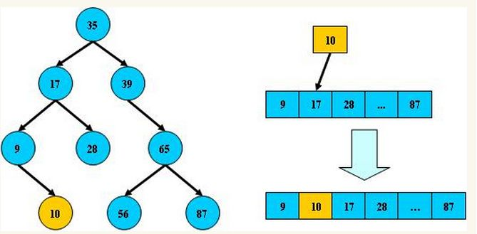
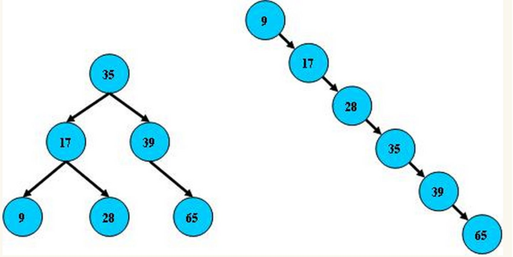
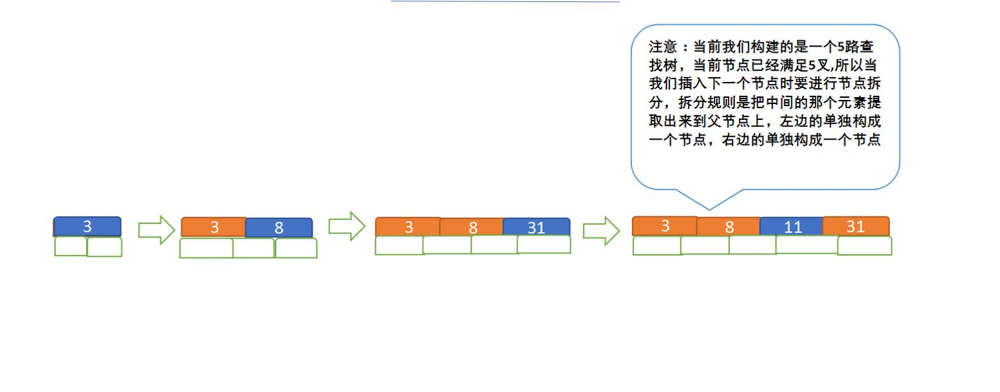
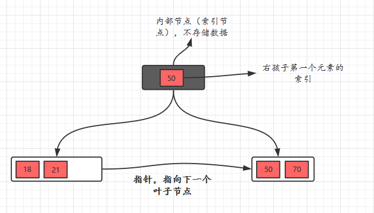
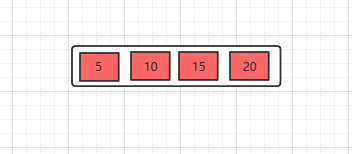
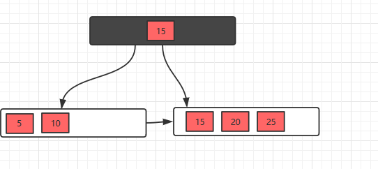
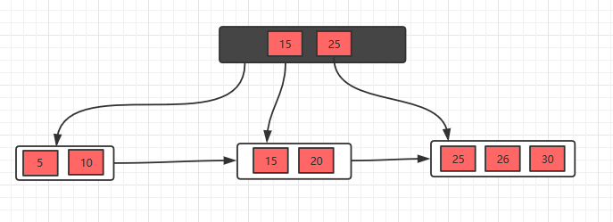
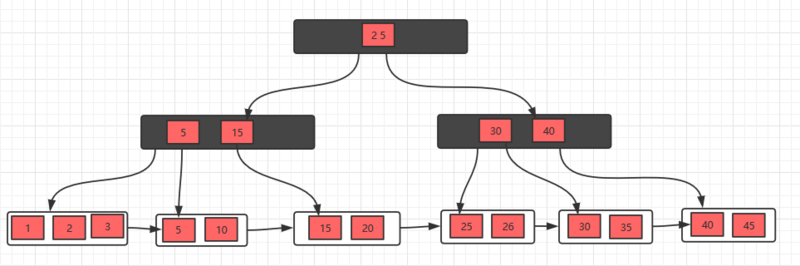
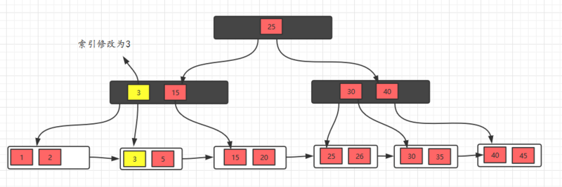
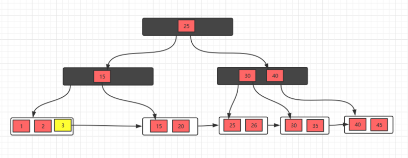

# 数据结构

## 平衡二叉树

>  平衡二叉树是基于**二分法**的策略提高数据的查找速度的二叉树的数据结构

### 特点：

平衡二叉树是采用二分法思维把数据按规则组装成一个树形结构的数据，用这个树形结构的数据减少无关数据的索引，大大提升了数据检索的速度；

### 规则：

1. 非叶子节点只允许最多两个子节点的存在

2. 每一个非叶子节点数据分布规则：

   1. 左子树的值 < 当前节点的值
   2. 右子树的值 > 当前节点的值

   这里的值基于自己的算法规定而定，比如 Hash 值
   
3. 树的左右两边的层级数相差不会大于1;

4. 没有值相等重复的节点;

**平衡树的层级结构**:

因为平衡二叉树查询性能和树的层级（h高度）成反比，h值越小查询越快.

为了保证树的结构左右两端数据大致平衡降低二叉树的查询难度一般会采用一种算法机制实现节点数据结构的平衡，实现了这种算法的有比如[Treap](https://link.zhihu.com/?target=http%3A//baike.baidu.com/item/Treap)、红黑树，使用平衡二叉树能保证数据的左右两边的节点层级相差不会大于1.

通过这样避免树形结构由于删除增加变成线性链表影响查询效率，保证数据平衡的情况下查找数据的速度近于二分法查找；

## B 树

> B树和平衡二叉树稍有不同的是B树属于多叉树又名平衡多路查找树（查找路径不只两个），数据库索引技术里大量使用者B树和B+树的数据结构

### 规则

1. 排序方式：

   所有节点的关键子是按照递增次序排列，并遵循左小右大原则

2. 子节点数：

   非叶节点的子节点数>1，且<=M ，且M>=2，空树除外（注：M阶代表一个树节点最多有多少个查找路径，M=M路,当M=2则是2叉树,M=3则是3叉）；

3. 关键字树：

   子节点的关键字数量大于等于 Math.ceil(M/2)-1 个且小于等于 M - 1 个

   ceil()是个朝正无穷方向取整的函数 如ceil(1.1)结果为2

4. 所有叶子节点均在同一层、叶子节点除了包含关键字和关键字记录的指针外也有指向其叶子节点的指针，只不过指针地址都为 null。

   由字母顺序构成的B树

### 查询流程

如上图我要从上图中找到E字母，查找流程如下：

1. 获取根节点的关键字进行比较，当前根节点关键字为M，E<M（26个字母顺序），所以往找到指向左边的子节点（二分法规则，左小右大，左边放小于当前节点值的子节点、右边放大于当前节点值的子节点）；

2. 拿到关键字D和G，D<E<G 所以直接找到D和G中间的节点；

3. 拿到E和F，因为E=E 所以直接返回关键字和指针信息（如果树结构里面没有包含所要查找的节点则返回null）

### 插入流程

定义一个5阶树（平衡5路查找树;），现在我们要把3、8、31、11、23、29、50、28 这些数字构建出一个5阶树出来;

遵循规则：

1. 节点拆分规则：

   当前是要组成一个5路查找树，那么此时m=5,关键字数必须<=5-1（这里关键字数>4就要进行节点拆分）；

2. 排序规则：

   满足节点本身比左边节点大，比右边节点小的排序规则;

先插入 3、8、31、11

再插入23、29

再插入50、28

### 删除流程

1. 节点合并规则：当前是要组成一个5路查找树，那么此时m=5,关键字数必须大于等于ceil（5/2）（这里关键字数<2就要进行节点合并）；

2. 满足节点本身比左边节点大，比右边节点小的排序规则;

3. 关键字数小于二时先从子节点取，子节点没有符合条件时就向向父节点取，取中间值往父节点放；

### 特点

B树相对于平衡二叉树的不同是，每个节点包含的关键字增多了，特别是在B树应用到数据库中的时候，数据库充分利用了磁盘块的原理（磁盘数据存储是采用块的形式存储的，每个块的大小为4K，每次IO进行数据读取时，同一个磁盘块的数据可以一次性读取出来）把节点大小限制和充分使用在磁盘快大小范围；把树的节点关键字增多后树的层级比原来的二叉树少了，减少数据查找的次数和复杂度;

## B+ 树

> B+树是B树的一个升级版，相对于B树来说B+树更充分的利用了节点的空间，让查询速度更加稳定，其速度完全接近于二分法查找。为什么说B+树查找的效率要比B树更高、更稳定；我们先看看两者的区别

### 规则：

1. B+跟B树不同B+树的**非叶子**节点不保存关键字记录的指针，只进行数据索引，这样使得B+树每个**非叶子**节点所能保存的关键字大大增加；

2. B+树**叶子**节点保存了父节点的所有关键字记录的指针，所有数据地址必须要到叶子节点才能获取到。所以每次数据查询的次数都一样；

3. B+树叶子节点的关键字从小到大有序排列，左边结尾数据都会保存右边节点开始数据的指针。

4. 非叶子节点的子节点数=关键字数（来源百度百科）（根据各种资料 这里有两种算法的实现方式，另一种为非叶节点的关键字数=子节点数-1（来源维基百科)，虽然他们数据排列结构不一样，但其原理还是一样的Mysql 的B+树是用第一种方式实现）;

### 插入流程

对于插入操作很简单，只需要记住一个技巧即可：

**当节点元素数量大于m-1的时候，按中间元素分裂成左右两部分，中间元素分裂到父节点当做索引存储，但是，本身中间元素还是分裂右边这一部分的**。

下面以一颗5阶B+树的插入过程为例，5阶B+树的节点最少2个元素，最多4个元素。

1. 插入5，10，15，20

   

2. 插入25，此时元素数量大于4个了，分裂

   

3. 接着插入26，30，继续分裂

   

   

### 删除流程

对于删除操作是比B树简单一些的，因为**叶子节点有指针的存在，向兄弟节点借元素时，不需要通过父节点了，而是可以直接通过兄弟节移动即可（前提是兄弟节点的元素大于m/2），然后更新父节点的索引；如果兄弟节点的元素不大于m/2（兄弟节点也没有多余的元素），则将当前节点和兄弟节点合并，并且删除父节点中的key**，下面我们看看具体的实例。

1. 初始状态

   

2. 删除10，删除后，不满足要求，发现左边兄弟节点有多余的元素，所以去借元素，最后，修改父节点索引

   

3. 删除元素5，发现不满足要求，并且发现左右兄弟节点都没有多余的元素，所以，可以选择和兄弟节点合并，最后修改父节点索引

   

4. 发现父节点索引也不满足条件，所以，需要做跟上面一步一样的操作

   

