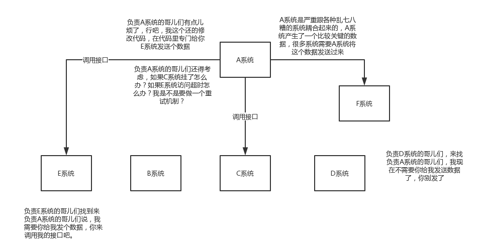
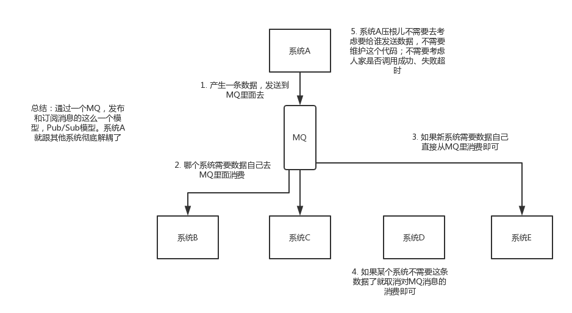
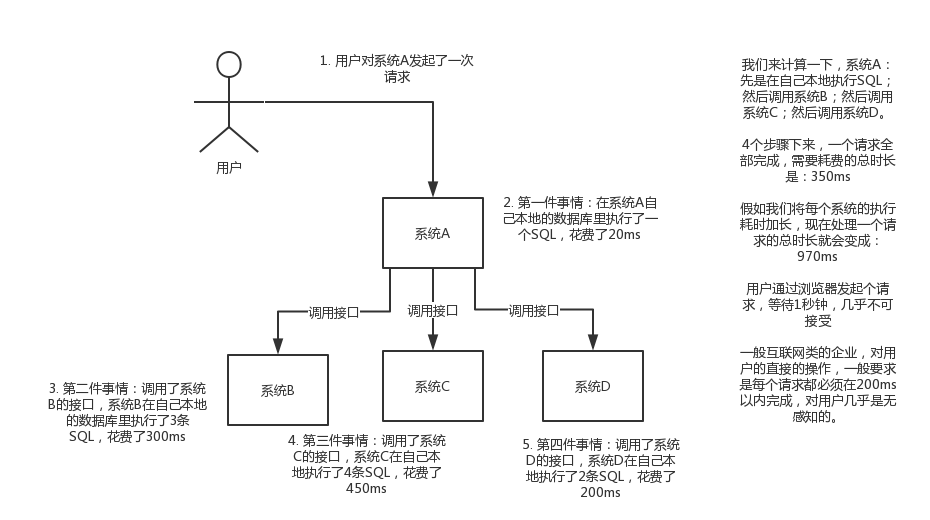
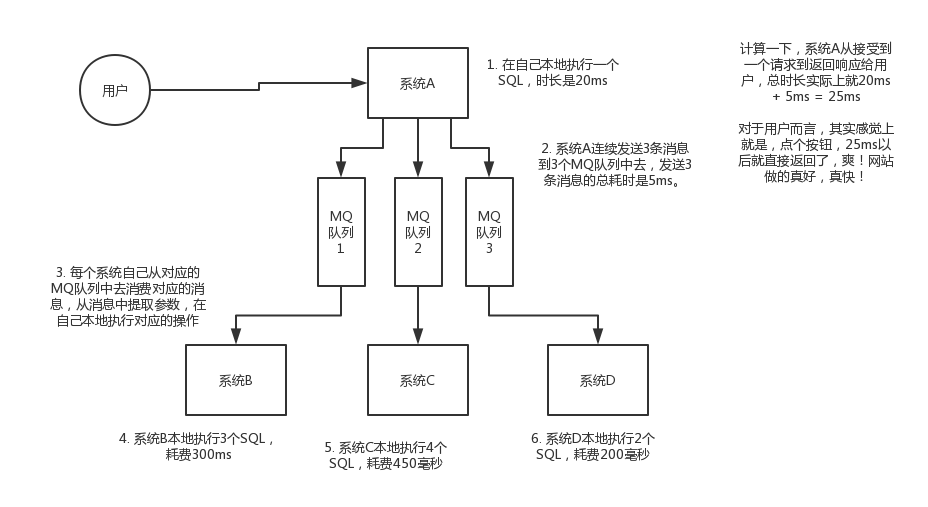
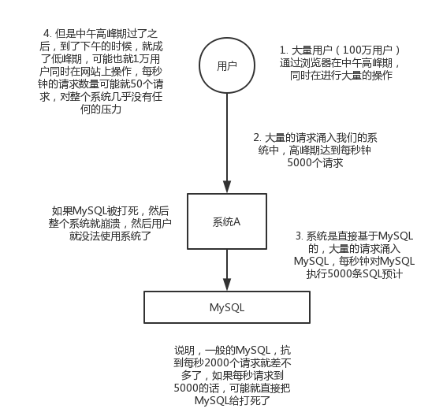

# 消息队列（MQ）

## 为什么时候用 MQ

#### MQ 的三大优点

* 解耦

  * 不使用MQ场景时：

    

  * 使用MQ对系统进行解耦：

  

* 异步

  * 不使用MQ进行异步请求：

    

  * 使用MQ进行异步请求：

    

* 消峰

  * 没有使用MQ的时候，高峰期系统被打死的场景：

    

  * 使用MQ在高峰期进行削峰：

    

#### 使用MQ也会带来问题：

* 降低系统可用性：MQ一旦宕机，则整个系统就会崩溃，无法运转

* 增加系统复杂性

* 一致性问题：分布式系统中，因为MQ故障，导致数据的不一致，此时仍然返回给用户错误的数据。

  

#### 市面上四大MQ中间件比较

| 特性                    | ActiveMQ                                                     | RabbitMQ                                                     | RocketMQ                                                     | Kafka                                                        |
| ----------------------- | ------------------------------------------------------------ | ------------------------------------------------------------ | ------------------------------------------------------------ | ------------------------------------------------------------ |
| 单机吞吐性              | 万级。吞吐量比RocketMQ和Kafka要低一个数量级                  | 万级。吞吐量比RocketMQ和Kafka要低一个数量级                  | 十万级。RocketMQ可以支持高吞吐的一种MQ                       | 十万级。这是Kafka最大的优点，就是高吞吐。一般用来配合大数据的系统进行实时的数据计算、日志采集等场景 |
| Topic数量对吞吐量的影响 |                                                              |                                                              | topic 可以达到几百，几千个，吞吐量会有较小幅度的下降，这是RocketMQ的一大优势，在同等硬件条件下，可以支撑大量的 topic | topic 从几十个到几百个的时候，吞吐量会大量下降，所以在同等硬件条件下，Kafka 尽量保证 topic 的数量不要过多。如果需要支持大规模的 topic，则需要从硬件角度进行拓展。 |
| 时效性                  | ms 级                                                        | 微秒级，这是 RabbitMQ的特性，延迟是最低的                    | ms 级                                                        | ms 级以内                                                    |
| 可用性                  | 高，基于主从架构实现高可用性                                 | 高，基于主从架构实现高可用性                                 | 非常高，分布式架构                                           | 非常高，Kafka 是分布式的，一个数据多个副本，少数机器宕机，不会丢失数据，导致系统不可用 |
| 消息可靠性              | 有较低的概率丢失数据                                         |                                                              | 经过参数优化配置，可以做到0丢失。                            | 经过参数优化配置，可以做到0丢失。                            |
| 功能支持                | MQ 领域的功能及其完备                                        | 基于 erlang 开发，所以并发性很强，性能极其好，延时很低       | MQ功能较完备，并且是分布式架构，拓展性较强。                 | 功能较为简单，主要支持简单的MQ功能，在大数据领域的实时计算以及日志采集背带规模使用，是业内标准 |
| 优劣势总结              | 非常成熟，功能强大，在业内大量的公司以及项目中都有应用。**偶尔会有较低概率丢失消息** 。现在社区以及国内应用越来越少，官方社区现在对ActiveMQ 5.x 维护越来越少，几个月才发布一个版本。并且主要是基于解耦和异步来使用的，较少在大规模吞吐的场景中使用 | erlang 语言开发的，性能极其好，**延时很低**；吞吐量达到万级，MQ 功能比较完备，开元提供的管理界面非常棒，用起来比较友善，社区相对比较活跃，几乎每个月都会发布几个版本，在国内的一些互联网公司近几年使用RabbitMQ 的也比较多。但是问题也比较显而易见，**RabbitMQ的吞吐量相对于其他几个MQ比较低**，由于本身实现机制比较重，并且 erlang 开发，国内具有做 erlang 源码级别的研究和定制的公司非常少。大多都依靠开源社区快速维护和修复 bug，**RabbitMQ集群动态拓展比较麻烦**， **主要问题还是 erlang 开发比较难以阅读源码，难以定制和掌握**。 | 接口简单易用，**阿里出品，经历过大规模应用**。**可以做到日处理消息上百亿**，做到大规模的吞吐，性能也非常好，**分布式拓展比较方便**，社会维护程度也还不错。**支持大规模的topic数量，支持复杂MQ业务场景**。**很大优势在于Java编写**，对于Java程序员来说比较方便阅读源码，社区活跃度相对较为一般，不过也还可以，文档相对来说简单一些，然后接口这块不是按照标准JMS规范走的有些系统要迁移需要修改大量代码，还有就是阿里出台的技术，你得做好这个技术万一被抛弃，社区黄掉的风险，那如果你们公司有技术实力我觉得用RocketMQ挺好的。 | Kafka 特点比较明显，**提供超高的吞吐量，ms 级别的延迟性，极高的可用性以及可靠性，分布式可以人以拓展**。但是仅仅提供了较少的核心功能。同时Kafka最好是支持较少的 topic 数量即可，以保证其超高吞吐量。Kafka 唯一的劣势就是**消息有可能重复消费**，出现这问题肯定会对数据的准确性造成影响，在大数据领域中以及日志采集过程中，这点影响可以忽略。这个特性天然适合大数据实时计算以及以及日志收集。 |

#### 根据MQ的特性，选择适合的MQ

* 一般业务系统要引入MQ，最早的时候使用 ActiveMQ，但是现在实际应用的比较少，没有经历过大规模吞吐量场景验证，社区也不是很活跃，**不推荐使用**。

* 后来大家使用 RabbitMQ，但是确实 erlang 语言阻止了大量的 Java 工程师去深入研究和掌控它，对公司而言，几乎处于不可控的状态，但是RabbitMQ是开源的，有比较稳定的支持，活跃度也高。

* RocketMQ 也有越来越多的公司使用，但是唯一的风险就是**社区可能突然黄掉**。如果对自己公司技术有绝对的自信，那么推荐使用 RocketMQ，否则推荐使用 RabbitMQ。

  中小型公司，技术实力一般，技术挑战不是非常高，选择 RabbitMQ 比较不错；大型公司，基础架构研发实力比较强，用 RocketMQ 也是非常好的选择。

* 如果是大数据领域的实时计算、日志采集等场景，用 Kafka 是业内标准的，绝对没问题，社区活跃度非常高，绝对不会黄，几乎是全世界这个领域的事实性规范。

## MQ的高可用性

#### RabbitMQ 的三种模式：

* 单机模式：服务部署到一台机器上，适合做练习用。

* **普通集群模式**：在多台机器上部署多个 RabbitMQ 实例，每个机器启动一个。但实际上创建的 Queue 只会放在一个 RabbitMQ 实例上，但其他的每个实例都同步该实例的 Queue 的元数据。假设服务请求到其他实例上，那么这些实例会从真正存放 Queue 的实例上拉取数据后，再进行消费。这样就导致只有两个选择：

  * 每次随机连接一个实例，在每次请求时，从存放 Queue 的实例上拉取数据，这样会导致集群内部产生大量数据传输。假设存放 Queue 的实例宕机了，会导致其他实例无法拉取数据，导致系统不可用，如果开启了 RabbitMQ 持久化的话，也需要等到实例数据完全还原，才可以恢复服务。
  * 固定 Queue 所在的实例，每次请求都在该实例上消费。这样相当于单实例，容易达到性能瓶颈。

  

* **镜像集群方式**：RabbitMQ 真正的高可用模式，与普通集群不同的是，它的每一个实例上存放 Queue 的消息，当对其中一个实例进行消息消费时，他会自动把消息同步到其他的 Queue 实例上。

  * 优点：其中任何一个机器宕机，服务不会受到很大的影响。

  * 缺点：

    * 性能开销太大，将消息同步到所有的其他实例上，增加网络带宽的压力；
    * 拓展性差，假设某个 Queue 实例的负载很重，新增的机器同样包含该 Queue 实例的所有数据，没有很大程度上的提升性能。

  * 如何开启镜像集群模式。在 RabbitMQ 的管理控制面板上，在后台新增一个镜像集群的策略，指定的时候选择数据同步到所有节点上，也可以选择同步到指定数量的节点上，当你再次创建 Queue 的时候，应用这个策略，就会自动将消息同步到其他的 Queue 节点上。

    

#### Kafka 的高可用性（0.8版本之后）

* **Kafka 架构：**由多个 Broker 组成，每一个 Broker 都是一个节点；每创建一个 Topic，该 Topic 可以划分为多个 Partition，每个 Partition 可以存放于不同的 Broker 上，每个 Partition 可以存放 Topic 的一部分数据。

* **高可用机制（HA机制）：**在Kafka 0.8 版本以后，提供了 HA 机制，就是 **replica 副本机制**：每个 Partition 的数据都会同步到其他机器上，形成自己的多个 replica 副本。然后这些 replica 副本会选举出一个 leader 出来，那么生产和消费都在 leader 上进行，其他与该 Partition 相关的 replica 副本为该 leader 的 follower。**在写入数据的时候，leader 会把数据同步到所有的 follower 上**去，**读取数据的时候直接读取 leader 上的数据**。假设可以随意读写每个 follower，那么就会导致数据一致性的问题，提高系统的复杂性，只有将一个 partition 的 replica 副本分布在不同的机器上时，才可以提高容错性。

  * 此时如果 leader 宕机了，那么其他的 follower 会选举一个新的 leader，读写任务继续由新的 leader 承担。
  * 写数据时，生产者直接写入 leader，然后 leader 将数据落地写入本地磁盘，接着其他的 **follower 主动从 leader 所在机器上 pull 数据**。一旦所有的 follower 同步好数据了，就会发送一个 `ack` 给 leader， leader 收到所有follower 的 `ack` 之后， 就会将写入成功的消息返回给生产者。(这只是其中一种模式，可以适当调整这个行为)
  * 消费的时候，只会从 leader 去读取数据，**只有一个消息已经被所有的follower都同步成功`ack` 的时候，这条消息才会被消费者读取到。**

  

#### 如何保证消息不被重复消费（如何保证消息的幂等性）

**以 Kafka 为例**

* Kafka 实际上有有 offset 的概念，每个消息写入 Queue 时，都有一个 offset，相当于消息的序号，在消费者消费数据之后，每隔一段时间，会把自己消费过的 offset 提交一下，表示这些消息已经消费国了，下次再重启时，可以到最后一个消费的 offset 节点处继续消费。

* **重复消费的产生：**如果在消费者还未提交一部分已经消费的 offset 时，服务器重启或者宕机，等启动后则会在已提交过的 offset 处开始继续消费，那么已经消费重启之前未提交的这一部分消息就会被重复消费。

  

* 

* **幂等性**：无论多少次请求，结果与一次请求一致。

* 以下几个场景如何保证幂等性：

  * 写入数据库，可以先根据消息的条件或者主键查询数据库这条记录是否已经存在，如果已经存在则不写入。（也可以根据数据库唯一键来保证幂等性）
  * 写入 Redis，Redis 的 Set 方法是天然幂等性的，不用多余的操作。
  * 如果不是以上两个场景，则可以在生产者发送每一条数据时，里面加一个全局唯一的 id；在消费者消费该数据时，拿到该 id 去 Redis 中查询是否存在该 id， 如果存在，则不消费；如果不存在则执行消费的业务逻辑，并将 id 写入 Redis 中。

### 消息队列的两种模式

* **点对点模式**：一对一，消费者主动拉去数据，消息被消费者收到后消息删除

  